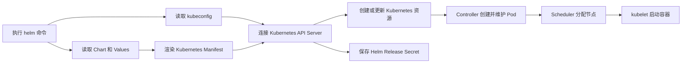

# Helm 与 Kubernetes 交互原理及使用指南

## 1. Helm 是干什么的

Helm 是 Kubernetes 应用的安装和版本管理工具。

`kubectl` 更适合直接查看或操作 Deployment、Service、ConfigMap 等单个 Kubernetes 资源；Helm 则把一个应用需要的多份 Kubernetes 配置组织成一个整体，统一进行安装、升级、回退和删除。

例如，部署一个完整应用可能需要以下资源：

- Deployment 或 StatefulSet
- Service
- Ingress
- ConfigMap
- Secret
- ServiceAccount 和 RBAC
- PersistentVolumeClaim

Helm 可以把这些资源的 YAML 模板和默认参数一起打包成 Chart。安装 Chart 时，Helm 根据实际参数生成普通 Kubernetes YAML，再提交给 Kubernetes API Server。

需要特别说明：Chart 通常不包含容器镜像本体，只保存镜像地址和 Kubernetes 资源模板。真正的镜像仍然存放在 Docker Hub、GHCR 或企业镜像仓库中。

## 2. Helm 的三个核心概念

| 名称 | 含义 | 示例 |
| --- | --- | --- |
| Chart | Kubernetes 应用安装包，主要包含资源模板和默认配置 | Jenkins Chart、PostgreSQL Chart |
| Values | 给模板使用的参数 | 镜像版本、Pod 数量、端口、存储大小 |
| Release | 某个 Chart 在某个集群和命名空间中的一次安装实例 | `jenkins-test`、`jenkins-prod` |

同一个 Chart 可以安装多次。每次安装可以使用不同的 Release 名称和 Values，因此可以同时存在测试环境和生产环境。

## 3. Helm 如何与 Kubernetes 交互



一次 `helm install` 或 `helm upgrade` 主要经历以下过程：

1. Helm 默认读取 `~/.kube/config`，获得集群地址、证书、用户身份和当前 Context。
2. Helm 读取 Chart 自带的 `values.yaml`。
3. Helm 合并 `-f` 或 `--set` 提供的覆盖参数。
4. Helm 把 Values 填入 `templates/` 目录下的模板。
5. Helm 生成普通 Kubernetes YAML，也就是 Manifest。
6. Helm 通过 HTTPS 请求 Kubernetes API Server。
7. API Server 执行身份验证、RBAC 权限检查和资源格式校验。
8. API Server 接收 Deployment、Service 等资源。
9. Kubernetes Controller、Scheduler 和 kubelet 继续完成 Pod 创建与运行。
10. Helm 在对应命名空间保存本次 Release 的版本记录。

Helm 不会直接连接 kubelet，也不会直接操作 etcd。它通常也不是通过执行 `kubectl` 完成部署，而是自己作为 Kubernetes API 客户端访问 API Server。

Helm 和 `kubectl` 可以使用相同的 kubeconfig：

```bash
kubectl config current-context

helm list --all-namespaces
```

也可以明确指定 Context 和命名空间：

```bash
helm list \
  --kube-context cluster-test \
  --namespace demo
```

Helm 不能绕过 Kubernetes RBAC。当前 kubeconfig 中的用户没有权限创建 Deployment 或读取 Secret 时，Helm 同样会失败。

## 4. Helm 命令结束后谁在管理应用

Helm 只在执行安装、升级、回退、查询或删除命令时工作。命令结束后，没有一个 Helm 服务在后台持续管理应用。

应用后续的运行由 Kubernetes 负责：

- Pod 异常退出后，由 Deployment 或 StatefulSet 负责补建。
- Pod 需要放到哪个节点，由 Scheduler 决定。
- 节点上的容器启动和健康检查，由 kubelet 负责。
- Service 流量转发和网络规则，由 Kubernetes 及相关网络组件负责。

使用 `--wait` 时，Helm 只是在本次命令执行期间观察资源是否达到就绪状态。它不是永久监控服务。

## 5. 为什么使用 Secret 保存 Release

Helm 2 曾经使用集群内的 Tiller 服务管理发布。Helm 3 删除了 Tiller，因此需要把 Release 记录保存在一个所有授权 Helm 客户端都能访问的位置。

默认使用 Kubernetes Secret 有以下原因：

- Secret 是 Kubernetes 原生资源，不需要额外部署数据库。
- Secret 按命名空间保存，方便隔离不同环境的 Release。
- 可以通过 Kubernetes RBAC 控制谁能读取或修改 Release 记录。
- Kubernetes 开启 Secret 静态加密后，可以加密保存在 etcd 中的 Release 数据。
- 换一台安装了 Helm 的电脑，只要连接同一个集群并具有权限，仍然可以查询、升级和回退 Release。

Secret 并不是 Helm 唯一支持的存储方式，但它是 Helm 3 的默认方式。根据具体版本和配置，Helm 也可以使用 ConfigMap 或 SQL 存储驱动。

### 5.1 Secret 并不自动等于安全加密

Kubernetes Secret 默认主要使用 Base64 表示数据，Base64 不是加密。

如果 Values 中填写了密码，或者渲染后的 Manifest 中包含 Kubernetes Secret 内容，那么相关敏感信息也可能进入 Helm Release Secret。因此生产环境至少需要：

- 严格限制 `get`、`list`、`watch` Secret 的 RBAC 权限。
- 开启 Kubernetes Secret 静态加密，保护 etcd 中的数据。
- 不要把真实密码写入提交到 Git 的 Values 文件。
- 优先通过受控的密钥管理方式向集群注入密码。

## 6. Release Secret 具体保存什么

Helm 通常为每个 Release 版本保存一个 Secret。例如：

```text
sh.helm.release.v1.myapp.v1
sh.helm.release.v1.myapp.v2
sh.helm.release.v1.myapp.v3
```

这里：

- `myapp` 是 Release 名称。
- `v1`、`v2`、`v3` 是 Release 修订版本。
- Secret 的类型是 `helm.sh/release.v1`。
- Secret 的 `data.release` 保存编码后的 Release 对象。

Helm 会把 Release 数据序列化、压缩并编码后放进 `data.release`。它不是把每份 YAML 作为独立文件分别放进 Secret，而是保存一个完整的发布档案。

这个发布档案主要包括：

- Chart 及其模板和默认配置
- 本次安装传入的覆盖配置
- 模板渲染后的 Manifest
- Helm Hook
- Release 名称和命名空间
- Release 修订版本
- 安装、升级或失败状态
- 时间和说明信息

因此，可以把它理解为：

> Helm 保存的是“当时准备怎样部署这套应用”的记录，而不是“集群现在实际运行成什么样”的完整快照。

Release Secret 不保存以下运行数据：

- Pod 当前是否 Ready
- Pod 日志
- Deployment 当前的实际副本状态
- 容器镜像本体
- PVC 中的业务数据
- 节点和容器的实时运行状态

查看 Helm 当时保存的 Manifest：

```bash
helm get manifest myapp --namespace demo
```

查看当时使用的 Values：

```bash
helm get values myapp --namespace demo --all
```

查看集群当前的真实状态：

```bash
kubectl get deployment,replicaset,pod,service \
  --namespace demo
```

查看 Helm 保存了哪些 Release Secret：

```bash
kubectl get secret \
  --namespace demo \
  --selector owner=helm,name=myapp
```

## 7. 为什么要保存旧版本内容

Helm 保存历史版本，主要是为了升级判断、历史查询和回退。

升级时，Helm 会综合参考三份信息：

1. 上一个 Release 保存的 Manifest。
2. 集群中当前存在的资源。
3. 新 Chart 和新 Values 生成的 Manifest。

这样 Helm 才能判断哪些字段是本次需要更新的，哪些字段可能是在集群中被其他控制器或管理员修改的。

回退时，Helm 会读取旧版本保存的 Chart、配置和 Manifest，再对 Kubernetes 资源执行一次更新。回退不是让整个集群回到过去，也不会自动恢复数据库和 PVC 中的业务数据。

```bash
helm history myapp --namespace demo

helm rollback myapp 2 --namespace demo --wait
```

回退操作本身还会产生一个新的修订版本。例如当前是修订版本 3，回退到版本 2 后，新的执行结果通常记录为修订版本 4，而不是把当前版本号直接改回 2。

## 8. Values、Template 和 Manifest 分别是什么

| 名称 | 作用 | 是否直接提交给 Kubernetes |
| --- | --- | --- |
| Values | 提供镜像、Pod 数量、端口等参数 | 否 |
| Template | 带有 `{{ }}` 表达式的 Kubernetes YAML 模板 | 否 |
| Manifest | Values 填入 Template 后生成的普通 Kubernetes YAML | 是 |

三者关系如下：

```text
Chart 默认 values.yaml
        +
环境配置 values-prod.yaml
        +
命令行 --set 参数
        ↓
templates/ 中的资源模板
        ↓ Helm 渲染
普通 Kubernetes Manifest
        ↓
Kubernetes API Server
```

### 8.1 Values

Values 是一组配置参数，本身不是 Kubernetes 资源，也不会作为独立文件提交给 API Server。

常见 Values 包括：

- Pod 副本数
- 镜像仓库和镜像标签
- 容器端口
- Service 类型和端口
- Ingress 域名
- CPU 和内存限制
- 存储大小和 StorageClass

Values 的常见覆盖顺序是：

```text
Chart 自带 values.yaml
        ↓ 被覆盖
-f values-test.yaml 或 -f values-prod.yaml
        ↓ 再被覆盖
--set image.tag=新版本
```

如果多次使用 `-f`，后面的文件会覆盖前面的同名配置。

### 8.2 Template

Template 是 `templates/` 目录中的 Kubernetes YAML 模板。模板使用 `{{ }}` 读取 Values、Release 名称和 Chart 信息。

例如：

```yaml
spec:
  replicas: {{ .Values.replicaCount }}
```

这里的 `.Values.replicaCount` 会被实际数字替换。

需要区分两个相似名称：

- `templates/deployment.yaml` 是 Chart 中的模板文件。
- `helm template` 是在本地渲染 Chart 的命令。

### 8.3 Manifest

Manifest 是模板渲染完成后的普通 Kubernetes YAML，不再包含需要 Helm 处理的 `{{ }}` 表达式。

Manifest 可以包含多份资源：

```yaml
apiVersion: apps/v1
kind: Deployment
...
---
apiVersion: v1
kind: Service
...
```

Helm 把 Manifest 提交给 Kubernetes API Server，同时把相应发布信息保存进 Release Secret。

## 9. 一个能够真正创建 Pod 的完整示例

生产环境通常不会直接创建一个孤立的 Pod，而是创建 Deployment。Deployment 内部包含 Pod 模板，Kubernetes 会通过 ReplicaSet 创建和维护实际 Pod。

示例目录：

```text
demo-chart/
├── Chart.yaml
├── values.yaml
├── values-prod.yaml
└── templates/
    ├── deployment.yaml
    └── service.yaml
```

### 9.1 Chart.yaml

`Chart.yaml` 描述 Chart 自身的名称和版本：

```yaml
apiVersion: v2
name: demo-app
description: A minimal Helm chart for demonstrating Kubernetes deployment
type: application
version: 0.1.0
appVersion: "1.0.0"
```

`version` 是 Chart 自身的版本，`appVersion` 是应用版本说明。容器真正使用哪个镜像标签，仍以模板引用的 Values 为准。

### 9.2 values.yaml

`values.yaml` 保存默认配置：

```yaml
replicaCount: 1

image:
  repository: nginx
  tag: "1.27.5"
  pullPolicy: IfNotPresent

containerPort: 80

service:
  type: ClusterIP
  port: 80
```

### 9.3 values-prod.yaml

生产环境只覆盖和默认值不同的部分：

```yaml
replicaCount: 3

image:
  tag: "1.27.5"

service:
  type: ClusterIP
```

这里没有重复填写 `image.repository` 和 `service.port`，它们继续使用 `values.yaml` 中的默认值。

### 9.4 templates/deployment.yaml

这个模板生成 Deployment。Deployment 的 `spec.template` 就是 Pod 模板：

```yaml
apiVersion: apps/v1
kind: Deployment
metadata:
  name: {{ .Release.Name }}
  labels:
    app.kubernetes.io/name: {{ .Chart.Name }}
    app.kubernetes.io/instance: {{ .Release.Name }}
spec:
  replicas: {{ .Values.replicaCount }}
  selector:
    matchLabels:
      app.kubernetes.io/name: {{ .Chart.Name }}
      app.kubernetes.io/instance: {{ .Release.Name }}
  template:
    metadata:
      labels:
        app.kubernetes.io/name: {{ .Chart.Name }}
        app.kubernetes.io/instance: {{ .Release.Name }}
    spec:
      containers:
        - name: app
          image: "{{ .Values.image.repository }}:{{ .Values.image.tag }}"
          imagePullPolicy: {{ .Values.image.pullPolicy }}
          ports:
            - name: http
              containerPort: {{ .Values.containerPort }}
          readinessProbe:
            httpGet:
              path: /
              port: http
            initialDelaySeconds: 2
            periodSeconds: 5
```

### 9.5 templates/service.yaml

这个模板生成一个 ClusterIP Service，把访问流量转发到 Pod：

```yaml
apiVersion: v1
kind: Service
metadata:
  name: {{ .Release.Name }}
  labels:
    app.kubernetes.io/name: {{ .Chart.Name }}
    app.kubernetes.io/instance: {{ .Release.Name }}
spec:
  type: {{ .Values.service.type }}
  selector:
    app.kubernetes.io/name: {{ .Chart.Name }}
    app.kubernetes.io/instance: {{ .Release.Name }}
  ports:
    - name: http
      port: {{ .Values.service.port }}
      targetPort: http
```

## 10. 先渲染检查，不安装

`helm template` 只在本地合并 Values 并渲染模板，通常不会访问 Kubernetes 集群：

```bash
helm template myapp ./demo-chart \
  --namespace demo \
  --values ./demo-chart/values-prod.yaml
```

渲染结果中的关键内容会类似：

```yaml
apiVersion: apps/v1
kind: Deployment
metadata:
  name: myapp
spec:
  replicas: 3
  template:
    spec:
      containers:
        - name: app
          image: "nginx:1.27.5"
          ports:
            - name: http
              containerPort: 80
```

参数对应关系是：

- `.Release.Name` 被替换成 `myapp`。
- `.Values.replicaCount` 被替换成 `3`。
- `.Values.image.repository` 使用默认值 `nginx`。
- `.Values.image.tag` 使用生产配置中的 `1.27.5`。
- `.Values.containerPort` 使用默认值 `80`。

还可以先检查 Chart 的基本结构和模板错误：

```bash
helm lint ./demo-chart \
  --values ./demo-chart/values-prod.yaml
```

## 11. 安装或升级应用

```bash
helm upgrade --install myapp ./demo-chart \
  --namespace demo \
  --create-namespace \
  --values ./demo-chart/values-prod.yaml \
  --wait \
  --timeout 5m
```

各参数含义：

- `upgrade --install`：没有安装过就安装，已经存在就升级。
- `myapp`：Release 名称，同时被模板中的 `.Release.Name` 使用。
- `./demo-chart`：Chart 路径。
- `--namespace demo`：资源和 Release 记录所在的命名空间。
- `--create-namespace`：命名空间不存在时创建它。
- `--values`：加载生产环境覆盖配置。
- `--wait`：等待主要资源就绪。
- `--timeout 5m`：最多等待 5 分钟。

这条命令不会直接提交 `values-prod.yaml`。实际过程是：

```text
values.yaml + values-prod.yaml
              ↓
deployment.yaml + service.yaml
              ↓ Helm 渲染
Deployment Manifest + Service Manifest
              ↓
Kubernetes API Server
```

Pod 的创建链路是：

```text
Helm 创建 Deployment
        ↓
Deployment Controller 创建 ReplicaSet
        ↓
ReplicaSet 根据 replicas: 3 创建 3 个 Pod
        ↓
Scheduler 把 Pod 分配到节点
        ↓
kubelet 拉取 nginx 镜像并启动容器
```

不建议在普通应用中让 Helm 直接创建 `kind: Pod`，因为孤立 Pod 缺少 Deployment 提供的副本维持、滚动升级和异常重建能力。

## 12. 安装后的检查方法

查看 Helm Release：

```bash
helm list --namespace demo

helm status myapp --namespace demo
```

查看 Helm 保存的配置和 Manifest：

```bash
helm get values myapp --namespace demo --all

helm get manifest myapp --namespace demo
```

查看 Kubernetes 实际创建的资源：

```bash
kubectl get deployment,replicaset,pod,service \
  --namespace demo \
  --selector app.kubernetes.io/instance=myapp
```

查看 Pod 分布和状态：

```bash
kubectl get pod \
  --namespace demo \
  --selector app.kubernetes.io/instance=myapp \
  --output wide
```

查看 Service：

```bash
kubectl get service myapp \
  --namespace demo
```

## 13. 升级、历史和回退

例如临时把 Pod 数量调整为 5：

```bash
helm upgrade myapp ./demo-chart \
  --namespace demo \
  --values ./demo-chart/values-prod.yaml \
  --set replicaCount=5 \
  --wait
```

这里 `--set replicaCount=5` 的优先级高于 `values-prod.yaml`，因此最终 Manifest 中会生成 `replicas: 5`。

查看历史版本：

```bash
helm history myapp --namespace demo
```

回退到修订版本 1：

```bash
helm rollback myapp 1 \
  --namespace demo \
  --wait
```

## 14. 删除 Release

```bash
helm uninstall myapp --namespace demo
```

Helm 会根据 Release 记录删除所管理的 Kubernetes 资源，并默认删除 Release 历史记录。

如果明确需要保留历史记录：

```bash
helm uninstall myapp \
  --namespace demo \
  --keep-history
```

删除 Release 不等于恢复或删除所有业务数据。PVC 是否被删除、底层存储是否保留，取决于 Chart、StorageClass 和 PersistentVolume 的回收策略，需要单独检查。

## 15. 官方 get-helm-3 安装脚本

正确地址：

```text
https://raw.githubusercontent.com/helm/helm/main/scripts/get-helm-3
```

链接末尾不能带中文逗号，否则请求地址会错误。

这个脚本只负责在当前电脑安装 Helm 3 客户端，不会连接 Kubernetes，也不会向集群安装任何资源。脚本主要执行：

1. 检测操作系统和 CPU 架构。
2. 查询最新 Helm 3 版本。
3. 从 `get.helm.sh` 下载对应安装包和 SHA-256 文件。
4. 校验下载文件的 SHA-256。
5. 解压并把 `helm` 复制到 `/usr/local/bin/helm`。
6. 清理临时文件。

截至 2026-08-14，本次查询到的最新 Helm 3 版本是 `v3.21.4`。这个版本号会随官方发布变化。

脚本默认开启 SHA-256 校验，但 GPG 签名校验默认关闭。比起直接把远程脚本通过管道交给 Shell，更稳妥的做法是先下载、检查，再执行：

```bash
curl --fail --location --output get-helm-3 \
  https://raw.githubusercontent.com/helm/helm/main/scripts/get-helm-3

less get-helm-3

chmod 700 get-helm-3

./get-helm-3
```

安装完成后：

```bash
helm version
```

只有执行 `helm install`、`helm upgrade`、`helm list` 等需要集群的命令时，Helm 才会通过 kubeconfig 连接 Kubernetes。

## 16. 最终理解

Helm 的完整工作可以概括为：

```text
Chart 提供应用结构
        +
Values 提供环境参数
        ↓
Template 生成 Manifest
        ↓
Helm 将 Manifest 提交给 Kubernetes API Server
        ↓
Kubernetes 创建并持续维护实际资源
        ↓
Helm 使用 Secret 保存每次 Release 的发布记录
```

一句话总结：

> Helm 负责生成和管理 Kubernetes 应用的发布版本；Kubernetes 负责真正创建、调度和持续运行容器。

## 17. 参考资料

- [Helm 官方安装脚本 get-helm-3](https://raw.githubusercontent.com/helm/helm/main/scripts/get-helm-3)
- [Helm 官方文档：Using Helm](https://helm.sh/docs/intro/using_helm/)
- [Helm 官方文档：Chart Template Guide](https://helm.sh/docs/chart_template_guide/)
- [Helm 官方文档：Values Files](https://helm.sh/docs/chart_template_guide/values_files/)
- [Helm 官方文档：Changes Since Helm 2](https://helm.sh/docs/faq/changes_since_helm2/)
- [Kubernetes 官方文档：Secrets](https://kubernetes.io/docs/concepts/configuration/secret/)
- [Kubernetes 官方文档：Encrypting Confidential Data at Rest](https://kubernetes.io/docs/tasks/administer-cluster/encrypt-data/)
