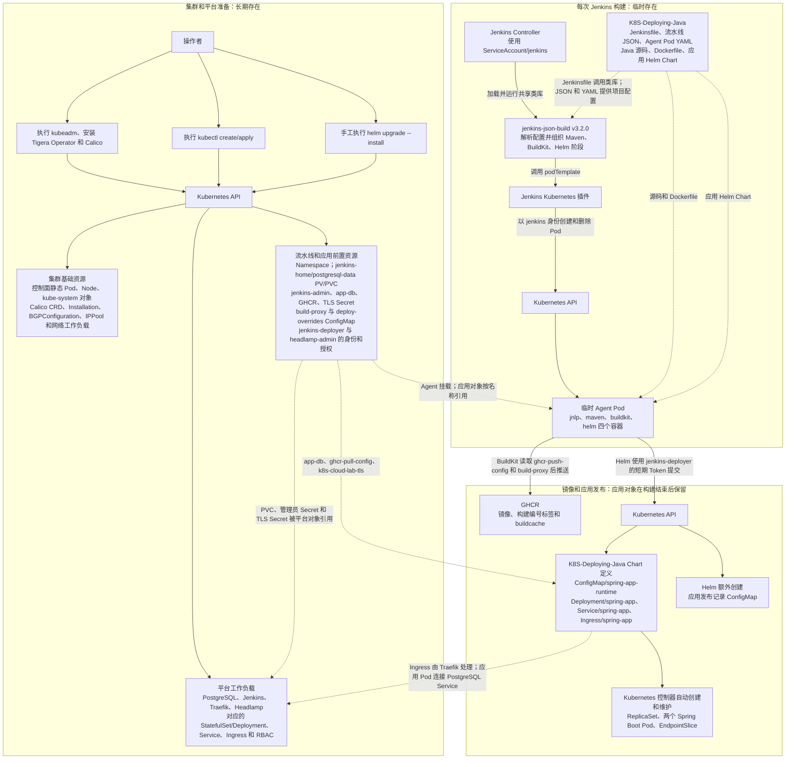
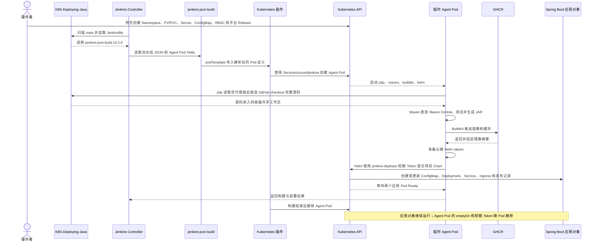

# Kubernetes、Jenkins、BuildKit、GitHub、Spring Boot 3 与 PostgreSQL 部署攻略：云服务器方案

> 更新时间：2026-08-12  
> 文档定位：既是可以逐步执行的实验操作手册，也是解释原理、风险、验证方法和排障思路的培训文档。  
> 适用环境：三台阿里云香港 ECS，位于同一 VPC、交换机和安全组，使用 Calico 节点间 BGP + IPIP。  
> 实验项目：[sunweisheng/K8S-Deploying-Java](https://github.com/sunweisheng/K8S-Deploying-Java)，默认构建分支为 `main`。  
> 当前正式基线：`K8S-Deploying-Java v1.0.9`，提交 `f71418a0346a4cf29109efaef60efebf319172cf`，Jenkinsfile 已固定 `jenkins-json-build v3.2.0`；Tag、GitHub Release 和 JAR 已正式发布。`v1.0.8` 提交 `485a6e709d235e3c9b1dd0d673752a013c782d50` 继续作为虚拟机真实流水线的历史验证基线。  
> 实际验证状态：2026-08-12 已在三台一次性阿里云 ECS 上完成真实安装和只读验收。三个节点均为 `Ready`；Calico 的四项 Tigera 状态正常，三节点 BGP 全互联，IPPool 为 IPIP Always、VXLAN Never；NFS、Jenkins、PostgreSQL、Traefik、Headlamp 和 Spring Boot 均已运行。云端 Jenkins `K8S-Deploying-Java/main #5` 直接加载 `jenkins-json-build v3.2.0`，使用提交 `f71418a0346a4cf29109efaef60efebf319172cf` 完成 21 个测试、BuildKit 推送和 Helm Revision 2 部署，最终为 `SUCCESS`。培训电脑通过本地 CA 和 `30443` 访问 Jenkins、应用健康接口及 Headlamp 均得到 `HTTP 200`。本次未执行跨节点固定测试 Pod、页面数据库增删改和删除 Jenkins/PostgreSQL Pod 的持久化复验，也未从阿里云控制台核对安全组来源范围；详细证据、未验证项和现场修正见附录 A.2 与附录 B。  
> 临时环境说明：本次实测使用的公网地址为 `8.218.180.162`、`8.210.138.194`、`8.210.148.60`，对应私网地址为 `192.168.0.10`、`192.168.0.11`、`192.168.0.12`。这组三台 ECS 会在实验结束后删除，公网地址届时失效；以后重建时必须先按参数表替换真实地址，不能照抄本次公网地址。  
> 配套方案：[查看本地虚拟机方案](kubernetes-jenkins-buildkit-github-springboot3-postgresql-vm-guide.md)。

## 使用说明

本手册只描述云服务器路线。请从第一部分开始顺序执行，不要混入 UTM RouterOS、Multipass、桥接网卡、Mac 代理或无封装 Pod 网络配置。

作为实验操作手册，每个阶段都给出命令、预期结果和验收方法；作为培训文档，关键位置同时说明命令用途、参数含义、安全边界、常见错误和恢复办法。完成本手册后，应能解释并实际验证：

- VPC、交换机、安全组、公网 IP、私有 IP 与 Kubernetes 节点网络之间的关系。
- Calico 节点间 BGP 为什么仍需 IPIP，以及它与阿里云公网 BGP 的区别。
- Jenkins Controller 与临时 Agent Pod 的职责边界。
- Maven、BuildKit Rootless、GHCR 和 Helm 在流水线中的执行顺序。
- PostgreSQL 与 Jenkins 如何通过 NFS PV/PVC 保留数据。
- Traefik、Ingress、本地 CA、培训电脑 hosts 和 NodePort 如何共同提供受限公网入口。
- 如何用状态、日志、事件和逐层网络检查定位故障，而不是只重复执行命令。

### 文档结构和阅读顺序

正文只保留当前基线需要顺序执行的步骤、成功标准和重点知识。建议按下面顺序使用：

1. 先阅读“架构与技术边界”，理解网络、存储、Ingress、Secret 和 BuildKit Rootless 的边界。
2. 顺序执行“第一部分：云服务器基础设施”。
3. 顺序执行“第二部分：平台与应用部署”的第 2 至第 16 节。
4. 完成“第三部分：安全检查与最终验收”。
5. 遇到旧版本遗留配置时查看“附录 A：验证记录与旧版本补救”。
6. 遇到报错、异常状态或历史告警时查看“附录 B：错误信息与排查经验”。
7. 需要升级、回滚、私有仓库、Webhook、分支预览或其他扩展时查看“附录 C：更新、回滚与未来扩展”。
8. 文档维护规则和资料来源位于附录 D。

两份攻略共用的平台知识保持一致，但基础设施命令不能混用。配套文档：[本地虚拟机方案](./kubernetes-jenkins-buildkit-github-springboot3-postgresql-vm-guide.md)。

## 架构与技术边界

### 总体架构

本方案使用三台同地域、同 VPC、同交换机、同安全组的云服务器。Kubernetes、NFS 和 Calico 全部使用私有 IP，只有 SSH 与 Traefik NodePort 按来源限制后使用公网 IP：

```text
阿里云香港 VPC（192.168.0.0/24）
├── hk-k8s-master  192.168.0.10：控制平面、NFSv4
├── hk-k8s-node1   192.168.0.11：Jenkins、临时 Agent、Traefik
└── hk-k8s-node2   192.168.0.12：PostgreSQL、Spring Boot、Traefik

培训电脑
└── 8.210.138.194:30443 -> Traefik -> 各 Ingress
```


Kubernetes 内部采用下面的结构。Headlamp 不使用 NFS，它通过 Kubernetes API 管理集群：

```text
GitHub：sunweisheng/K8S-Deploying-Java（main）
      │ 拉取代码
      ▼
Jenkins Controller Pod
      │ 创建临时 Agent Pod
      ▼
Jenkins Agent Pod
├── jenkins-json-build v3.2.0：统一驱动 JSON 流水线
├── maven：使用 JDK 21 测试和打包
├── buildkit：以 Rootless 模式构建镜像并推送 GHCR
└── helm：使用 Helm 部署 Spring Boot

Traefik Ingress Controller（2 个 Pod）
├── Jenkins Ingress
│   └── Jenkins Service（ClusterIP）
│       └── Jenkins Controller Pod
│           └── Jenkins PVC ──► NFSv4
├── Spring Boot Ingress
│   └── Spring Boot Service（ClusterIP）
│       └── Spring Boot Pod（2 个副本）
│           └── PostgreSQL Service（ClusterIP）
│               └── PostgreSQL Pod
│                   └── PostgreSQL PVC ──► NFSv4
└── Headlamp Ingress
    └── Headlamp Service（ClusterIP）
        └── Headlamp Pod ──► Kubernetes API
```

#### 构建部署中的 Kubernetes 资源由谁创建

下面两张图只列主要对象和责任关系，不展开 Helm Chart 自带的每一个辅助 ConfigMap、ServiceAccount 或 RBAC 对象。读图时要区分三件事：文件由谁定义、流程由谁触发、最终由谁调用 Kubernetes API 创建对象。项目仓库只是定义来源，不会脱离 Jenkins 自己访问集群。



各类对象在整个流程中的位置如下：

| 对象范围 | 定义来源 | 谁触发、谁实际创建 | 什么时候起作用 |
| --- | --- | --- | --- |
| Kubernetes 与 Calico 基础对象 | kubeadm、Tigera Operator/Calico 清单和本文参数 | 操作者执行安装；kubeadm、kubelet、Operator 和 Calico 控制器创建或维护 | 为后续所有 Pod、Service、存储和网络提供集群基础 |
| 前置对象 | 本文中的 YAML 和 `kubectl create` 命令 | 操作者通过 `kubectl` 创建 | Jenkins、Agent Pod、PostgreSQL 和 Spring Boot 启动前就必须存在 |
| 环境 Helm values | 项目定义可选挂载规则；具体内容由本方案第 11 节定义 | 操作者创建 `ConfigMap/deploy-overrides` | Helm 容器启动时挂载；写了哪一项就覆盖哪一项，没有写的字段继续使用 Chart 默认值 |
| 平台对象 | Jenkins、Traefik、Headlamp 官方 Chart，以及本文生成的 PostgreSQL Chart | 操作者运行 Helm；Helm 向 API 提交；Kubernetes 控制器继续创建 Pod 和 EndpointSlice | 提供持续运行的 Jenkins、数据库、入口和管理界面 |
| 临时 Agent Pod | `K8S-Deploying-Java/ci/jenkins-agent.yaml` 与共享类库默认值 | `jenkins-json-build` 调用 `podTemplate`；Jenkins Kubernetes 插件以 `ServiceAccount/jenkins` 创建并在结束后删除 | 只在一次构建期间提供 Maven、BuildKit、Helm 和 Jenkins Agent 环境 |
| Spring Boot 应用对象 | `K8S-Deploying-Java/deploy/charts/spring-app` | `jenkins-json-build` 组织 Helm 命令；Agent Pod 中的 Helm 以 `jenkins-deployer` 身份创建或更新 | Deployment、Service、Ingress 和运行配置在构建结束后继续运行 |
| 自动派生对象 | Deployment、Service、Namespace 和 ServiceAccount 等上层对象 | Kubernetes 内置控制器和 kubelet 自动创建或维护 | 包括 ReplicaSet、业务 Pod、EndpointSlice、`kube-root-ca.crt` 和投射的短期 Token |

一次 `main` 分支构建的实际顺序如下：



两个项目的职责边界可以概括为：`K8S-Deploying-Java` 提供“这个项目构建什么、Agent Pod 长什么样、应用对象长什么样”；`jenkins-json-build` 提供“按什么顺序执行、如何创建临时 Agent、如何构建镜像和调用 Helm”。数据库密码、GHCR 凭据、TLS 私钥和部署授权仍由本文提前创建，不由任何一个 Git 仓库生成或保存。

#### Agent Pod 的定义、创建与 BuildKit 网络配置源码

Agent Pod 不是在 Jenkins 页面中手工编写，也不是由 `jenkins-json-build` 单独决定。实际链路是：`K8S-Deploying-Java` 定义包含四个容器的 Pod YAML，`jenkins-json-build` 读取并替换变量，Jenkins Kubernetes 插件为 `jnlp` 补齐动态连接参数和共享工作区，再调用 Kubernetes API 创建 Pod。

```text
K8S-Deploying-Java 定义 Jenkinsfile、项目 JSON 和 Agent Pod YAML
        │
        ▼
jenkins-json-build v3.2.0 读取配置、合并模板并替换 ${变量}
        │
        ▼
Jenkins Kubernetes 插件接收 podTemplate，为 jnlp 补齐动态连接参数和共享工作区
        │
        ▼
Kubernetes API 创建包含 jnlp、maven、buildkit、helm 的临时 Agent Pod
```

##### 1. 项目从哪里指定 Agent Pod

项目根目录的 `Jenkinsfile` 只保留共享类库入口：

```groovy
@Library('jenkins-json-build@v3.2.0') _

jenkinsJsonBuild(configFiles: ['ci/jenkins-project.json'])
```

`ci/jenkins-project.json` 一方面继承共享类库中的 Java、Maven、BuildKit 和 Helm 阶段，另一方面明确指定项目自己的 Pod YAML：

```json
{
  "schemaVersion": 3,
  "extends": "java-maven-kubernetes",
  "variables": {
    "JNLP_IMAGE": "docker.io/jenkins/inbound-agent:jdk25@sha256:...",
    "BUILD_PROXY_CONFIG_MAP": "build-proxy",
    "HELM_OVERRIDE_CONFIG_MAP": "deploy-overrides"
  },
  "agent": {
    "type": "kubernetes",
    "yamlFile": "ci/jenkins-agent.yaml"
  }
}
```

共享类库的 `V3Pipeline.kubernetesYaml()` 会优先读取 `agent.yamlFile`，然后用已经合并的变量替换 YAML 中的占位符：

```groovy
if (agent.yamlFile) {
    yaml = readSource(agent.yamlFile.toString(), trustedHostsFromOptions())
}

return resolver.resolve(yaml, context.variables(), 'agent.podYaml').toString()
```

解析后的 YAML 由 `V3Pipeline.withAgent()` 交给 Jenkins Kubernetes 插件：

```groovy
String yaml = kubernetesYaml(agent, context)
Map arguments = [yaml: yaml, showRawYaml: false]

steps.podTemplate(arguments) {
    steps.node(environmentValue('POD_LABEL')?.toString() ?: '') {
        checkoutSource(config)
        body.call()
    }
}
```

这里的 `podTemplate()` 是创建临时 Agent Pod 的关键调用。共享类库负责准备参数，Jenkins Kubernetes 插件使用 `ServiceAccount/jenkins` 调用 Kubernetes API；构建结束后，插件再删除这个 Pod。

##### 2. 四个容器分别由谁定义、负责什么

`K8S-Deploying-Java/ci/jenkins-agent.yaml` 显式定义四个容器：

```yaml
spec:
  containers:
    - name: jnlp
      # 连接 Jenkins Controller，并 checkout GitHub 源码。

    - name: maven
      # 执行 Java 测试和打包。

    - name: buildkit
      # 构建镜像并推送 GHCR。

    - name: helm
      # 把固定镜像摘要部署到 Kubernetes。
```

项目显式声明 `jnlp`，使两种环境都能通过 `build-proxy` 选择直连或代理；镜像使用与 Jenkins 平台一致的固定摘要。Jenkins Kubernetes 插件仍负责向这个特殊容器注入本次 Agent 名称、密钥、Controller 地址和共享工作区挂载，使 Pod 通过 WebSocket 连接 Controller。未放在具体 `container(...)` 块中的 checkout 默认在 `jnlp` 中执行，源码随后进入四个容器共用的工作区。

四个容器的职责和代理边界如下：

| 容器 | 谁加入 | 主要职责 | `v3.2.0` 云端代理状态 |
| --- | --- | --- | --- |
| `jnlp` | 项目 Pod YAML 定义；插件补动态连接参数 | 连接 Controller、checkout GitHub 源码 | 统一代理变量为空；项目 YAML 还读取空 `build-proxy`，最终直连 GitHub |
| `maven` | 项目 Pod YAML | Maven 测试、JaCoCo 和 JAR 打包 | 统一代理变量为空，直连 Maven Central |
| `buildkit` | 项目 Pod YAML | 拉取基础镜像、构建并推送镜像和远程缓存 | 统一代理变量为空；项目 YAML 还读取空 `build-proxy`，最终直连 Docker Hub 和 GHCR |
| `helm` | 项目 Pod YAML | 准备可选环境 values，并使用短期投射 Token 部署 Spring Boot | 统一代理变量为空，直连所需服务和集群内 API |

虚拟机正式基线真实构建 `K8S-Deploying-Java/main #11` 已经同时列出 `buildkit`、`helm`、`jnlp`、`maven`，证明这份共用项目配置最终形成四容器 Pod；云服务器仍要在真实构建时再次核对，不能用虚拟机结果代替云端验收。

##### 3. 为什么云方案仍要创建空的 `build-proxy`

代理不是 Jenkins Controller 自动继承给整个 Pod。`v3.2.0` 通过 Java 模板的 `agent.environment` 把 `POD_HTTP_PROXY`、`POD_HTTPS_PROXY`、`POD_NO_PROXY` 展开为大小写环境变量，统一交给 Agent 容器；默认值为空。除此之外，共用项目的 `ci/jenkins-agent.yaml` 还让 `jnlp` 和 `buildkit` 引用 `BUILD_PROXY_CONFIG_MAP`：

```yaml
- name: jnlp
  envFrom:
    - configMapRef:
        name: ${BUILD_PROXY_CONFIG_MAP}

- name: buildkit
  env:
    - name: HTTP_PROXY
      valueFrom:
        configMapKeyRef:
          name: ${BUILD_PROXY_CONFIG_MAP}
          key: HTTP_PROXY
    - name: HTTPS_PROXY
      valueFrom:
        configMapKeyRef:
          name: ${BUILD_PROXY_CONFIG_MAP}
          key: HTTPS_PROXY
    - name: NO_PROXY
      valueFrom:
        configMapKeyRef:
          name: ${BUILD_PROXY_CONFIG_MAP}
          key: NO_PROXY
```

项目 JSON 会把 `${BUILD_PROXY_CONFIG_MAP}` 替换为 `build-proxy`。因为 `jnlp` 的 `configMapRef` 和 BuildKit 的 `configMapKeyRef` 都不是可选项，云服务器即使不需要代理，也必须让这个 ConfigMap 和三个键存在，否则 Agent Pod 无法正常启动。

第 11 节创建的云端占位值是：

```yaml
HTTP_PROXY: ""
HTTPS_PROXY: ""
NO_PROXY: "127.0.0.1,localhost,.svc,.svc.cluster.local"
```

空值表示容器直接访问外网，不表示配置遗漏。当前项目额外 ConfigMap 的作用如下：

```text
ConfigMap/build-proxy
        ├── envFrom → jnlp 得到空代理值 → 直接 checkout GitHub
        └── configMapKeyRef → buildkit 得到空代理值 → 直接访问 Docker Hub 和 GHCR
```

Maven 和 Helm 不直接引用该 ConfigMap，但 `v3.2.0` 仍会通过 Agent 环境给它们注入默认空代理变量。以后云环境确实必须经过企业代理时，不能只更新 `ConfigMap/build-proxy`：还要通过项目配置给 `POD_HTTP_PROXY`、`POD_HTTPS_PROXY`、`POD_NO_PROXY` 提供同一组值，再创建新的 Agent Pod。两处值不一致时不要继续构建，避免不同容器走不同出口。

##### 4. Helm 如何使用 Chart 默认值和云端环境 values

应用 Chart 的默认域名和 TLS Secret 是虚拟机方案使用的 `app.k8s.lab` 和 `k8s-lab-tls`。项目 Agent YAML 给 Helm 容器挂载可选的 `ConfigMap/deploy-overrides`，`optional: true` 表示对象不存在时 Pod 仍能启动：

```yaml
- name: helm-overrides
  configMap:
    name: deploy-overrides
    optional: true
```

云服务器第 11 节创建同名 ConfigMap，并在 `values.yaml` 中覆盖为 `app.cloud.k8s.lab` 和 `k8s-cloud-lab-tls`。部署阶段先运行 `ci/prepare-helm-values.sh`：有挂载文件时复制，没有时生成内容为 `{}` 的空文件；随后 `lint`、`template` 和 `upgrade` 都通过共享类库现有的 `valuesFiles` 使用它：

```json
{
  "type": "helm",
  "action": "upgrade",
  "valuesFiles": ["${HELM_OVERRIDE_VALUES_FILE}"],
  "setValues": {
    "image.repository": "${IMAGE_REPOSITORY}",
    "image.digest": "${IMAGE_DIGEST}"
  }
}
```

合并顺序是“Chart 默认值 → 云端环境 values → 本次构建的镜像仓库和摘要”。环境 values 只写 `ingress.host` 时只替换域名，只写 `ingress.tlsSecret` 时只替换 TLS Secret，两者不要求同时出现。镜像仓库和经过校验的摘要最后由流水线强制覆盖，环境 ConfigMap 不能改变本次构建要部署的镜像。

##### 5. BuildKit 如何执行构建、缓存和推送

这里先说明 BuildKit 阶段实际完成什么；JSON 如何选择处理方法、每个字段如何变成命令参数，以及真实构建最终执行的完整命令，见文档末尾“附录 D.3 BuildKit 阶段 JSON 如何转成执行命令”。

共享类库模板把镜像阶段固定到 `buildkit` 容器：

```json
{
  "id": "image",
  "container": "buildkit",
  "steps": [
    {
      "type": "containerImage",
      "builder": "buildkit",
      "cacheFrom": ["type=registry,ref=${BUILDKIT_CACHE_REF}"],
      "cacheTo": ["type=registry,ref=${BUILDKIT_CACHE_REF},mode=max"]
    }
  ]
}
```

`V3Pipeline` 根据 `container` 字段进入对应容器，然后生成 `buildctl-daemonless.sh build` 命令。源码中的关键部分如下：

```groovy
for (String source : cacheFrom) {
    command.addAll(['--import-cache', source])
}
for (String destination : cacheTo) {
    command.addAll(['--export-cache', destination])
}
command.addAll([
    '--output', "type=image,name=${destinations.join(',')},push=true",
    '--metadata-file', metadataFile
])

String digest = ImageReference.requireDigest(parsed[metadataKey]?.toString())
```

网络配置只解决“请求直接连接还是经过代理”。GHCR 登录由另一个对象 `Secret/ghcr-push-config` 解决：项目 YAML 把它挂载为 BuildKit 的 Docker `config.json`，并通过 `DOCKER_CONFIG` 指向挂载目录。两者不能互相替代：`build-proxy` 决定连接路径，`ghcr-push-config` 负责 Registry 身份认证。

还要区分节点的 containerd 外网能力：containerd 负责在 Pod 启动前拉取 `maven`、`buildkit`、`helm`、`jnlp` 等容器镜像；这里的 `build-proxy` 占位配置控制 Pod 启动后 `jnlp` checkout GitHub，以及 BuildKit 拉取 Dockerfile 基础镜像、读写缓存和推送最终镜像时是否使用代理。

对应源码可以在固定版本中查看：

- [`K8S-Deploying-Java v1.0.9 / Jenkinsfile`](https://github.com/sunweisheng/K8S-Deploying-Java/blob/v1.0.9/Jenkinsfile)
- [`K8S-Deploying-Java v1.0.9 / ci/jenkins-project.json`](https://github.com/sunweisheng/K8S-Deploying-Java/blob/v1.0.9/ci/jenkins-project.json)
- [`K8S-Deploying-Java v1.0.9 / ci/jenkins-agent.yaml`](https://github.com/sunweisheng/K8S-Deploying-Java/blob/v1.0.9/ci/jenkins-agent.yaml)
- [`K8S-Deploying-Java v1.0.9 / ci/prepare-helm-values.sh`](https://github.com/sunweisheng/K8S-Deploying-Java/blob/v1.0.9/ci/prepare-helm-values.sh)
- [`jenkins-json-build v3.2.0 / V3Pipeline.groovy`](https://github.com/sunweisheng/jenkins-json-build/blob/v3.2.0/shared-library/src/com/bluersw/jenkins/libraries/v3/V3Pipeline.groovy)
- [`jenkins-json-build v3.2.0 / java-maven-kubernetes.json`](https://github.com/sunweisheng/jenkins-json-build/blob/v3.2.0/shared-library/resources/com/bluersw/jenkins/libraries/v3/templates/java-maven-kubernetes.json)

关键选择：

- 两种部署方案使用同一个固定业务仓库 `https://github.com/sunweisheng/K8S-Deploying-Java`；`pom.xml`、`Jenkinsfile`、`Dockerfile`、`ci/` 和 `deploy/` 都位于仓库根目录。
- `hk-k8s-master` 提供 NFSv4 存储，Jenkins 和 PostgreSQL 分别使用独立 NFS PV/PVC。
- Jenkins Controller 使用 PVC 保存任务、插件、凭据和构建记录，Pod 重建后数据仍在。
- PostgreSQL 使用独立 PVC，Pod 或节点重启后数据库文件仍在。
- Jenkins 不在 Controller 中执行构建。每次构建临时创建 Agent Pod，结束后自动删除。
- Jenkins 固定使用已经发布的 `jenkins-json-build v3.2.0` 标签，并从仓库的 `shared-library/` 子目录加载共享类库；现有 V2 项目继续固定使用 `v2.1`。
- 共享类库的 `jenkinsJsonBuild` 读取 `ci/jenkins-project.json`，统一驱动 Maven、JUnit、Jacoco、SonarQube、BuildKit 和 Helm；Jenkinsfile 只保留入口。
- Java 编译、测试和打包使用 Docker Hub 官方 Maven 镜像，内含 Eclipse Temurin OpenJDK 21。
- Java 运行镜像使用 Docker Hub 官方 Eclipse Temurin JRE 21。
- BuildKit 使用官方 `moby/buildkit` Rootless 镜像，在临时 Agent Pod 内按需启动守护进程；不挂载 Docker Socket，也不使用特权容器。
- 镜像推送到 `ghcr.io`。部署时使用镜像摘要，不依赖会变化的 `latest` 标签。
- Traefik、Jenkins、PostgreSQL、Headlamp 和 Spring Boot 工作负载都用 Helm 管理。
- 数据库密码、Jenkins 管理员密码、GHCR 登录信息和 TLS 私钥都保存为 Kubernetes Secret，不写入 Git。
- PostgreSQL 只提供集群内部 `ClusterIP Service`，不直接暴露到局域网。
- Jenkins、Spring Boot 和 Headlamp 都使用 `ClusterIP Service + Ingress`。
- Traefik 是唯一的业务入口，通过 `30080/30443` 提供 HTTP/HTTPS；安全组只允许培训电脑当前公网 IP `/32` 访问。
- Headlamp 使用保存在 Kubernetes Secret 中的长期 `cluster-admin` Token，方便在实验环境中直接管理全部资源；该 Token 不会按 8 小时自动过期，实验结束后必须删除。
- Traefik 和 Spring Boot 各运行 2 个副本，用于验证 Service 负载分发和滚动更新。
- 三台 ECS 默认均为 2 核、4 GB；虽然 `v3.2.0` 平台默认允许两个 Agent，本攻略在项目尚无跨节点分散规则时覆盖为最多一个构建 Agent。Jenkins Controller、PostgreSQL 和 Headlamp 保持单副本。
- 多副本只用于实验，不代表具备高可用；本文不设计多控制平面、存储冗余或故障自动切换。
- 本实验只验证 Jenkins 和 PostgreSQL 在 Pod 重建后的数据持久化，不设计两者的备份与灾难恢复；重要数据不能只依赖本方案。
- Jenkins 使用本地 CA，且安全组只允许培训电脑来源。固定实验项目只在创建任务时手工扫描一次，不启用定时扫描和 GitHub Webhook。
- 后续云实验使用 3 台香港普通云服务器；除服务器租金外，优先只使用开源软件和免费服务。

### 持久化边界

本方案使用 NFSv4 和 Kubernetes 静态 NFS PV/PVC：

- Jenkins Pod 重启、重建：数据不丢。
- PostgreSQL Pod 重启、重建：数据不丢。
- Kubernetes Worker 正常重启：数据不丢。
- Pod 可以在不同 Worker 之间重新调度，数据仍由 NFS 提供。

NFS 服务器位于 `hk-k8s-master`。它停机时，Jenkins 和 PostgreSQL 会暂时无法读写；NFS 目录、云盘或 ECS 被删除时，PV/PVC 不能找回数据。本文只验证 Pod 和节点正常重启后的数据持久化，不设计存储高可用，也不提供备份恢复流程。

PostgreSQL 可以使用 NFSv4 完成本实验，但数据库对延迟和 `fsync` 很敏感。本文不是生产方案，实验数据允许重新初始化。

### BuildKit Rootless 安全边界

Kaniko 仓库已经归档，本文不再使用 Kaniko，镜像构建改为 Moby 项目持续维护的 BuildKit。每次构建时，Jenkins 都会创建一个临时 Agent Pod，并在其中通过 `buildctl-daemonless.sh` 启动 BuildKit daemon；构建结束后，daemon 和 Pod 一起删除。构建缓存单独推送到 GHCR，不依赖 Worker 的本地目录。

这套方案没有挂载 Docker Socket，也没有把 BuildKit 容器设置为特权容器，但这并不代表它可以安全地构建任意来源的代码。理解它的安全边界，需要分别看清下面四个问题。

#### 1. 为什么同时固定版本标签和 SHA256 摘要

每个 Jenkins Agent Pod 都使用 V3.2.0 固定的镜像：

```text
moby/buildkit:v0.32.2-rootless@sha256:504731e577c20559c00f968f33219f30115e70be29ab96728d1d06e963fc494b
```

这里的版本标签和摘要解决的是两个不同问题：

- `v0.32.2-rootless` 供人阅读，用来说明选择的是哪个 BuildKit 版本和运行模式。
- `sha256:504731...` 是这份多架构镜像“总目录”的摘要，供容器运行时确定并校验实际要拉取的内容。这个“总目录”的正式名称是 OCI Image Index，在 Docker 资料中也常称为 Manifest List。

“多架构镜像总目录”可以理解成下面这张对应表：

```text
moby/buildkit:v0.32.2-rootless
└── 多架构镜像总目录  sha256:504731...
    ├── linux/amd64  ──► AMD64 版本的镜像清单 ──► 对应镜像层
    └── linux/arm64  ──► ARM64 版本的镜像清单 ──► 对应镜像层
        （这里只画出本实验关注的两种架构）
```

镜像标签下面并不是只有一套适用于所有 CPU 的文件。镜像仓库先保存一份多架构总目录，总目录再记录每种操作系统和 CPU 架构对应的镜像清单；具体镜像清单继续记录配置文件和各镜像层的摘要。

当 Kubernetes 在 Intel 或 AMD Worker 上启动 Agent Pod 时，容器运行时按以下顺序处理：

1. 按 `sha256:504731...` 获取并校验指定的多架构总目录，而不是只查询标签当前指向什么。
2. 识别节点架构为 `linux/amd64`，从总目录选择 AMD64 条目；如果节点是 ARM，则选择 `linux/arm64` 条目。
3. 按该条目记录的摘要获取具体架构的镜像清单，再按清单中的摘要获取和校验配置文件与镜像层。

因此，“精确指定”指的是锁定这张总目录，以及由它引用的各架构镜像。以后即使镜像仓库把 `v0.32.2-rootless` 标签改为指向另一张总目录，本文使用的 Pod 也不会悄悄改用新内容：原摘要仍存在时继续拉取原内容；原摘要已经被删除时拉取失败，不会自动退回标签当前指向的内容。

固定摘要的主要价值是让升级受控、故障可以复现、审计时能够确认实际使用的构建工具。以后升级 BuildKit 时，应先验证新版本和目标架构，再同时修改标签与摘要，使“可读版本”和“实际内容”保持一致。

摘要也有明确边界：它只能证明拉取到的内容与选定内容一致，不能证明这份内容没有漏洞，也不能阻止选定镜像本身已经被污染。它同样不能单独保证整个应用构建可复现，因为 Dockerfile 基础镜像、Maven 依赖和外部下载也可能变化。

固定摘要本身也不会让镜像拉取更快。本文配置的 `imagePullPolicy: IfNotPresent` 会在节点已经保存所需镜像时复用本地缓存，但使用普通标签也可以采用相同的缓存策略；如果节点没有镜像，仍然需要访问镜像仓库。离线环境要提前把镜像加载到节点或使用内部镜像仓库，不能只靠写入 SHA256 摘要解决。

#### 2. Rootless 解决了什么，没有解决什么

`rootless` 镜像中的 BuildKit daemon 以普通用户 `1000:1000` 运行。Dockerfile 的 `RUN` 步骤即使在自己的构建环境中看到 `root`，这个身份也通过用户命名空间映射到非特权用户，并不等同于获得 Worker 宿主机的真实 root 权限。

这样做可以降低 BuildKit 被利用后的权限范围，并避免把宿主机 Docker daemon 的控制权交给流水线。但 Rootless 不是“绝对安全模式”：构建进程仍会处理仓库代码、访问网络，并在需要时接触构建上下文、镜像仓库凭据或显式传入的构建 Secret。因此，不能只看到 UID `1000` 就把不可信仓库交给它构建。

#### 3. 为什么 Rootless 还要放开部分安全限制

BuildKit 构建镜像时需要创建用户和挂载命名空间，并执行 `unshare`、`mount` 等操作。默认 seccomp 和 AppArmor 策略可能拦截这些操作。RootlessKit 还要通过镜像内的 `newuidmap`、`newgidmap` 辅助程序，为 BuildKit 建立 subordinate UID/GID 映射；它们需要在容器内部临时取得完成映射所需的权限。

因此，本文只对 `buildkit` 容器使用下面这组安全上下文：

```yaml
securityContext:
  runAsUser: 1000
  runAsGroup: 1000
  allowPrivilegeEscalation: true
  capabilities:
    drop:
      - ALL
    add:
      - SETUID
      - SETGID
  seccompProfile:
    type: Unconfined
  appArmorProfile:
    type: Unconfined
```

这几项配置分别解决不同问题：

- `allowPrivilegeEscalation: true` 允许执行带有 setuid 位或文件 capability 的辅助程序时，在**容器内部**获得它们预先声明的权限。如果设为 `false`，容器运行时会启用 `no_new_privs`，`newuidmap`、`newgidmap` 即使存在也无法完成 UID/GID 映射，日志会出现 `operation not permitted`。
- `drop: ALL` 先删除默认 capabilities，再只加回建立映射需要的 `SETUID`、`SETGID`，避免把其他不需要的 capability 一并交给 BuildKit。
- seccomp 和 AppArmor 的 `Unconfined` 放开 BuildKit 创建用户、挂载命名空间时需要的系统调用和安全策略限制。

`allowPrivilegeEscalation: true` 不等于 `privileged: true`。本文没有把 BuildKit 设置为特权容器，也没有挂载 Docker Socket 或 `hostPath`；daemon 的常规身份仍是 `1000:1000`。但是，这组配置已经不符合 Kubernetes Restricted Pod Security 的全部限制，并且扩大了 BuildKit 容器可使用的内核接口。Maven、Helm 和 `jnlp` 不需要 UID/GID 映射，仍保持 `allowPrivilegeEscalation: false` 和 `drop: ALL`，不能把 BuildKit 的例外复制给整个 Agent Pod。

#### 4. `--oci-worker-no-process-sandbox` 带来了什么风险

正常情况下，BuildKit 会为每个构建执行步骤创建独立 PID 命名空间并挂载单独的 `/proc`。Docker 可以通过 `systempaths=unconfined` 放开所需的 `/proc` 挂载限制，但 Kubernetes 没有完全等价的配置，因此 BuildKit 官方 Kubernetes 示例使用：

```text
--oci-worker-no-process-sandbox
```

这个参数不再为 Dockerfile 的 `RUN` 步骤创建独立的进程沙箱。它带来两项官方明确提示的风险：

- `RUN` 对应的进程可以看到 BuildKit daemon 容器中的其他进程，并可能向它们发送信号；在安全条件允许时，还可能进行 `ptrace`。
- BuildKit 无法可靠清理某个构建步骤退出后仍残留的进程。

这不表示 `RUN` 进程会自动进入 Worker 宿主机或其他 Pod 的 PID 命名空间，因为本文没有启用 `hostPID`。真正的问题是：恶意或失控的构建步骤与 BuildKit daemon 之间少了一层进程隔离，可能干扰同一个 Agent Pod 内的构建服务。因此，本文只构建受控的实验仓库和分支，不允许来自不可信 Fork 的代码在带有 GHCR 凭据的流水线中直接运行。

#### Ubuntu 24.04 为什么还要检查节点参数

Rootless BuildKit 依赖非特权用户命名空间完成 UID/GID 映射。Ubuntu 24.04 默认启用了额外的 AppArmor 用户命名空间限制，因此两台 Worker 都要先检查：

```bash
sysctl user.max_user_namespaces
sysctl kernel.apparmor_restrict_unprivileged_userns
```

`user.max_user_namespaces` 必须大于 `0`。如果 `kernel.apparmor_restrict_unprivileged_userns` 为 `1`，按照 BuildKit v0.32.2 的 Rootless 文档，在两台 Worker 上执行：

```bash
echo 'kernel.apparmor_restrict_unprivileged_userns=0' | \
  sudo tee /etc/sysctl.d/99-buildkit-rootless.conf
sudo sysctl --system
```

这个 sysctl 会持久关闭整台 Worker 对非特权用户命名空间施加的这项 AppArmor 限制，而不是只放行 BuildKit Pod。它不会直接授予普通用户宿主机 root 权限，但会扩大节点上非特权进程可以使用的内核攻击面。Ubuntu 设置这项默认限制，本来就是为了降低用户命名空间相关内核漏洞的利用风险。

因此，本文的最终取舍是：只在专用实验集群的两台 Worker 上进行该设置，不与敏感生产工作负载混用；只构建受控仓库，不让不可信代码接触流水线凭据。如果组织安全基线禁止关闭该限制，不应强行照搬命令，而应使用隔离的构建节点、编写经过安全评审的 AppArmor 策略，或者使用平台统一提供的远程 BuildKit 服务。

一句话总结：Rootless 降低了 BuildKit 直接拥有宿主机高权限的风险，固定摘要保证构建工具版本不会悄悄变化；但 BuildKit 专用的 `allowPrivilegeEscalation: true`、`SETUID`/`SETGID`、`Unconfined`，以及 `--oci-worker-no-process-sandbox` 和节点级用户命名空间设置都削弱了部分隔离能力，所以“只构建可信代码，并把构建节点与敏感生产负载隔离”仍是这套方案的必要前提。

## 第一部分：云服务器基础设施

### B.1 架构与网络边界

云端仍是培训和实验环境，不按生产高可用标准建设。三台 ECS 使用同一阿里云账号、同一香港地域、同一个 VPC、同一个交换机和同一个安全组。这样三台机器通过私有 IP 通信，不购买负载均衡、云数据库、云 NFS、对象存储、NAT 网关或域名。

这里先纠正一个容易混淆的概念：阿里云公网带宽中的 **BGP（多线）** 负责公网访问线路，它不会把 Calico 的 Pod 路由发布到 VPC。本文所说的 **Calico BGP** 是三台 ECS 在私网中通过 TCP `179` 建立的节点间 BGP。两者名字相同，作用和配置位置不同：

| 名称 | 负责内容 | 是否参与 Pod 路由 |
| --- | --- | --- |
| 阿里云公网 BGP | 本机通过公网 IP 访问 ECS | 否 |
| Calico 节点间 BGP | 三个 Kubernetes 节点交换 Pod 网段路由 | 是 |
| 阿里云安全组 | 允许或拒绝网络流量 | 否，它不是路由器 |
| VPC 和交换机 | 为三台 ECS 提供私网地址和私网通信 | 只承载流量，不自动学习 Calico 路由 |

```text
培训电脑 hosts
  └── <入口 ECS 公网 IP>:30443
       └── Traefik NodePort
            ├── Jenkins Ingress
            ├── Spring Boot Ingress
            └── Headlamp Ingress

阿里云香港 VPC 私网
  ├── hk-k8s-master ─┐
  ├── hk-k8s-node1  ─┼── Calico iBGP 全互联：TCP 179
  └── hk-k8s-node2  ─┘   跨节点 Pod 数据：IPIP，协议号 4
```

同地域、同安全组本身还不够，购买时必须把三台 ECS 放进**同一个 VPC**，最好也放进**同一个交换机**。私网流量是否收费要以购买页和阿里云当时的计费规则为准，不能把“同安全组”写成永远免费的承诺。公网 BGP 带宽也按所选带宽或流量套餐计费。

### B.2 购买前的配置表

建议批量购买时统一选择 Ubuntu 24.04 LTS。AMD64 套餐通常更多；本文使用的主要镜像同时支持 AMD64 和 ARM64，因此也可以选择 ARM64，但三台机器应保持同一架构。

| ECS | 最低建议 | 系统盘 | Kubernetes 角色 | 主要工作负载 |
| --- | --- | --- | --- | --- |
| `hk-k8s-master` | 2 核、4 GB | 40 GB ESSD | Control Plane | Kubernetes、NFSv4 |
| `hk-k8s-node1` | 2 核、4 GB | 40 GB ESSD | Worker | Jenkins、临时 Agent、Traefik |
| `hk-k8s-node2` | 2 核、4 GB | 40 GB ESSD | Worker | PostgreSQL、Spring Boot、Traefik |

三台 ECS 统一使用 `2 核/4 GB/40 GB`，便于批量购买和培训时核对。`jenkins-json-build v3.2.0` 的平台模板默认 `containerCap: 2`，但该值只限制整个 Kubernetes Cloud 最多创建两个 Agent Pod，不保证它们落在不同 Worker。本攻略使用的项目 Pod 暂无跨节点分散规则，所以云实验先安全覆盖为 `containerCap: 1`，同一时间只运行一个 Maven/BuildKit Agent。以后要并行两个构建，必须先通过 Pod 反亲和性、节点标签与亲和性、污点或等效方法保证每台 4 GB Worker 最多一个构建 Pod；或者把可能同时承载两个 Agent 的 Worker 升到至少 8 GB。不能只把并发改为 `2`。40 GB master 足够保存本实验的小规模 Jenkins 和 PostgreSQL 数据，如果需要长期保留大量构建记录，应扩容系统盘或增加数据盘，而不是一开始固定购买 80 GB。控制平面、NFS、Jenkins 和 PostgreSQL 都是单点，这符合实验范围，不代表生产可用。

购买页面逐项确认：

1. 地域选择香港，三台 ECS 必须完全相同。
2. VPC 选择同一个新建 VPC，例如 `k8s-lab-vpc`。
3. 交换机选择同一个新建交换机，例如 `k8s-lab-vswitch`。
4. 安全组选择同一个新建安全组，例如 `k8s-lab-sg`。
5. 三台 ECS 都保留私有 IPv4；公网 IPv4 用于 SSH，选择其中一台作为 Traefik 访问入口。
6. 不购买域名、证书、SLB、RDS 或 NAS。
7. 记录公网带宽的计费方式和流量上限，镜像拉取、BuildKit 推送镜像和远程缓存都会消耗公网流量。

购买完成后填写下表。后续所有 Kubernetes、NFS、BGP 通信均使用私有 IP：

| 主机名 | 私有 IP | 公网 IP | 用途 |
| --- | --- | --- | --- |
| `hk-k8s-master` | `192.168.0.10` | `8.218.180.162` | API、etcd、NFS、SSH |
| `hk-k8s-node1` | `192.168.0.11` | `8.210.138.194` | Worker、本次实验公网入口 |
| `hk-k8s-node2` | `192.168.0.12` | `8.210.148.60` | Worker、备用入口 |

上表是本次临时实验真实使用的地址，三台 ECS 销毁后即失效。以后重新创建 ECS 时，必须先把本节和后续统一参数替换为新地址，不能因为私网规划相同就继续使用已经释放的公网 IP。

### B.3 安全组设计

本次使用普通安全组 `k8s-lab-sg`，控制台“组内连通策略”已经设置为“组内互通”。确认三台 ECS 都加入该安全组后，无需再增加重复的组内入方向规则。若以后使用的安全组没有开启“组内互通”，再增加一条“来源为本安全组、协议为全部”的规则。两种方式都必须允许 IPIP 使用的 IP 协议号 `4`；公网规则仍只允许培训电脑当前公网 IP。不要把“全部协议、来源 `0.0.0.0/0`”用于公网。

| 来源 | 协议/端口 | 目标 | 原因 |
| --- | --- | --- | --- |
| 同一个安全组组内互通，或来源为本安全组 | 全部协议 | 三台 ECS | Kubernetes、Calico BGP、IPIP、NFS 的内部通信 |
| 培训电脑公网 IP `/32` | TCP `22` | 三台 ECS | SSH 管理 |
| 培训电脑公网 IP `/32` | TCP `30080` | 三台 ECS | Traefik HTTP，自动跳转 HTTPS |
| 培训电脑公网 IP `/32` | TCP `30443` | 三台 ECS | Traefik HTTPS |

如果不使用“同安全组全部协议”，至少需要在私网放行：

| 私网端口或协议 | 用途 |
| --- | --- |
| TCP `6443` | Kubernetes API |
| TCP `2379-2380` | etcd，只在控制平面使用 |
| TCP `10250` | kubelet |
| TCP `179` | Calico 节点间 BGP |
| IP 协议号 `4` | Calico IPIP 数据流量，它不是 TCP/UDP 端口 |
| TCP `2049` | NFSv4 |
| ICMP | 安装和故障排查时的私网连通性测试 |

本方案没有使用 VXLAN，因此不需要开放 UDP `4789`。公网不开放 `6443`、`2379-2380`、`10250`、`179` 或 `2049`。需要从本机执行 `kubectl` 时，优先先 SSH 到 `hk-k8s-master`，不要为了方便把 Kubernetes API 暴露给整个互联网。

同一个安全组会把公网 `30080/30443` 规则应用到三台 ECS。由于 NodePort 在三个节点都能访问，本机 `hosts` 只指向选定入口 ECS；安全组来源限制保证其他公网用户不能访问。培训电脑公网 IP 变化后，要先更新安全组来源地址，否则 SSH 和网页都会被拒绝。

安全组放行后还要在三台 ECS 检查主机防火墙：

```bash
sudo ufw status verbose
```

Ubuntu 镜像默认通常没有启用 UFW，但不能靠猜测。若它已经启用，需要完整放行上述私网流量后再安装 Kubernetes；本次实验也可以在确认安全组规则正确后执行 `sudo ufw disable`，只由阿里云安全组负责边界访问控制。不能出现安全组允许、UFW 又拦截的双重规则冲突。

### B.4 记录统一参数并检查私网

以下变量只保存本次临时实验的地址和版本，不包含密码或 Token。当前免密 SSH 用户已经验证为 `root`：

```bash
export ECS_USER=root
export MASTER_PRIVATE_IP=192.168.0.10
export NODE1_PRIVATE_IP=192.168.0.11
export NODE2_PRIVATE_IP=192.168.0.12
export MASTER_PUBLIC_IP=8.218.180.162
export NODE1_PUBLIC_IP=8.210.138.194
export NODE2_PUBLIC_IP=8.210.148.60
export ENTRY_PUBLIC_IP="$NODE1_PUBLIC_IP"
export VPC_CIDR=192.168.0.0/24

export POD_CIDR=10.244.0.0/16
export SERVICE_CIDR=10.96.0.0/12
export KUBERNETES_VERSION=v1.36.2
export KUBERNETES_MINOR=v1.36
export CALICO_VERSION=v3.32.1
```

本次三台 ECS 的 `eth0` 都位于 `192.168.0.0/24`，所以 `VPC_CIDR` 使用这个范围更小的实际交换机网段。NFS 和主机防火墙只信任实际节点所在网段，不扩大到整个 VPC。重建 ECS 后必须根据新交换机网段重新确认。

先分别用公网 IP 登录三台 ECS：

```bash
ssh "${ECS_USER}@${MASTER_PUBLIC_IP}"
ssh "${ECS_USER}@${NODE1_PUBLIC_IP}"
ssh "${ECS_USER}@${NODE2_PUBLIC_IP}"
```

在三台机器上执行 `ip -br address` 和 `ip route`，确认记录的私有 IP 确实绑定在 ECS 主网卡上。然后用私有 IP 互相 `ping`。三台 ECS 私网不通时，先修正 VPC、交换机和安全组，不要开始安装 Kubernetes。

2026-08-12 实测结果：三台主机均可使用 `root` 和本机公钥免密登录；主机名与上表一致，`eth0` 分别绑定 `192.168.0.10/24`、`192.168.0.11/24`、`192.168.0.12/24`，公网出口分别为 `8.218.180.162`、`8.210.138.194`、`8.210.148.60`，三台之间的私网 `ping` 全部成功。GitHub 页面和 GHCR Registry API 已抽查连通，访问 `https://ghcr.io/v2/` 返回未认证时预期的 `401`；`git ls-remote` 已从云服务器读取到项目 `main` 提交 `485a6e709d235e3c9b1dd0d673752a013c782d50`。测试期间出现过一次 GitHub TCP `443` 短暂超时，因此后续拉取源码仍需保留重试和实际观察。

上述结果证明 SSH、公私网地址、默认路由、ICMP 私网互通和基础公网访问可用，但私网 `ping` 只验证 ICMP。Calico 使用的 IP 协议号 `4` 必须等 B.9 的跨节点 Pod 测试通过后，才能写成 IPIP 已验收。

### B.5 设置主机名和节点解析

分别在对应 ECS 执行且只执行自己的那一行：

```bash
# hk-k8s-master
sudo hostnamectl set-hostname hk-k8s-master

# hk-k8s-node1
sudo hostnamectl set-hostname hk-k8s-node1

# hk-k8s-node2
sudo hostnamectl set-hostname hk-k8s-node2
```

在三台 ECS 的 `/etc/hosts` 各增加相同的三行，地址必须使用私有 IP：

```text
192.168.0.10 hk-k8s-master
192.168.0.11 hk-k8s-node1
192.168.0.12 hk-k8s-node2
```

重新登录 SSH 后检查：

```bash
hostnamectl --static
getent hosts hk-k8s-master hk-k8s-node1 hk-k8s-node2
ping -c 2 hk-k8s-master
ping -c 2 hk-k8s-node1
ping -c 2 hk-k8s-node2
```

这里的 `/etc/hosts` 用于三台 Linux 服务器之间识别节点。后面培训电脑自己的 `hosts` 用于访问 Jenkins、Spring Boot 和 Headlamp，两者不要混在一起。

### B.6 在三台 ECS 安装 containerd 和 Kubernetes

以下系统准备、containerd 和 Kubernetes 软件安装命令需要在三台 ECS 全部执行。先关闭 Swap，因为 kubelet 需要稳定掌握节点可用内存：

```bash
sudo swapoff -a
sudo sed -i.bak '/\sswap\s/s/^/#/' /etc/fstab

cat <<'EOF' | sudo tee /etc/modules-load.d/k8s.conf
overlay
br_netfilter
EOF

sudo modprobe overlay
sudo modprobe br_netfilter

cat <<'EOF' | sudo tee /etc/sysctl.d/99-kubernetes-cri.conf
net.bridge.bridge-nf-call-iptables  = 1
net.bridge.bridge-nf-call-ip6tables = 1
net.ipv4.ip_forward                 = 1
EOF

sudo sysctl --system
```

`overlay` 是容器镜像文件系统需要的内核模块，`br_netfilter` 让 Kubernetes 的网络规则能够处理桥接流量，`ip_forward` 允许节点转发 Pod 数据包。

安装并配置 containerd：

```bash
sudo apt-get update
sudo apt-get install -y containerd

sudo mkdir -p /etc/containerd
containerd config default | sudo tee /etc/containerd/config.toml >/dev/null
sudo sed -i 's/SystemdCgroup = false/SystemdCgroup = true/' /etc/containerd/config.toml

sudo systemctl enable --now containerd
sudo systemctl restart containerd
systemctl is-active containerd
```

Kubernetes 和 Ubuntu 都使用 systemd 管理资源，所以 containerd 必须使用 `SystemdCgroup = true`；两套管理方式不一致时，节点在压力下可能出现 Pod 状态异常。

安装 kubeadm、kubelet 和 kubectl：

```bash
export KUBERNETES_MINOR=v1.36

sudo apt-get update
sudo apt-get install -y apt-transport-https ca-certificates curl gpg
sudo mkdir -p -m 755 /etc/apt/keyrings

curl -fsSL "https://pkgs.k8s.io/core:/stable:/${KUBERNETES_MINOR}/deb/Release.key" \
  | sudo gpg --dearmor --yes -o /etc/apt/keyrings/kubernetes-apt-keyring.gpg

echo "deb [signed-by=/etc/apt/keyrings/kubernetes-apt-keyring.gpg] https://pkgs.k8s.io/core:/stable:/${KUBERNETES_MINOR}/deb/ /" \
  | sudo tee /etc/apt/sources.list.d/kubernetes.list

sudo apt-get update
sudo apt-get install -y kubelet kubeadm kubectl
sudo apt-mark hold kubelet kubeadm kubectl

kubeadm version -o short
kubelet --version
kubectl version --client
```

每台 ECS 都必须让 kubelet 使用自己的私有 IP。下面命令从本机默认路由读取源地址，并检查它必须是本次三台 ECS 的私有 IP 之一；在三台机器上各完整执行一次：

```bash
NODE_PRIVATE_IP="$(
  ip -4 route get 1.1.1.1 \
    | awk '{for (i = 1; i <= NF; i++) if ($i == "src") {print $(i + 1); exit}}'
)"

case "$NODE_PRIVATE_IP" in
  192.168.0.10|192.168.0.11|192.168.0.12) ;;
  *)
    printf '本机私有 IP 不在本次节点清单中：%s\n' "$NODE_PRIVATE_IP" >&2
    exit 1
    ;;
esac

printf 'KUBELET_EXTRA_ARGS=--node-ip=%s\n' "$NODE_PRIVATE_IP" \
  | sudo tee /etc/default/kubelet
sudo systemctl restart kubelet
cat /etc/default/kubelet
```

此时 kubelet 可能因为集群尚未初始化而反复重启，这是正常现象。这里不能填写公网 IP，否则 Kubernetes 和 Calico 会把内部通信错误地引向公网。

### B.7 初始化 Kubernetes 并加入 Worker

只在 `hk-k8s-master` 执行：

```bash
export MASTER_PRIVATE_IP=192.168.0.10
export KUBERNETES_VERSION=v1.36.2

sudo kubeadm init \
  --kubernetes-version="$KUBERNETES_VERSION" \
  --apiserver-advertise-address="$MASTER_PRIVATE_IP" \
  --pod-network-cidr=10.244.0.0/16 \
  --service-cidr=10.96.0.0/12

mkdir -p "$HOME/.kube"
sudo cp /etc/kubernetes/admin.conf "$HOME/.kube/config"
sudo chown "$(id -u):$(id -g)" "$HOME/.kube/config"
chmod 600 "$HOME/.kube/config"
```

保存 `kubeadm init` 最后输出的 `kubeadm join` 命令，并分别在 `hk-k8s-node1`、`hk-k8s-node2` 用 `sudo` 执行。命令丢失或 Token 过期时，按“附录 B.1.17 Join 命令丢失或 Token 过期”处理。

Worker 加入后，在 master 检查：

```bash
kubectl get nodes -o wide
```

安装 Calico 前节点显示 `NotReady` 是正常的；三个 `INTERNAL-IP` 必须是记录的私有 IP，不能是公网 IP。

### B.8 安装 Calico：BGP 交换路由，关闭 VXLAN

只在 `hk-k8s-master` 执行：

```bash
export CALICO_VERSION=v3.32.1

kubectl create -f \
  "https://raw.githubusercontent.com/projectcalico/calico/${CALICO_VERSION}/manifests/v1_crd_projectcalico_org.yaml"

kubectl create -f \
  "https://raw.githubusercontent.com/projectcalico/calico/${CALICO_VERSION}/manifests/tigera-operator.yaml"

kubectl wait --for=condition=Established \
  crd/installations.operator.tigera.io \
  --timeout=120s
```

先创建 Calico Installation：

```bash
cat <<'EOF' | kubectl apply -f -
apiVersion: operator.tigera.io/v1
kind: Installation
metadata:
  name: default
spec:
  calicoNetwork:
    nodeAddressAutodetectionV4:
      kubernetes: NodeInternalIP
    ipPools:
      - blockSize: 26
        cidr: 10.244.0.0/16
        encapsulation: IPIP
        natOutgoing: Enabled
        nodeSelector: all()
EOF
```

然后按 Calico `v3.32.1` 官方基础资源的顺序创建 `APIServer/default`：

```bash
cat <<'EOF' | kubectl apply -f -
apiVersion: operator.tigera.io/v1
kind: APIServer
metadata:
  name: default
spec: {}
EOF
```

这个对象不能省略；如果 `tiers` 一直等待 Tigera API Server，按附录 B.1.18 处理。

再把三节点 BGP 全互联写成明确配置，避免培训时只依赖默认值：

```bash
cat <<'EOF' | kubectl apply -f -
apiVersion: crd.projectcalico.org/v1
kind: BGPConfiguration
metadata:
  name: default
spec:
  asNumber: 64512
  nodeToNodeMeshEnabled: true
EOF
```

这套配置满足“BGP 模式并关闭 VXLAN”：

- 三个 Calico Node 使用私有 IP 和 AS `64512`，通过 TCP `179` 建立 iBGP 全互联。
- BGP 负责告诉每个节点“哪个 Pod 地址块位于哪个节点”。
- `encapsulation: IPIP` 表示跨节点 Pod 数据使用 IPIP，底层是 IP 协议号 `4`。
- 没有 VXLAN，所以不使用 UDP `4789`。
- `natOutgoing: Enabled` 让 Pod 访问互联网时使用 ECS 节点地址，GitHub、Docker Hub 和 GHCR 不需要认识 Pod 网段。

这里没有使用 `encapsulation: None`。原因是节点间 BGP 只会修改三台 Linux 节点自己的路由表，不会自动修改阿里云 VPC 路由表；纯无封装流量可能被 VPC 当作未知 Pod 地址丢弃。IPIP 保留了 Calico BGP，同时让 VPC 只看到三台 ECS 私有 IP，培训结果更稳定。

当前固定使用 Calico BGP + IPIP；纯无封装 BGP 的前置条件见附录 C。

云端不创建本机方案中的 `routeros-peer`，也不创建 `real-lan-no-nat` 地址池。虽然本次阿里云 vSwitch 与家中局域网碰巧都使用 `192.168.0.0/24`，它们仍是两个互相隔离的网络；云端没有 UTM RouterOS，也不能把家中真实局域网的路由和地址池配置搬到 VPC。

### B.9 验证 Calico BGP、IPIP 和跨节点 Pod

先等待 Calico 就绪：

```bash
watch kubectl get tigerastatus
```

通常等待 2 至 5 分钟。所有项目都同时显示 `AVAILABLE=True`、`PROGRESSING=False`、`DEGRADED=False` 后退出 `watch`；正常列表应包含 `apiserver`、`calico`、`ippools` 和 `tiers`。如果等待超过 10 分钟仍有项目处于 `DEGRADED=True`，不要继续部署 NFS 或 Jenkins，按附录 B 的对应故障项检查。状态正常后再执行：

```bash
kubectl get nodes -o wide
kubectl get pods -n calico-system -o wide
kubectl -n calico-system get deployment,pod \
  -l apiserver=true -o wide
kubectl -n calico-system get service calico-api -o wide
kubectl get bgpconfiguration default -o yaml
kubectl get ippool default-ipv4-ippool -o yaml
kubectl get nodes \
  -o 'custom-columns=NAME:.metadata.name,INTERNAL_IP:.status.addresses[?(@.type=="InternalIP")].address'
kubectl get nodes \
  -o 'go-template={{range .items}}{{.metadata.name}}{{"\t"}}{{index .metadata.annotations "projectcalico.org/IPv4Address"}}{{"\n"}}{{end}}'
```

预期结果：

- 三个 Node 为 `Ready`，`INTERNAL_IP` 和 `projectcalico.org/IPv4Address` 注解都使用 ECS 私有 IP；注解中的地址允许带子网前缀，例如 `192.168.0.10/24`。
- `calico-system` 命名空间中的 `calico-apiserver` Deployment 与两个 Pod 为 Ready，`tigerastatus/apiserver` 和 `tigerastatus/tiers` 均可用且未降级。
- `nodeToNodeMeshEnabled` 为 `true`。
- IPPool 显示 `ipipMode: Always`、`vxlanMode: Never`。
- Calico Node 日志中没有持续出现 BGP 连接失败。

检查每个 Calico Node 的 BGP 就绪状态：

```bash
for pod in $(kubectl -n calico-system get pod -l k8s-app=calico-node -o name); do
  echo "===== ${pod} ====="
  kubectl -n calico-system exec "$pod" -c calico-node -- calico-node -bird-ready
done
```

创建两个固定在不同 Worker 上的测试 Pod：

```bash
cat <<'EOF' | kubectl apply -f -
apiVersion: v1
kind: Pod
metadata:
  name: bgp-test-node1
spec:
  nodeName: hk-k8s-node1
  containers:
    - name: busybox
      image: docker.io/library/busybox:1.36.1
      command: ["sh", "-c", "sleep 3600"]
---
apiVersion: v1
kind: Pod
metadata:
  name: bgp-test-node2
spec:
  nodeName: hk-k8s-node2
  containers:
    - name: busybox
      image: docker.io/library/busybox:1.36.1
      command: ["sh", "-c", "sleep 3600"]
EOF

kubectl wait --for=condition=Ready pod/bgp-test-node1 pod/bgp-test-node2 --timeout=180s
kubectl get pod bgp-test-node1 bgp-test-node2 -o wide

NODE2_POD_IP=$(kubectl get pod bgp-test-node2 -o jsonpath='{.status.podIP}')
kubectl exec bgp-test-node1 -- ping -c 4 "$NODE2_POD_IP"
```

`ping` 成功才说明“BGP 会话建立”和“实际 Pod 数据能跨 ECS”两部分都正常。然后在两台 Worker 查看路由：

```bash
ip route show | grep 10.244
```

远端 Pod 地址块通常会显示由 BIRD 管理并通过 `tunl0` 转发。测试完成后删除 Pod：

```bash
kubectl delete pod bgp-test-node1 bgp-test-node2
```

如果 BGP 正常但跨节点 `ping` 失败，暂停后续部署并按“附录 B.1.9 BGP 正常但跨节点 Pod 不通”处理。

## 第二部分：平台与应用部署

本部分部署 Jenkins、BuildKit、PostgreSQL、Traefik、Headlamp 和 Spring Boot。完成第一部分并确认三个节点 Ready 后，先阅读第 2 节的方案边界，再从第 3 节开始顺序执行。

### 2. 当前执行基线与验证范围

本次顺序操作以已正式发布的 `jenkins-json-build v3.2.0` 和 `K8S-Deploying-Java v1.0.9` 为基线。不要引用共享类库的 `master`、功能分支或临时提交，也不要改回旧 `k8sCluster`、Docker Socket 或特权容器方案。

当前验证范围必须分开记录：

- 三台一次性 ECS 已完成真实安装和只读验收：SSH、私网互通、Kubernetes、Calico BGP/IPIP 配置、NFS 挂载、平台工作负载、云端 V3.2.0 流水线、应用健康检查和三个 HTTPS Ingress 均已有现场证据。固定跨节点测试 Pod、浏览器数据库增删改、Pod 删除后的持久化复验及阿里云安全组控制台规则尚未验证，不能写成已通过。完整记录见附录 A.2；旧命令与补救方法见附录 B。
- `v1.0.9` 保留从 `v1.0.8` 引入的可选环境 Helm values：没有覆盖时保留 Chart 默认值；云服务器由第 11 节创建 `ConfigMap/deploy-overrides`，只覆盖实际提供的字段。
- 21 个 Maven 测试、JAR 构建、Helm lint，以及默认、只覆盖域名、只覆盖 TLS Secret、同时覆盖两项的模板渲染已经通过。
- 虚拟机真实流水线 `main #11` 的项目 Jenkinsfile 实际固定 `v3.1.4`；`v3.2.0` Release 将这次成功记录为 Java/Maven/BuildKit/Helm 兼容性回归依据，因为 `v3.2.0` 保持原有 Java V3 行为兼容。它不能代替云服务器使用 `v3.2.0` 的独立验收。
- 虚拟机结果只作为历史回归依据；云服务器本次独立实测结果和仍未执行的项目以附录 A.2 为准。
- `jenkins-json-build v3.2.0` 是当前修复后的共享类库基线；旧版本故障经过统一放在附录 A。

云服务器中 `jnlp`、Maven、BuildKit 和 Helm 默认直接访问外网。`v3.2.0` 的 Java Kubernetes 模板新增 `POD_HTTP_PROXY`、`POD_HTTPS_PROXY` 和 `POD_NO_PROXY`，默认均为空，并同时提供大小写代理变量；第 11 节仍创建空的 `build-proxy` ConfigMap，以兼容当前项目自带的 Agent YAML。详细版本审计、旧版错误和验证证据见附录 A；运行时报错见附录 B。

### 3. 已核对的软件和镜像

以下内容在 2026-08-12 按 `jenkins-json-build v3.2.0` Release 核对过版本、固定摘要与 AMD64/ARM64 支持：

| 用途 | 版本或镜像 | AMD64 / ARM64 |
| --- | --- | --- |
| Jenkins Helm Chart | `jenkins/jenkins 5.9.49`，Jenkins `2.568.2` | 支持 |
| Jenkins Controller | `jenkins/jenkins:2.568.2-jdk25`，固定多架构摘要 | 支持 |
| Jenkins 入站 Agent | `jenkins/inbound-agent:jdk25`，固定多架构摘要 | 支持 |
| Jenkins 共享类库 | `sunweisheng/jenkins-json-build v3.2.0`，库目录 `shared-library` | 不涉及 |
| Maven 构建 | `maven:3.9.11-eclipse-temurin-21` | 支持 |
| Java 运行 | `eclipse-temurin:21-jre-jammy`，当前对应 OpenJDK `21.0.11_10` | 支持 |
| BuildKit Rootless | `moby/buildkit:v0.32.2-rootless@sha256:504731e577c20559c00f968f33219f30115e70be29ab96728d1d06e963fc494b` | 支持 |
| PostgreSQL | `postgres:17-bookworm`，本文固定到 PostgreSQL `17.10` 对应摘要 | 支持 |
| 部署工具 | Helm、kubectl，Agent 镜像 `alpine/k8s:1.36.2` | 支持 |
| Ingress Controller | Traefik Helm Chart `41.1.1`，Traefik `3.7.9` | 支持 |
| Kubernetes Web UI | Headlamp Helm Chart `0.44.0`，Headlamp `0.44.0` | 支持 |
| 共享存储 | Ubuntu NFSv4 + Kubernetes NFS PV/PVC | 支持 |

本文示例中的主要镜像都固定摘要。以后升级版本时应先重新核对目标架构，再同时修改可读标签和摘要，不能只改其中一项，也不能使用 `latest`。

### 4. 创建部署目录和云服务器参数

在 `hk-k8s-master` 创建部署目录。这个目录保存基础设施配置，不保存密码和 Token：

```bash
mkdir -p "$HOME/k8s-platform/manifests"
cd "$HOME/k8s-platform"
```

创建 `platform.env`。NFS 地址填写 master 的私有 IP，允许网段填写三台 ECS 实际所在的 VPC 或交换机网段；GitHub 用户名或组织名必须使用全小写：

```bash
cat > "$HOME/k8s-platform/platform.env" <<'EOF'
export CI_NAMESPACE=ci
export APP_NAMESPACE=spring-app
export INGRESS_NAMESPACE=ingress-system
export HEADLAMP_NAMESPACE=headlamp

# 本次临时实验 master 私有 IP 和三台 ECS 所在的实际 vSwitch 网段
export NFS_SERVER=192.168.0.10
export NFS_CLIENT_CIDR=192.168.0.0/24
export JENKINS_PV_SIZE=10Gi
export JENKINS_PVC_SIZE=8Gi
export POSTGRESQL_PV_SIZE=10Gi
export POSTGRESQL_PVC_SIZE=8Gi
export INGRESS_HTTP_NODE_PORT=30080
export INGRESS_HTTPS_NODE_PORT=30443
export JENKINS_HOST=jenkins.cloud.k8s.lab
export APP_HOST=app.cloud.k8s.lab
export HEADLAMP_HOST=headlamp.cloud.k8s.lab
export TLS_SECRET_NAME=k8s-cloud-lab-tls

export GHCR_OWNER=sunweisheng
export GHCR_REPOSITORY=spring-app
EOF

chmod 600 "$HOME/k8s-platform/platform.env"
source "$HOME/k8s-platform/platform.env"

if grep -Eq 'REPLACE_WITH|replace_with' "$HOME/k8s-platform/platform.env"; then
  echo 'platform.env 还有未替换的云服务器参数'
  exit 1
fi
```

`NFS_CLIENT_CIDR` 不是 Kubernetes 或 Ubuntu 自动生成的值，而是 NFS 导出规则允许访问的客户端地址范围。它不会修改 ECS 的私有 IP、子网掩码或路由。云服务器方案必须从云控制台查询三台 ECS 实际所在的 VPC/vSwitch 网段后填写，不能照抄虚拟机方案的 `192.168.0.8/29`。

填写后在 `hk-k8s-master` 核对：

```bash
grep '^export NFS_CLIENT_CIDR=' "$HOME/k8s-platform/platform.env"
```

执行 `source "$HOME/k8s-platform/platform.env"` 后，后续 NFS 配置命令通过 `${NFS_CLIENT_CIDR}` 读取这个值。

#### 4.1 安装 Helm

后续 Traefik、Jenkins、PostgreSQL、Headlamp 和 Spring Boot 都由 Helm 管理。下面整段命令可以一次复制到当前 `root@hk-k8s-master:~#` 终端执行，不会打开编辑器或分页查看器：

```bash
curl -fsSLo get_helm.sh \
  https://raw.githubusercontent.com/helm/helm/main/scripts/get-helm-3 &&
bash -n get_helm.sh &&
echo 'Helm 安装脚本语法检查通过' &&
chmod 700 get_helm.sh &&
./get_helm.sh &&
rm -f get_helm.sh &&
helm version
```

这里的 `bash -n get_helm.sh` 只读取并检查脚本语法，不会执行脚本；语法正确时它本身没有输出，所以后面的“`Helm 安装脚本语法检查通过`”就是检查通过提示。`&&` 表示只有前一条命令成功，才继续执行下一条，避免下载或语法检查失败后仍然运行脚本。

安装成功时会看到类似 `helm installed into /usr/local/bin/helm` 的提示，最后的 `helm version` 会输出版本信息。误进入 `less` 分页查看器时，按“附录 B.1.8 退出 less 分页查看器”处理。

Helm 管理工作负载和发布历史；NFS 主机软件、Kubernetes Secret、静态 PV/PVC 与最小权限 RBAC 仍使用系统命令或 `kubectl`，避免把密钥写入 Helm values 和发布记录。

### 5. 检查云服务器外网访问和主机状态

本方案假定三台 ECS 可以直接访问 GitHub、Docker Hub、GHCR 和软件仓库，不配置 Mac `7890` 代理。分别在三台 ECS 执行：

```bash
curl -I https://github.com
curl -I https://ghcr.io/v2/
```

`ghcr.io/v2/` 返回 `401 Unauthorized` 也说明网络和 TLS 已连通，因为匿名请求本来就没有仓库权限。连接超时或域名无法解析时，暂停安装并按“附录 B.1.10 ECS 无法访问外部服务”处理。

不额外安装 `crictl`。只在 `hk-k8s-master` 通过 Kubernetes Pod 验证节点上的 kubelet 和 containerd 能拉取并运行 Maven 构建镜像。下面各段按顺序分别执行，不要一次全部粘贴：

```bash
kubectl run image-pull-test \
  --image=docker.io/library/maven:3.9.11-eclipse-temurin-21 \
  --restart=Never --command -- java -version
```

看到 `pod/image-pull-test created` 后，单独执行下面的命令。它会等待容器启动，并持续显示 `java -version` 的输出：

```bash
kubectl logs --follow image-pull-test \
  --pod-running-timeout=10m
```

日志输出完成并重新出现命令提示符后，单独确认 Pod 确实执行成功：

```bash
kubectl wait \
  --for=jsonpath='{.status.phase}'=Succeeded \
  pod/image-pull-test \
  --timeout=30s
kubectl get pod image-pull-test
```

只有看到 `condition met`，并且 Pod 状态为 `Completed`，才单独清理测试 Pod：

```bash
kubectl delete pod image-pull-test
```

任一步失败时不要执行删除命令，保留测试 Pod，并按附录 B.1.19 查看状态和事件。

三台 ECS 还要分别检查基础状态：

```bash
hostnamectl
timedatectl
ip -br address
ip route
uptime
free -h
df -h
systemctl is-active ssh containerd kubelet
sudo journalctl -u kubelet --since '5 minutes ago' --no-pager
sudo ufw status verbose
sudo ss -lntup
```

节点私有 IP、默认路由和时间必须正确。`uptime` 用来查看系统已运行多久和近期平均负载；三个负载数字依次代表最近 1、5、15 分钟。负载不是 CPU 百分比：当负载持续高于这台云服务器的逻辑 CPU 数量时，表示等待 CPU 或不可中断 I/O 的任务已经超过当前处理能力。若 1 分钟负载低于 5 分钟负载，通常表示高负载正在下降。`free -h`、`df -h` 分别检查内存和磁盘。`systemctl is-active` 应连续输出三个 `active`，这只能证明三个服务进程正在运行，不能单独证明 Kubernetes 集群健康。`journalctl --since '5 minutes ago'` 只查看 kubelet 最近 5 分钟的日志；没有输出，或者只有不再重复的偶发告警，通常表示当前没有持续故障。主机防火墙规则要与 B.3 的安全组边界一致；不能出现安全组允许而 UFW 拦截的冲突。

然后只在 `hk-k8s-master` 执行下面三条命令，检查集群当前状态。这三条命令可以整段复制执行：

```bash
kubectl get nodes
kubectl get pods -A
kubectl get --raw='/readyz?verbose'
```

当前状态同时满足以下条件，才可以继续后面的部署：

- 三台 Node 的 `STATUS` 都是 `Ready`。
- `kube-system`、`calico-system` 等命名空间的 Pod 为 `Running` 或已正常结束的 `Completed`，没有持续的 `Pending`、`Error`、`CrashLoopBackOff`。
- API Server 检查最后显示 `readyz check passed`。
- 最近 5 分钟的 kubelet 日志没有连续出现 `context deadline exceeded` 或 `request canceled`。

这些实时检查未通过，或日志持续出现 API Server、etcd、kubelet 超时和重启信息时，暂停主流程并按“附录 B.1.1 控制面超时、重启与历史告警”保存证据和复查。

### 6. 安装 NFS 并创建 PV/PVC

#### 6.1 在 `hk-k8s-master` 安装 NFSv4 服务

云服务器实验使用 `hk-k8s-master` 的私有 IP 提供 NFS，避免增加第四台机器。先确认 `platform.env` 中的 `NFS_SERVER` 和 `NFS_CLIENT_CIDR` 已正确填写，再在 master 执行：

```bash
source "$HOME/k8s-platform/platform.env"
: "${NFS_SERVER:?必须设置 NFS_SERVER}"
: "${NFS_CLIENT_CIDR:?必须设置 NFS_CLIENT_CIDR}"
printf 'NFS 服务端：%s\n允许访问的客户端范围：%s\n' \
  "$NFS_SERVER" "$NFS_CLIENT_CIDR"

sudo apt-get update
sudo apt-get install -y nfs-kernel-server

sudo install -d -o 1000 -g 1000 -m 0750 /srv/nfs/k8s/jenkins
sudo install -d -o 999 -g 999 -m 0700 /srv/nfs/k8s/postgresql
sudo install -d -o root -g root -m 0755 /etc/exports.d

sudo tee /etc/exports.d/k8s.exports >/dev/null <<EOF
/srv/nfs/k8s/jenkins    ${NFS_CLIENT_CIDR}(rw,sync,no_subtree_check,root_squash)
/srv/nfs/k8s/postgresql ${NFS_CLIENT_CIDR}(rw,sync,no_subtree_check,root_squash)
EOF

sudo test -s /etc/exports.d/k8s.exports &&
sudo exportfs -rav &&
sudo systemctl enable --now nfs-kernel-server &&
sudo systemctl is-active nfs-kernel-server &&
sudo exportfs -v
```

Ubuntu 24.04 安装 `nfs-kernel-server` 后不一定自动创建 `/etc/exports.d`，所以必须先用 `install -d` 创建目录。`test -s` 检查配置文件已经存在且不是空文件，后面的 `&&` 表示前一步失败就不再继续，避免出现“NFS 服务为 `active`，但实际没有导出任何目录”的假成功。

NFS 安装出现辅助单元未启动或 `No file systems exported!` 时，按“附录 B.1.2 NFS 辅助单元提示与空导出”核对导出是否真正生效。

`NFS_CLIENT_CIDR` 填写三台 ECS 所在的实际交换机网段，不能使用 `0.0.0.0/0`。这样不会向所有公网地址开放 NFS。`sync` 保证写入确认前数据已经提交到底层存储；不要为了速度改成 `async`。

如果 UFW 已经启用，在 `k8s-master` 允许 Kubernetes 节点访问 NFSv4：

```bash
source "$HOME/k8s-platform/platform.env"
sudo ufw allow from "$NFS_CLIENT_CIDR" to any port 2049 proto tcp comment 'K8S NFSv4'
sudo ufw status numbered
```

#### 6.2 在所有 Kubernetes 节点安装 NFS 客户端

在 `hk-k8s-master`、`hk-k8s-node1` 和 `hk-k8s-node2` 全部执行：

```bash
sudo apt-get update
sudo apt-get install -y nfs-common
```

`platform.env` 只创建在 `hk-k8s-master`，两台 Worker 上没有这个文件。因此不要在 Worker 执行 `source "$HOME/k8s-platform/platform.env"`。分别登录 `hk-k8s-node1` 和 `hk-k8s-node2`，在每台 Worker 上完整执行一次下面的命令。第一条命令会停下来提示输入 `hk-k8s-master` 的私有 IP，输入后按回车：

```bash
read -r -p '请输入 hk-k8s-master 私有 IP: ' NFS_SERVER
: "${NFS_SERVER:?必须输入 hk-k8s-master 私有 IP}"
printf '本次测试连接的 NFS 服务端：%s\n' "$NFS_SERVER"
sudo mkdir -p /mnt/nfs-test
sudo mount -t nfs4 -o hard,timeo=600,retrans=2 \
  "${NFS_SERVER}:/srv/nfs/k8s/jenkins" /mnt/nfs-test
findmnt --target /mnt/nfs-test
sudo umount /mnt/nfs-test
```

输入的 `NFS_SERVER` 只保存在当前 Worker 终端，关闭终端后就会消失，不需要复制 master 的整份 `platform.env`。`findmnt` 应显示来源为 master 私有 IP 下的 `/srv/nfs/k8s/jenkins`、挂载点为 `/mnt/nfs-test`、文件系统类型为 `nfs4`；看到这条记录后再卸载。两台 Worker 都成功，才说明它们都能访问 master 提供的 NFS。

挂载失败时暂停创建 PV/PVC，并按“附录 B.1.11 Worker 挂载 NFS 测试目录失败”处理。

#### 6.3 创建命名空间、NFS PV 和 PVC

在 `hk-k8s-master` 创建 `$HOME/k8s-platform/manifests/storage.yaml.tpl`。下面整段是一个 Bash 命令块，可以直接复制执行；末尾的 `EOF` 负责结束文件内容：

```bash
mkdir -p "$HOME/k8s-platform/manifests"
cat > "$HOME/k8s-platform/manifests/storage.yaml.tpl" <<'EOF'
apiVersion: v1
kind: Namespace
metadata:
  name: ${CI_NAMESPACE}
---
apiVersion: v1
kind: Namespace
metadata:
  name: ${APP_NAMESPACE}
---
apiVersion: v1
kind: Namespace
metadata:
  name: ${INGRESS_NAMESPACE}
---
apiVersion: v1
kind: Namespace
metadata:
  name: ${HEADLAMP_NAMESPACE}
---
apiVersion: storage.k8s.io/v1
kind: StorageClass
metadata:
  name: nfs-static
provisioner: kubernetes.io/no-provisioner
volumeBindingMode: Immediate
reclaimPolicy: Retain
---
apiVersion: v1
kind: PersistentVolume
metadata:
  name: jenkins-nfs-pv
  labels:
    storage-owner: jenkins
spec:
  capacity:
    storage: ${JENKINS_PV_SIZE}
  volumeMode: Filesystem
  accessModes:
    - ReadWriteMany
  persistentVolumeReclaimPolicy: Retain
  storageClassName: nfs-static
  mountOptions:
    - nfsvers=4.2
    - hard
    - timeo=600
    - retrans=2
  nfs:
    server: ${NFS_SERVER}
    path: /srv/nfs/k8s/jenkins
---
apiVersion: v1
kind: PersistentVolume
metadata:
  name: postgresql-nfs-pv
  labels:
    storage-owner: postgresql
spec:
  capacity:
    storage: ${POSTGRESQL_PV_SIZE}
  volumeMode: Filesystem
  accessModes:
    - ReadWriteMany
  persistentVolumeReclaimPolicy: Retain
  storageClassName: nfs-static
  mountOptions:
    - nfsvers=4.2
    - hard
    - timeo=600
    - retrans=2
  nfs:
    server: ${NFS_SERVER}
    path: /srv/nfs/k8s/postgresql
---
apiVersion: v1
kind: PersistentVolumeClaim
metadata:
  name: jenkins-home
  namespace: ${CI_NAMESPACE}
spec:
  accessModes:
    - ReadWriteMany
  storageClassName: nfs-static
  resources:
    requests:
      storage: ${JENKINS_PVC_SIZE}
  selector:
    matchLabels:
      storage-owner: jenkins
---
apiVersion: v1
kind: PersistentVolumeClaim
metadata:
  name: postgresql-data
  namespace: ${APP_NAMESPACE}
spec:
  accessModes:
    - ReadWriteMany
  storageClassName: nfs-static
  resources:
    requests:
      storage: ${POSTGRESQL_PVC_SIZE}
  selector:
    matchLabels:
      storage-owner: postgresql
EOF
```

本方案把两个 PV 设为 `10Gi`、两个 PVC 设为 `8Gi`，用于控制实验数据规模。静态 NFS PV 的 `capacity` 只是 Kubernetes 调度声明，不会给 NFS 目录创建真实配额，因此还要定期在 NFS 服务器执行 `df -h /srv/nfs/k8s`，不能依赖 PVC 容量阻止宿主磁盘写满。需要保存更多 Jenkins 构建记录或数据库数据时，先扩容 master 磁盘，再同步提高声明容量。

应用并检查：

```bash
if ! command -v envsubst >/dev/null 2>&1; then
  sudo apt-get update
  sudo apt-get install -y gettext-base
fi

source "$HOME/k8s-platform/platform.env"
envsubst < "$HOME/k8s-platform/manifests/storage.yaml.tpl" | kubectl apply -f -
kubectl get pv
kubectl get pvc -A
```

`envsubst` 由 Ubuntu 的 `gettext-base` 软件包提供；上面的判断只会在命令不存在时安装它。这里不依赖当前目录：无论终端当前位于 `~`、`~/k8s-platform` 还是其他目录，`source` 和 `envsubst` 都读取 `$HOME/k8s-platform` 下的指定文件。`envsubst` 把模板中的 `${NFS_SERVER}`、命名空间和容量变量替换成 `platform.env` 中的实际值，再通过管道交给 `kubectl apply -f -`；最后一个 `-` 表示让 `kubectl` 从标准输入读取渲染后的 YAML。

两个 PVC 应立即显示 `Bound`。PV 的 `Retain` 表示删除 PVC 后底层 NFS 文件不会自动删除，避免误操作直接清空数据。

### 7. 创建密码和 GHCR 登录信息

Kubernetes Secret 是本文唯一的运行时密钥入口：数据库凭据、Jenkins 管理员密码、GHCR 登录信息和 TLS 私钥都放进对应命名空间的 Secret。应用通过 `secretKeyRef` 或 Secret Volume 使用，不把明文写入镜像、ConfigMap、Jenkinsfile 或 GitHub 仓库。

需要明确：Secret 的 YAML 中虽然显示为 Base64，但 Base64 不是加密。本文是实验环境，不配置 etcd 静态加密；不要在这里使用生产密码，限制 kubeconfig 和控制平面的登录权限，并且不要把 Secret 导出后提交到 Git。

#### 7.1 PostgreSQL Secret

密码不能写进 YAML、`platform.env` 或 Git。下面的命令在内存中读取密码，临时文件删除后再清理变量：

```bash
source "$HOME/k8s-platform/platform.env"
umask 077
DB_SECRET_FILE="$(mktemp)"

read -r -p 'PostgreSQL 数据库名: ' POSTGRES_DB
read -r -p 'PostgreSQL 用户名: ' POSTGRES_USER
read -r -s -p 'PostgreSQL 密码: ' POSTGRES_PASSWORD
echo

{
  printf 'POSTGRES_DB=%s\n' "$POSTGRES_DB"
  printf 'POSTGRES_USER=%s\n' "$POSTGRES_USER"
  printf 'POSTGRES_PASSWORD=%s\n' "$POSTGRES_PASSWORD"
  printf 'SPRING_DATASOURCE_URL=jdbc:postgresql://postgresql:5432/%s\n' "$POSTGRES_DB"
  printf 'SPRING_DATASOURCE_USERNAME=%s\n' "$POSTGRES_USER"
  printf 'SPRING_DATASOURCE_PASSWORD=%s\n' "$POSTGRES_PASSWORD"
} > "$DB_SECRET_FILE"

kubectl -n "$APP_NAMESPACE" create secret generic app-db \
  --from-env-file="$DB_SECRET_FILE"

rm -f "$DB_SECRET_FILE"
unset DB_SECRET_FILE POSTGRES_DB POSTGRES_USER POSTGRES_PASSWORD
```

不要运行 `kubectl get secret app-db -o yaml`，避免无意中复制 Secret 内容。

#### 7.2 GitHub Token 权限

固定业务仓库 `K8S-Deploying-Java` 和共享类库仓库目前都是公开仓库，Jenkins 拉取源码不需要 Token。本实验实际只需要准备 GHCR Token：

| 凭据 | 用途 | 最小权限 |
| --- | --- | --- |
| GHCR Token | BuildKit 推送镜像和远程缓存，Kubernetes 拉取私有镜像 | Classic PAT：`write:packages`；该权限同时允许下载镜像 |

当前源码仓库保持公开；私有源码仓库的凭据方案见附录 C。

##### 7.2.1 在 GitHub 网页创建 GHCR Token

GHCR 登录目前只支持 Personal Access Token (classic)，不能在 `Fine-grained tokens` 页面创建。本文是短期实验，使用一枚短期 Token 同时完成 BuildKit 推送和 Kubernetes 私有镜像拉取。

在浏览器中按以下步骤操作：

1. 登录 GitHub，确认右上角头像所对应的账号是 `sunweisheng`。
2. 这个功能在 GitHub 右上角头像下的 `Settings` -> `Developer settings` -> `Personal access tokens` -> `Tokens (classic)`。不要进入 `Fine-grained tokens`。
3. 为避免普通创建页面连带选择权限过大的 `repo`，本实验直接打开 [GitHub 官方 GHCR Token 创建页](https://github.com/settings/tokens/new?scopes=write:packages)。这个链接仍然属于上一步的 `Tokens (classic)`，只是会预先选择 `write:packages`。
4. 如果 GitHub 要求验证密码或双重认证，按页面提示完成验证。
5. `Note` 填写 `k8s-lab-ghcr`，用来说明这个 Token 的用途；它不是密码内容。
6. `Expiration` 选择能覆盖本次实验的最短期限，例如 `7 days` 或 `30 days`，不要选择永不过期。
7. 在 `Select scopes` 中确认 `write:packages` 已选中。`read:packages` 会随之选中，因为具有写权限的 Token 也要能够读取镜像；不要选择 `repo` 或 `delete:packages`。
8. 点击页面底部的 `Generate token`。
9. Token 只会完整显示一次，立即点击复制按钮。不要把它粘贴到文档、Git 仓库、截图或聊天记录中，也不要把 Token 写入 `platform.env`。

当前镜像推送到个人账号；组织账号与 SAML SSO 的处理见附录 C。

此时 GitHub 的 Packages 页面还不会出现 `spring-app`，这是正常的：Package 要等 Jenkins 第一次成功推送镜像后才会创建。首次推送后的仓库关联和可见性确认在第 15.1 节完成。

#### 7.3 选择 GHCR Package 可见性

GHCR 的可见性设置在整个 Package 上，不是设置在某个镜像标签上。例如下面这些地址都属于同一个 `spring-app` Package：

```text
ghcr.io/sunweisheng/spring-app:1
ghcr.io/sunweisheng/spring-app:2
ghcr.io/sunweisheng/spring-app:buildcache
ghcr.io/sunweisheng/spring-app@sha256:<摘要>
```

第一次推送会创建 Package，GitHub 默认将其设为私有。源码仓库是公开还是私有，不会自动决定 Package 的可见性；Package 与源码仓库关联后可以继承访问权限，但不会继承源码仓库的公开或私有状态。

本攻略推荐保持私有：不需要在首次推送后修改可见性，Jenkins 使用 `ghcr-push-config` 推送，Spring Boot 使用 `ghcr-pull-config` 拉取。这是从首次构建开始就不需要人工修改可见性的模式。若培训需要允许匿名拉取，可以在第一次推送成功后按第 15.1 节把 Package 一次性改为公开；公开后不能再改回私有。

无论选择私有还是公开，只要 `IMAGE_REPOSITORY` 始终固定为 `ghcr.io/sunweisheng/spring-app`，本文限定的 `main` 分支任务后续推送 `${BUILD_NUMBER}` 标签和 `buildcache` 标签时，都会保留该 Package 已有的可见性，不需要逐次人工设置。BuildKit 推送命令不负责设置可见性，也不存在“每个 tag 单独设置可见性”的步骤。

只有修改斜杠后的镜像仓库名或 Owner，例如从 `spring-app` 改成 `spring-app-dev`，才会创建另一个 Package；新 Package 会再次使用默认私有状态，需要单独确认可见性。因此不要把分支名、构建号或环境名拼进 `IMAGE_REPOSITORY`，它们只能放在冒号后的 tag 中。

#### 7.4 创建 GHCR 推送和拉取 Secret

先区分 GitHub 与 Kubernetes 各自完成的工作：GitHub 网页只负责生成上一节的 Token，不需要提前手工创建名为 `spring-app` 的 Package；下面的 `kubectl` 命令才负责把该 Token 保存为 Kubernetes Secret。Jenkins 第一次成功推送镜像时，GHCR 会自动创建 `spring-app` Package。

这里要创建两个 Secret，是因为 Kubernetes Secret 只能被同一命名空间中的工作负载直接使用：

- `ci/ghcr-push-config` 交给 Jenkins Agent 中的 BuildKit，用于向 GHCR 推送镜像和构建缓存。
- `spring-app/ghcr-pull-config` 交给 Spring Boot Pod，用于从私有 GHCR Package 拉取镜像。

本实验为了减少操作，两个 Secret 使用同一枚短期 Token；它们不是两个不同的 GitHub Token。在 `k8s-master` 执行下面整段命令。Token 不会出现在命令历史或命令行参数中：

```bash
source "$HOME/k8s-platform/platform.env"
sudo apt-get update
sudo apt-get install -y jq

umask 077
DOCKER_CONFIG_FILE="$(mktemp)"
GHCR_USER="${GHCR_OWNER:?platform.env 中缺少 GHCR_OWNER}"
printf 'GHCR 用户名: %s\n' "$GHCR_USER"
read -r -s -p 'GHCR Token: ' GHCR_TOKEN
echo

GHCR_AUTH="$(printf '%s:%s' "$GHCR_USER" "$GHCR_TOKEN" | base64 -w 0)"
jq -n --arg auth "$GHCR_AUTH" \
  '{"auths":{"ghcr.io":{"auth":$auth}}}' > "$DOCKER_CONFIG_FILE"

kubectl -n "$CI_NAMESPACE" create secret generic ghcr-push-config \
  --type=kubernetes.io/dockerconfigjson \
  --from-file=.dockerconfigjson="$DOCKER_CONFIG_FILE" \
  --dry-run=client -o yaml | kubectl apply -f -

kubectl -n "$APP_NAMESPACE" create secret generic ghcr-pull-config \
  --type=kubernetes.io/dockerconfigjson \
  --from-file=.dockerconfigjson="$DOCKER_CONFIG_FILE" \
  --dry-run=client -o yaml | kubectl apply -f -

rm -f "$DOCKER_CONFIG_FILE"
unset DOCKER_CONFIG_FILE GHCR_USER GHCR_TOKEN GHCR_AUTH

kubectl -n "$CI_NAMESPACE" get secret ghcr-push-config
kubectl -n "$APP_NAMESPACE" get secret ghcr-pull-config
```

命令直接读取 `$HOME/k8s-platform/platform.env` 中已有的 `GHCR_OWNER=sunweisheng` 作为用户名，不再要求手工输入，避免误填邮箱。GHCR 认证使用“GitHub 用户名 + Token”：`sunweisheng` 是 Registry 识别的账号名，`sunweisheng@live.cn` 只用于登录 GitHub 和接收通知，不是 GHCR 用户名。该 Token 也必须由 `sunweisheng` 账号创建。

在 `GHCR Token:` 后粘贴刚复制的 Token，再按回车。`read -s` 不会把 Token 显示在屏幕上，粘贴后看起来没有反应是正常的。两个 Secret 最后都应显示类型 `kubernetes.io/dockerconfigjson`。命令从第一次创建就使用 `--dry-run=client -o yaml | kubectl apply -f -`，所以 Token 到期后重新创建 Classic PAT，再完整执行同一命令块即可更新 Secret。

成功时最后两条检查命令会分别显示类似下面的结果，`AGE` 会按实际创建时间变化：

```text
NAME               TYPE                             DATA   AGE
ghcr-push-config   kubernetes.io/dockerconfigjson   1      5s
NAME               TYPE                             DATA   AGE
ghcr-pull-config   kubernetes.io/dockerconfigjson   1      5s
```

这里只能用 `kubectl get secret` 查看名称和类型，不要增加 `-o yaml`，否则终端会输出包含认证信息的 Base64 数据。

此前若误把邮箱填成 GHCR 用户名，按“附录 B.1.3 修正 GHCR Secret 用户名”处理，不要删除 Secret 或打印其内容。

### 8. 部署 PostgreSQL

PostgreSQL 使用自建的轻量 Helm Chart，引用已经存在的 `app-db` Secret 和 `postgresql-data` PVC。Chart 中没有密码。

本节所有命令都在 `k8s-master` 执行。下面每个代码块都是一条完整的文件创建命令，应按顺序整段复制执行；`EOF` 之间的内容会直接写入指定文件，不会进入文本编辑器。

先创建 Chart 目录：

```bash
mkdir -p "$HOME/k8s-platform/charts/postgresql/templates"
```

创建 `Chart.yaml`。这个文件声明 Chart 的名称、类型和版本：

```bash
cat > "$HOME/k8s-platform/charts/postgresql/Chart.yaml" <<'EOF'
apiVersion: v2
name: lab-postgresql
description: PostgreSQL for the Kubernetes lab
type: application
version: 1.0.0
appVersion: "17.10"
EOF
```

创建 `values.yaml`。所有可变名称和资源参数都放在这个配置文件中：

```bash
cat > "$HOME/k8s-platform/charts/postgresql/values.yaml" <<'EOF'
fullnameOverride: postgresql

image:
  repository: docker.io/library/postgres
  tag: 17-bookworm
  digest: sha256:9b18b78397054fce88a9552e9d5a3ad5bb7fd258c5b3cc1c5028e46373d6ea8f
  pullPolicy: IfNotPresent

existingSecret: app-db

persistence:
  existingClaim: postgresql-data

service:
  port: 5432

resources:
  requests:
    cpu: 250m
    memory: 512Mi
  limits:
    cpu: "1"
    memory: 2Gi
EOF
```

创建 `templates/service.yaml`。这个模板为 PostgreSQL 提供集群内部固定的服务名和 `5432` 端口：

```bash
cat > "$HOME/k8s-platform/charts/postgresql/templates/service.yaml" <<'EOF'
{{- $name := required "fullnameOverride is required" .Values.fullnameOverride -}}
apiVersion: v1
kind: Service
metadata:
  name: {{ $name }}
  labels:
    app.kubernetes.io/name: {{ $name }}
    app.kubernetes.io/managed-by: {{ .Release.Service }}
spec:
  type: ClusterIP
  selector:
    app.kubernetes.io/name: {{ $name }}
  ports:
    - name: postgresql
      port: {{ .Values.service.port }}
      targetPort: postgresql
EOF
```

创建 `templates/statefulset.yaml`。这个模板定义 PostgreSQL Pod、健康检查、资源限制以及 PVC 挂载方式：

```bash
cat > "$HOME/k8s-platform/charts/postgresql/templates/statefulset.yaml" <<'EOF'
{{- $name := required "fullnameOverride is required" .Values.fullnameOverride -}}
apiVersion: apps/v1
kind: StatefulSet
metadata:
  name: {{ $name }}
  labels:
    app.kubernetes.io/name: {{ $name }}
    app.kubernetes.io/managed-by: {{ .Release.Service }}
spec:
  serviceName: {{ $name }}
  replicas: 1
  selector:
    matchLabels:
      app.kubernetes.io/name: {{ $name }}
  template:
    metadata:
      labels:
        app.kubernetes.io/name: {{ $name }}
    spec:
      terminationGracePeriodSeconds: 60
      securityContext:
        runAsUser: 999
        runAsGroup: 999
        fsGroup: 999
        fsGroupChangePolicy: OnRootMismatch
        seccompProfile:
          type: RuntimeDefault
      containers:
        - name: postgresql
          image: "{{ .Values.image.repository }}:{{ .Values.image.tag }}@{{ .Values.image.digest }}"
          imagePullPolicy: {{ .Values.image.pullPolicy }}
          envFrom:
            - secretRef:
                name: {{ required "existingSecret is required" .Values.existingSecret }}
          env:
            - name: PGDATA
              value: /var/lib/postgresql/data/pgdata
          ports:
            - name: postgresql
              containerPort: {{ .Values.service.port }}
          resources:
{{ toYaml .Values.resources | indent 12 }}
          startupProbe:
            exec:
              command:
                - sh
                - -c
                - pg_isready -U "$POSTGRES_USER" -d "$POSTGRES_DB"
            periodSeconds: 5
            failureThreshold: 30
          readinessProbe:
            exec:
              command:
                - sh
                - -c
                - pg_isready -U "$POSTGRES_USER" -d "$POSTGRES_DB"
            periodSeconds: 10
            timeoutSeconds: 5
          livenessProbe:
            exec:
              command:
                - sh
                - -c
                - pg_isready -U "$POSTGRES_USER" -d "$POSTGRES_DB"
            periodSeconds: 20
            timeoutSeconds: 5
            failureThreshold: 6
          securityContext:
            allowPrivilegeEscalation: false
            capabilities:
              drop:
                - ALL
          volumeMounts:
            - name: data
              mountPath: /var/lib/postgresql/data
      volumes:
        - name: data
          persistentVolumeClaim:
            claimName: {{ required "persistence.existingClaim is required" .Values.persistence.existingClaim }}
EOF
```

确认四个文件都已创建。下面命令应正好列出 `Chart.yaml`、`values.yaml` 和两个模板文件：

```bash
find "$HOME/k8s-platform/charts/postgresql" -maxdepth 2 -type f -print | sort
```

先检查 Chart 渲染结果，再安装：

```bash
source "$HOME/k8s-platform/platform.env"
POSTGRESQL_CHART_DIR="$HOME/k8s-platform/charts/postgresql"
helm lint "$POSTGRESQL_CHART_DIR"
helm template postgresql "$POSTGRESQL_CHART_DIR" \
  --namespace "$APP_NAMESPACE" \
  > /tmp/postgresql-rendered.yaml

helm upgrade --install postgresql "$POSTGRESQL_CHART_DIR" \
  --namespace "$APP_NAMESPACE" \
  --atomic \
  --wait \
  --timeout 5m

helm -n "$APP_NAMESPACE" status postgresql
kubectl -n "$APP_NAMESPACE" get pod,service,pvc -o wide
unset POSTGRESQL_CHART_DIR
```

预期结果：

- `postgresql-0` 为 `Running` 且 `READY 1/1`。
- `postgresql-data` 为 `Bound`。
- Pod 可以运行在任一可调度 Worker，数据始终挂载自 NFS PVC。
- PostgreSQL Service 没有 `NodePort`，局域网不能直接连接数据库。
- `helm -n spring-app history postgresql` 能看到发布历史。

### 9. 安装 Jenkins

除非小节明确写着“在培训电脑”或“打开浏览器”，第 9 节所有 Bash 命令都在 `hk-k8s-master` 执行。包含 `cat > ... <<'EOF'` 的代码块就是文件创建命令，应从 `cat` 到最后一行 `EOF` 整段复制执行，不需要打开编辑器。

#### 9.1 确认 Helm 和集群连接

按第 4.1 节安装 Helm 后，再次确认 Helm 和 Kubernetes API 都可用：

```bash
helm version
kubectl cluster-info
```

#### 9.2 创建 Jenkins 管理员 Secret

```bash
source "$HOME/k8s-platform/platform.env"
umask 077
JENKINS_SECRET_FILE="$(mktemp)"

read -r -p 'Jenkins 管理员用户名: ' JENKINS_ADMIN_USER
read -r -s -p 'Jenkins 管理员密码: ' JENKINS_ADMIN_PASSWORD
echo

{
  printf 'jenkins-admin-user=%s\n' "$JENKINS_ADMIN_USER"
  printf 'jenkins-admin-password=%s\n' "$JENKINS_ADMIN_PASSWORD"
} > "$JENKINS_SECRET_FILE"

kubectl -n "$CI_NAMESPACE" create secret generic jenkins-admin \
  --from-env-file="$JENKINS_SECRET_FILE" \
  --dry-run=client -o yaml | kubectl apply -f -

rm -f "$JENKINS_SECRET_FILE"
unset JENKINS_SECRET_FILE JENKINS_ADMIN_USER JENKINS_ADMIN_PASSWORD

kubectl -n "$CI_NAMESPACE" get secret jenkins-admin
```

`Jenkins 管理员密码:` 使用了 `read -s`，输入或粘贴时屏幕不显示字符是正常现象。首次执行应看到 `secret/jenkins-admin created`；以后修改用户名或密码并重新执行时会看到 `secret/jenkins-admin configured`。最后检查结果中的类型应为 `Opaque`，不要增加 `-o yaml` 查看密码内容。

#### 9.3 创建 Jenkins Helm 配置

创建 `$HOME/k8s-platform/jenkins-values.yaml.tpl`：

```bash
cat > "$HOME/k8s-platform/jenkins-values.yaml.tpl" <<'EOF'
controller:
  image:
    registry: docker.io
    repository: jenkins/jenkins
    tag: "2.568.2-jdk25@sha256:731295021178803629eed771b57cbb4809a0bf76b1b2ef4d7497305a1aa80cef"
    pullPolicy: IfNotPresent

  numExecutors: 0
  disableRememberMe: true
  javaOpts: "-Xms512m -Xmx1536m -Duser.timezone=Asia/Shanghai"

  resources:
    requests:
      cpu: 500m
      memory: 1Gi
    limits:
      cpu: "2"
      memory: 2Gi

  probes:
    startupProbe:
      failureThreshold: 90

  serviceType: ClusterIP
  servicePort: 8080
  jenkinsUrl: https://${JENKINS_HOST}:${INGRESS_HTTPS_NODE_PORT}

  ingress:
    enabled: true
    ingressClassName: traefik
    path: /
    pathType: Prefix
    hostName: ${JENKINS_HOST}
    tls:
      - secretName: ${TLS_SECRET_NAME}
        hosts:
          - ${JENKINS_HOST}

  admin:
    createSecret: true
    existingSecret: jenkins-admin

  installPlugins:
    - kubernetes:4540.v612369217f87
    - workflow-aggregator:608.v67378e9d3db_1
    - workflow-multibranch:841.vec5b_9e1806ec
    - pipeline-model-api:2.2277.v00573e73ddf1
    - pipeline-model-definition:2.2277.v00573e73ddf1
    - pipeline-model-extensions:2.2277.v00573e73ddf1
    - pipeline-stage-step:322.vecffa_99f371c
    - pipeline-stage-tags-metadata:2.2277.v00573e73ddf1
    - pipeline-input-step:534.v352f0a_e98918
    - joda-time-api:2.14.0-149.v1c3ce991d1b_9
    - pipeline-groovy-lib:798.v5cc688825312
    - git:5.10.1
    - configuration-as-code:2111.v475308a_6c93b_
    - pipeline-utility-steps:3.810.va_7672d206740
    - github-branch-source:1983.vfa_27ed961853
    - credentials-binding:728.v902a_273b_8947
    - config-file-provider:1013.v73c323e52b_1f
    - http_request:1.25
    - junit:1416.vd753e036de5e
    - jacoco:3.3.7
    - sonar:2.18.3
    - ssh-slaves:3.1097.v868116049892
    - agent-server-parameter:1.23.v3f9770f9cc1a_
    - custom-checkbox-parameter:1.72.v6074130b_6587
    - coverage:3.3325.v2f3dd167a_b_e5
  installLatestPlugins: false
  installLatestSpecifiedPlugins: false
  initializeOnce: true
  overwritePlugins: false

  JCasC:
    defaultConfig: true
    overwriteConfiguration: false
    security:
      apiToken:
        creationOfLegacyTokenEnabled: false
        tokenGenerationOnCreationEnabled: false
    configScripts:
      github-api-usage: |
        unclassified:
          githubConfiguration:
            apiRateLimitChecker: ThrottleOnOver
      v3-security: |
        jenkins:
          remotingSecurity:
            enabled: true
      v3-shared-library: |
        unclassified:
          globalLibraries:
            libraries:
              - name: "jenkins-json-build"
                defaultVersion: "v3.2.0"
                implicit: false
                allowVersionOverride: true
                includeInChangesets: true
                retriever:
                  modernSCM:
                    libraryPath: "shared-library"
                    scm:
                      git:
                        remote: "https://github.com/sunweisheng/jenkins-json-build.git"
                        traits:
                          - cloneOptionTrait:
                              extension:
                                shallow: true
                                noTags: false
                                timeout: 10

  sidecars:
    configAutoReload:
      enabled: false

  initContainerEnv: []
  containerEnv: []
agent:
  enabled: true
  namespace: ${CI_NAMESPACE}
  serviceAccount: jenkins-build
  jenkinsUrl: http://jenkins.${CI_NAMESPACE}.svc.cluster.local:8080
  websocket: true
  podRetention: Never
  containerCap: 1
  addMasterProxyEnvVars: false
  privileged: false
  hostNetworking: false
  showRawYaml: false
  restrictedPssSecurityContext: true
  runAsUser: 1000
  runAsGroup: 1000
  image:
    registry: docker.io
    repository: jenkins/inbound-agent
    tag: "jdk25@sha256:a95513bf791abd2279535ed78bcf5695cd3d910fab0edeeda3d049cccbe2a4ac"

persistence:
  enabled: true
  existingClaim: jenkins-home

rbac:
  create: true
  readSecrets: false

serviceAccount:
  create: true
  name: jenkins

serviceAccountAgent:
  create: true
  name: jenkins-build
  automountServiceAccountToken: false
EOF
```

生成云服务器使用的 `jenkins-values.yaml` 并安装 Jenkins：

```bash
source "$HOME/k8s-platform/platform.env"
unset HTTP_PROXY HTTPS_PROXY http_proxy https_proxy

helm repo add jenkins https://charts.jenkins.io
helm repo update
envsubst < "$HOME/k8s-platform/jenkins-values.yaml.tpl" \
  > "$HOME/k8s-platform/jenkins-values.yaml"

helm upgrade --install jenkins jenkins/jenkins \
  --namespace "$CI_NAMESPACE" \
  --version 5.9.49 \
  --values "$HOME/k8s-platform/jenkins-values.yaml" \
  --wait \
  --timeout 15m
```

第一次安装成功时，Helm 会输出 `Release "jenkins" does not exist. Installing it now.`，这只是说明原来没有同名 Release，不是错误。随后应看到：

- `NAME: jenkins`：本次 Helm Release 名称是 `jenkins`。
- `NAMESPACE: ci`：资源安装在 `ci` 命名空间。
- `STATUS: deployed`：Helm 已成功提交并完成本次部署。
- `REVISION: 1`：这是第一次发布；以后升级会依次变为 `2`、`3`。
- `NOTE: Consider using a custom image with pre-installed plugins`：这是 Jenkins Chart 的性能优化建议，不是报错，本实验继续使用固定摘要的官方镜像即可。

命令使用了 `--wait`；出现上述结果并返回 `root@hk-k8s-master:~#` 提示符，表示 Helm 安装阶段成功。此时还没有完成浏览器访问验收，必须继续执行下面的 Pod、PVC 和 StatefulSet 检查；Traefik 和 TLS 尚未完成时也不能直接访问 Jenkins 域名。

`jenkins-values.yaml` 不含密码，可以保留。检查：

```bash
kubectl -n "$CI_NAMESPACE" get pod,service,pvc -o wide
kubectl -n "$CI_NAMESPACE" rollout status statefulset/jenkins --timeout=10m
```

预期结果：

- Jenkins Pod 为 `Running`。
- `jenkins-home` 为 `Bound`，数据来自 NFS PVC。
- Jenkins Service 为 `ClusterIP`，Ingress 由 Jenkins Helm Release 创建；完成 Traefik 和 TLS Secret 后再用域名访问。
- Jenkins Controller 的执行器数量为 0，构建只能在临时 Agent Pod 中运行。

`v3.2.0` 把 Jenkins Controller 启动探针容忍时间延长到 15 分钟，避免 NFS Jenkins Home 在插件扫描和任务加载较慢时被默认的短启动探针反复重启。`failureThreshold: 90` 不是让启动必然等待 15 分钟；Controller 提前就绪后会立即通过探针。

`controller.admin.createSecret: true` 与 `existingSecret: jenkins-admin` 需要同时保留。这里的 `true` 不会创建或覆盖前面已经准备好的 Secret，而是让 Chart 投射默认 JCasC 安全域需要的管理员用户名和密码文件。`disableRememberMe` 和 API Token 策略使用 Chart 原生字段，不要再在自定义 JCasC 中重复声明，否则当前 Configuration as Code 可能因重复键停止启动。

本配置安装了 `v3.2.0` 多语言平台所需的参数、HTTP、Coverage、SSH Agent 和 Pipeline Declarative 依赖插件。当前 Spring Boot 流水线只使用其中的 Java、Maven、JUnit、JaCoCo、BuildKit 和 Helm 能力；插件已安装不等于本项目会创建 Custom Checkbox 或 Mac/Windows Agent。

#### 9.3.1 确认 Jenkins 可以创建 Agent Pod

Jenkins 在 Kubernetes 中创建临时 Agent Pod，需要同时具备“连接配置”和“Kubernetes 权限”。本文已经在 `jenkins-values.yaml` 中完成，不需要再到 Jenkins 页面手工填写 Kubernetes API 地址、证书或 Token：

- `controller.JCasC.defaultConfig: true`：Jenkins 启动时自动创建名为 `kubernetes` 的 Cloud，使用集群内 Kubernetes API 和 Controller Pod 自动挂载的 ServiceAccount Token。
- `serviceAccount.create: true` 与 `serviceAccount.name: jenkins`：在 `ci` 命名空间创建 `ServiceAccount/jenkins`，并让 Jenkins Controller Pod 使用这个身份。
- `rbac.create: true`：创建 Role 和 RoleBinding，允许 `jenkins` 在 `ci` 中创建、查看、执行和删除 Agent Pod，并读取 Pod 日志和事件。
- `rbac.readSecrets: false`：不给 Controller 读取 Kubernetes Secret 的权限。
- `agent.namespace: ci`、`agent.jenkinsUrl` 和 `agent.websocket: true`：Agent Pod 创建在 `ci`，并通过集群内 Service 和 WebSocket 连接 Jenkins。
- `agent.containerCap: 1`：这是本云实验对 `v3.2.0` 默认值 `2` 的资源保护覆盖。当前项目 Pod 没有保证两个构建分散到两台 Worker 的规则，所以两台 4 GB Worker 暂不并行创建两个 Agent。
- `serviceAccountAgent.name: jenkins-build` 与 `automountServiceAccountToken: false`：为 Chart 默认 Agent 准备无自动 Token 的身份；当前 Java 项目 YAML 会显式改用第 10 节的 `jenkins-deployer`，并且只给 Helm 容器投射短期 Token。
- `agent.restrictedPssSecurityContext: true`：Kubernetes 插件给所有 Agent 容器补 `runAsNonRoot: true`、禁止提权、删除 capabilities 和 `RuntimeDefault` seccomp；它不会自动选择数字 UID/GID。
- `agent.runAsUser/runAsGroup: 1000`：让 Chart 自带的默认 PodTemplate 使用数字身份。项目流水线通过 `podTemplate(yaml: ...)` 创建动态 Pod，不可靠继承该默认模板，因此固定项目 `v1.0.9` 还在自己的 Pod YAML 中设置 Pod 级数字 UID/GID 和 `fsGroup`。
- `controller.containerEnv: []`：云端 Jenkins Controller 默认直连外部服务，也不再保存应用域名或 TLS Secret。应用部署差异属于目标 Kubernetes 环境，由第 11 节的 `ConfigMap/deploy-overrides` 提供。

这里要区分两个配置层次：Chart 的 `agent.runAsUser/runAsGroup` 保护 Chart 默认 Agent；项目 Pod 的 `spec.securityContext` 才直接控制本次流水线。不能只在 Helm values 中增加 UID 后，就删掉项目 YAML 中的 Pod 级身份。

这里的 `jenkins` 是 **Controller 创建 Agent Pod 时使用的身份**。第 10 节的 `jenkins-deployer` 是 **Agent Pod 中 Helm 部署应用时使用的身份**，两者不是同一个账号，也不要互相替代。

**执行位置：`hk-k8s-master`。** 在当前 `root@hk-k8s-master:~#` 终端整段执行：

```bash
source "$HOME/k8s-platform/platform.env"

kubectl -n "$CI_NAMESPACE" get serviceaccount jenkins
kubectl -n "$CI_NAMESPACE" get role,rolebinding \
  -l app.kubernetes.io/instance=jenkins
kubectl -n "$CI_NAMESPACE" get statefulset jenkins \
  -o jsonpath='{.spec.template.spec.serviceAccountName}{"\n"}'

kubectl auth can-i create pods \
  --namespace "$CI_NAMESPACE" \
  --as "system:serviceaccount:${CI_NAMESPACE}:jenkins"
kubectl auth can-i delete pods \
  --namespace "$CI_NAMESPACE" \
  --as "system:serviceaccount:${CI_NAMESPACE}:jenkins"
kubectl auth can-i get pods/log \
  --namespace "$CI_NAMESPACE" \
  --as "system:serviceaccount:${CI_NAMESPACE}:jenkins"
kubectl auth can-i get secrets \
  --namespace "$CI_NAMESPACE" \
  --as "system:serviceaccount:${CI_NAMESPACE}:jenkins"
```

StatefulSet 查询应输出 `jenkins`；后面四条权限检查应依次输出 `yes`、`yes`、`yes`、`no`。这证明 Controller 能管理构建 Pod、读取构建日志，但不能读取 Secret。浏览器中进入 `Manage Jenkins` → `Clouds`，还应能看到自动生成的 `kubernetes`；只检查是否存在，不需要点击 `New cloud` 重建。

这些检查只能证明权限和 Cloud 配置已经准备好。项目 YAML 中的 `jnlp`、Maven、BuildKit、Helm 能否由插件补齐连接参数并创建为一个四容器 Pod，仍要由第 15 节流水线验证。

#### 9.3.2 确认 Jenkins Controller 能直接读取 Git 仓库

云服务器方案不使用 Mac `7890` 代理。在创建 Jenkins 任务前，从 Controller Pod 执行一次与流水线读取 Jenkinsfile 相同的 Git 操作。

**执行位置：`hk-k8s-master`。** 整段执行：

```bash
source "$HOME/k8s-platform/platform.env"

kubectl -n "$CI_NAMESPACE" exec statefulset/jenkins -c jenkins -- \
  git ls-remote --heads \
  https://github.com/sunweisheng/K8S-Deploying-Java.git main
```

命令应立即输出固定提交和 `refs/heads/main`。出现 DNS、连接超时、TLS 或错误代理地址时，按“附录 B.2 Jenkins 在创建 Agent Pod 前读取 Jenkinsfile 失败”处理，不要继续创建任务。

#### 9.4 安装 Traefik Ingress Controller

`ingress-nginx` 项目已经归档，不适合在 2026 年新建环境。本文使用仍在维护的 Traefik，并且只使用 Kubernetes 标准 `Ingress` 资源，不要求业务项目使用 Traefik 私有 CRD。

创建 `$HOME/k8s-platform/traefik-values.yaml.tpl`：

```bash
cat > "$HOME/k8s-platform/traefik-values.yaml.tpl" <<'EOF'
deployment:
  replicas: 2

ingressClass:
  enabled: true
  isDefaultClass: true
  name: traefik

ingressRoute:
  dashboard:
    enabled: false

providers:
  kubernetesIngress:
    enabled: true
  kubernetesCRD:
    enabled: false

ports:
  web:
    exposedPort: ${INGRESS_HTTP_NODE_PORT}
    nodePort: ${INGRESS_HTTP_NODE_PORT}
    http:
      redirections:
        entryPoint:
          to: websecure
          scheme: https
          permanent: true
  websecure:
    exposedPort: ${INGRESS_HTTPS_NODE_PORT}
    nodePort: ${INGRESS_HTTPS_NODE_PORT}
    http:
      tls:
        enabled: true

service:
  spec:
    type: NodePort

log:
  level: INFO

accessLog:
  enabled: true

resources:
  requests:
    cpu: 100m
    memory: 128Mi
  limits:
    cpu: "1"
    memory: 512Mi

EOF
```

安装固定版本：

```bash
source "$HOME/k8s-platform/platform.env"
unset HTTP_PROXY HTTPS_PROXY http_proxy https_proxy

helm repo add traefik https://traefik.github.io/charts
helm repo update
envsubst < "$HOME/k8s-platform/traefik-values.yaml.tpl" \
  > "$HOME/k8s-platform/traefik-values.yaml"

helm upgrade --install traefik traefik/traefik \
  --namespace "$INGRESS_NAMESPACE" \
  --version 41.1.1 \
  --values "$HOME/k8s-platform/traefik-values.yaml" \
  --wait \
  --timeout 10m

kubectl -n "$INGRESS_NAMESPACE" get deployment,pod,service -o wide
kubectl get ingressclass traefik
```

Traefik 是唯一使用 NodePort 的业务入口。Jenkins、Spring Boot 和 Headlamp 自己的 Service 都保持 `ClusterIP`。

#### 9.5 创建实验 TLS 证书并配置培训电脑访问

本实验为云服务器单独使用 `*.cloud.k8s.lab` 域名，并由独立的本地 CA 签发测试证书。培训电脑必须手工信任这张根证书，未导入根证书的其他电脑仍会显示证书不受信任。这样可以在一次性实验环境中练习完整 HTTPS 链路，无需购买域名或接入公网证书签发流程；公网可信证书也有免费方案，但仍需要真实域名和域名验证，不属于本实验范围。生产环境不能沿用这组本地 CA、私钥和测试证书，应改用组织认可、可续期的正式证书方案。

云服务器证书不复用虚拟机方案的 `*.k8s.lab` 域名、CA、证书文件或 Kubernetes TLS Secret，避免两套环境同时存在时互相覆盖。为了以后删除并重建云服务器时复用云端测试证书，首次生成后把 CA 证书、CA 私钥、通配符证书和通配符私钥一起备份到培训电脑的受保护目录 `~/.k8s-cloud-lab-pki`。私钥不提交 Git、不发送到聊天，也不放入 iCloud 或其他网盘同步目录。

本节必须分段执行，不能把整节一次性粘贴到同一个终端。每个 Bash 代码块内部可以整段复制；看到当前代码块执行完成并重新出现命令提示符后，再按顺序执行下一段：

1. 第 1 段在 `hk-k8s-master` 生成 CA 和通配符证书。
2. 第 2 段仍在 `hk-k8s-master`，把证书写入三个 Kubernetes 命名空间。
3. 第 3 段在培训电脑下载并保护四个可复用的证书文件。
4. 在培训电脑信任证书并配置 `hosts`。
5. 第 5 段回到 `hk-k8s-master` 检查 Kubernetes 资源。
6. 第 6 段在培训电脑检查 HTTPS，最后使用浏览器访问 Jenkins。

第 1 段：在 `hk-k8s-master` 整段执行下面的证书生成命令：

```bash
source "$HOME/k8s-platform/platform.env"
TLS_DIR="$HOME/k8s-platform/tls"
mkdir -p "$TLS_DIR"
chmod 700 "$TLS_DIR"
umask 077

openssl genrsa -out "$TLS_DIR/k8s-cloud-lab-ca.key" 4096
openssl req -x509 -new -sha256 -days 3650 \
  -key "$TLS_DIR/k8s-cloud-lab-ca.key" \
  -subj '/CN=K8S Cloud Lab Local CA' \
  -out "$TLS_DIR/k8s-cloud-lab-ca.crt"

cat > "$TLS_DIR/wildcard-k8s-cloud-lab.cnf" <<EOF
[req]
prompt = no
distinguished_name = dn
req_extensions = req_ext

[dn]
CN = *.cloud.k8s.lab

[req_ext]
subjectAltName = @alt_names
keyUsage = critical,digitalSignature,keyEncipherment
extendedKeyUsage = serverAuth

[alt_names]
DNS.1 = *.cloud.k8s.lab
DNS.2 = ${JENKINS_HOST}
DNS.3 = ${APP_HOST}
DNS.4 = ${HEADLAMP_HOST}
EOF

openssl req -new -newkey rsa:2048 -nodes \
  -keyout "$TLS_DIR/wildcard-k8s-cloud-lab.key" \
  -out "$TLS_DIR/wildcard-k8s-cloud-lab.csr" \
  -config "$TLS_DIR/wildcard-k8s-cloud-lab.cnf"

openssl x509 -req -sha256 -days 825 \
  -in "$TLS_DIR/wildcard-k8s-cloud-lab.csr" \
  -CA "$TLS_DIR/k8s-cloud-lab-ca.crt" \
  -CAkey "$TLS_DIR/k8s-cloud-lab-ca.key" \
  -CAcreateserial \
  -extensions req_ext \
  -extfile "$TLS_DIR/wildcard-k8s-cloud-lab.cnf" \
  -out "$TLS_DIR/wildcard-k8s-cloud-lab.crt"

openssl verify \
  -CAfile "$TLS_DIR/k8s-cloud-lab-ca.crt" \
  "$TLS_DIR/wildcard-k8s-cloud-lab.crt"
unset TLS_DIR
```

成功时最后应输出类似 `/root/k8s-platform/tls/wildcard-k8s-cloud-lab.crt: OK`。重新出现 `root@hk-k8s-master:~#` 后再执行第 2 段。

第 2 段：继续在 `hk-k8s-master` 整段执行。它把同一张证书分别存入三个命名空间，因为 Ingress 只能引用与自己同命名空间的 Secret：

```bash
source "$HOME/k8s-platform/platform.env"
TLS_DIR="$HOME/k8s-platform/tls"
for namespace in "$CI_NAMESPACE" "$APP_NAMESPACE" "$HEADLAMP_NAMESPACE"; do
  kubectl -n "$namespace" create secret tls "$TLS_SECRET_NAME" \
    --cert="$TLS_DIR/wildcard-k8s-cloud-lab.crt" \
    --key="$TLS_DIR/wildcard-k8s-cloud-lab.key" \
    --dry-run=client -o yaml | kubectl apply -f -
done
unset TLS_DIR
```

成功时会出现三行 `secret/k8s-cloud-lab-tls created`；如果以前执行过，则会显示 `secret/k8s-cloud-lab-tls configured`。重新出现 `root@hk-k8s-master:~#` 后，第 2 段结束。

第 3 段：在培训电脑整段执行，把 CA 和通配符证书的公钥、私钥一起下载到受保护目录：

```bash
export ECS_USER=root
export MASTER_PUBLIC_IP=8.218.180.162
export ENTRY_PUBLIC_IP=8.210.138.194

LAB_PKI_DIR="$HOME/.k8s-cloud-lab-pki"
mkdir -p "$LAB_PKI_DIR"
chmod 700 "$LAB_PKI_DIR"

for pki_file in \
  k8s-cloud-lab-ca.crt \
  k8s-cloud-lab-ca.key \
  wildcard-k8s-cloud-lab.crt \
  wildcard-k8s-cloud-lab.key; do
  scp \
    "${ECS_USER}@${MASTER_PUBLIC_IP}:~/k8s-platform/tls/${pki_file}" \
    "$LAB_PKI_DIR/${pki_file}"
done

chmod 600 \
  "$LAB_PKI_DIR/k8s-cloud-lab-ca.key" \
  "$LAB_PKI_DIR/wildcard-k8s-cloud-lab.key"
chmod 644 \
  "$LAB_PKI_DIR/k8s-cloud-lab-ca.crt" \
  "$LAB_PKI_DIR/wildcard-k8s-cloud-lab.crt"

ls -la "$LAB_PKI_DIR"
unset LAB_PKI_DIR pki_file
```

第 4 步：在培训电脑信任 `~/.k8s-cloud-lab-pki/k8s-cloud-lab-ca.crt`。`k8s-cloud-lab-ca.key` 可以签发任何会被培训电脑信任的证书，因此必须保留在权限为 `700` 的目录中；两份 `.key` 文件权限必须是 `600`。虚拟机方案的 `k8s-lab-ca.crt` 和云服务器方案的 `k8s-cloud-lab-ca.crt` 是两个独立 CA，需要分别导入和管理。

如果培训电脑是 Mac，在 Mac 终端整段执行下面的命令。它会备份原始 `/etc/hosts`，删除可能存在的旧实验域名记录，再写入云端入口公网 IP：

```bash
export ENTRY_PUBLIC_IP=8.210.138.194
HOSTS_ENTRY="${ENTRY_PUBLIC_IP} jenkins.cloud.k8s.lab app.cloud.k8s.lab headlamp.cloud.k8s.lab"

if [[ ! -f /etc/hosts.before-k8s-cloud-lab ]]; then
  sudo cp /etc/hosts /etc/hosts.before-k8s-cloud-lab
fi

sudo sed -i '' -E \
  '/(^|[[:space:]])(jenkins\.cloud\.k8s\.lab|app\.cloud\.k8s\.lab|headlamp\.cloud\.k8s\.lab)([[:space:]]|$)/d' \
  /etc/hosts
printf '%s\n' "$HOSTS_ENTRY" | sudo tee -a /etc/hosts >/dev/null

sudo dscacheutil -flushcache
sudo killall -HUP mDNSResponder

grep -nE 'jenkins\.cloud\.k8s\.lab|app\.cloud\.k8s\.lab|headlamp\.cloud\.k8s\.lab' /etc/hosts
dscacheutil -q host -a name jenkins.cloud.k8s.lab

unset HOSTS_ENTRY
```

本次 `ENTRY_PUBLIC_IP` 使用 `hk-k8s-node1` 的真实公网 IP `8.210.138.194`。ECS 销毁重建后，先改成新入口公网 IP再执行。Windows 的 hosts 文件是 `C:\Windows\System32\drivers\etc\hosts`，需要使用管理员权限手工增加同样的一行。`hosts` 只负责域名解析，不会把 `30443` 变成 `443`。

如果培训 Mac 使用系统代理，还必须把 `*.cloud.k8s.lab` 加入当前活动网络服务的代理绕过列表；仅把入口 IP 网段加入例外并不能保证浏览器按域名直连。如果代理软件会自动重写 macOS 系统代理例外，还要在代理软件的直连规则中增加 `DOMAIN-SUFFIX,cloud.k8s.lab,DIRECT`。Windows 培训电脑也要在系统代理或代理软件中配置同等的域名直连规则。

第 5 段：回到 `hk-k8s-master`。Jenkins Ingress 已经包含在 `jenkins-values.yaml` 中，整段执行下面的资源检查：

```bash
source "$HOME/k8s-platform/platform.env"
kubectl -n "$CI_NAMESPACE" get service,ingress
```

第 6 段：回到培训电脑，整段执行下面的命令，验证证书、域名、端口和 Ingress：

```bash
curl --noproxy '*' \
  --silent --show-error \
  --output /dev/null \
  --write-out 'HTTP %{http_code}\n' \
  --cacert "$HOME/.k8s-cloud-lab-pki/k8s-cloud-lab-ca.crt" \
  --resolve "jenkins.cloud.k8s.lab:30443:${ENTRY_PUBLIC_IP}" \
  https://jenkins.cloud.k8s.lab:30443/login
```

安全组必须把 `30443` 的来源限制为培训电脑当前公网 IP `/32`。

上述 `curl` 输出 `HTTP 200` 后，在培训电脑浏览器访问 `https://jenkins.cloud.k8s.lab:30443`。

`--resolve "jenkins.cloud.k8s.lab:30443:${ENTRY_PUBLIC_IP}"` 只对当前这一次 `curl` 生效，相当于临时告诉 curl：访问 `jenkins.cloud.k8s.lab:30443` 时连接入口 ECS 公网 IP。请求仍保留 `jenkins.cloud.k8s.lab` 作为 TLS SNI 和 HTTP Host，Traefik 才能匹配 Jenkins Ingress，证书也才能校验域名。该参数不会修改培训电脑的 hosts 文件；浏览器不能使用 curl 参数，所以培训电脑仍需要第 4 步配置 hosts。

输出 `HTTP 200` 表示这条访问链路已经验收通过：公网端口 `30443` 可以连接，Traefik 完成 TLS 握手，云服务器专用本地 CA 成功校验证书，`jenkins.cloud.k8s.lab` 匹配到 Jenkins Ingress，并且 Jenkins `/login` 返回正常页面。只有云平台确实为 Ingress 提供并回填负载均衡地址时，`kubectl get ingress` 的 `ADDRESS` 才是必要验收项；本文 NodePort 方案以实际的 `HTTP 200` 作为访问成功依据。

##### 9.5.1 下次重建云服务器时复用证书

只要通配符证书仍在有效期内，并且云服务器实验域名仍是 `*.cloud.k8s.lab`，下次创建完新的 `hk-k8s-master` 后，可以直接从培训电脑恢复四个云服务器专用文件。在培训电脑整段执行：

```bash
export ECS_USER=root
export MASTER_PUBLIC_IP=8.218.180.162
LAB_PKI_DIR="$HOME/.k8s-cloud-lab-pki"

openssl x509 \
  -in "$LAB_PKI_DIR/wildcard-k8s-cloud-lab.crt" \
  -noout -subject -dates

ssh "${ECS_USER}@${MASTER_PUBLIC_IP}" \
  'mkdir -p "$HOME/k8s-platform/tls" && chmod 700 "$HOME/k8s-platform/tls"'

for pki_file in \
  k8s-cloud-lab-ca.crt \
  k8s-cloud-lab-ca.key \
  wildcard-k8s-cloud-lab.crt \
  wildcard-k8s-cloud-lab.key; do
  scp \
    "$LAB_PKI_DIR/${pki_file}" \
    "${ECS_USER}@${MASTER_PUBLIC_IP}:~/k8s-platform/tls/${pki_file}"
done

ssh "${ECS_USER}@${MASTER_PUBLIC_IP}" \
  'chmod 600 \
    "$HOME/k8s-platform/tls/k8s-cloud-lab-ca.key" \
    "$HOME/k8s-platform/tls/wildcard-k8s-cloud-lab.key" && \
   chmod 644 \
    "$HOME/k8s-platform/tls/k8s-cloud-lab-ca.crt" \
    "$HOME/k8s-platform/tls/wildcard-k8s-cloud-lab.crt"'

unset LAB_PKI_DIR pki_file
```

检查输出中的 `notAfter` 尚未过期后，跳过本节第 1 段的证书生成命令，直接从第 2 段“创建三个 Kubernetes TLS Secret”继续。

如果培训电脑已经信任同一个 CA，不需要再次导入。证书已过期、域名发生变化或怀疑私钥泄露时不能复用，应重新生成整套证书。

#### 9.6 核对 `jenkins-json-build` 共享类库

完成 9.4 的 Traefik 安装和 9.5 的 TLS、域名解析检查后，Jenkins 后台入口才可用。打开 `https://jenkins.cloud.k8s.lab:30443`，使用 9.2 创建的管理员用户名和密码登录。

Jenkins Pipeline Shared Library 默认要求 `src`、`vars`、`resources` 位于仓库根目录，而本项目把它们放在 `shared-library/`。本文已经在 9.3 的 JCasC 中固定 `jenkins-json-build v3.2.0`、公开仓库地址和 `Library Path=shared-library`，不需要首次安装后再手工新增，也不需要复制源码或新建第二个仓库。

登录 Jenkins 后按下面的顺序核对：

1. 不要点击最右侧的人形头像；它打开的是个人账号菜单，所以里面没有 `System`。
2. 点击头像左侧带红点的齿轮图标，进入 `Manage Jenkins`。红点只表示 Jenkins 有管理提醒，不表示安装失败。
3. 在 `Manage Jenkins` 页面点击 `System`。也可以直接打开 `https://jenkins.cloud.k8s.lab:30443/manage/configure` 进入同一个系统配置页面。
4. 找到 `Global Trusted Pipeline Libraries`，确认只有一条名为 `jenkins-json-build` 的配置，不要重复点击 `Add`。
5. `Default version` 应为已经发布的 `v3.2.0`。
6. `Allow default version to be overridden` 应已启用，`Load implicitly` 应未启用。
7. `Retrieval method` 应为 `Modern SCM`，`Source Code Management` 应为 `Git`。
8. `Project Repository` 应为 `https://github.com/sunweisheng/jenkins-json-build.git`，公开仓库的 `Credentials` 保持 `none`。
9. 高级设置中的 `Library Path` 应为 `shared-library`。

项目 Jenkinsfile 也必须使用下面的固定引用：

```groovy
@Library('jenkins-json-build@v3.2.0') _
```

不要写成 `@Library('jenkins-json-build@master')`。固定标签保证本方案始终使用经过核对的同一份类库代码。

`K8S-Deploying-Java v1.0.8` 的历史 Jenkinsfile 固定 `v3.1.4`；当前正式发布的 `v1.0.9` 提交 `f71418a0346a4cf29109efaef60efebf319172cf` 已把 Jenkinsfile 固定为 `v3.2.0`。Jenkinsfile 中的显式版本会覆盖 Jenkins 后台默认值，因此云端构建日志仍必须实际显示 `Loading library jenkins-json-build@v3.2.0`，并显示从该提交取得 Jenkinsfile。不要改用共享类库 `master`，也不要移动已发布 Tag。

当前共享类库保持公开；改为私有仓库时的凭据边界见附录 C。

通过正式流水线验证类库是否加载成功。Console Output 必须出现 `Loading library jenkins-json-build@v3.2.0`，并按 JSON 的阶段顺序进入 Maven、BuildKit 和 Helm；如果仍显示 `@v3.1.4`，说明 Jenkins 读到的是旧应用提交，先停止验收并检查构建日志中的提交号，不能把它记为 `v3.2.0` 云端结果。如果提示找不到 `jenkinsJsonBuild`，按“附录 B.2 Jenkins 提示找不到 `jenkinsJsonBuild`”处理。

#### 9.7 安装 Headlamp

Headlamp 用于查看和管理 Node、Pod、Service、Ingress、PV/PVC、Secret、日志和事件。Headlamp Pod 自身不直接使用管理员权限，网页登录时使用下一节创建并保存在 Kubernetes Secret 中的长期 `cluster-admin` Token。

**执行位置：`hk-k8s-master`。** 上一节是在培训电脑浏览器中配置 Jenkins，现在回到用于管理集群的 SSH 终端。如果提示符已经是 `root@hk-k8s-master:~#`，直接继续；如果 SSH 已断开，先重新登录 `hk-k8s-master`，看到该提示符后再执行本节命令。不要在培训电脑、`hk-k8s-node1` 或 `hk-k8s-node2` 上执行下面的命令。

在 `hk-k8s-master` 创建 `$HOME/k8s-platform/headlamp-values.yaml.tpl`：

```bash
cat > "$HOME/k8s-platform/headlamp-values.yaml.tpl" <<'EOF'
replicaCount: 1

image:
  registry: ghcr.io
  repository: headlamp-k8s/headlamp
  tag: v0.44.0
  pullPolicy: IfNotPresent

config:
  inCluster: true
  sessionTTL: 28800
  unsafeUseServiceAccountToken: false
  enableHelm: true

service:
  type: ClusterIP
  port: 80

clusterRoleBinding:
  create: false

ingress:
  enabled: true
  ingressClassName: traefik
  hosts:
    - host: ${HEADLAMP_HOST}
      paths:
        - path: /
          type: Prefix
  tls:
    - secretName: ${TLS_SECRET_NAME}
      hosts:
        - ${HEADLAMP_HOST}

resources:
  requests:
    cpu: 100m
    memory: 128Mi
  limits:
    cpu: 500m
    memory: 512Mi

securityContext:
  runAsNonRoot: true
  runAsUser: 100
  runAsGroup: 101
  allowPrivilegeEscalation: false
  readOnlyRootFilesystem: true
  capabilities:
    drop:
      - ALL
EOF
```

继续在 `hk-k8s-master` 安装固定版本：

```bash
source "$HOME/k8s-platform/platform.env"
helm repo add headlamp https://kubernetes-sigs.github.io/headlamp/
helm repo update
envsubst < "$HOME/k8s-platform/headlamp-values.yaml.tpl" \
  > "$HOME/k8s-platform/headlamp-values.yaml"

helm upgrade --install headlamp headlamp/headlamp \
  --namespace "$HEADLAMP_NAMESPACE" \
  --version 0.44.0 \
  --values "$HOME/k8s-platform/headlamp-values.yaml" \
  --wait \
  --timeout 10m

kubectl -n "$HEADLAMP_NAMESPACE" get deployment,pod,service,ingress -o wide
```

Headlamp 出现黄色历史事件时，不要据此直接判定安装失败；按“附录 B.1.4 区分 Headlamp 历史事件与当前故障”检查当前 Pod 和发布状态。

#### 9.8 创建 Headlamp 管理身份

**执行位置：`hk-k8s-master`。** 本节三个命令块都继续在当前 `root@hk-k8s-master:~#` 终端执行，不要退出到培训电脑。

在 `hk-k8s-master` 创建 `$HOME/k8s-platform/manifests/headlamp-admin.yaml.tpl`：

```bash
mkdir -p "$HOME/k8s-platform/manifests"
cat > "$HOME/k8s-platform/manifests/headlamp-admin.yaml.tpl" <<'EOF'
apiVersion: v1
kind: ServiceAccount
metadata:
  name: headlamp-admin
  namespace: ${HEADLAMP_NAMESPACE}
---
apiVersion: rbac.authorization.k8s.io/v1
kind: ClusterRoleBinding
metadata:
  name: headlamp-admin
subjects:
  - kind: ServiceAccount
    name: headlamp-admin
    namespace: ${HEADLAMP_NAMESPACE}
roleRef:
  apiGroup: rbac.authorization.k8s.io
  kind: ClusterRole
  name: cluster-admin
---
apiVersion: v1
kind: Secret
metadata:
  name: headlamp-admin-permanent-token
  namespace: ${HEADLAMP_NAMESPACE}
  annotations:
    kubernetes.io/service-account.name: headlamp-admin
type: kubernetes.io/service-account-token
EOF
```

应用并确认管理员身份拥有集群权限：

```bash
source "$HOME/k8s-platform/platform.env"
envsubst < "$HOME/k8s-platform/manifests/headlamp-admin.yaml.tpl" | kubectl apply -f -

kubectl auth can-i '*' '*' --all-namespaces \
  --as "system:serviceaccount:${HEADLAMP_NAMESPACE}:headlamp-admin"
```

结果应为 `yes`。等待 Kubernetes 为长期 Token Secret 写入 Token，然后显示一次供网页登录：

```bash
source "$HOME/k8s-platform/platform.env"

until kubectl -n "$HEADLAMP_NAMESPACE" get secret headlamp-admin-permanent-token \
  -o jsonpath='{.data.token}' | grep -q .; do
  sleep 1
done

kubectl -n "$HEADLAMP_NAMESPACE" get secret headlamp-admin-permanent-token \
  -o go-template='{{.data.token | base64decode}}{{"\n"}}'
```

最后一条命令会在 `hk-k8s-master` 终端显示 Token。保持终端不动，回到 **培训电脑浏览器**打开 `https://headlamp.cloud.k8s.lab:30443`，粘贴 Token 登录；不要把 Token 保存到 Git、聊天记录或文档。这个 Token 不会自动过期，可以读取 Secret，也可以修改和删除全部集群资源，只能用于隔离的实验环境。

实验结束、Token 怀疑泄露或不再需要 Headlamp 管理权限时，立即删除长期 Token：

```bash
source "$HOME/k8s-platform/platform.env"
kubectl -n "$HEADLAMP_NAMESPACE" delete secret headlamp-admin-permanent-token
```

删除 Secret 后，已经复制出的 Token 立即失效；以后确实需要时，重新应用本节的 `headlamp-admin.yaml.tpl` 再生成，不要把旧 Token 长期保存在剪贴板或文件中。

### 10. 授权 Jenkins 部署应用

这一步的目的，是让 Jenkins **可以发布 Spring Boot 应用，但不能读取数据库密码等 Secret**。先记住一句话：Jenkins Controller 负责创建临时 Agent Pod，Agent Pod 里的 Helm 负责部署应用，这两项工作使用不同的 Kubernetes 身份。

这里的“V3 Agent Pod”是指 `jenkins-json-build v3.2.0` 为本项目每次构建临时创建的 Pod，不是 Kubernetes 的第三个版本。项目 YAML 声明 `jnlp`、Maven、BuildKit 和 Helm 四个容器，Jenkins Kubernetes 插件为 `jnlp` 补齐动态连接参数；构建结束后整个 Pod 会被删除。

| Kubernetes 身份 | 在哪里使用 | 可以做什么 | 不能做什么 |
| --- | --- | --- | --- |
| `jenkins` | Jenkins Controller | 在 `ci` 命名空间创建和删除临时 Agent Pod，查看 Pod 状态和日志 | 不能读取 Kubernetes Secret，也没有应用部署权限 |
| `jenkins-deployer` | 本项目的临时 V3 Agent Pod | 通过 Helm 在 `spring-app` 命名空间管理 Deployment、Service、Ingress 和 Helm 发布记录 | 不能读取应用 Secret，也不能管理其他命名空间 |

V3 Agent Pod 虽然声明使用 `jenkins-deployer`，但设置了 `automountServiceAccountToken: false`，所以 Kubernetes 不会把 API Token 自动挂载到 Pod 的每个容器。Pod 模板只把有效期为 `3600` 秒的投射 Token 挂载给 Helm 容器：Maven 只能编译和测试，BuildKit 只能使用单独的 GHCR 凭据构建并推送镜像，只有 Helm 能拿 Kubernetes Token 调用 API。投射 Token 绑定当前 Pod；Pod 存活期间 kubelet 会按需轮换，Pod 删除后不能继续拿它访问集群。

Helm 还需要保存每次安装、升级和回滚的发布记录。Helm 默认把这些记录保存为 Kubernetes Secret，那就必须给 `jenkins-deployer` 读写 Secret 的权限。本文设置 `HELM_DRIVER=configmap`，改为把发布记录保存在 ConfigMap，因此只需授予 ConfigMap 权限。Spring Boot Deployment 只引用已经存在的数据库 Secret 名称，Helm 不需要读取其中的密码。

本节接下来创建三个对象：

1. `ServiceAccount/jenkins-deployer`：定义部署时使用的身份，位于 `ci` 命名空间。
2. `Role/jenkins-deployer`：列出这个身份可以在 `spring-app` 命名空间执行的操作，不包含 Secret 权限。
3. `RoleBinding/jenkins-deployer`：把前面的身份与权限连接起来。ServiceAccount 在 `ci`，Role 和 RoleBinding 在 `spring-app`，这是 Kubernetes 支持的跨命名空间授权方式。

实际执行链路是：`Jenkins Controller（jenkins）` 创建临时 V3 Agent Pod → Maven 编译 → BuildKit 构建并推送镜像 → Helm 使用 `jenkins-deployer` 的短期 Token 部署到 `spring-app` → 构建结束后 Agent Pod 被删除。

**执行位置：`hk-k8s-master`。** 本节两个命令块都在 `root@hk-k8s-master:~#` 终端执行。如果刚才只切换到了培训电脑浏览器，直接回到原来的 Master SSH 终端；如果 SSH 已断开，则先重新登录 `hk-k8s-master`。

在 `hk-k8s-master` 创建 `$HOME/k8s-platform/manifests/jenkins-deployer-rbac.yaml.tpl`：

```bash
mkdir -p "$HOME/k8s-platform/manifests"
cat > "$HOME/k8s-platform/manifests/jenkins-deployer-rbac.yaml.tpl" <<'EOF'
apiVersion: v1
kind: ServiceAccount
metadata:
  name: jenkins-deployer
  namespace: ${CI_NAMESPACE}
automountServiceAccountToken: false
---
apiVersion: rbac.authorization.k8s.io/v1
kind: Role
metadata:
  name: jenkins-deployer
  namespace: ${APP_NAMESPACE}
rules:
  - apiGroups:
      - apps
    resources:
      - deployments
    verbs:
      - get
      - list
      - watch
      - create
      - update
      - patch
      - delete
  - apiGroups:
      - apps
    resources:
      - replicasets
    verbs:
      - get
      - list
      - watch
  - apiGroups:
      - ""
    resources:
      - services
      - configmaps
    verbs:
      - get
      - list
      - watch
      - create
      - update
      - patch
      - delete
  - apiGroups:
      - ""
    resources:
      - pods
    verbs:
      - get
      - list
      - watch
  - apiGroups:
      - networking.k8s.io
    resources:
      - ingresses
    verbs:
      - get
      - list
      - watch
      - create
      - update
      - patch
      - delete
---
apiVersion: rbac.authorization.k8s.io/v1
kind: RoleBinding
metadata:
  name: jenkins-deployer
  namespace: ${APP_NAMESPACE}
subjects:
  - kind: ServiceAccount
    name: jenkins-deployer
    namespace: ${CI_NAMESPACE}
roleRef:
  apiGroup: rbac.authorization.k8s.io
  kind: Role
  name: jenkins-deployer
EOF
```

继续在 `hk-k8s-master` 应用并验证权限：

```bash
source "$HOME/k8s-platform/platform.env"
envsubst < "$HOME/k8s-platform/manifests/jenkins-deployer-rbac.yaml.tpl" | kubectl apply -f -

kubectl auth can-i patch deployments.apps \
  --namespace "$APP_NAMESPACE" \
  --as "system:serviceaccount:${CI_NAMESPACE}:jenkins-deployer"

kubectl auth can-i create configmaps \
  --namespace "$APP_NAMESPACE" \
  --as "system:serviceaccount:${CI_NAMESPACE}:jenkins-deployer"

kubectl auth can-i get secrets \
  --namespace "$APP_NAMESPACE" \
  --as "system:serviceaccount:${CI_NAMESPACE}:jenkins-deployer"

kubectl auth can-i create namespaces \
  --all-namespaces \
  --as "system:serviceaccount:${CI_NAMESPACE}:jenkins-deployer"
```

四条检查的预期结果依次为 `yes`、`yes`、`no`、`no`：允许更新 Deployment，允许用 ConfigMap 保存 Helm 发布记录，但拒绝读取 Secret，也拒绝创建集群级 Namespace。`spring-app` 命名空间已经由管理员预先创建，固定实验项目会把 Helm 的 `createNamespace` 设为 `false`，因此不需要扩大 `jenkins-deployer` 权限。只有得到这四个结果才继续后续实验；结果不一致时，按“附录 B.1.16 jenkins-deployer 权限检查结果异常”处理。

最后一条的 `--all-namespaces` 不会增加或修改任何权限。`Namespace` 本身是集群级资源，该参数只是阻止 `kubectl` 把当前命名空间附加到权限检查中。旧命令出现范围告警时，按“附录 B.1.12 旧版 RBAC 检查出现范围告警”判断。

### 11. 创建 Agent 无代理配置和云端 Helm values

#### 11.1 创建 Agent 的无代理占位配置

云服务器中的 `jnlp`、Maven、BuildKit 和 Helm 都可以直接访问外网。`v3.2.0` Java 模板的 `POD_HTTP_PROXY`、`POD_HTTPS_PROXY`、`POD_NO_PROXY` 默认为空；当前项目自带 Agent YAML 还让 `jnlp` 和 BuildKit 读取名为 `build-proxy` 的 ConfigMap，因此这里创建三个空值作为兼容占位。

**执行位置：`hk-k8s-master`。执行方式：下面整段命令一起执行。** `kubectl create ... --dry-run=client -o yaml | kubectl apply -f -` 先生成 YAML，再立即提交给 Kubernetes：

```bash
source "$HOME/k8s-platform/platform.env"

kubectl -n "$CI_NAMESPACE" create configmap build-proxy \
  --from-literal=HTTP_PROXY= \
  --from-literal=HTTPS_PROXY= \
  --from-literal=NO_PROXY=127.0.0.1,localhost,.svc,.svc.cluster.local \
  --dry-run=client -o yaml | kubectl apply -f -

kubectl -n "$CI_NAMESPACE" get configmap build-proxy
```

成功时会显示 `configmap/build-proxy created` 或 `configured`，最后的查询必须看到它的 `DATA` 为 `3`。

空值不是漏配：它同时满足 `jnlp` 的 `configMapRef` 和 BuildKit 的 `configMapKeyRef` 存在性检查，让 `jnlp` 直连 GitHub、BuildKit 直连 Docker Hub 和 GHCR。Maven 和 Helm 不直接引用该 ConfigMap，但 `v3.2.0` 会为四个容器统一提供值为空的代理变量；Maven 也不挂载 `maven-settings`。ConfigMap 已进入集群只说明配置对象存在，完整验证要等流水线创建 Agent Pod 后进行。

当前云服务器默认直连外网；必须使用企业代理时的参数化要求见附录 C。

#### 11.2 创建云端 Helm values

云服务器使用独立的应用域名和 TLS Secret，不能沿用虚拟机 Chart 默认值。先创建仅包含环境差异的 values 文件，再把它保存为 `ci/deploy-overrides`：

```bash
cat > "$HOME/k8s-platform/deploy-overrides-values.yaml" <<'EOF'
ingress:
  host: app.cloud.k8s.lab
  tlsSecret: k8s-cloud-lab-tls
EOF

kubectl -n "$CI_NAMESPACE" create configmap deploy-overrides \
  --from-file=values.yaml="$HOME/k8s-platform/deploy-overrides-values.yaml" \
  --dry-run=client -o yaml | kubectl apply -f -

kubectl -n "$CI_NAMESPACE" get configmap deploy-overrides
```

成功时会显示 `configmap/deploy-overrides created` 或 `configured`，最后查询的 `DATA` 必须为 `1`，对应键名 `values.yaml`。这里保存的是普通 Helm 配置，不包含密码、Token 或 TLS 私钥；真正的证书仍在 `Secret/k8s-cloud-lab-tls` 中。

两个字段相互独立：只需要自定义域名时就只写 `ingress.host`，只需要自定义 TLS Secret 时就只写 `ingress.tlsSecret`，没有写的字段继续使用 Chart 默认值。当前云服务器方案两项都不同，因此正文同时写入两项。ConfigMap 更新只会影响新创建的 Agent Pod；修改后要重新构建，不要重建 Jenkins Controller。

### 12. 区分历史应用基线与云端验收输入

**本节不需要在任何终端执行命令，也不需要人工打开项目文件逐项核对。** 本实验固定使用公开仓库 [sunweisheng/K8S-Deploying-Java](https://github.com/sunweisheng/K8S-Deploying-Java)。`v1.0.8`、提交 `485a6e709d235e3c9b1dd0d673752a013c782d50` 是虚拟机真实通过的历史应用基线；它的 Jenkinsfile 固定 `v3.1.4`，因此只能作为应用功能和旧流水线兼容性依据。当前正式发布的 `v1.0.9` 提交 `f71418a0346a4cf29109efaef60efebf319172cf` 已固定 `v3.2.0`，云服务器必须以 Jenkins 实际读取到该提交为验收输入。

该仓库就是本攻略的固定实验来源，不是需要学员继续开发的示例骨架。应用代码、流水线配置和 Helm Chart 由维护者统一提供；学员不需要临时编辑源码。开始第 14 节后，以 Jenkins 构建日志实际显示的应用提交号和 `Loading library jenkins-json-build@v3.2.0` 作为版本依据。

| 云端验收合同 | 要求使用的实现 |
|---|---|
| Git 来源 | 仓库根目录，分支 `main`，Jenkinsfile 路径 `Jenkinsfile`，公开仓库无需源码凭据 |
| Java 构建 | OpenJDK 21、Spring Boot 3.5.16、Maven，产物 `target/app.jar` |
| 业务功能 | Pod 名称/IP/节点展示与刷新、记录新增/修改/删除、后端分页 |
| PostgreSQL | `app-db` Secret 注入连接信息，Flyway 管理 `demo_records` 表，Hibernate 使用 `ddl-auto=validate` |
| Jenkins Agent | 项目声明 `jnlp`、`maven`、`buildkit`、`helm`；插件为 `jnlp` 补动态连接参数；`v3.2.0` 向四容器注入空代理变量，项目 YAML 还让 `jnlp` 和 BuildKit 读取空 `build-proxy`，最终均为直连 |
| 镜像构建 | `jenkins-json-build@v3.2.0` 调用 Rootless BuildKit，推送到 `ghcr.io/sunweisheng/spring-app` 并生成 `sha256` 摘要 |
| GHCR 关联 | Dockerfile 已设置标准 `org.opencontainers.image.source` 标签，首次推送后由 GHCR 自动关联源码仓库 |
| Helm 部署 | Release `spring-app`，命名空间 `spring-app`，Chart `deploy/charts/spring-app`；镜像按摘要部署；`ci/deploy-overrides` 把 Ingress 覆盖为云端域名和 TLS Secret |
| 流水线权限 | `jenkins-deployer` 只管理预先创建的应用命名空间；短期 Kubernetes Token 只挂载给 Helm 容器 |
| 应用运行安全 | 两个非 root Pod、只读根文件系统、禁止自动挂载 ServiceAccount Token、存活与就绪探针 |
| 访问入口 | Traefik Ingress，域名 `app.cloud.k8s.lab`，TLS Secret `k8s-cloud-lab-tls`；与虚拟机方案完全分开 |

应用项目 `v1.0.9` 已在 JDK 21.0.12 和 Maven 3.9.11 下完成 `mvn clean verify`：21 个测试全部通过，`target/app.jar` 和 JaCoCo 报告生成成功，版本一致性测试确认 Maven、Chart `version` 和 `appVersion` 均为 `1.0.9`。`v1.0.8` 已有的 Helm lint、四种环境 values 组合模板渲染、Pod 数字身份、可写 Home 和 Token 挂载验证仍是兼容性依据；云服务器使用 `v1.0.9 + v3.2.0` 的真实流水线结果必须独立记录。

虚拟机 `main #11` 使用项目 Jenkinsfile 固定的 `v3.1.4`，已进一步真实验证 Jenkins 创建 Agent Pod、BuildKit 推送 GHCR 镜像与缓存、摘要传递、Helm 更新、Spring Boot 连接 PostgreSQL 和两个副本就绪；该结果已列入 `v3.2.0` Release 的 Java 兼容性验证记录。但这些结果不等于云服务器直接运行 `v3.2.0` 已经通过；ECS 上的 Agent、网络、存储、Registry 拉取和公网入口仍要在第 15 和第 16 节通过云端实际流水线确认。

### 13. 学员无需修改项目

本次实验不需要学员克隆项目到操作电脑，也不要为了触发流水线改 README。当前 `main` 与 `v1.0.9` 都指向提交 `f71418a0346a4cf29109efaef60efebf319172cf`，Jenkinsfile 已固定 `v3.2.0`；Jenkins 在扫描 `main` 分支和开始构建时会自动拉取该提交。GitHub Release 中的 JAR 用于发布留档，流水线仍会从源码重新执行 Maven 构建。

源码仓库公开，因此第 14 节的 GitHub Branch Source 将 `Credentials` 设为 `none`。第 7 节创建的 GHCR 推送和拉取 Secret 仍然必须保留：源码公开不代表任何人都能向 GHCR 推送镜像，也不代表私有 Package 可以匿名拉取。

第 14 节创建 Jenkins 任务后，首次构建日志必须显示 `Loading library jenkins-json-build@v3.2.0`。如果仍显示 `v3.1.4`，说明任务读取了旧提交，不要把该次构建记录为云端验收结果。

### 14. 在 Jenkins 中创建任务

#### 14.1 配置 GitHub API 访问策略

`K8S-Deploying-Java` 是公开仓库，本实验的 GitHub Branch Source 仍将 `Credentials` 设为 `none`。公开仓库虽然不需要登录就能读取源码，但 Multibranch Pipeline 扫描仓库时还要调用 GitHub API 查询仓库信息、分支和 Jenkinsfile。匿名访问 GitHub API 的限额只有每个来源 IP 每小时 60 次。

Jenkins 默认的 `Normalize API requests` 会尝试把这 60 次请求均匀分配到一小时内。即使日志显示还有 `52 remaining`，只要当前请求速度超出它计算的平均进度，也会出现 `Jenkins-Imposed API Limiter` 和 `Sleeping for ...`。这不是 Jenkins 卡死，而是 Jenkins 主动暂停请求。

本手册通过 JCasC 将 GitHub API 策略固定为 `ThrottleOnOver`，创建任务前只需在 `Manage Jenkins` → `System` 中核对 `GitHub API usage` 为 `Throttle at/near rate limit`。旧安装仍为 `Normalize API requests` 时，按附录 A 修正。

当前只扫描一个公开仓库；私有仓库或多仓库扫描方案见附录 C。

#### 14.2 创建 Multibranch Pipeline

先确认“新建任务”页面中存在 `Multibranch Pipeline`。如果页面只有 `Freestyle project`、`Pipeline`、`Organization Folder` 和“文件夹”，不要选择其中任何一个代替：`Pipeline` 不会自动扫描仓库分支，`Organization Folder` 用于扫描一个 GitHub 组织中的多个仓库，都不符合本实验的单仓库多分支任务。

如果页面缺少 `Multibranch Pipeline`，暂停创建任务并按“附录 B.1.5 新建任务时缺少 Multibranch Pipeline”恢复插件。

插件正常后继续创建任务：

1. `Enter an item name` 填 `spring-app`，选择 `Multibranch Pipeline`，然后点击 `OK`。
2. Branch Source 选择 GitHub。
3. Repository URL 填 `https://github.com/sunweisheng/K8S-Deploying-Java.git`，Credentials 选择 `none`。
4. 在 Branch Source 的 Behaviors 中增加 `Filter by name (with wildcards)`，Include 只填写 `main`，不要让功能分支进入部署流水线。
5. Script Path 使用 `Jenkinsfile`。
6. 不启用 `Periodic folder trigger`。本实验项目已经固定，后续不会通过修改源码触发新构建，没必要每 5 分钟消耗匿名 GitHub API 额度。
7. 保存后只执行一次 `Scan Multibranch Pipeline Now`，确认任务列表中只有 `main`。以后需要重新实验时再手工扫描一次。

打开 `Scan Repository Log` 后，下面这些日志表示仓库扫描成功：

- `Checking branch main`：正在检查允许发现的 `main` 分支。
- `'Jenkinsfile' found` 和 `Met criteria`：在仓库根目录找到了 Jenkinsfile，该分支符合创建任务的条件。
- `Scheduled build for branch: main`：已经为 `main` 安排第一次流水线构建。
- `1 branches were processed`：本次只处理了预期的一个分支。
- `0 pull requests were processed`：当前没有处理 Pull Request，符合本实验只构建 `main` 的设置。
- `Finished branch indexing` 和 `Finished: SUCCESS`：只表示仓库扫描成功，不表示 Maven 构建、镜像推送和 Helm 部署成功。

扫描完成后，点击页面上方的 `spring-app`，进入 `main` → 最新构建（第一次通常是 `#1`）→ `Console Output`。只有这个构建最终显示 `Finished: SUCCESS`，并完成第 15 和第 16 节的集群检查，才表示整条实验流水线通过。

扫描出现 `Jenkins-Imposed API Limiter` 时不要重复点击，按“附录 B.1.6 Jenkins-Imposed API Limiter 限速等待”判断等待还是重试。

项目 JSON 和 Jenkins 页面都只允许 `main` 进入镜像与部署阶段；分支预览环境的独立命名方案见附录 C。

业务仓库和 `jenkins-json-build` 共享类库当前都是公开仓库，二者都不配置源码凭据。GHCR 推送 Token 仍只存在于 Kubernetes Secret。

本实验按设计只手工扫描，不接收 GitHub Webhook；持续集成扩展见附录 C。

### 15. 第一次流水线的执行顺序

只有第 13 节的前置条件已经满足，并且扫描日志记录的是 Jenkinsfile 固定 `v3.2.0` 的应用提交，才执行本节。`main` 分支第一次构建会执行：

1. Jenkins 按固定标签 `v3.2.0` 从公开仓库的 `shared-library/` 目录加载支持 BuildKit 的 `jenkins-json-build`。
2. Jenkins Controller 创建临时 Agent Pod；项目 YAML 提供 `jnlp`、Maven、BuildKit、Helm，Kubernetes 插件补齐 `jnlp` 动态连接参数，所以最终应有四个容器。
3. `jnlp` 继承 Pod 的数字 UID/GID，与 Jenkins 建立 WebSocket 连接，读取空的 `build-proxy` 后直连 GitHub，把完整源码 checkout 到四个容器共享的工作区。
4. `jenkinsJsonBuild` 读取 `ci/jenkins-project.json`，创建每个项目独立的变量和执行结果。
5. `maven` 容器读取共享工作区，直连 Maven Central，按 Java 模板执行 Maven、JUnit、Jacoco 和可选 SonarQube，生成 `target/app.jar`。
6. `buildkit` 容器通过 `buildctl-daemonless.sh` 启动临时 Rootless daemon，读取 Dockerfile 并构建运行镜像。
7. BuildKit 使用 `ghcr-push-config` 推送 Jenkins `BUILD_NUMBER` 标签，并把远程缓存写入 `${IMAGE_REPOSITORY}:buildcache`。
8. BuildKit 写出元数据 JSON，Jenkins 校验并读取其中的镜像摘要。
9. `helm` 容器用 Helm 检查 Chart，并注入本次镜像仓库和摘要。
10. Helm 首次安装或升级 Spring Boot Release；升级失败时由 V3 尝试自动回退上一版。
11. 健康检查通过后，流水线成功；Agent Pod 自动删除。

第 7 步只是向固定的 `ghcr.io/sunweisheng/spring-app` Package 增加或更新 tag，不会为每个构建创建新的 Package。Package 在首次推送后保持私有，或者按第 15.1 节一次性改为公开；此后所有自动推送都会沿用同一可见性。GitHub 页面出现多个相近 Package 时，按“附录 B.1.14 GHCR 出现多个相近 Package”处理。

**执行位置：`hk-k8s-master`。** 在另一终端查看临时构建 Pod：

```bash
source "$HOME/k8s-platform/platform.env"
kubectl -n "$CI_NAMESPACE" get pods -l workload=jenkins-build -w
```

Pod 应从 `0/4` 逐步变成 `4/4 Running`。如果停在 `Pending`，不要只看总状态，按附录 B 的 `CreateContainerConfigError` 小节查看四个容器各自的 waiting reason。

`4/4 Running` 只表示 Maven、BuildKit、Helm 和 `jnlp` 四个容器都已经启动，不表示 Maven 测试、镜像推送和应用部署已经完成。本文给 Maven 使用的是随 Agent Pod 创建和删除的 `emptyDir`，因此每个新的 Agent Pod 都从空 Maven 缓存开始。第一次执行 `clean test` 时需要从 Maven Central 下载 Spring Boot、JUnit、Hibernate 等依赖；云服务器公网出口较慢时，这一步可能持续数分钟。当前 Pod 内后续的 `clean package` 会复用已经下载的文件，但构建结束、Pod 删除后不会保留这份缓存。这是本次短期实验为保持 Agent 无状态而接受的时间开销。

Maven 首次下载依赖耗时较长时不要重复触发构建；需要判断是正常下载还是网络失败时，按“附录 B.1.7 Maven 下载长时间无结果”检查。

在镜像阶段运行时另开终端检查 Rootless 身份和 Worker；下面的命令不会打印 GHCR Token：

```bash
kubectl -n ci exec <构建POD> -c buildkit -- id
kubectl -n ci exec <构建POD> -c buildkit -- \
  buildctl-daemonless.sh debug workers
```

第一条应显示 UID/GID `1000:1000`，第二条应列出可用 OCI Worker。若失败，先按附录 B 的 BuildKit 项目排查，不要增加 `privileged: true` 或挂载 Docker Socket。

#### 15.1 首次推送后确认 GHCR Package（默认不改可见性）

**执行时机：第一次流水线的 BuildKit 推送成功之后。** 推送发生前，GitHub `Packages` 页面没有 `spring-app` 是正常现象，不要提前手工创建 Package，也不需要修改项目代码来制造一次提交。

本文采用第 7.3 节推荐的**私有 Package** 方案，因此这一步默认只是网页确认，不需要点击 `Change visibility`，也不需要进入 `Danger Zone`。最小操作只有：打开首次推送自动创建的 `spring-app`，确认页面显示 `Private`。第 7.4 节创建的 `ghcr-push-config` 和 `ghcr-pull-config` 已经分别负责推送和拉取私有镜像。

个人账号的操作路径：

1. 打开 GitHub 个人主页，进入 `Packages`。
2. 打开 `spring-app`。
3. 确认 Package 可见性显示为 `Private`。
4. 只有确实选择公开方案时，才在 `Package settings` 的 `Danger Zone` 中使用 `Change visibility`。

使用组织账号时，从组织主页的 `Packages` 进入 `spring-app`，后续操作相同，并且当前账号必须具有该 Package 的管理员权限。

固定项目的 Dockerfile 已设置 `org.opencontainers.image.source=https://github.com/sunweisheng/K8S-Deploying-Java`。BuildKit 推送的镜像会携带这项标准 OCI 元数据，GHCR 应自动把 Package 关联到源码仓库，不需要人工执行 `Connect repository`。页面暂时没有显示关联时，按“附录 B.1.13 GHCR Package 暂未关联源码仓库”处理。

按第 7.3 节选定一种模式：

| 模式 | 首次推送后要做什么 | Kubernetes 拉取方式 | 后续自动推送 |
| --- | --- | --- | --- |
| 私有，本文推荐 | GitHub 默认已经是私有，只确认页面显示 `Private` | 保留 `ghcr-pull-config` | 同一 Package 的新 tag 自动保持私有，无需人工设置 |
| 公开 | 点击 `Change visibility`，选择 `Public`，输入 `spring-app` 并确认 | 可以匿名拉取；保留现有 Secret 也不影响部署 | 同一 Package 的新 tag 自动保持公开，无需人工设置 |

把 Package 改为公开是不可逆操作，不能再改回私有。不要为了省略拉取 Secret 临时把内部镜像改为公开。

最后确认：

- Package 的源码仓库显示为 `sunweisheng/K8S-Deploying-Java`；该关联来自镜像的 OCI source 标签，不需要手工设置。
- `ci/jenkins-project.json` 中的 `IMAGE_REPOSITORY` 始终是 `ghcr.io/sunweisheng/spring-app`，只允许 `main` 分支任务使用 `${BUILD_NUMBER}` 作为 tag。
- Package 保持私有时，应用使用的 GitHub 用户或 Token 有 `read:packages`。
- 不给 Token 增加 `delete:packages`，除非确实需要删除镜像。

### 16. 完整验证

#### 16.1 检查所有工作负载

```bash
source "$HOME/k8s-platform/platform.env"

kubectl get nodes -o wide
kubectl get pv
kubectl get ingressclass
kubectl -n "$INGRESS_NAMESPACE" get deployment,pod,service -o wide
kubectl -n "$CI_NAMESPACE" get pod,service,pvc -o wide
kubectl -n "$APP_NAMESPACE" get statefulset,deployment,pod,service,ingress,pvc -o wide
kubectl -n "$HEADLAMP_NAMESPACE" get deployment,pod,service,ingress -o wide
HELM_DRIVER=configmap helm -n "$APP_NAMESPACE" list

kubectl -n "$APP_NAMESPACE" get ingress spring-app \
  -o jsonpath='{.spec.rules[0].host}{"\n"}{.spec.tls[0].secretName}{"\n"}'
```

最后两行必须依次为 `app.cloud.k8s.lab` 和 `k8s-cloud-lab-tls`。如果仍出现虚拟机方案的 `app.k8s.lab` 或 `k8s-lab-tls`，不要继续浏览器验收：先检查第 11.2 节的 `ConfigMap/deploy-overrides` 是否存在、键名是否为 `values.yaml`、字段缩进是否正确，修正后重新构建。不需要重新生成 `jenkins-values.yaml`，也不需要重建 Jenkins Controller。

#### 16.2 检查 Java 与数据库连接

```bash
kubectl -n "$APP_NAMESPACE" logs deployment/spring-app --tail=200
kubectl -n "$APP_NAMESPACE" get endpoints postgresql
```

日志中不应出现数据库密码。`postgresql` Endpoints 应指向 `postgresql-0` 的 Pod IP。

#### 16.3 从培训电脑访问云端 Ingress

确认培训电脑已经信任第 9.5 节下载的 CA 证书，且 `hosts` 已把三个实验域名指向入口 ECS 公网 IP。然后执行：

```bash
export ENTRY_PUBLIC_IP=8.210.138.194

curl --noproxy '*' \
  --cacert "$HOME/.k8s-cloud-lab-pki/k8s-cloud-lab-ca.crt" \
  --resolve "app.cloud.k8s.lab:30443:${ENTRY_PUBLIC_IP}" \
  https://app.cloud.k8s.lab:30443/actuator/health

curl --noproxy '*' \
  --cacert "$HOME/.k8s-cloud-lab-pki/k8s-cloud-lab-ca.crt" \
  --resolve "jenkins.cloud.k8s.lab:30443:${ENTRY_PUBLIC_IP}" \
  -I https://jenkins.cloud.k8s.lab:30443/login

curl --noproxy '*' \
  --cacert "$HOME/.k8s-cloud-lab-pki/k8s-cloud-lab-ca.crt" \
  --resolve "headlamp.cloud.k8s.lab:30443:${ENTRY_PUBLIC_IP}" \
  -I https://headlamp.cloud.k8s.lab:30443/
```

三个请求都必须到达对应服务，证书名称必须匹配。入口 ECS 不可用时，按“附录 B.1.15 入口 ECS 不可用时手工切换”处理；这只是实验故障切换，不是自动高可用。

上述请求成功后，在 **培训电脑浏览器**打开下面的项目页面，端口 `30443` 不能省略：

```text
https://app.cloud.k8s.lab:30443/
```

这是 `K8S-Deploying-Java` 项目的根页面，不是 Jenkins 页面，也不是只用于检查状态的 `/actuator/health` 接口。浏览器应显示“Kubernetes Java 演示”，并能看到当前响应实例的 Pod 名称、Pod IP、所在节点和响应时间，以及 PostgreSQL 记录列表。

按下面顺序完成页面验收：

1. 多次点击“刷新实例”，确认实例信息可以更新；两个应用 Pod 都正常时，应能观察到请求由不同 Pod 响应。
2. 输入标题和内容并点击“添加记录”，确认记录出现在列表中。
3. 修改一条记录并刷新页面，确认修改后的内容仍然存在。
4. 删除一条不再需要的记录，确认总数和列表同步变化。
5. 添加超过一页的记录，切换每页条数并使用首页、上一页、下一页和末页，确认分页可用。
6. 保留至少一条容易识别的记录，不要删除，供第 16.4 节验证 Pod 重建后的数据持久化。

浏览器访问依赖第 9.5 节配置的 `hosts`，不能使用 `curl --resolve` 代替。如果页面超时，先确认安全组仍允许培训电脑当前公网 IP `/32` 访问 `30443`，并确认 `*.cloud.k8s.lab` 没有被发送到系统代理。如果浏览器显示证书警告，不要直接忽略，应重新确认培训电脑已经信任 `~/.k8s-cloud-lab-pki/k8s-cloud-lab-ca.crt`。

#### 16.4 验证 Pod 重建后数据仍在

先在 Jenkins 新建一个临时任务或记录当前任务数量，再执行：

```bash
kubectl -n "$CI_NAMESPACE" delete pod jenkins-0
kubectl -n "$CI_NAMESPACE" rollout status statefulset/jenkins --timeout=10m
```

Jenkins Pod 重建后，任务和配置应仍在。

对 PostgreSQL，先确保应用中已有一条可识别的测试数据，再执行：

```bash
kubectl -n "$APP_NAMESPACE" delete pod postgresql-0
kubectl -n "$APP_NAMESPACE" rollout status statefulset/postgresql --timeout=5m
```

应用重新连接后，原测试数据应仍在。不要只根据 PVC 为 `Bound` 判断数据一定正确，必须实际读取一条已知数据。这个检查只验证持久化，不代表已经具备备份能力。

## 第三部分：安全检查与最终验收

### 17. 安全检查

实验完成前逐项确认：

- Jenkins Branch Source 固定为公开仓库 `https://github.com/sunweisheng/K8S-Deploying-Java.git`，只发现 `main`，Script Path 为根目录 `Jenkinsfile`。
- Git 仓库中没有数据库密码、GitHub Token、`.env` 或 kubeconfig。
- 共享类库固定引用已发布的 `v3.2.0`，`Library Path` 为 `shared-library`，没有引用 `master`。
- Jenkins 平台按 `v3.2.0` 固定安装 Custom Checkbox Parameter 等多语言平台插件，但当前单项目 Spring Boot 流水线没有声明 `customCheckbox` 参数，不依赖它参与本次构建逻辑。
- Jenkins Controller 不执行构建，`numExecutors` 为 0。
- BuildKit 容器以 UID/GID `1000:1000` 运行，不使用 `privileged: true`，也不挂载 Docker Socket；已接受 Rootless 所需 `Unconfined` 和 `--oci-worker-no-process-sandbox` 的安全边界。
- PostgreSQL 只有 ClusterIP，没有 NodePort。
- Jenkins、Spring Boot、Headlamp 都是 ClusterIP Service，只通过 Traefik HTTPS Ingress 访问。
- Traefik `30080/30443` 只向培训电脑当前公网 IP `/32` 开放。
- TLS 私钥、数据库密码、Jenkins 密码和 GHCR Token 全部位于 Kubernetes Secret，不在 Git 中。
- 已理解 Secret 的 Base64 不是加密，实验环境没有使用生产密码。
- Headlamp 使用不会自动过期的 `cluster-admin` Token，可以读取 Secret 和修改全部集群资源；已接受风险，并知道实验结束后删除 `headlamp-admin-permanent-token` Secret。
- GitHub Token 使用最小权限，并记录到期时间。
- Jenkins ServiceAccount 无权读取应用 Secret；Headlamp 管理身份是明确的实验例外。
- Spring Boot Pod 设置 `automountServiceAccountToken: false`，不挂载无用途的 Kubernetes API Token。
- Helm Chart 和 `values.yaml` 中没有密码或 Token，Chart 只引用现有 Secret。
- `ConfigMap/deploy-overrides` 只保存云端域名和 TLS Secret 名称，不保存证书、私钥或其他敏感信息。
- NFS 只向 `NFS_CLIENT_CIDR` 中的节点导出，使用 `sync` 和 `root_squash`，公网不能访问 TCP `2049`。
- GHCR 中保留当前运行镜像和至少一个可回滚镜像。
- GHCR 的 `IMAGE_REPOSITORY` 固定，自动推送只新增 tag；Package 可见性符合第 7.3 节选定的私有或公开模式。
- 升级 PostgreSQL、Jenkins、BuildKit 或基础镜像前先检查当前集群架构支持。

### 18. 最终验收清单

下面保留空白清单，供以后重建新的云服务器时逐项验收。本次一次性 ECS 的实际结果单独记录在附录 A.2；未执行的项目保持“未验证”，不要根据当前 Pod 正常自行勾选。

#### 18.1 平台与应用验收

```text
[ ] 三个 Kubernetes 节点 Ready
[ ] 实验源码来自 sunweisheng/K8S-Deploying-Java，实际提交或标签已记入实验记录
[ ] Jenkins 使用仓库根目录 Jenkinsfile，Branch Source 只发现 main，公开源码凭据为 none
[ ] SSH、Kubernetes、BGP、NFS 和 Ingress 端口按可信来源限制
[ ] NFSv4 导出正常，Jenkins 和 PostgreSQL NFS PV/PVC 均为 Bound
[ ] Jenkins PVC Bound，Controller 重建后任务仍在
[ ] PostgreSQL PVC Bound，Pod 重建后测试数据仍在
[ ] Traefik 两个副本 Ready，IngressClass 为 traefik
[ ] Jenkins、Spring Boot、Headlamp 都通过 ClusterIP Service + HTTPS Ingress 访问
[ ] 培训电脑浏览器能打开 https://app.cloud.k8s.lab:30443/，页面显示 Pod 信息并能完成 PostgreSQL 记录新增、修改、删除和分页
[ ] Headlamp 使用长期 cluster-admin Token，能管理资源和读取 Secret，并已记录实验结束后的删除方法
[ ] 数据库、Jenkins、GHCR 和 TLS 密钥全部存为 Kubernetes Secret
[ ] Jenkins containerCap 为 1，同一时间只创建一个临时 Agent Pod
[ ] Multibranch Pipeline 只发现 main，项目 JSON 也限制只有 main 可以推送镜像和部署 spring-app Release
[ ] Jenkins 从 shared-library 子目录成功加载支持 BuildKit 的 jenkins-json-build v3.2.0
[ ] ci/jenkins-project.json schemaVersion 为 3，jenkinsJsonBuild 执行 Maven、BuildKit 和 Helm
[ ] Maven 使用 OpenJDK 21，测试和打包成功
[ ] ci/deploy-overrides 的 values.yaml 把应用 Ingress 覆盖为 app.cloud.k8s.lab / k8s-cloud-lab-tls
[ ] 两台 Worker 允许 Rootless 所需的非特权用户命名空间，且只承载可接受该安全边界的工作负载
[ ] BuildKit Rootless 无 Docker Socket、无特权模式，镜像使用已核对的固定摘要
[ ] BuildKit 远程缓存成功写入 GHCR，元数据中的 sha256 摘要经过校验后传给 Helm
[ ] 镜像成功推送到 GHCR
[ ] 连续执行两次构建后，新镜像 tag 位于同一个 spring-app Package，Package 可见性不变且不需要再次人工设置
[ ] PostgreSQL、Jenkins、Traefik、Headlamp 和 Spring Boot 都有 Helm Release
[ ] Spring Boot 由 Helm 使用镜像摘要部署且两个副本 Ready
[ ] Spring Boot Pod 没有挂载默认 ServiceAccount Token
[ ] Spring Boot 能连接 PostgreSQL
[ ] GitHub 仓库扫描能触发新构建
```

#### 18.2 云服务器基础设施验收

```text
[ ] 三台阿里云香港 ECS 位于同一地域、同一 VPC、同一交换机和同一安全组
[ ] 三台 ECS 均为 2 核、4 GB 内存和 40 GB ESSD，Jenkins containerCap 为 1
[ ] 云端 Kubernetes INTERNAL-IP、NFS 和 Calico BGP_IPV4 全部使用 ECS 私有 IP
[ ] 云端 Calico 节点间 BGP 正常，IPPool 为 ipipMode Always、vxlanMode Never
[ ] 云端两个固定在不同 Worker 的测试 Pod 可以互相 ping
[ ] 云端安全组内部允许 TCP 179 和 IP 协议号 4，公网没有开放集群内部端口
[ ] 培训电脑 hosts 把三个 *.cloud.k8s.lab 域名指向选定入口 ECS 公网 IP
[ ] 云端能通过 30443 访问 Jenkins、应用和 Headlamp，来源仅限培训电脑公网 IP
[ ] 已理解阿里云公网 BGP 不会向 VPC 发布 Calico Pod 路由
[ ] 云服务器不依赖付费负载均衡、云数据库、云 NFS、对象存储、域名或公共证书服务
[ ] 云服务器迁移只调整节点网络、Calico、入口、TLS 信任、代理和存储参数
```

## 附录 A：验证记录与旧版本补救

本附录保存版本审计、真实试验边界和旧安装的一次性补救方法。当前全新安装不需要先执行这些补救命令。

### A.1 `jenkins-json-build v3.2.0` 评估与采用记录

本次核对了远端 `v3.2.0` annotated tag、[GitHub Release `v3.2.0`](https://github.com/sunweisheng/jenkins-json-build/releases/tag/v3.2.0)、标签提交 `8ff8696a4aa65753339a8636d217787645f87e4b`、V3 Java Kubernetes 模板、Rootless Pod 模板、Jenkins 平台 values 和 `containerImage` 实现。`v3.2.0` 保持 Java、Maven、BuildKit、Kaniko 和 Helm 原有 V3 行为兼容，同时新增多语言模板、参数、构建步骤和 Jenkins 平台配置。本文正式固定使用 `v3.2.0`，不引用 `master`、功能分支或临时提交号。

与本云服务器 Java 方案直接相关的 `v3.2.0` 能力包括：

- `containerImage` 默认使用 BuildKit，同时保留 `java-maven-kubernetes-kaniko` 兼容模板。
- `java-maven-kubernetes` 默认使用 `java-buildkit-helm` Pod 模板，并固定 BuildKit Rootless 多架构镜像摘要。
- BuildKit 支持多标签、`platforms`、`target`、构建参数、`cacheFrom/cacheTo`、secret、SSH 和额外参数。
- BuildKit 通过结构化 metadata JSON 读取并校验镜像摘要，继续输出 `IMAGE_DIGEST`、`IMAGE_REFERENCE` 和 `context.outputs.image`，Helm 阶段不需要改接口。
- BuildKit 镜像、执行器、frontend、daemon 参数、状态目录、Docker 配置、Registry Secret、UID/GID 和容器资源都可以通过 JSON 变量覆盖。
- 默认 Pod 无特权、无 Docker Socket、无 `hostPath`；Registry 凭据只挂给 BuildKit，短期 Kubernetes Token 只挂给 Helm。
- Java Kubernetes 模板提供默认空值的 `POD_HTTP_PROXY`、`POD_HTTPS_PROXY`、`POD_NO_PROXY`，并向 Agent 与 Maven、BuildKit、Helm 容器注入大小写代理变量；云服务器保持空值即可直连。
- Jenkins 平台默认 `containerCap: 2`，但不控制 Pod 落在哪个节点；本文因 4 GB Worker 和当前项目没有分散规则而覆盖为 `1`。
- Jenkins Controller 启动探针延长到 15 分钟，管理员既存 Secret 使用 Chart 投影，`disableRememberMe` 与 API Token 策略使用 Chart 原生字段，避免重复 JCasC。
- 新增 Node/npm、Android/Gradle、React Native Android、iOS/Xcode、React Native iOS 和旧版 .NET Framework/MSBuild 模板，以及对应参数和覆盖率能力；本攻略仍只执行 Spring Boot Java 路线。

V3.1.2 修复了 `BuildContext.copy()` 的 Jenkins CPS 错误，虚拟机真实 Jenkins 随后可以越过配置解析并创建 Agent Pod。V3.1.3 继续修复四容器身份和可写目录：Pod 使用数字 UID/GID `1000:1000` 与 `fsGroup: 1000`，Maven、Helm 显式使用同一身份，当时由插件自动注入的 `jnlp` 继承 Pod 数字身份；Maven 和 Helm 各自使用可写 Home，Maven 的 `HOME`、`MAVEN_CONFIG`、Java `user.home` 和本地仓库全部迁出 `/root`。当前项目为统一选择直连或代理而显式定义 `jnlp`，并继续使用同一数字身份。

虚拟机真实构建 `#5` 已验证 V3.1.3 的 Agent Pod 达到 `4/4 Running`，四个容器均以 `1000:1000` 运行，Maven 14 个测试和 Java 打包成功。随后 BuildKit 报告 `newuidmap ... operation not permitted`：Chart 5.9.49 的 `restrictedPssSecurityContext` 自动给 BuildKit 补入 `allowPrivilegeEscalation: false` 和 `drop: ALL`，使 setuid 辅助程序无法建立 subordinate UID/GID 映射。云服务器采用相同 Chart 和 Pod 模板，因此也必须提前修复。

V3.1.4 开始只为 BuildKit 容器显式设置 `allowPrivilegeEscalation: true`，在 `drop: ALL` 后加回 `SETUID`、`SETGID`；`v3.2.0` 继续保留该修复，Maven、Helm 和 `jnlp` 继续禁止提权。短期诊断 Pod 已用这组最小配置成功启动 BuildKit 并列出 OCI Worker，没有使用 `privileged: true`、Docker Socket 或 `hostPath`。标准模板仍没有新增强制 `maven-settings` ConfigMap 前置。

验证状态需要区分源码检查和真实环境：

| 检查对象 | 当前结果 | 对本方案的影响 |
| --- | --- | --- |
| `v3.2.0` 标签提交 `8ff8696` | annotated Tag 和正式 Release 已发布，非 Draft、非 Prerelease | 云方案固定到不可变正式标签，不依赖会继续变化的 `master` |
| `v3.2.0` 自动测试 | 共享类库 47 项单元测试、V2 转换器 5 项测试、JSON/Pod 安全检查通过 | Java 兼容、多语言步骤、参数与模板在源码层已验证 |
| 固定实验项目 `v1.0.9` | JDK 21.0.12 和 Maven 3.9.11 下 21 个测试、JAR/JaCoCo 通过；Maven、Chart `version` 和 `appVersion` 均为 `1.0.9`；Jenkinsfile 固定 `v3.2.0` | 云端真实流水线 `main #5` 已完成独立端到端验证，详见 A.2 |
| 虚拟机正式基线真实端到端流水线 | 项目 Jenkinsfile 固定 V3.1.4 的 `main #11` 使用提交 `485a6e7...`（`v1.0.8`）并以 `SUCCESS` 结束；21 个测试和 JAR 构建通过，BuildKit 推送镜像 `:11` 与缓存，摘要 `sha256:c809a4a2...3b16aaff` 经校验后由 Helm Revision 3 部署，Chart/App 均为 `1.0.8`，两个应用副本 Ready，PostgreSQL 17.10、HTTPS 和健康检查通过；该结果已写入 `v3.2.0` Release 验证记录 | 这是历史回归依据；云服务器是否通过仍以本次独立的 `main #5` 记录为准 |
| BuildKit 诊断 Pod | V3.1.4 引入且 V3.2.0 保留的 `allowPrivilegeEscalation: true`、`drop: ALL`、`SETUID`、`SETGID` 在虚拟机中成功启动 BuildKit 并列出 OCI Worker | 证明最小安全上下文可建立 UID/GID 映射；不等于云服务器端到端通过 |
| 云服务器 Kubernetes + Registry | `main #5` 直接加载 V3.2.0，完成 Maven、BuildKit、GHCR 缓存与镜像推送、摘要校验和 Helm 部署 | 云端核心流水线已通过；页面写操作和删除 Pod 的持久化复验仍未执行 |
| `v1.0.7` 历史方案 | 要求 Jenkins Controller 同时提供 `DEPLOY_APP_HOST` 和 `DEPLOY_TLS_SECRET`，缺少任一变量都会在流水线解析阶段失败 | 该做法把应用环境差异放在 Jenkins Controller，且不支持只覆盖一个字段；`v1.0.8` 已改为可选环境 values，新安装不要再配置这两个变量 |

源码检查通过不等于集群已经验收。本文继续使用项目内的 `ci/jenkins-agent.yaml`；云服务器通过第 11 节的空 `build-proxy` ConfigMap 让 `jnlp` 和 BuildKit 直连，Maven 与 Helm 也直接访问所需外部服务。项目自带 YAML 与 `v3.2.0` 标准模板必须满足相同的数字身份、最小权限、可写目录和代理变量合同。

本实验采用以下边界：

| 内容 | 本实验做法 |
| --- | --- |
| 共享类库来源 | `https://github.com/sunweisheng/jenkins-json-build.git` |
| 固定版本 | 已发布的 `v3.2.0`；旧项目继续使用 `v2.1` |
| 类库目录 | `shared-library` |
| 类库负责 | 配置、Agent、Maven、报告、BuildKit 摘要、Helm 部署、回调和归档 |
| Jenkinsfile 负责 | 固定类库版本并调用 `jenkinsJsonBuild` |
| 本 Java 流水线不使用 | 旧 `k8sCluster`、私有镜像、Docker Socket、`customCheckbox` 参数 |

V3.2.0 已正式支持 Java、Node、Android、React Native Android、iOS、React Native iOS 和旧版 .NET Framework；本攻略只使用 Java Kubernetes 模板。Custom Checkbox Parameter 与 Agent Server Parameter 已作为平台能力安装并完成发布验收，但当前固定 Spring Boot 项目没有声明这些参数。

### A.2 2026-08-12 云服务器真实验收记录

本次使用的是实验结束后会删除的一次性 ECS。记录真实地址是为了保留完整证据，不表示这些公网地址长期有效：

| 节点 | 公网 IP | 私网 IP | 角色 |
| --- | --- | --- | --- |
| `hk-k8s-master` | `8.218.180.162` | `192.168.0.10` | Control Plane、NFS |
| `hk-k8s-node1` | `8.210.138.194` | `192.168.0.11` | Worker、选定 Ingress 入口 |
| `hk-k8s-node2` | `8.210.148.60` | `192.168.0.12` | Worker |

已真实通过的只读检查：

- 三台 SSH 免密登录、主机名、私网地址和默认路由正确；`ssh`、`containerd`、`kubelet` 为 `active`，Swap 关闭，UFW 未启用，40 GB 系统盘有充足余量。
- Kubernetes Server 为 `v1.36.2`，三台 kubelet 为 `v1.36.3`；三个 Node 均为 `Ready`，API Server 的 `/readyz?verbose` 全部通过，检查时所有 Pod 均为 `Running` 且没有重启。
- Calico `v3.32.1` 的 `apiserver`、`calico`、`ippools`、`tiers` 均为 `AVAILABLE=True`、`PROGRESSING=False`、`DEGRADED=False`。三个 `calico-node -bird-ready` 都显示已与另外两个节点建立 BGP，ASN 为 `64512`，节点 mesh 已启用；IPPool 为 `10.244.0.0/16`、IPIP Always、VXLAN Never、NAT Enabled。
- NFS 服务为 `active`，只向 `192.168.0.0/24` 导出 Jenkins 和 PostgreSQL 目录，使用 `sync`、`root_squash`。两个 PVC 均为 `Bound`；Jenkins 实际把 `192.168.0.10:/srv/nfs/k8s/jenkins` 挂载到 `/var/jenkins_home`，PostgreSQL 实际把 `192.168.0.10:/srv/nfs/k8s/postgresql` 挂载到 `/var/lib/postgresql/data`。
- Jenkins、PostgreSQL、Traefik、Headlamp 和 Spring Boot Helm Release 均为 `deployed`。Jenkins Controller 实际镜像固定为 `jenkins:2.568.2-jdk25@sha256:731295021178803629eed771b57cbb4809a0bf76b1b2ef4d7497305a1aa80cef`，执行器数量为 `0`，Agent `containerCap` 为 `1`。`helm list` 中显示的 Jenkins App Version `2.568.1` 是 Chart `5.9.49` 自带的元数据；实际运行镜像以 StatefulSet 和安装 values 中固定的 `2.568.2` 为准。
- Jenkins Controller 身份在 `ci` 命名空间可以创建、删除 Agent Pod 和读取 Pod 日志，不能读取 Secret。`jenkins-deployer` 在 `spring-app` 命名空间可以管理 Deployment 和 ConfigMap，不能读取或创建 Secret，也不能创建 Namespace。
- 云端 Multibranch 任务只发现 `main`。`main #5` 在 2026-08-12 13:22:00 CST 开始，约 122 秒后以 `SUCCESS` 结束；日志确认从提交 `f71418a0346a4cf29109efaef60efebf319172cf` 取得 Jenkinsfile，并加载 `jenkins-json-build@v3.2.0:shared-library/`。Maven 21 个测试全部通过，BuildKit 把 `ghcr.io/sunweisheng/spring-app:5` 和缓存推送到 GHCR，镜像摘要为 `sha256:3e89938750746753c81721cde3f57eccedc8c9f78daff75757d9b3f5e9f975b0`，Helm 使用同一摘要完成 `spring-app` Revision 2 部署。
- Spring Boot 两个副本分别运行在 node1、node2，均为 Ready，`/actuator/health` 返回 `UP`；两个副本的启动日志都显示 Hikari 已取得 PostgreSQL 连接，Flyway 识别数据库为 PostgreSQL `17.10`。Spring Boot Pod 没有挂载默认 ServiceAccount Token。
- Jenkins、Spring Boot 和 Headlamp Service 均为 ClusterIP；Traefik 是唯一 NodePort，端口为 `30080/30443`。培训电脑使用本地 CA 和 node1 公网地址执行三个 HTTPS 请求，Jenkins `/login`、应用 `/actuator/health`、Headlamp `/` 均返回 `HTTP 200`。
- 当前 Warning Events 只有 Spring Boot 启动最初几秒的探针 `connection refused`；对应 Pod 随后已 Ready，最近没有新的 Warning，应视为历史启动事件，不是持续故障。

本轮没有执行以下会创建测试资源、写入业务数据或重建 Pod 的项目，因此明确记为未验证：

- 没有重新创建两个固定在不同 Worker 的测试 Pod 做跨节点 `ping`。现有两个 Spring Boot 副本跨节点运行且各自连接数据库，只能作为旁证，不能替代正文 B.9 的固定测试。
- 没有在页面执行 PostgreSQL 记录新增、修改、删除和分页。
- 没有删除 Jenkins 或 PostgreSQL Pod 验证数据在重建后仍存在。PVC Bound 和 NFS 实际挂载只证明当前存储链路正常，不等于持久化复验已经完成。
- 没有登录阿里云控制台核对安全组公网来源是否严格限制为培训电脑 `/32`，也没有核对 TCP `179` 和 IP 协议号 `4` 的云侧规则；SSH 内部检查不能替代云平台规则验收。

### A.3 旧版本一次性补救

#### A.3.1 旧 Jenkins 安装修正 GitHub API 策略

本文的 Jenkins Helm 配置已经通过 JCasC 将该策略固定为 `ThrottleOnOver`，对应页面中的 `Throttle at/near rate limit`。你当前的 Jenkins 是在这项修正前安装的，因此仍需按以下步骤修改一次；以后用新版手册重新安装时，只需进入页面核对，无需重复修改：

1. 返回 Jenkins 首页，进入 `Manage Jenkins` → `System`。
2. 找到 `GitHub API usage`。
3. 选择 `Throttle at/near rate limit`，表示正常使用当前剩余额度，只在接近 GitHub 限额时等待。
4. 点击页面底部的 `Save`。

不要选择 `Never check rate limit (NOT RECOMMENDED)`。访问公共 GitHub 时，插件也不会真正关闭限速，而是自动退回 `Throttle at/near rate limit`。这项设置只改变 Jenkins 使用现有额度的节奏，不会提高 GitHub 的匿名限额；如果额度确实已经接近耗尽，仍需等待日志显示的 GitHub 重置时间。

## 附录 B：错误信息与排查经验

正文只保留成功标准。出现下面的报错、异常状态或历史告警时，再进入本附录，避免在正常安装过程中提前执行恢复命令。

### B.1 从主流程移出的现场排障记录

#### B.1.1 控制面超时、重启与历史告警

日志中的 `Failed to update lease` 表示 kubelet 当时没有及时联系到 API Server；`ExecSync command from runtime service failed` 表示容器健康检查在限定时间内没有完成；`Housekeeping took longer than expected` 表示 kubelet 自身的资源统计也被拖慢。这三类信息连续出现时，通常说明当时节点或云服务器的 CPU、内存、磁盘响应较慢。`the object has been modified` 是多个更新发生冲突后的重试信息，偶尔单独出现一般不用处理。不要只根据 `journalctl -n 50` 中保存的历史错误判断当前集群是否失败，应以上面的实时检查为准。

如果最近 5 分钟仍连续出现连接 Kubernetes API 私有地址的 `connect: connection refused`，说明 master 当时没有正常提供 Kubernetes API，这不是可以忽略的历史告警。立即暂停后续部署，不要先重启或删除组件，在 `hk-k8s-master` 整段执行下面的只读检查：

```bash
date
uptime
free -h
df -h /
kubectl get nodes -o wide
kubectl get pods -A -o wide
kubectl get --raw='/readyz?verbose'
kubectl -n kube-system get pods -l tier=control-plane -o \
  'custom-columns=NAME:.metadata.name,STATUS:.status.phase,RESTARTS:.status.containerStatuses[0].restartCount,LAST_REASON:.status.containerStatuses[0].lastState.terminated.reason,LAST_EXIT_CODE:.status.containerStatuses[0].lastState.terminated.exitCode,LAST_FINISHED:.status.containerStatuses[0].lastState.terminated.finishedAt'
```

前四条记录检查时间、系统负载、内存和系统盘；中间三条确认 Node、Pod 和 API Server 当前状态；最后一条列出 API Server、etcd、Controller Manager 和 Scheduler 的当前状态、累计重启次数及上一次退出信息，不依赖额外安装 `crictl`。若 `kubectl` 已恢复、`readyz check passed`，控制面 Pod 均为 `Running`，等待 5 分钟复查时 `RESTARTS` 没有继续增加，并且最近 5 分钟不再出现连接失败，才继续部署。若重启次数继续增加或 `kubectl` 仍连接失败，应先保留这些输出并检查对应 Pod 的上一次容器日志，不能继续安装平台组件。

例如，需要检查上一次 API Server 容器为什么退出时执行：

```bash
APISERVER_POD="$(kubectl -n kube-system get pod \
  -l component=kube-apiserver \
  -o jsonpath='{.items[0].metadata.name}')"
kubectl -n kube-system logs "$APISERVER_POD" --previous --tail=100
```

`--previous` 读取同一个 Pod 中上一次已经退出的容器日志，不会重启或修改 Pod。若提示 `previous terminated container ... not found`，表示 kubelet 已没有可读取的上一次容器日志，不等于当前容器异常。

如果 API Server 上一次日志反复出现访问 `127.0.0.1:2379` 的 `context deadline exceeded`、`http: Handler timeout`，随后出现多条 `Shutting down` 和 `Stopped listening on [::]:6443`，表示 API Server 退出前无法及时访问本机 etcd，最后执行了正常关闭流程；它不像程序直接崩溃或被内存不足强制杀死。这种情况通常是健康检查连续失败后，kubelet 重启了 API Server。还要继续检查同一时段的 etcd 日志，不能只根据 API Server 日志断定根因。

先确认终端已经回到 `root@hk-k8s-master:~#`。如果终端只显示一个 `>`，表示 Bash 正在等待补全引号或续行，按 `Ctrl+C` 取消这次未完成的输入即可，不会重启或停止 Kubernetes。然后整段执行：

```bash
ETCD_POD="$(kubectl -n kube-system get pod \
  -l component=etcd \
  -o jsonpath='{.items[0].metadata.name}')"
kubectl -n kube-system logs "$ETCD_POD" --since=30m --tail=200
vmstat 1 5
```

这里没有给 etcd 日志加 `--previous`，因为如果 etcd 的 `RESTARTS` 为 `0`，需要检查的异常仍在它当前容器的历史日志中。`--since=30m` 只读取最近 30 分钟，`--tail=200` 最多显示最后 200 行。`vmstat 1 5` 每秒采样一次、共输出 5 次；排障时主要看 `r` 和 `wa`：当后续样本的 `r` 持续高于这台云服务器的逻辑 CPU 数量时，表示 CPU 等待队列较长，`wa` 持续较高表示磁盘 I/O 等待明显。第一次样本是系统启动以来的平均值，不用单独据此判断当前负载。

如果 etcd 没有重启，但同一时段多次出现 `apply request took too long`，并显示实际耗时超过 `expected-duration: 100ms`，表示 etcd 仍在运行，只是部分读写响应超过了它的慢请求警告阈值；这能解释 API Server 为什么可能等待 etcd 超时，但不能单独证明是 CPU 还是磁盘造成的。恢复后的 `vmstat` 只能说明采样时刻的状态：`wa` 持续为 `0` 表示当时没有明显磁盘等待，`id` 较高表示 CPU 仍有空闲，`si` 和 `so` 为 `0` 表示没有 Swap 换入换出；这些数据不能反推异常发生时也正常。

等待 5 分钟后，在 `hk-k8s-master` 做最后一次稳定性复查：

```bash
date
uptime
kubectl get nodes
kubectl -n kube-system get pods -l tier=control-plane
kubectl get --raw='/readyz?verbose'
sudo journalctl -u kubelet --since '5 minutes ago' --no-pager
```

三台 Node 仍为 `Ready`、控制面 Pod 均为 `Running`、`RESTARTS` 没有增加、API Server 显示 `readyz check passed`，并且 kubelet 最近 5 分钟没有继续出现连接失败或超时，说明这次异常已经恢复，可以继续实验。单次短暂恢复后不立即修改云服务器配置；如果同类重启再次发生，应同时保留异常时的 `uptime`、`vmstat`、etcd 日志和云监控指标，再决定是减少并发任务还是调整云服务器资源。

如果 `journalctl` 输出 `-- No entries --`，表示最近 5 分钟没有 kubelet 日志，正是本项检查希望看到的结果，不是命令失败。判断负载是否恢复时，应比较 1、5、15 分钟三个数字与服务器逻辑 CPU 数量；1 分钟负载已经低于逻辑 CPU 数量并且低于 5 分钟、15 分钟负载，通常表示此前积累的压力正在下降。

#### B.1.2 NFS 辅助单元提示与空导出

安装过程中出现 `service is a disabled or a static unit, not starting it`，通常只是说明某个 NFS 辅助单元由其他服务按需调用，不代表主服务安装失败。真正的成功标准必须同时满足：`exportfs -rav` 显示两条 `exporting`、`systemctl is-active` 显示 `active`，并且 `exportfs -v` 能列出 Jenkins 和 PostgreSQL 两个目录。若看到 `No file systems exported!`，说明共享配置尚未生效，不能继续创建 PV/PVC。

#### B.1.3 修正 GHCR Secret 用户名

如果此前误把邮箱填成 GHCR 用户名，不需要删除 Secret，也不需要重新生成 Token。重新执行本节完整命令块并粘贴原 Token，`kubectl apply` 会把两个 Secret 更新为正确的 `sunweisheng + Token`。若误填后仍停在 `GHCR Token:` 等待输入，先按 `Ctrl+C`，再执行下面的清理命令，然后重新执行本节命令块：

```bash
if [[ -n "${DOCKER_CONFIG_FILE:-}" ]]; then
  rm -f -- "$DOCKER_CONFIG_FILE"
fi
unset DOCKER_CONFIG_FILE GHCR_USER GHCR_TOKEN GHCR_AUTH
```

#### B.1.4 区分 Headlamp 历史事件与当前故障

Headlamp 首页的 `Events` 显示的是 Kubernetes 保留的**历史事件**，不是“当前仍有多少个 Pod 故障”。例如镜像拉取曾经失败，Pod 后来重试成功并进入 `Running`，原来的 `ErrImagePull` 和 `ImagePullBackOff` 事件仍会保留一段时间；同一事件重复发生时，`Count` 还会累加。Headlamp 自己刚启动时，应用尚未监听服务端口，也可能短暂出现 `Readiness probe failed: connection refused`。

因此不能只看黄色事件数量判断安装失败。继续在 `hk-k8s-master` 整段执行下面的当前状态检查：

```bash
source "$HOME/k8s-platform/platform.env"
kubectl get nodes
kubectl get pods -A -o wide
kubectl -n "$INGRESS_NAMESPACE" rollout status deployment/traefik --timeout=30s
kubectl -n "$HEADLAMP_NAMESPACE" rollout status deployment/headlamp --timeout=30s
kubectl get events -A \
  --field-selector type=Warning \
  --sort-by=.lastTimestamp
```

判断顺序如下：

1. `kubectl get nodes` 中三台节点都应为 `Ready`。
2. `kubectl get pods -A` 中当前 Pod 应为 `Running` 或已正常结束的 `Completed`，`READY` 列中的容器数应完整；不能仍有 `ImagePullBackOff`、`CrashLoopBackOff` 或长时间 `Pending`。
3. 两条 `rollout status` 都应返回 `successfully rolled out`。这表示 Deployment 当前副本已经可用。
4. 最后再看事件的 `LAST SEEN`、`Count` 和消息。如果失败只发生在启动或早期拉取镜像阶段，时间不再更新，并且前三项都正常，它就是已经恢复的历史记录，不需要删除事件或重新安装组件。如果事件时间持续更新，或当前 Pod 状态异常，再用 `kubectl describe pod` 和 `kubectl logs` 排查对应 Pod。

#### B.1.5 新建任务时缺少 Multibranch Pipeline

缺少该选项时按以下顺序恢复：

1. 返回 Jenkins 首页，进入 `Manage Jenkins` → `Plugins`。
2. 先在 `Installed plugins` 中搜索 `Pipeline: Multibranch`。如果已经安装但被禁用，启用它并重启 Jenkins。
3. 如果未安装，进入 `Available plugins`，搜索并安装 `Pipeline: Multibranch`（插件 ID 为 `workflow-multibranch`）。本文固定版本为 `841.vec5b_9e1806ec`，支持当前 Jenkins 版本。
4. 安装完成后选择安全重启；重新登录并再次打开“新建任务”，确认出现 `Multibranch Pipeline`。

#### B.1.6 Jenkins-Imposed API Limiter 限速等待

如果扫描日志已经出现 `Jenkins-Imposed API Limiter`：

- `Still sleeping, now only 2 min 7 sec remaining` 表示还要等待约 2 分 7 秒，倒计时结束后会自动继续，不是失败。
- 不要连续点击 `Scan Multibranch Pipeline Now` 或反复启动构建，否则会产生更多 GitHub API 请求。
- 修改第 14.1 节的策略不会保证已经进入睡眠的这一次请求立即醒来。可以等待当前倒计时结束；如果不想继续等，先终止当前构建，保存新策略后再手工扫描一次。
- 倒计时结束后页面没有立刻变化时，只刷新一次控制台页面。刷新网页不会终止 Jenkins 后台任务。

#### B.1.7 Maven 下载长时间无结果

**执行位置：`hk-k8s-master`。** 如果 Jenkins 的 Console Output 长时间显示 `Downloading from central`，不要重复扫描或重复点击构建。另开一个 `root@hk-k8s-master:~#` 终端，把下面整段执行一次，等待约一分钟后再执行一次进行比较：

```bash
source "$HOME/k8s-platform/platform.env"

BUILD_POD="$(kubectl -n "$CI_NAMESPACE" get pods \
  -l workload=jenkins-build \
  -o jsonpath='{.items[0].metadata.name}')"

kubectl -n "$CI_NAMESPACE" exec "$BUILD_POD" -c maven -- \
  sh -c 'ps -o pid,etime,stat,args | grep "[o]rg.codehaus.plexus"'
kubectl -n "$CI_NAMESPACE" exec "$BUILD_POD" -c maven -- \
  du -sh /home/jenkins/.m2/repository
```

第一条能看到 Java 进程末尾的 `Launcher clean test` 或 `Launcher clean package`，说明 Maven 仍在执行；第二条显示 Maven 缓存已经占用多少空间。再次执行时，只要 Console Output 继续出现新的 `Downloaded from central`，或者缓存容量继续增大，就不是卡死，应继续等待。若 Java 进程已经消失，或连续多次只有同一个下载且最终出现 `Connection timed out`、`Connection reset` 或 `BUILD FAILURE`，再按附录 B 的“Maven 下载依赖失败”检查网络和配置。仓库扫描日志中的 `Finished: SUCCESS` 仍然只代表扫描成功，最终以 `spring-app/main` 构建日志末尾的 `Finished: SUCCESS` 为准。

#### B.1.8 退出 less 分页查看器

`less 文件名` 是分页查看器，不是编辑器。误进入后按小写 `q` 退出；`:Q` 也可以退出，但正文统一使用更直接的 `q`。

#### B.1.9 BGP 正常但跨节点 Pod 不通

如果 BGP Session 已建立，但跨节点 Pod 的 `ping` 失败，优先检查安全组是否允许同安全组全部协议，尤其是 IP 协议号 `4`。不要开放 UDP `4789`，也不要直接把正文方案改成 VXLAN。修正安全组后重新执行正文的跨节点测试，成功后才继续部署平台组件。

#### B.1.10 ECS 无法访问外部服务

如果访问 GitHub 或 `ghcr.io` 时连接超时或域名无法解析，先检查 ECS 公网出口、DNS 和安全策略。`ghcr.io/v2/` 返回 `401 Unauthorized` 表示网络和 TLS 已经连通，不需要把它当成失败。外部服务检查通过前，不要继续安装平台组件。

#### B.1.11 Worker 挂载 NFS 测试目录失败

先检查 `ping "$NFS_SERVER"`、TCP `2049`、`nfs-kernel-server` 状态和 `/etc/exports.d/k8s.exports`，不要先修改 Kubernetes YAML。若失败后 `/mnt/nfs-test` 仍处于挂载状态，先执行 `findmnt --target /mnt/nfs-test` 确认，再执行 `sudo umount /mnt/nfs-test` 清理测试挂载。两台 Worker 都成功完成测试后，才继续创建 PV/PVC。

#### B.1.12 旧版 RBAC 检查出现范围告警

如果使用旧命令时看到 `Warning: resource 'namespaces' is not namespace scoped`，这是检查范围提示，不是执行失败。只要紧随其后的权限检查结果为 `no`，就已经通过，无需重新应用 RBAC。正文使用 `--all-namespaces`，用于避免 `kubectl` 把当前命名空间附加到集群级资源检查中；这个参数不会增加或修改权限。

#### B.1.13 GHCR Package 暂未关联源码仓库

先确认本次流水线实际构建的是当前固定 Release 对应提交，再刷新 Package 页面。源码关联只影响 GitHub 页面显示，不影响 Token 推送和 Kubernetes Secret 拉取；不要通过修改源码重新触发构建。

#### B.1.14 GHCR 出现多个相近 Package

这通常表示 `IMAGE_REPOSITORY` 曾被改动。先修正项目配置，让后续构建继续推送到固定的 `ghcr.io/sunweisheng/spring-app`；不要逐个手工调整相近 Package 的可见性，也不要把它们误认为同一 Package 的不同 tag。

#### B.1.15 入口 ECS 不可用时手工切换

把培训电脑 `hosts` 中的三个实验域名和检查命令使用的 `ENTRY_PUBLIC_IP` 改为另一台运行正常的 ECS 公网 IP，再重新执行入口验证。这只是人工切换实验入口，不具备自动探测或自动恢复能力，不能写成高可用。

#### B.1.16 jenkins-deployer 权限检查结果异常

四条检查只允许得到 `yes`、`yes`、`no`、`no`。如果前两条返回 `no`，说明流水线缺少部署或 ConfigMap 发布记录权限；如果后两条任意一条返回 `yes`，说明该 ServiceAccount 还从其他 RoleBinding 或 ClusterRoleBinding 获得了额外权限。先查明并修正授权来源，不要直接扩大角色权限，也不要继续后续实验。

#### B.1.17 Join 命令丢失或 Token 过期

在 `hk-k8s-master` 执行下面的命令，重新生成完整的 Worker 加入命令：

```bash
kubeadm token create --print-join-command
```

生成后按照正文顺序，分别在 `hk-k8s-node1` 和 `hk-k8s-node2` 中执行，并在命令开头加上 `sudo`。

#### B.1.18 `tiers` 一直等待 Tigera API Server

2026-08-12 云端首次安装时，`calico-system`、`kube-system` 和 `tigera-operator` 中的相关 Pod 已全部为 `Running` 且没有重启，但 `tigerastatus/tiers` 超过 10 分钟仍显示：

```text
AVAILABLE=
PROGRESSING=
DEGRADED=True
MESSAGE=Waiting for Tigera API server to be ready
```

现场检查发现既没有 `calico-apiserver` 工作负载，也没有 `APIServer/default`。原因是原 B.8 只从 Calico `v3.32.1` 官方 `custom-resources.yaml` 采用了 `Installation/default`，漏掉了同一份官方清单中的 `APIServer/default`；Operator 因此没有目标对象可部署，继续等待不会自行恢复。启动最初几秒出现的 `Installation.operator.tigera.io "default" not found` 已随着 Installation 创建而消失，不是这次持续故障的原因。

先只读确认当前现象：

```bash
kubectl get apiservers.operator.tigera.io
kubectl get namespaces
kubectl get pods -A -o wide
kubectl get tigerastatus tiers -o yaml
```

如果 `APIServer` 查询为空、`calico-system` 中没有 `calico-apiserver` Deployment，并且核心 Pod 当前均正常，只补建缺少的对象：

```bash
cat <<'EOF' | kubectl apply -f -
apiVersion: operator.tigera.io/v1
kind: APIServer
metadata:
  name: default
spec: {}
EOF
```

不要删除现有 Calico Pod，不要重新安装 CRD 或 Tigera Operator。通常再等待 2 至 5 分钟：

```bash
watch kubectl get tigerastatus
```

只有 `apiserver`、`calico`、`ippools` 和 `tiers` 都显示 `AVAILABLE=True`、`PROGRESSING=False`、`DEGRADED=False`，并且下面的 Pod 为 `Running`，才回到 B.9 继续 BGP 和跨节点 IPIP 验收：

```bash
kubectl -n calico-system get deployment,pod \
  -l apiserver=true -o wide
kubectl -n calico-system get service calico-api -o wide
```

如果补建后超过 10 分钟仍未恢复，保留下列输出再排查，不要继续部署 NFS 或 Jenkins：

```bash
kubectl -n calico-system get deployment,pod \
  -l apiserver=true -o wide
kubectl -n calico-system get service calico-api -o wide
kubectl -n calico-system get events --sort-by=.lastTimestamp
kubectl get apiservice
kubectl -n tigera-operator logs deployment/tigera-operator \
  --since=15m --tail=200
```

原文曾错误地检查不存在的 `calico-apiserver` 命名空间，并使用 `kubectl get nodes.crd.projectcalico.org` 或 `kubectl get nodes.projectcalico.org` 查询 Calico Node。当前 Calico `v3.32.1` 的 API discovery 不提供这两个 Node 资源名，两条命令都会报资源不存在。正文已经改为检查 `calico-system` 中带 `apiserver=true` 标签的资源，并通过 Kubernetes Node 的 `projectcalico.org/IPv4Address` 注解核对 Calico 选用的私网地址；不需要为旧命令补装其他工具或组件。

#### B.1.19 镜像拉取测试在 `ContainerCreating` 时读取日志失败

2026-08-12 云端首次执行镜像测试时，旧正文连续创建 Pod、读取日志和删除 Pod。容器尚处于 `ContainerCreating` 时，`kubectl logs` 立即返回：

```text
Error from server (BadRequest): container "image-pull-test" in pod "image-pull-test" is waiting to start: ContainerCreating
```

下一条命令随后删除了 Pod，因此这次结果既不能证明镜像拉取成功，也不能证明镜像拉取失败。正文已改为先等待并跟随日志、确认 Pod 执行成功，最后才删除；任一步失败时会保留 Pod。

如果旧命令已经显示 `pod "image-pull-test" deleted`，不需要额外清理，直接重新执行正文第 5 节修正后的完整代码块。修正后的命令超过 10 分钟仍失败时，不要先删除 Pod，执行：

```bash
kubectl get pod image-pull-test -o wide
kubectl describe pod image-pull-test
kubectl get events \
  --field-selector involvedObject.name=image-pull-test \
  --sort-by=.lastTimestamp
```

判断最后的事件：`Pulling` 表示仍在下载；`ErrImagePull` 或 `ImagePullBackOff` 表示镜像地址、Docker Hub 网络或限速问题；网络创建、调度或磁盘错误也会在 Events 中给出原因。保留输出继续排查，确认问题后再执行 `kubectl delete pod image-pull-test` 清理。

### B.2 常见问题和处理方法

#### Jenkins 一直停在 Init

检查：

```bash
kubectl -n ci describe pod jenkins-0
kubectl -n ci logs jenkins-0 -c init --tail=200
```

通常原因是插件下载失败。确认 ECS 能直接访问 Jenkins 插件站点、GitHub 和镜像仓库，并检查 DNS、TLS、出口规则及 Pod 日志。

#### Jenkins 提示找不到 `jenkinsJsonBuild`

依次检查：

1. `Global Trusted Pipeline Libraries` 中的名称是否为 `jenkins-json-build`。
2. 版本是否为已发布的标签 `v3.2.0`，旧项目才使用 `v2.1`。
3. 仓库地址是否为 `https://github.com/sunweisheng/jenkins-json-build.git`。
4. `Library Path` 是否为 `shared-library`。
5. `pipeline-groovy-lib` 插件是否已按 Helm values 安装。
6. Jenkins Controller 是否能直接访问 GitHub。

不要通过把 `shared-library/vars` 复制进应用仓库来绕过问题；那样会产生两份难以同步的类库源码。

#### Jenkins 读取配置后报告 `BuildContext.copy` CPS 错误

如果日志先后出现 `Obtained Jenkinsfile`、`Loading library jenkins-json-build@v3.1.1`、`Obtained ci/jenkins-project.json`，随后出现以下错误：

```text
expected to call com.bluersw.jenkins.libraries.v3.BuildContext.<init>
but wound up catching com.bluersw.jenkins.libraries.v3.BuildContext.copy
```

这表示 Jenkinsfile、实验项目配置和共享类库源码都已经下载成功，公网出口问题已经排除；失败发生在共享类库根据 JSON 创建项目执行上下文时，此时还没有创建 Agent Pod，因此也不是 Kubernetes Cloud、ServiceAccount 或 Pod RBAC 问题。

根因是 `v3.1.1` 的 `BuildContext` 构造函数调用了 `copy()`。Jenkins 会把普通共享库方法转换为可以暂停和恢复的 Pipeline CPS 方法，但 Groovy 构造函数不能调用这种转换后的方法，于是 Jenkins 发现“预期执行构造函数，实际进入 `copy`”并主动终止。普通 Maven 单元测试直接在 JVM 中执行 Groovy 类，没有经过 Jenkins CPS 转换，所以原有测试没有暴露这个问题。

反复点击构建、重启 Jenkins、修改 Agent Pod 权限或重新扫描仓库都不能修复旧共享类库源码。该问题已经由 `jenkins-json-build v3.1.2` 修复，当前 `v3.2.0` 继续包含该修复；已经发布的旧标签都保持原内容，没有移动或覆盖。不要把 Jenkinsfile 临时改为引用会继续变化的 `master`。

当前 `main` 的 Jenkinsfile 已固定 `v3.2.0`。在 Jenkins 打开 `spring-app`，点击一次 `Scan Multibranch Pipeline Now`。扫描发现新提交后通常会自动触发 `main` 新构建；如果构建已经开始，不要再点击 `Build Now`。只有扫描结束但没有自动构建时，才进入 `main` 手工点击一次 `Build Now`。新构建日志必须同时出现 `Loading library jenkins-json-build@v3.2.0` 和该次实验记录的 `Obtained Jenkinsfile from <提交号>`。

#### Agent Pod 长时间 `Pending` 并反复出现 `CreateContainerConfigError`

`Pending` 只表示 Pod 还没有全部进入运行状态，不等于“再等一会一定会启动”。必须继续看每个容器的 waiting reason：

| 现象 | 含义 | 是否继续等 |
| --- | --- | --- |
| `PodScheduled=False`、`Unschedulable` | CPU、内存、亲和性、污点等调度条件暂时不满足 | 资源释放后可能恢复，但仍要看调度事件 |
| `ContainerCreating` | 正在拉镜像、挂载卷或建立容器网络 | 短时间可等待；长时间要看 Events |
| `ErrImagePull`、`ImagePullBackOff` | 镜像地址、凭据或网络失败 | 先修镜像或网络，单纯等待通常无效 |
| `CreateContainerConfigError` | 容器参数在真正启动前就不合法 | 不会自行恢复，立即查看 message 并修改配置 |

虚拟机真实构建已经确认了与云方案共用模板的错误：BuildKit 容器可以运行，另外三个容器报告：

```text
maven: container has runAsNonRoot and image will run as root
helm: container has runAsNonRoot and image will run as root
jnlp: image has non-numeric user (jenkins), cannot verify user is non-root
```

`runAsNonRoot: true` 不是“自动给容器创建一个普通用户”，而是一道启动前校验：如果最终 UID 是 `0`，或 kubelet 无法确认它不是 `0`，就拒绝创建容器。Maven 和 Helm 镜像默认用户是 root，所以前两项失败。Inbound Agent 镜像虽然写了文本用户 `jenkins`，但 kubelet 从镜像元数据拿到的是用户名而不是数字 UID；在启动前的校验阶段，它不会依赖容器文件系统里的 `/etc/passwd` 去证明该名字对应非零 UID，所以第三项也失败。Pod 级 `runAsUser: 1000` 会覆盖镜像默认用户，给 kubelet 一个可以直接验证的非零数字。

**执行位置：`hk-k8s-master`。** 构建卡住时，在新的 `root@hk-k8s-master:~#` 终端整段执行：

```bash
source "$HOME/k8s-platform/platform.env"

BUILD_POD="$(kubectl -n "$CI_NAMESPACE" get pods \
  -l workload=jenkins-build \
  -o jsonpath='{.items[0].metadata.name}')"

printf 'Agent Pod: %s\n' "$BUILD_POD"
kubectl -n "$CI_NAMESPACE" get pod "$BUILD_POD" -o wide
kubectl -n "$CI_NAMESPACE" get pod "$BUILD_POD" \
  -o jsonpath='{range .status.containerStatuses[*]}{.name}{"\t"}{.state.waiting.reason}{"\t"}{.state.waiting.message}{"\n"}{end}'
kubectl -n "$CI_NAMESPACE" describe pod "$BUILD_POD"
```

如果 reason 是上面的 `CreateContainerConfigError`，先在 Jenkins 点红色停止按钮结束当前构建，不要继续等。这个身份和可写目录问题由 `jenkins-json-build v3.1.3` 修复，当前 `v3.2.0` 继续包含该修复：Pod、Maven、Helm 使用数字 UID/GID `1000:1000`，Pod 使用 `fsGroup: 1000`；旧构建中由插件自动注入的 `jnlp` 继承 Pod 数字身份，当前项目显式定义的 `jnlp` 也使用同一身份。Maven 和 Helm 各自挂载可写 Home，Maven 配置与仓库移到 `/home/jenkins/.m2`。V3.2.0 另外为 BuildKit 增加 UID/GID 映射所需的最小安全上下文，详见后面的 `newuidmap` 排障小节。

按上一段步骤扫描到本次实验记录的应用提交并触发新构建后，在 **`hk-k8s-master`** 观察：

```bash
source "$HOME/k8s-platform/platform.env"
kubectl -n "$CI_NAMESPACE" get pods -l workload=jenkins-build -w
```

新 Agent Pod 应从 `0/4` 逐步变为 `4/4 Running`；四个容器是项目定义的 `jnlp`、`maven`、`buildkit`、`helm`，插件会为 `jnlp` 补动态连接参数。看到 `4/4` 后按 `Ctrl+C` 退出观察，再趁构建仍在运行时整段检查身份和目录：

```bash
source "$HOME/k8s-platform/platform.env"

BUILD_POD="$(kubectl -n "$CI_NAMESPACE" get pods \
  -l workload=jenkins-build \
  -o jsonpath='{.items[0].metadata.name}')"

for container_name in maven buildkit helm jnlp; do
  kubectl -n "$CI_NAMESPACE" exec "$BUILD_POD" \
    -c "$container_name" -- id
done

kubectl -n "$CI_NAMESPACE" exec "$BUILD_POD" -c maven -- \
  sh -c 'test -f /home/jenkins/.m2/settings.xml && test -w /home/jenkins'
kubectl -n "$CI_NAMESPACE" exec "$BUILD_POD" -c helm -- \
  sh -c 'test -w /home/jenkins'
```

四次 `id` 都应显示 `uid=1000`、`gid=1000`，最后两条命令无输出且退出码为 `0`。如果流水线很快结束并自动删除 Pod，以 Jenkins 日志中的阶段结果为准，下次构建时再执行身份检查。

#### Jenkins 在创建 Agent Pod 前读取 Jenkinsfile 失败

如果仓库扫描已经显示 `Finished: SUCCESS`，但 `main` 构建在 `Checking out git` 后出现 `Error cloning remote repo 'origin'` 和 `Finished: FAILURE`，说明 Controller 尚未读到 Jenkinsfile，因此不会创建 Agent Pod。这不是 Kubernetes Pod RBAC 问题。

在 **`hk-k8s-master`** 直接复现同一个 Git 操作：

```bash
source "$HOME/k8s-platform/platform.env"

kubectl -n "$CI_NAMESPACE" exec statefulset/jenkins -c jenkins -- \
  printenv HTTP_PROXY HTTPS_PROXY NO_PROXY

kubectl -n "$CI_NAMESPACE" exec statefulset/jenkins -c jenkins -- \
  git ls-remote --heads \
  https://github.com/sunweisheng/K8S-Deploying-Java.git main
```

云方案的三个代理变量应为空或不存在，Git 命令应输出固定提交和 `refs/heads/main`。如果出现 DNS、连接超时或 TLS 错误，检查 ECS 公网出口、DNS 和安全策略；如果出现 `192.168.0.5:7890`，说明 Jenkins Controller 误用了虚拟机方案的代理配置，应使用云服务器方案的 `jenkins-values.yaml.tpl` 重新生成 values 并执行 Helm upgrade。Git 测试通过后只重新执行一次 `spring-app/main` 构建，不需要重新扫描仓库。

#### Jenkins PVC 一直 Pending

检查：

```bash
kubectl get pv
kubectl -n ci describe pvc jenkins-home
source "$HOME/k8s-platform/platform.env"
sudo exportfs -v
showmount -e "$NFS_SERVER"
```

确认 PV 的 NFS 地址为 `${NFS_SERVER}:/srv/nfs/k8s/jenkins`，所有节点已经安装 `nfs-common`，安全组和主机防火墙没有拦截私网 TCP `2049`。

#### PostgreSQL 报 Permission denied

在 NFS 服务器 `k8s-master` 检查：

```bash
sudo ls -ld /srv/nfs/k8s/postgresql
sudo exportfs -v
```

目录必须属于 UID/GID `999:999`，权限为 `0700`。修复前先停止 PostgreSQL Pod，不能在数据库写入过程中递归修改权限。

#### Maven 下载依赖失败

**执行位置：`hk-k8s-master`。执行方式：构建仍在运行时整段执行。** 下面检查 Maven 容器是否保持直连，并验证 Maven Central 的 DNS：

```bash
source "$HOME/k8s-platform/platform.env"

BUILD_POD="$(kubectl -n "$CI_NAMESPACE" get pods \
  -l workload=jenkins-build \
  -o jsonpath='{.items[0].metadata.name}')"
: "${BUILD_POD:?没有找到正在运行的 Jenkins Agent Pod}"

kubectl -n "$CI_NAMESPACE" exec "$BUILD_POD" -c maven -- sh -lc '
  test -z "${HTTP_PROXY:-}"
  test -z "${HTTPS_PROXY:-}"
  test -z "${http_proxy:-}"
  test -z "${https_proxy:-}"
  printf "NO_PROXY=%s\nno_proxy=%s\n" "${NO_PROXY:-}" "${no_proxy:-}"
  test ! -e /home/jenkins/.m2/settings.xml
  getent ahosts repo.maven.apache.org | head
'
```

成功时 `HTTP_PROXY`、`HTTPS_PROXY` 及小写变量都为空，`NO_PROXY/no_proxy` 可以显示集群内部例外；不会找到自定义 `settings.xml`，最后会显示 Maven Central 的解析地址。Console Output 应出现 `Downloading from central: https://repo.maven.apache.org/maven2/...`。如果代理值非空，先检查项目 `POD_*_PROXY` 配置；如果 DNS 有地址但下载超时，检查 ECS 的公网出口、DNS 和安全策略。

如果日志在 Maven 启动前就失败，再检查 JSON 文件：

```bash
jq empty ci/jenkins-project.json
```

同时确认 Jenkins 日志已经进入 V3 的 `Java tests`、`Java package` 阶段，而不是提示找不到 JSON 路径。

#### BuildKit 报告 `newuidmap ... operation not permitted`

如果 Maven 测试和打包已经成功，BuildKit 随后出现下面两条信息，直接原因是第一条：

```text
newuidmap ... failed: operation not permitted
could not connect to ... buildkitd.sock
```

`newuidmap` 失败后，`buildkitd` 没有成功启动，也就不会创建 socket；第二条“无法连接 socket”是连带结果，不是另一个网络故障。这个错误发生在 UID/GID 映射阶段，不能仅凭 `operation not permitted` 就归类为 OverlayFS 错误。

**执行位置：`hk-k8s-master`。执行方式：趁 Agent Pod 仍在运行时，整段执行。** 下面的命令只读取四个容器的实际安全上下文，不会修改 Pod：

```bash
source "$HOME/k8s-platform/platform.env"

BUILD_POD="$(kubectl -n "$CI_NAMESPACE" get pods \
  -l workload=jenkins-build \
  -o jsonpath='{.items[0].metadata.name}')"
: "${BUILD_POD:?没有找到正在运行的 Jenkins Agent Pod}"

kubectl -n "$CI_NAMESPACE" get pod "$BUILD_POD" \
  -o jsonpath='{range .spec.containers[*]}{.name}{" uid="}{.securityContext.runAsUser}{" gid="}{.securityContext.runAsGroup}{" allowPE="}{.securityContext.allowPrivilegeEscalation}{" add="}{.securityContext.capabilities.add}{" drop="}{.securityContext.capabilities.drop}{" seccomp="}{.securityContext.seccompProfile.type}{" apparmor="}{.securityContext.appArmorProfile.type}{"\n"}{end}'
```

V3.2.0 的 `buildkit` 行必须包含：

```text
uid=1000 gid=1000 allowPE=true add=["SETUID","SETGID"] drop=["ALL"] seccomp=Unconfined apparmor=Unconfined
```

其他三个容器的 `allowPE` 应为 `false`，并保持 `drop=["ALL"]`。如果 BuildKit 仍显示 `allowPE=false` 或没有 `SETUID`、`SETGID`，说明当前构建还在使用旧项目或旧共享库。不要现场修改临时 Pod，也不要改成 `privileged: true`；确认日志已经出现本次实验记录的 `Obtained Jenkinsfile from <提交号>` 和 `Loading library jenkins-json-build@v3.2.0`，停止旧构建后只触发一次新构建。

#### BuildKit 的其他启动错误或 GHCR 返回 401/403

依次检查：

1. `ghcr-push-config` 是否存在于 `ci` 命名空间，并挂载到 BuildKit 容器的 `/home/user/.docker/config.json`。
2. BuildKit 容器是否符合上一节列出的 V3.2.0 完整安全上下文，而不只是 UID/GID 为 `1000:1000`。
3. Worker 的 `user.max_user_namespaces` 是否大于 `0`；Ubuntu 24.04 的 `kernel.apparmor_restrict_unprivileged_userns` 是否已按“BuildKit Rootless 安全边界”处理。
4. 只有日志明确同时提到 `overlayfs`、`mount` 或 snapshotter 时，才把它作为 OverlayFS 问题处理；可在测试环境把 `BUILDKITD_FLAGS` 改为 `--oci-worker-no-process-sandbox --oci-worker-snapshotter=native` 验证。`newuidmap ... operation not permitted` 不属于这一类。
5. Secret 中的 GitHub 用户名是否与 Token 所属用户一致，Token 是否有 `write:packages`，组织是否要求 SSO 授权。
6. GHCR 仓库名和 Owner 是否全小写，网络代理是否允许访问 Docker Hub 和 GHCR。

不要在 Jenkins 日志中打印 Token 或 Docker 配置内容，也不要把 BuildKit 改成特权容器来跳过诊断。

#### Spring Boot 出现 ImagePullBackOff

```bash
APP_POD="$(kubectl -n spring-app get pod \
  -l app.kubernetes.io/name=spring-app \
  -o jsonpath='{.items[0].metadata.name}')"
: "${APP_POD:?没有找到 Spring Boot Pod}"
kubectl -n spring-app describe pod "$APP_POD"
```

确认 `ghcr-pull-config` 位于 `spring-app` 命名空间、Token 有 `read:packages`，并确认 containerd 能直接访问 `ghcr.io`。

#### Spring Boot 一直没有 Ready

```bash
kubectl -n spring-app logs deployment/spring-app --tail=200
kubectl -n spring-app get pod
APP_POD="$(kubectl -n spring-app get pod \
  -l app.kubernetes.io/name=spring-app \
  -o jsonpath='{.items[0].metadata.name}')"
: "${APP_POD:?没有找到 Spring Boot Pod}"
kubectl -n spring-app describe pod "$APP_POD"
```

重点检查：

- 项目是否包含 Actuator。
- `/actuator/health/liveness` 和 `/actuator/health/readiness` 是否已启用。
- 数据库迁移是否成功。
- `app-db` Secret 的数据库名、用户名和密码是否匹配 PostgreSQL 初始化值。

PostgreSQL 数据目录初始化后，修改 Secret 不会自动修改数据库中的现有用户密码。需要在数据库中同步修改，或在确认可删除全部测试数据后重新初始化。

#### Ingress 返回 404 或证书不匹配

```bash
kubectl get ingressclass
kubectl get ingress -A
kubectl -n ingress-system get pod,service -o wide
kubectl -n ingress-system logs deployment/traefik --tail=200
```

确认 Ingress 的 `ingressClassName` 为 `traefik`，浏览器访问的是域名而不是只有节点 IP，培训电脑的 `hosts` 已配置，TLS Secret 与 Ingress 位于同一命名空间。

#### Headlamp 登录后看不到资源

```bash
kubectl auth can-i get pods --all-namespaces \
  --as system:serviceaccount:headlamp:headlamp-admin
kubectl auth can-i get secrets --all-namespaces \
  --as system:serviceaccount:headlamp:headlamp-admin
```

两项都应为 `yes`。如果权限为 `yes` 但登录 Token 无效，检查 `headlamp-admin-permanent-token` Secret 是否仍存在且类型为 `kubernetes.io/service-account-token`；Secret 已删除时，按第 9.8 节重新应用清单。不要改回临时 8 小时 Token，也不要在排障输出中打印现有 Token。

#### Jenkins 的 Helm 部署阶段失败

应用 Release 使用 ConfigMap 驱动，手工排查时也必须带相同设置：

```bash
HELM_DRIVER=configmap helm -n spring-app list
HELM_DRIVER=configmap helm -n spring-app history spring-app
HELM_DRIVER=configmap helm -n spring-app status spring-app
kubectl -n spring-app get event --sort-by=.lastTimestamp
```

如果忘记 `HELM_DRIVER=configmap`，Helm 会去找默认的 Secret 发布记录并误报 Release 不存在。V3 的 `rollbackOnFailure` 会在升级失败后尝试自动回退；首次安装还没有上一版时，回退失败信息属于预期结果。不要在故障时手工删除 NFS PVC 或 Kubernetes Secret。

#### GitHub 提交后没有自动构建

本实验按设计不接收 GitHub Webhook，也不启用定时扫描，因此 GitHub 提交后不会自动构建。先确认 Branch Source 只包含 `main`，再手工执行一次 `Scan Multibranch Pipeline Now`。本地域名、本地 CA 和安全组来源限制会阻止 GitHub 回调，这不是 Jenkins 故障。

## 附录 C：更新、回滚与未来扩展

### C.1 更新与回滚

#### C.1.1 Java 应用回滚

Spring Boot Release 的发布记录使用 ConfigMap 驱动。查看历史版本：

```bash
HELM_DRIVER=configmap helm -n spring-app history spring-app
```

选择上一版的 `REVISION` 后回滚：

```bash
HELM_DRIVER=configmap helm -n spring-app rollback spring-app <REVISION> \
  --wait \
  --timeout 5m
HELM_DRIVER=configmap helm -n spring-app status spring-app
```

镜像按 Jenkins `BUILD_NUMBER` 保存在 GHCR，并且 Deployment 实际记录的是摘要，因此能准确回到旧镜像。

#### C.1.2 Jenkins 更新

更新 Jenkins 时：

1. 查看目标 Helm Chart 的变更说明。
2. 核对 Jenkins Controller、Inbound Agent 和插件是否支持当前集群架构。
3. 在 `jenkins-values.yaml.tpl` 中更新版本。
4. 先执行 `helm diff` 或 `helm upgrade --dry-run` 检查变化。
5. 再执行 `helm upgrade`。

`initializeOnce: true` 会避免 Controller 每次重启都重新下载插件。确实需要新增或升级插件时，调整插件列表和初始化策略，不要直接在网页里升级全部插件。

#### C.1.3 PostgreSQL 大版本升级

本文固定 PostgreSQL 17。不能把镜像直接改成 PostgreSQL 18 后重启，因为数据目录格式不兼容。本实验需要更换大版本时，删除测试数据并按新版本重新初始化，不设计数据库迁移流程。

### C.2 未来扩展方案

以下内容不属于当前基线的顺序操作。只有需求发生变化时，才按对应小节单独设计和验证。

#### C.2.1 把实验源码仓库改为私有

以后如果源码仓库改为私有，再单独创建 Fine-grained Token，并只授予 `K8S-Deploying-Java` 的 `Contents: Read-only`；不要把 GHCR 写入 Token 同时用作源码凭据。GHCR 包设置为公开后，应用拉取镜像可以不使用 Secret，但 BuildKit 推送镜像和远程缓存仍需要写权限。

#### C.2.2 使用组织 GHCR 和 SAML SSO

如果镜像要推送到组织名下，并且组织启用了 SAML SSO，创建 Token 后还要在 Token 列表右侧点击 `Configure SSO`，为目标组织执行 `Authorize`。本文推送到个人账号 `sunweisheng`，通常不会出现这一步。

#### C.2.3 把共享类库改为私有仓库

如果以后把共享类库仓库改为私有仓库，只在 Jenkins Credentials 中新增只读 GitHub 凭据，并在上面的 `Credentials` 选择它。不要把 GitHub App 私钥、PAT 或 SSH 私钥粘贴到 Markdown、Jenkinsfile、Helm values 或共享类库仓库中。

#### C.2.4 私有仓库或多仓库扫描

以后如果仓库改为私有，或同一 Jenkins 要持续扫描多个仓库，再单独创建只读 GitHub 凭据。不要复用 GHCR 写入 Token。GHCR 推送 Token 已保存在 Kubernetes Secret 中，不要复制到 Jenkinsfile。

#### C.2.5 增加分支预览环境

项目 JSON 已对 `image` 和 `deploy` 阶段增加 `BRANCH_NAME == main` 条件，Jenkins 页面仍应限制为 `main`，避免创建无用途的功能分支任务。当前配置中的部署都使用同一个 GHCR Package 和 `spring-app` Release；如果以后需要分支预览环境，应先为镜像 tag、Helm Release、Namespace 和域名设计独立命名规则，再放开分支发现，不能直接复用 `${BUILD_NUMBER}`，因为不同分支任务的构建号会重复。

#### C.2.6 启用 GitHub Webhook 和持续扫描

本方案虽然有公网入口，但 `*.cloud.k8s.lab` 只在培训电脑的 `hosts` 中解析，证书也是云服务器实验专用本地 CA，安全组还会拒绝 GitHub 来源，因此 Webhook 不会生效。本实验使用固定项目，创建任务时手工扫描一次即可，不启用定时扫描；以后确实需要持续集成或秒级触发时，再准备公共 DNS、受信任证书和单独的 Webhook 访问控制。

#### C.2.7 实验纯无封装 Calico BGP

如果以后专门实验纯无封装 BGP，需要先确认阿里云 VPC 支持把每个 Calico `/26` 地址块的自定义路由指向对应 ECS，并处理节点转发要求，然后才能改为 `encapsulation: None`。阿里云公网 BGP 不能代替这些 VPC 路由。本攻略不把这项云厂商相关实验混入当前主流程。

#### C.2.8 云网络接入企业代理

若所在云网络必须使用企业代理，应把代理地址作为云端环境参数补充到 `platform.env`，同时通过项目环境覆盖 `POD_HTTP_PROXY`、`POD_HTTPS_PROXY`、`POD_NO_PROXY` 并更新 `build-proxy`；不能临时把地址硬编码进应用仓库。四个容器必须使用同一代理边界，`NO_PROXY` 至少保留 Kubernetes Service、Pod、节点和目标私网网段。

## 附录 D：文档维护与参考资料

### D.1 后续问答如何回补本文档

后续实际操作中，只要出现看不懂、前置条件不明确、命令结果与预期不一致、排障步骤不足或容易误操作的地方，就说明对应知识点还不完整。回答并解决问题后，应把结论同步补到本手册的对应章节；必要时也更新[本地虚拟机方案](./kubernetes-jenkins-buildkit-github-springboot3-postgresql-vm-guide.md)中的共通知识。

每次补充至少说明四项：问题出现在哪一步、为什么会出现、如何检查和解决、解决后看到什么结果才算通过。涉及环境差异时，还要明确该内容只适用于虚拟机、只适用于云服务器，还是两种方案都适用。

### D.2 参考资料

- [K8S-Deploying-Java 实验项目](https://github.com/sunweisheng/K8S-Deploying-Java)
- [K8S-Deploying-Java v1.0.9 Release](https://github.com/sunweisheng/K8S-Deploying-Java/releases/tag/v1.0.9)
- [Jenkins Kubernetes 插件](https://plugins.jenkins.io/kubernetes/)
- [Jenkins Shared Libraries](https://www.jenkins.io/doc/book/pipeline/shared-libraries/)
- [jenkins-json-build](https://github.com/sunweisheng/jenkins-json-build)
- [jenkins-json-build v3.2.0 Release](https://github.com/sunweisheng/jenkins-json-build/releases/tag/v3.2.0)
- [Jenkins 官方 Helm Chart](https://github.com/jenkinsci/helm-charts/tree/main/charts/jenkins)
- [Helm 官方文档](https://helm.sh/docs/)
- [Traefik Kubernetes Ingress](https://doc.traefik.io/traefik/providers/kubernetes-ingress/)
- [Traefik 官方 Helm Chart](https://github.com/traefik/traefik-helm-chart)
- [Headlamp 官方文档](https://headlamp.dev/docs/latest/)
- [Headlamp 官方 Helm Chart](https://github.com/kubernetes-sigs/headlamp/tree/main/charts/headlamp)
- [BuildKit 官方文档](https://docs.docker.com/build/buildkit/)
- [BuildKit v0.32.2](https://github.com/moby/buildkit/releases/tag/v0.32.2)
- [BuildKit Rootless 模式](https://github.com/moby/buildkit/blob/v0.32.2/docs/rootless.md)
- [BuildKit Kubernetes Rootless 示例](https://github.com/moby/buildkit/blob/v0.32.2/examples/kubernetes/pod.rootless.yaml)
- [Ubuntu 24.04 非特权用户命名空间限制](https://discourse.ubuntu.com/t/noble-numbat-release-notes/39890#p-99950-unprivileged-user-namespace-restrictions-15)
- [Maven 官方镜像](https://hub.docker.com/_/maven)
- [Eclipse Temurin 官方镜像](https://hub.docker.com/_/eclipse-temurin)
- [PostgreSQL 官方镜像](https://hub.docker.com/_/postgres)
- [GitHub Container Registry](https://docs.github.com/packages/working-with-a-github-packages-registry/working-with-the-container-registry)
- [GitHub Package 访问控制和可见性](https://docs.github.com/packages/learn-github-packages/configuring-a-packages-access-control-and-visibility)
- [Kubernetes NFS Volume](https://kubernetes.io/docs/concepts/storage/volumes/#nfs)
- [Kubernetes PV/PVC](https://kubernetes.io/docs/concepts/storage/persistent-volumes/)
- [Kubernetes Secret](https://kubernetes.io/docs/concepts/configuration/secret/)
- [Spring Boot Kubernetes Probes](https://docs.spring.io/spring-boot/reference/actuator/endpoints.html#actuator.endpoints.kubernetes-probes)
- [使用 kubeadm 安装 Kubernetes](https://kubernetes.io/docs/setup/production-environment/tools/kubeadm/install-kubeadm/)
- [Calico BGP](https://docs.tigera.io/calico/latest/networking/configuring/bgp)
- [Calico IPIP 和 VXLAN](https://docs.tigera.io/calico/latest/networking/configuring/vxlan-ipip)
- [阿里云 ECS 安全组](https://www.alibabacloud.com/help/en/ecs/user-guide/security-groups)
- [阿里云 VPC 路由表](https://www.alibabacloud.com/help/en/vpc/user-guide/route-table-overview)

### D.3 BuildKit 阶段 JSON 如何转成执行命令

本节解释 `jenkins-json-build v3.2.0` 如何把下面的镜像阶段配置变成真正执行的 `buildctl-daemonless.sh build` 命令。负责解释 JSON 和组装命令的是共享类库中的 `V3Pipeline`；Jenkins Kubernetes 插件只负责让该命令在临时 Agent Pod 的 `buildkit` 容器中运行，不负责拼接 BuildKit 参数。

```json
{
  "id": "image",
  "name": "OCI image",
  "container": "buildkit",
  "timeoutMinutes": 60,
  "steps": [
    {
      "type": "containerImage",
      "builder": "buildkit",
      "executor": "${BUILDKIT_EXECUTOR}",
      "frontend": "${BUILDKIT_FRONTEND}",
      "context": ".",
      "dockerfile": "Dockerfile",
      "destinations": ["${IMAGE_REPOSITORY}:${BUILD_NUMBER}"],
      "cache": true,
      "cacheFrom": ["type=registry,ref=${BUILDKIT_CACHE_REF}"],
      "cacheTo": ["type=registry,ref=${BUILDKIT_CACHE_REF},mode=max"]
    }
  ]
}
```

#### D.3.1 完整调用路线

```text
JSON 中的 image 阶段
  │ VariableResolver 替换 ${变量}
  ▼
V3Pipeline.runStageBody()
  │ 根据 container: buildkit 切换容器，并设置 60 分钟超时
  ▼
V3Pipeline.dispatchStep()
  │ 根据 type: containerImage 选择步骤处理方法
  ▼
V3Pipeline.runContainerImageStep()
  │ 根据 builder: buildkit 选择构建器处理方法
  ▼
V3Pipeline.runBuildKitContainerImage()
  │ 把字段组装成 BuildKit 参数并进行 Shell 安全转义
  ▼
V3Pipeline.runCommandStep()
  │ 调用 Jenkins sh 步骤
  ▼
buildkit 容器执行 buildctl-daemonless.sh build
```

在 `V3Pipeline.executeSteps()` 中，项目变量、共享类库默认值和 Jenkins 运行时变量先被解析：

```groovy
Map variables = context.variables(stageVariables, stepVariables)
Map stepConfig = resolver.resolve(
    currentStep,
    variables,
    "${context.projectId}.${rawStep.id ?: rawStep.type}"
) as Map
```

因此，后续 BuildKit 处理方法拿到的已经是 `buildctl-daemonless.sh`、`dockerfile.v0`、实际 GHCR 地址和本次构建号，不再是 `${BUILDKIT_EXECUTOR}` 等占位符。

#### D.3.2 `container` 和 `timeoutMinutes` 如何生效

`container: buildkit` 不会成为 BuildKit 命令参数。`V3Pipeline.runStageBody()` 用它选择 Agent Pod 中的容器：

```groovy
String containerName = stage.container?.toString()
if (containerName) {
    Closure contained = action
    action = {
        steps.container(containerName) {
            contained.call()
        }
    }
}
```

共享模板默认是 `timeoutMinutes: 30`，固定项目从 `v1.0.8` 起把 `image` 阶段覆盖为 `timeoutMinutes: 60`，用于容纳较慢的 Registry 传输。这个值同样不会进入 BuildKit 命令；共享类库只在该阶段外层增加 Jenkins 超时控制：

```groovy
action = {
    steps.timeout(time: timeoutMinutes, unit: 'MINUTES') {
        timed.call()
    }
}
```

所以这两个字段控制“在哪里执行”和“最多执行多久”，不控制 BuildKit 自身参数。

#### D.3.3 `type` 和 `builder` 如何选择处理方法

共享类库的 `defaults.json` 把 `containerImage` 步骤注册到 `runContainerImageStep`：

```json
"stepHandlers": {
  "containerImage": "runContainerImageStep"
}
```

`dispatchStep()` 根据 `type` 调用注册的方法：

```groovy
String type = config.type.toString()
String methodName = (defaults.stepHandlers as Map)[type]?.toString()
this."${methodName}"(context, config, stageVariables)
```

进入 `runContainerImageStep()` 后，再根据 `builder: buildkit` 找到 BuildKit 的处理方法和默认值：

```json
"containerImage": {
  "digestFile": ".jenkins-json-build/image-digest",
  "digestVariable": "IMAGE_DIGEST",
  "builders": {
    "buildkit": {
      "handler": "runBuildKitContainerImage",
      "executor": "buildctl-daemonless.sh",
      "frontend": "dockerfile.v0",
      "metadataFile": ".jenkins-json-build/image-metadata.json",
      "metadataDigestKey": "containerimage.digest"
    }
  }
}
```

实际调用代码如下：

```groovy
String builder = config.builder?.toString()
Map builderDefaults = (defaults.containerImage.builders as Map)[builder] as Map
Map buildConfig = merger.merge(builderDefaults, config)

String methodName = required(builderDefaults, 'handler')
String digest = this."${methodName}"(
    context,
    buildConfig,
    stageVariables,
    destinations,
    digestFile
).toString()
```

#### D.3.4 JSON 字段与命令参数的对应关系

| JSON 字段 | 虚拟机构建 `#3` 解析结果 | 生成的命令或控制行为 |
| --- | --- | --- |
| `container` | `buildkit` | 进入 Agent Pod 的 `buildkit` 容器，不进入命令 |
| `timeoutMinutes` | `60` | Jenkins 60 分钟超时控制，不进入命令 |
| `type` | `containerImage` | 选择 `runContainerImageStep()` |
| `builder` | `buildkit` | 选择 `runBuildKitContainerImage()` |
| `executor` | `buildctl-daemonless.sh` | 命令开头 |
| `frontend` | `dockerfile.v0` | `--frontend dockerfile.v0` |
| `context` | `.` | `--local context=.` |
| `dockerfile` | `Dockerfile` | `--local dockerfile=. --opt filename=Dockerfile` |
| `destinations` | `ghcr.io/sunweisheng/spring-app:11` | `--output type=image,name=...,push=true` |
| `cache` | `true` | 使用缓存参数，不添加 `--no-cache` |
| `cacheFrom` | GHCR `buildcache` | `--import-cache type=registry,ref=...` |
| `cacheTo` | GHCR `buildcache,mode=max` | `--export-cache type=registry,ref=...,mode=max` |
| 默认 `metadataFile` | `.jenkins-json-build/image-metadata.json` | `--metadata-file ...` |

虚拟机验证时的变量结果为：

```text
${BUILDKIT_EXECUTOR}   -> buildctl-daemonless.sh
${BUILDKIT_FRONTEND}   -> dockerfile.v0
${IMAGE_REPOSITORY}    -> ghcr.io/sunweisheng/spring-app
${BUILD_NUMBER}        -> 3
${BUILDKIT_CACHE_REF}  -> ghcr.io/sunweisheng/spring-app:buildcache
```

云服务器真实构建时，`BUILD_NUMBER` 必须以云端 Jenkins 当次任务为准，不能固定照抄 `3`；其他项目变量仍来自同一份固定项目 JSON。

#### D.3.5 共享类库怎样组装命令

`V3Pipeline.runBuildKitContainerImage()` 先创建参数列表，再按配置增加缓存、输出和元数据参数：

```groovy
List<String> command = [
    required(config, 'executor'),
    'build',
    '--frontend', required(config, 'frontend'),
    '--local', "context=${config.context?.toString() ?: '.'}",
    '--local', "dockerfile=${dockerfileDirectory}",
    '--opt', "filename=${dockerfileName}"
]

for (String source : cacheFrom) {
    command.addAll(['--import-cache', source])
}
for (String destination : cacheTo) {
    command.addAll(['--export-cache', destination])
}

command.addAll([
    '--output', "type=image,name=${destinations.join(',')},push=true",
    '--metadata-file', metadataFile
])
```

所有参数经过 `ShellEscaper.posix()` 转义后连接为一条 Shell 命令，再交给 Jenkins 的 `sh` 步骤：

```groovy
String script = command.collect {
    ShellEscaper.posix(it)
}.join(' ')

runCommandStep(
    context,
    [type: 'command', shell: 'sh', script: script, workDir: null],
    stageVariables
)
```

#### D.3.6 已验证的命令与云端检查方法

下面的命令来自虚拟机正式基线真实流水线 `K8S-Deploying-Java/main #11`，该构建实际加载 `jenkins-json-build v3.1.4`。经逐行对比，`v3.2.0` 的 `runBuildKitContainerImage()` 保留了相同的 BuildKit 参数组装、Shell 转义、metadata 摘要读取和校验逻辑，因此这条真实命令可作为新版 Java 兼容性的回归依据，但不能写成 #11 直接运行了 `v3.2.0`。日志中实际显示为一行，这里只为便于阅读拆成多行，参数和顺序没有改变：

```bash
buildctl-daemonless.sh build \
  --frontend dockerfile.v0 \
  --local 'context=.' \
  --local 'dockerfile=.' \
  --opt 'filename=Dockerfile' \
  --import-cache 'type=registry,ref=ghcr.io/sunweisheng/spring-app:buildcache' \
  --export-cache 'type=registry,ref=ghcr.io/sunweisheng/spring-app:buildcache,mode=max' \
  --output 'type=image,name=ghcr.io/sunweisheng/spring-app:11,push=true' \
  --metadata-file .jenkins-json-build/image-metadata.json
```

云方案的命令默认同样没有代理参数，因为第 11 节给 `buildkit` 注入的是空 `HTTP_PROXY`、空 `HTTPS_PROXY` 和内部 `NO_PROXY`。如果以后配置企业代理，代理仍通过容器环境变量生效，不会出现在这条命令中。

虚拟机 `#11` 的这条命令最终得到摘要 `sha256:c809a4a29ac153b820d1cc9f6b373eba2f03a25c6c61a6ef912071403b16aaff`。它证明 `v3.1.4` 的转换逻辑和共用流水线合同已真实执行，也为 `v3.2.0` 保持不变的 BuildKit 实现提供回归依据；云端仍必须直接加载 `v3.2.0`，并产生自己的构建号和镜像摘要。

2026-08-12 的云服务器 `main #5` 已直接加载 `v3.2.0`，日志中的 BuildKit 命令使用云端构建号 `5`，把镜像 `ghcr.io/sunweisheng/spring-app:5` 和缓存推送到 GHCR，并由 Helm 使用摘要 `sha256:3e89938750746753c81721cde3f57eccedc8c9f78daff75757d9b3f5e9f975b0` 部署。虚拟机 `:11` 只用于解释命令结构，不能代替或改写云端实测结果；完整云端证据见附录 A.2。

构建完成后，共享类库读取元数据文件中的 `containerimage.digest`，并要求它是合法的 `sha256` 摘要：

```groovy
Object parsed = parseJsonValue(
    steps.readFile(file: metadataFile).toString(),
    metadataFile
)
String metadataKey = required(config, 'metadataDigestKey')
String digest = ImageReference.requireDigest(
    (parsed as Map)[metadataKey]?.toString()
)
steps.writeFile(file: digestFile, text: "${digest}\n", encoding: 'UTF-8')
```

`runContainerImageStep()` 随后把该摘要写入运行时变量 `IMAGE_DIGEST`。项目的 Helm 阶段通过 `image.digest=${IMAGE_DIGEST}` 部署不可变镜像摘要，而不是只依赖构建编号标签。

本节对应的固定源码：

- [`jenkins-json-build v3.2.0 / V3Pipeline.groovy`](https://github.com/sunweisheng/jenkins-json-build/blob/v3.2.0/shared-library/src/com/bluersw/jenkins/libraries/v3/V3Pipeline.groovy)
- [`jenkins-json-build v3.2.0 / defaults.json`](https://github.com/sunweisheng/jenkins-json-build/blob/v3.2.0/shared-library/resources/com/bluersw/jenkins/libraries/v3/defaults.json)
- [`jenkins-json-build v3.2.0 / java-maven-kubernetes.json`](https://github.com/sunweisheng/jenkins-json-build/blob/v3.2.0/shared-library/resources/com/bluersw/jenkins/libraries/v3/templates/java-maven-kubernetes.json)
