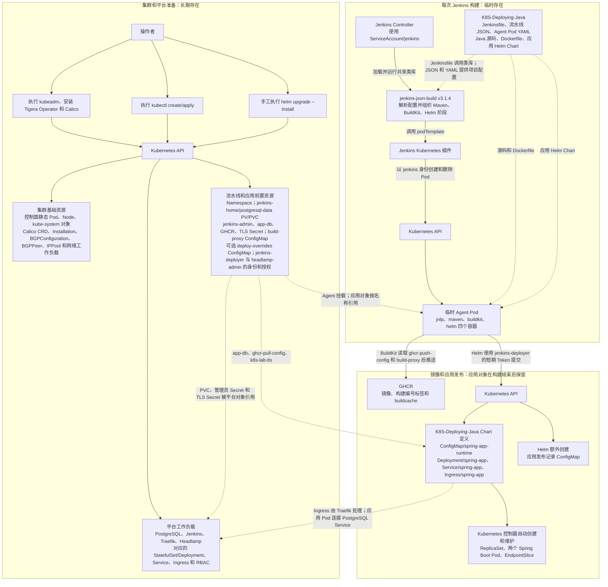
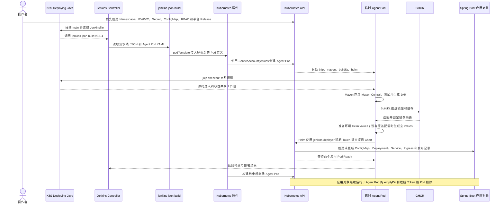

# Kubernetes、Jenkins、BuildKit、GitHub、Spring Boot 3 与 PostgreSQL 部署攻略：虚拟机方案

> 更新时间：2026-08-14  
> 文档定位：既是可以逐步执行的实验操作手册，也是解释原理、风险、验证方法和排障思路的培训文档。  
> 适用环境：2018 Intel Mac mini 上由 UTM 运行 RouterOS CHR，Multipass 运行三台 Ubuntu/Kubernetes 节点。  
> 实验项目：[sunweisheng/K8S-Deploying-Java](https://github.com/sunweisheng/K8S-Deploying-Java)，默认构建分支为 `main`。  
> 当前正式基线：`K8S-Deploying-Java v1.0.8`，提交 `485a6e709d235e3c9b1dd0d673752a013c782d50`，项目位于仓库根目录；Tag、GitHub Release 和 JAR 已正式发布。  
> 实际验证状态：21 个测试、JAR 构建、Rootless BuildKit 镜像与缓存推送、镜像摘要传递、Helm Revision 3、两个应用副本、PostgreSQL 17.10、HTTPS 页面和健康接口均已在本虚拟机环境通过；完整记录见第 2 节与附录 A。  
> 配套方案：[查看云服务器方案](./kubernetes-jenkins-buildkit-github-springboot3-postgresql-cloud-server-guide.md)。
> 共用外部附件：[Kubernetes 与 Calico 网络运行机制](./kubernetes-calico-networking-principles.md)，集中解释 Operator、CNI、Felix、BGP、IPIP、Linux 路由和 RouterOS 的关系。
> Helm 学习附件：[Helm 与 Kubernetes 交互原理及使用指南](./helm-kubernetes-interaction-guide.md)，集中解释 Chart、Values、Template、Manifest、Kubernetes API 交互和 Release 版本记录；Helm 3 默认使用 Secret，而本方案的 Spring Boot Release 显式设置 `HELM_DRIVER=configmap`。

## 使用说明

本手册只描述本地虚拟机路线。请从第一部分开始顺序执行，不要混入云服务器的 VPC、安全组、私有 IP 或 IPIP 配置。

Calico 的共同原理不在两份操作手册中重复展开。开始网络安装前，先阅读共用外部附件 [Kubernetes 与 Calico 网络运行机制](./kubernetes-calico-networking-principles.md)；本手册正文只保留本地虚拟机参数、操作和验收步骤。

作为实验操作手册，每个阶段都给出命令、预期结果和验收方法；作为培训文档，关键位置同时说明命令用途、参数含义、安全边界、常见错误和恢复办法。完成本手册后，应能解释并实际验证：

- UTM RouterOS、Multipass、Kubernetes、Calico BGP 与局域网之间的关系。
- Jenkins Controller 与临时 Agent Pod 的职责边界。
- Maven、BuildKit Rootless、GHCR 和 Helm 在流水线中的执行顺序。
- PostgreSQL 与 Jenkins 如何通过 NFS PV/PVC 保留数据。
- Traefik、Ingress、本地 CA、域名解析和 NodePort 如何共同提供访问入口。
- 如何用状态、日志、事件和逐层网络检查定位故障，而不是只重复执行命令。

### 文档结构和阅读顺序

正文只保留当前基线需要顺序执行的步骤、成功标准和重点知识。建议按下面顺序使用：

1. 先阅读“架构与技术边界”，理解网络、存储、Ingress、Secret 和 BuildKit Rootless 的边界。
2. 顺序执行“第一部分：本地虚拟机基础设施”。
3. 顺序执行“第二部分：平台与应用部署”的第 2 至第 16 节。
4. 完成“第三部分：安全检查与最终验收”。
5. 遇到旧版本遗留配置时查看“附录 A：验证记录与旧版本补救”。
6. 遇到报错、异常状态或历史告警时查看“附录 B：错误信息与排查经验”。
7. 需要升级、回滚、私有仓库、Webhook、分支预览或其他扩展时查看“附录 C：更新、回滚与未来扩展”。
8. 文档维护规则和资料来源位于附录 D。

两份攻略共用的平台知识保持一致，但基础设施命令不能混用。配套文档：[云服务器方案](./kubernetes-jenkins-buildkit-github-springboot3-postgresql-cloud-server-guide.md)。

## 架构与技术边界

### 总体架构

本方案只在 UTM 中运行 RouterOS CHR，三台 Ubuntu 节点由 Multipass 创建。两类虚拟机桥接到同一个真实局域网，网络地址和 Kubernetes 角色如下：

```text
2018 Intel Mac mini（6 核 Core i5、16 GB 内存）
├── UTM：RouterOS CHR 7.21.5  192.168.0.2
└── Multipass
    ├── k8s-master           192.168.0.10
    ├── k8s-node1            192.168.0.11
    └── k8s-node2            192.168.0.12
```

Kubernetes 内部采用下面的结构。Headlamp 不使用 NFS，它通过 Kubernetes API 管理集群：

```text
GitHub：sunweisheng/K8S-Deploying-Java（main）
      │ 拉取代码
      ▼
Jenkins Controller Pod
      │ 创建临时 Agent Pod
      ▼
Jenkins Agent Pod
├── jenkins-json-build v3.1.4：统一驱动 JSON 流水线
├── maven：使用 JDK 21 测试和打包
├── buildkit：以 Rootless 模式构建镜像并推送 GHCR
└── helm：使用 Helm 部署 Spring Boot

Traefik Ingress Controller（2 个 Pod）
├── Jenkins Ingress
│   └── Jenkins Service（ClusterIP）
│       └── Jenkins Controller Pod
│           └── Jenkins PVC ──► NFSv4
├── Spring Boot Ingress
│   └── Spring Boot Service（ClusterIP）
│       └── Spring Boot Pod（2 个副本）
│           └── PostgreSQL Service（ClusterIP）
│               └── PostgreSQL Pod
│                   └── PostgreSQL PVC ──► NFSv4
└── Headlamp Ingress
    └── Headlamp Service（ClusterIP）
        └── Headlamp Pod ──► Kubernetes API
```

#### 构建部署中的 Kubernetes 资源由谁创建

下面两张图只列主要对象和责任关系，不展开 Helm Chart 自带的每一个辅助 ConfigMap、ServiceAccount 或 RBAC 对象。读图时要区分三件事：文件由谁定义、流程由谁触发、最终由谁调用 Kubernetes API 创建对象。项目仓库只是定义来源，不会脱离 Jenkins 自己访问集群。



各类对象在整个流程中的位置如下：

| 对象范围 | 定义来源 | 谁触发、谁实际创建 | 什么时候起作用 |
| --- | --- | --- | --- |
| Kubernetes 与 Calico 基础对象 | kubeadm、Tigera Operator/Calico 清单和本文参数 | 操作者执行安装；kubeadm、kubelet、Operator 和 Calico 控制器创建或维护 | 为后续所有 Pod、Service、存储和网络提供集群基础 |
| 前置对象 | 本文中的 YAML 和 `kubectl create` 命令 | 操作者通过 `kubectl` 创建 | Jenkins、Agent Pod、PostgreSQL 和 Spring Boot 启动前就必须存在 |
| 环境 Helm values | 项目定义可选挂载规则；具体内容由各环境的本文步骤定义 | 虚拟机默认流程不创建；其他环境需要覆盖时由操作者创建 `ConfigMap/deploy-overrides` | Helm 容器启动时可选挂载，写了哪一项就覆盖哪一项；对象不存在时使用 Chart 默认值 |
| 平台对象 | Jenkins、Traefik、Headlamp 官方 Chart，以及本文生成的 PostgreSQL Chart | 操作者运行 Helm；Helm 向 API 提交；Kubernetes 控制器继续创建 Pod 和 EndpointSlice | 提供持续运行的 Jenkins、数据库、入口和管理界面 |
| 临时 Agent Pod | `K8S-Deploying-Java/ci/jenkins-agent.yaml` 与共享类库默认值 | `jenkins-json-build` 调用 `podTemplate`；Jenkins Kubernetes 插件以 `ServiceAccount/jenkins` 创建并在结束后删除 | 只在一次构建期间提供 Maven、BuildKit、Helm 和 Jenkins Agent 环境 |
| Spring Boot 应用对象 | `K8S-Deploying-Java/deploy/charts/spring-app` | `jenkins-json-build` 组织 Helm 命令；Agent Pod 中的 Helm 以 `jenkins-deployer` 身份创建或更新 | Deployment、Service、Ingress 和运行配置在构建结束后继续运行 |
| 自动派生对象 | Deployment、Service、Namespace 和 ServiceAccount 等上层对象 | Kubernetes 内置控制器和 kubelet 自动创建或维护 | 包括 ReplicaSet、业务 Pod、EndpointSlice、`kube-root-ca.crt` 和投射的短期 Token |

一次 `main` 分支构建的实际顺序如下：



两个项目的职责边界可以概括为：`K8S-Deploying-Java` 提供“这个项目构建什么、Agent Pod 长什么样、应用对象长什么样”；`jenkins-json-build` 提供“按什么顺序执行、如何创建临时 Agent、如何构建镜像和调用 Helm”。数据库密码、GHCR 凭据、TLS 私钥和部署授权仍由本文提前创建，不由任何一个 Git 仓库生成或保存。

#### Agent Pod 的定义、创建与 BuildKit 代理源码

Agent Pod 不是在 Jenkins 页面中手工编写，也不是由 `jenkins-json-build` 单独决定。实际链路是：`K8S-Deploying-Java` 定义包含四个容器的 Pod YAML，`jenkins-json-build` 读取并替换变量，Jenkins Kubernetes 插件为 `jnlp` 补齐动态连接参数和共享工作区，再调用 Kubernetes API 创建 Pod。

```text
K8S-Deploying-Java 定义 Jenkinsfile、项目 JSON 和 Agent Pod YAML
        │
        ▼
jenkins-json-build v3.1.4 读取配置、合并模板并替换 ${变量}
        │
        ▼
Jenkins Kubernetes 插件接收 podTemplate，为 jnlp 补齐动态连接参数和共享工作区
        │
        ▼
Kubernetes API 创建包含 jnlp、maven、buildkit、helm 的临时 Agent Pod
```

##### 1. 项目从哪里指定 Agent Pod

项目根目录的 `Jenkinsfile` 只保留共享类库入口：

```groovy
@Library('jenkins-json-build@v3.1.4') _

jenkinsJsonBuild(configFiles: ['ci/jenkins-project.json'])
```

`ci/jenkins-project.json` 一方面继承共享类库中的 Java、Maven、BuildKit 和 Helm 阶段，另一方面明确指定项目自己的 Pod YAML：

```json
{
  "schemaVersion": 3,
  "extends": "java-maven-kubernetes",
  "variables": {
    "JNLP_IMAGE": "docker.io/jenkins/inbound-agent:jdk25@sha256:...",
    "BUILD_PROXY_CONFIG_MAP": "build-proxy",
    "HELM_OVERRIDE_CONFIG_MAP": "deploy-overrides"
  },
  "agent": {
    "type": "kubernetes",
    "yamlFile": "ci/jenkins-agent.yaml"
  }
}
```

共享类库的 `V3Pipeline.kubernetesYaml()` 会优先读取 `agent.yamlFile`，然后用已经合并的变量替换 YAML 中的占位符：

```groovy
if (agent.yamlFile) {
    yaml = readSource(agent.yamlFile.toString(), trustedHostsFromOptions())
}

return resolver.resolve(yaml, context.variables(), 'agent.podYaml').toString()
```

解析后的 YAML 由 `V3Pipeline.withAgent()` 交给 Jenkins Kubernetes 插件：

```groovy
String yaml = kubernetesYaml(agent, context)
Map arguments = [yaml: yaml, showRawYaml: false]

steps.podTemplate(arguments) {
    steps.node(environmentValue('POD_LABEL')?.toString() ?: '') {
        checkoutSource(config)
        body.call()
    }
}
```

这里的 `podTemplate()` 是创建临时 Agent Pod 的关键调用。共享类库负责准备参数，Jenkins Kubernetes 插件使用 `ServiceAccount/jenkins` 调用 Kubernetes API；构建结束后，插件再删除这个 Pod。

##### 2. 四个容器分别由谁定义、负责什么

`K8S-Deploying-Java/ci/jenkins-agent.yaml` 显式定义四个容器：

```yaml
spec:
  containers:
    - name: jnlp
      # 连接 Jenkins Controller，并 checkout GitHub 源码。

    - name: maven
      # 执行 Java 测试和打包。

    - name: buildkit
      # 构建镜像并推送 GHCR。

    - name: helm
      # 把固定镜像摘要部署到 Kubernetes。
```

项目显式声明 `jnlp`，是为了让源码 checkout 稳定读取本环境的 `build-proxy`；镜像使用与 Jenkins 平台一致的固定摘要。Jenkins Kubernetes 插件仍负责向这个特殊容器注入本次 Agent 名称、密钥、Controller 地址和共享工作区挂载，使 Pod 通过 WebSocket 连接 Controller。未放在具体 `container(...)` 块中的 checkout 默认在 `jnlp` 中执行，源码随后进入四个容器共用的工作区。

四个容器的职责和代理边界如下：

| 容器 | 谁加入 | 主要职责 | 是否读取 `build-proxy` |
| --- | --- | --- | --- |
| `jnlp` | 项目 Pod YAML 定义；插件补动态连接参数 | 连接 Controller、checkout GitHub 源码 | 是，避免国内网络直连 GitHub 波动 |
| `maven` | 项目 Pod YAML | Maven 测试、JaCoCo 和 JAR 打包 | 否，当前方案直连 Maven Central |
| `buildkit` | 项目 Pod YAML | 拉取基础镜像、构建并推送镜像和远程缓存 | 是 |
| `helm` | 项目 Pod YAML | 准备可选环境 values，并使用短期投射 Token 部署 Spring Boot | 否 |

正式基线真实构建 `K8S-Deploying-Java/main #11` 的 Pod 日志已经同时列出 `buildkit`、`helm`、`jnlp`、`maven`，证明最终运行的是四容器 Pod。

##### 3. 为什么 jnlp 和 BuildKit 有代理，Maven 没有

代理不是 Jenkins Controller 自动继承给整个 Pod，也没有写在 Pod 级 `env` 中。第 11 节由操作者在 `ci` 命名空间预先创建 `ConfigMap/build-proxy`，项目 JSON 再把 ConfigMap 名称放入变量 `BUILD_PROXY_CONFIG_MAP`。项目的 `ci/jenkins-agent.yaml` 让 `jnlp` 读取整个 ConfigMap，让 `buildkit` 明确读取三个键：

```yaml
- name: jnlp
  envFrom:
    - configMapRef:
        name: ${BUILD_PROXY_CONFIG_MAP}

- name: buildkit
  env:
    - name: HTTP_PROXY
      valueFrom:
        configMapKeyRef:
          name: ${BUILD_PROXY_CONFIG_MAP}
          key: HTTP_PROXY
    - name: HTTPS_PROXY
      valueFrom:
        configMapKeyRef:
          name: ${BUILD_PROXY_CONFIG_MAP}
          key: HTTPS_PROXY
    - name: NO_PROXY
      valueFrom:
        configMapKeyRef:
          name: ${BUILD_PROXY_CONFIG_MAP}
          key: NO_PROXY
```

变量替换后，`${BUILD_PROXY_CONFIG_MAP}` 变成 `build-proxy`。Kubelet 在启动 `buildkit` 容器前读取这个 ConfigMap，并把三个键写成容器环境变量；`buildctl-daemonless.sh` 及其启动的 `buildkitd` 子进程继续继承这些变量。

```text
ConfigMap/build-proxy
        │
        ├── envFrom → jnlp → 通过 Mac 代理 checkout GitHub
        │
        └── configMapKeyRef → buildkit → buildctl-daemonless.sh 和 buildkitd
                                      ├── 通过 Mac 代理从 Docker Hub 拉取基础镜像
                                      └── 通过 Mac 代理向 GHCR 推送应用镜像和 buildcache
```

`jnlp` 的 `configMapRef` 和 BuildKit 的 `configMapKeyRef` 都不是可选项，因此 `build-proxy` 不存在时 Pod 无法正常启动，其中任一代理键不存在时 BuildKit 会进入 `CreateContainerConfigError`。Maven 和 Helm 不读取该 ConfigMap；Maven 继续直连 Maven Central。

##### 4. Helm 如何使用 Chart 默认值和可选环境 values

如果还不熟悉 Chart、Values、Template 和 Manifest 的关系，先阅读 [Helm 与 Kubernetes 交互原理及使用指南](./helm-kubernetes-interaction-guide.md)。该附件讲解 Helm 3 默认的 Secret 发布记录；本方案为了缩小 Jenkins 部署账号权限，显式使用 `HELM_DRIVER=configmap` 保存 Spring Boot Release 记录。

应用的默认域名和 TLS Secret 由 `K8S-Deploying-Java/deploy/charts/spring-app/values.yaml` 定义：

```yaml
ingress:
  host: app.k8s.lab
  tlsSecret: k8s-lab-tls
```

项目 Agent YAML 只给 Helm 容器挂载可选的 `ConfigMap/deploy-overrides`。`optional: true` 表示 ConfigMap 不存在时 Pod 仍能正常创建：

```yaml
- name: helm-overrides
  configMap:
    name: deploy-overrides
    optional: true
```

部署阶段先运行项目中的 `ci/prepare-helm-values.sh`：挂载目录中存在 `values.yaml` 时复制它，不存在时生成内容为 `{}` 的空文件。随后 `ci/jenkins-project.json` 通过共享类库已经支持的 `valuesFiles` 把这份文件交给 `lint`、`template` 和 `upgrade`：

```json
{
  "type": "helm",
  "action": "upgrade",
  "valuesFiles": ["${HELM_OVERRIDE_VALUES_FILE}"],
  "setValues": {
    "image.repository": "${IMAGE_REPOSITORY}",
    "image.digest": "${IMAGE_DIGEST}"
  }
}
```

因此合并顺序是“Chart 默认值 → 可选环境 values → 本次构建的镜像仓库和摘要”。环境 values 只写 `ingress.host` 时只替换域名，只写 `ingress.tlsSecret` 时只替换 TLS Secret，两者不要求同时出现。镜像仓库和经过校验的摘要最后由流水线强制覆盖，环境 ConfigMap 不能改变本次构建要部署的镜像。虚拟机默认流程不创建 `deploy-overrides`，正好直接使用 Chart 中的 `app.k8s.lab` 和 `k8s-lab-tls`。

##### 5. BuildKit 如何执行构建、缓存和推送

这里先说明 BuildKit 阶段实际完成什么；JSON 如何选择处理方法、每个字段如何变成命令参数，以及真实构建最终执行的完整命令，见文档末尾“附录 D.3 BuildKit 阶段 JSON 如何转成执行命令”。

共享类库模板把镜像阶段固定到 `buildkit` 容器：

```json
{
  "id": "image",
  "container": "buildkit",
  "steps": [
    {
      "type": "containerImage",
      "builder": "buildkit",
      "cacheFrom": ["type=registry,ref=${BUILDKIT_CACHE_REF}"],
      "cacheTo": ["type=registry,ref=${BUILDKIT_CACHE_REF},mode=max"]
    }
  ]
}
```

`V3Pipeline` 根据 `container` 字段进入对应容器，然后生成 `buildctl-daemonless.sh build` 命令。源码中的关键部分如下：

```groovy
for (String source : cacheFrom) {
    command.addAll(['--import-cache', source])
}
for (String destination : cacheTo) {
    command.addAll(['--export-cache', destination])
}
command.addAll([
    '--output', "type=image,name=${destinations.join(',')},push=true",
    '--metadata-file', metadataFile
])

String digest = ImageReference.requireDigest(parsed[metadataKey]?.toString())
```

代理只解决“网络请求经过哪里”。GHCR 登录由另一个对象 `Secret/ghcr-push-config` 解决：项目 YAML 把它挂载为 BuildKit 的 Docker `config.json`，并通过 `DOCKER_CONFIG` 指向挂载目录。两者不能互相替代：`build-proxy` 负责连接路径，`ghcr-push-config` 负责 Registry 身份认证。

还要区分节点的 containerd 代理：containerd 代理负责在 Pod 启动前拉取 `maven`、`buildkit`、`helm`、`jnlp` 等容器镜像；这里的 `build-proxy` 负责 Pod 启动后 `jnlp` checkout GitHub，以及 BuildKit 拉取 Dockerfile 基础镜像、读写缓存和推送最终镜像。

对应源码可以在固定版本中查看：

- [`K8S-Deploying-Java v1.0.8 / Jenkinsfile`](https://github.com/sunweisheng/K8S-Deploying-Java/blob/v1.0.8/Jenkinsfile)
- [`K8S-Deploying-Java v1.0.8 / ci/jenkins-project.json`](https://github.com/sunweisheng/K8S-Deploying-Java/blob/v1.0.8/ci/jenkins-project.json)
- [`K8S-Deploying-Java v1.0.8 / ci/jenkins-agent.yaml`](https://github.com/sunweisheng/K8S-Deploying-Java/blob/v1.0.8/ci/jenkins-agent.yaml)
- [`K8S-Deploying-Java v1.0.8 / ci/prepare-helm-values.sh`](https://github.com/sunweisheng/K8S-Deploying-Java/blob/v1.0.8/ci/prepare-helm-values.sh)
- [`jenkins-json-build v3.1.4 / V3Pipeline.groovy`](https://github.com/sunweisheng/jenkins-json-build/blob/v3.1.4/shared-library/src/com/bluersw/jenkins/libraries/v3/V3Pipeline.groovy)
- [`jenkins-json-build v3.1.4 / java-maven-kubernetes.json`](https://github.com/sunweisheng/jenkins-json-build/blob/v3.1.4/shared-library/resources/com/bluersw/jenkins/libraries/v3/templates/java-maven-kubernetes.json)

关键选择：

- 两种部署方案使用同一个固定业务仓库 `https://github.com/sunweisheng/K8S-Deploying-Java`；`pom.xml`、`Jenkinsfile`、`Dockerfile`、`ci/` 和 `deploy/` 都位于仓库根目录。
- `k8s-master` 提供 NFSv4 存储，Jenkins 和 PostgreSQL 分别使用独立 NFS PV/PVC。
- Jenkins Controller 使用 PVC 保存任务、插件、凭据和构建记录，Pod 重建后数据仍在。
- PostgreSQL 使用独立 PVC，Pod 或节点重启后数据库文件仍在。
- Jenkins 不在 Controller 中执行构建。每次构建临时创建 Agent Pod，结束后自动删除。
- Jenkins 固定使用已经发布的 `jenkins-json-build v3.1.4` 标签，并从仓库的 `shared-library/` 子目录加载共享类库；现有 V2 项目继续固定使用 `v2.1`。
- 共享类库的 `jenkinsJsonBuild` 读取 `ci/jenkins-project.json`，统一驱动 Maven、JUnit、Jacoco、SonarQube、BuildKit 和 Helm；Jenkinsfile 只保留入口。
- Java 编译、测试和打包使用 Docker Hub 官方 Maven 镜像，内含 Eclipse Temurin OpenJDK 21。
- Java 运行镜像使用 Docker Hub 官方 Eclipse Temurin JRE 21。
- BuildKit 使用官方 `moby/buildkit` Rootless 镜像，在临时 Agent Pod 内按需启动守护进程；不挂载 Docker Socket，也不使用特权容器。
- 镜像推送到 `ghcr.io`。部署时使用镜像摘要，不依赖会变化的 `latest` 标签。
- Traefik、Jenkins、PostgreSQL、Headlamp 和 Spring Boot 工作负载都用 Helm 管理。
- 数据库密码、Jenkins 管理员密码、GHCR 登录信息和 TLS 私钥都保存为 Kubernetes Secret，不写入 Git。
- PostgreSQL 只提供集群内部 `ClusterIP Service`，不直接暴露到局域网。
- Jenkins、Spring Boot 和 Headlamp 都使用 `ClusterIP Service + Ingress`。
- Traefik 是唯一的局域网入口，通过 `30080/30443` 提供 HTTP/HTTPS，不要求修改 RouterOS 或真实主路由。
- Headlamp 使用保存在 Kubernetes Secret 中的长期 `cluster-admin` Token，方便在实验环境中直接管理全部资源；该 Token 不会按 8 小时自动过期，实验结束后必须删除。
- Traefik 和 Spring Boot 各运行 2 个副本，用于验证 Service 负载分发和滚动更新。
- 受本机 16 GB 内存限制，Jenkins 默认最多创建 1 个构建 Agent；Jenkins Controller、PostgreSQL 和 Headlamp 保持单副本。
- 多副本只用于实验，不代表具备高可用；本文不设计多控制平面、存储冗余或故障自动切换。
- 本实验只验证 Jenkins 和 PostgreSQL 在 Pod 重建后的数据持久化，不设计两者的备份与灾难恢复；重要数据不能只依赖本方案。
- Jenkins 位于可信局域网并使用本地 CA。固定实验项目只在创建任务时手工扫描一次，不启用定时扫描和 GitHub Webhook。

### 持久化边界

本文使用 NFSv4 和 Kubernetes 静态 NFS PV/PVC：

- Jenkins Pod 重启、重建：数据不丢。
- PostgreSQL Pod 重启、重建：数据不丢。
- Kubernetes Worker 正常重启：数据不丢。
- Pod 可以在不同 Worker 之间重新调度，数据仍由 NFS 提供。

NFS 服务器位于 `k8s-master`。它停机时，Jenkins 和 PostgreSQL 会暂时无法读写；NFS 目录、虚拟磁盘或虚拟机被删除时，PV/PVC 不能找回数据。本文只验证 Pod 和节点正常重启后的数据持久化，不设计存储高可用，也不提供备份恢复流程。

PostgreSQL 可以使用 NFSv4 完成本实验，但数据库对延迟和 `fsync` 很敏感。本文不是生产方案，实验数据允许重新初始化。

### BuildKit Rootless 安全边界

Kaniko 仓库已经归档，本文不再使用 Kaniko，镜像构建改为 Moby 项目持续维护的 BuildKit。每次构建时，Jenkins 都会创建一个临时 Agent Pod，并在其中通过 `buildctl-daemonless.sh` 启动 BuildKit daemon；构建结束后，daemon 和 Pod 一起删除。构建缓存单独推送到 GHCR，不依赖 Worker 的本地目录。

这套方案没有挂载 Docker Socket，也没有把 BuildKit 容器设置为特权容器，但这并不代表它可以安全地构建任意来源的代码。理解它的安全边界，需要分别看清下面四个问题。

#### 1. 为什么同时固定版本标签和 SHA256 摘要

每个 Jenkins Agent Pod 都使用 V3.1.4 固定的镜像：

```text
moby/buildkit:v0.32.2-rootless@sha256:504731e577c20559c00f968f33219f30115e70be29ab96728d1d06e963fc494b
```

这里的版本标签和摘要解决的是两个不同问题：

- `v0.32.2-rootless` 供人阅读，用来说明选择的是哪个 BuildKit 版本和运行模式。
- `sha256:504731...` 是这份多架构镜像“总目录”的摘要，供容器运行时确定并校验实际要拉取的内容。这个“总目录”的正式名称是 OCI Image Index，在 Docker 资料中也常称为 Manifest List。

“多架构镜像总目录”可以理解成下面这张对应表：

```text
moby/buildkit:v0.32.2-rootless
└── 多架构镜像总目录  sha256:504731...
    ├── linux/amd64  ──► AMD64 版本的镜像清单 ──► 对应镜像层
    └── linux/arm64  ──► ARM64 版本的镜像清单 ──► 对应镜像层
        （这里只画出本实验关注的两种架构）
```

镜像标签下面并不是只有一套适用于所有 CPU 的文件。镜像仓库先保存一份多架构总目录，总目录再记录每种操作系统和 CPU 架构对应的镜像清单；具体镜像清单继续记录配置文件和各镜像层的摘要。

当 Kubernetes 在 Intel 或 AMD Worker 上启动 Agent Pod 时，容器运行时按以下顺序处理：

1. 按 `sha256:504731...` 获取并校验指定的多架构总目录，而不是只查询标签当前指向什么。
2. 识别节点架构为 `linux/amd64`，从总目录选择 AMD64 条目；如果节点是 ARM，则选择 `linux/arm64` 条目。
3. 按该条目记录的摘要获取具体架构的镜像清单，再按清单中的摘要获取和校验配置文件与镜像层。

因此，“精确指定”指的是锁定这张总目录，以及由它引用的各架构镜像。以后即使镜像仓库把 `v0.32.2-rootless` 标签改为指向另一张总目录，本文使用的 Pod 也不会悄悄改用新内容：原摘要仍存在时继续拉取原内容；原摘要已经被删除时拉取失败，不会自动退回标签当前指向的内容。

固定摘要的主要价值是让升级受控、故障可以复现、审计时能够确认实际使用的构建工具。以后升级 BuildKit 时，应先验证新版本和目标架构，再同时修改标签与摘要，使“可读版本”和“实际内容”保持一致。

摘要也有明确边界：它只能证明拉取到的内容与选定内容一致，不能证明这份内容没有漏洞，也不能阻止选定镜像本身已经被污染。它同样不能单独保证整个应用构建可复现，因为 Dockerfile 基础镜像、Maven 依赖和外部下载也可能变化。

固定摘要本身也不会让镜像拉取更快。本文配置的 `imagePullPolicy: IfNotPresent` 会在节点已经保存所需镜像时复用本地缓存，但使用普通标签也可以采用相同的缓存策略；如果节点没有镜像，仍然需要访问镜像仓库。离线环境要提前把镜像加载到节点或使用内部镜像仓库，不能只靠写入 SHA256 摘要解决。

#### 2. Rootless 解决了什么，没有解决什么

`rootless` 镜像中的 BuildKit daemon 以普通用户 `1000:1000` 运行。Dockerfile 的 `RUN` 步骤即使在自己的构建环境中看到 `root`，这个身份也通过用户命名空间映射到非特权用户，并不等同于获得 Worker 宿主机的真实 root 权限。

这样做可以降低 BuildKit 被利用后的权限范围，并避免把宿主机 Docker daemon 的控制权交给流水线。但 Rootless 不是“绝对安全模式”：构建进程仍会处理仓库代码、访问网络，并在需要时接触构建上下文、镜像仓库凭据或显式传入的构建 Secret。因此，不能只看到 UID `1000` 就把不可信仓库交给它构建。

#### 3. 为什么 Rootless 还要放开部分安全限制

BuildKit 构建镜像时需要创建用户和挂载命名空间，并执行 `unshare`、`mount` 等操作。默认 seccomp 和 AppArmor 策略可能拦截这些操作。RootlessKit 还要通过镜像内的 `newuidmap`、`newgidmap` 辅助程序，为 BuildKit 建立 subordinate UID/GID 映射；它们需要在容器内部临时取得完成映射所需的权限。

因此，本文只对 `buildkit` 容器使用下面这组安全上下文：

```yaml
securityContext:
  runAsUser: 1000
  runAsGroup: 1000
  allowPrivilegeEscalation: true
  capabilities:
    drop:
      - ALL
    add:
      - SETUID
      - SETGID
  seccompProfile:
    type: Unconfined
  appArmorProfile:
    type: Unconfined
```

这几项配置分别解决不同问题：

- `allowPrivilegeEscalation: true` 允许执行带有 setuid 位或文件 capability 的辅助程序时，在**容器内部**获得它们预先声明的权限。如果设为 `false`，容器运行时会启用 `no_new_privs`，`newuidmap`、`newgidmap` 即使存在也无法完成 UID/GID 映射，日志会出现 `operation not permitted`。
- `drop: ALL` 先删除默认 capabilities，再只加回建立映射需要的 `SETUID`、`SETGID`，避免把其他不需要的 capability 一并交给 BuildKit。
- seccomp 和 AppArmor 的 `Unconfined` 放开 BuildKit 创建用户、挂载命名空间时需要的系统调用和安全策略限制。

`allowPrivilegeEscalation: true` 不等于 `privileged: true`。本文没有把 BuildKit 设置为特权容器，也没有挂载 Docker Socket 或 `hostPath`；daemon 的常规身份仍是 `1000:1000`。但是，这组配置已经不符合 Kubernetes Restricted Pod Security 的全部限制，并且扩大了 BuildKit 容器可使用的内核接口。Maven、Helm 和 `jnlp` 不需要 UID/GID 映射，仍保持 `allowPrivilegeEscalation: false` 和 `drop: ALL`，不能把 BuildKit 的例外复制给整个 Agent Pod。

#### 4. `--oci-worker-no-process-sandbox` 带来了什么风险

正常情况下，BuildKit 会为每个构建执行步骤创建独立 PID 命名空间并挂载单独的 `/proc`。Docker 可以通过 `systempaths=unconfined` 放开所需的 `/proc` 挂载限制，但 Kubernetes 没有完全等价的配置，因此 BuildKit 官方 Kubernetes 示例使用：

```text
--oci-worker-no-process-sandbox
```

这个参数不再为 Dockerfile 的 `RUN` 步骤创建独立的进程沙箱。它带来两项官方明确提示的风险：

- `RUN` 对应的进程可以看到 BuildKit daemon 容器中的其他进程，并可能向它们发送信号；在安全条件允许时，还可能进行 `ptrace`。
- BuildKit 无法可靠清理某个构建步骤退出后仍残留的进程。

这不表示 `RUN` 进程会自动进入 Worker 宿主机或其他 Pod 的 PID 命名空间，因为本文没有启用 `hostPID`。真正的问题是：恶意或失控的构建步骤与 BuildKit daemon 之间少了一层进程隔离，可能干扰同一个 Agent Pod 内的构建服务。因此，本文只构建受控的实验仓库和分支，不允许来自不可信 Fork 的代码在带有 GHCR 凭据的流水线中直接运行。

#### Ubuntu 24.04 为什么还要检查节点参数

Rootless BuildKit 依赖非特权用户命名空间完成 UID/GID 映射。Ubuntu 24.04 默认启用了额外的 AppArmor 用户命名空间限制，因此两台 Worker 都要先检查：

```bash
sysctl user.max_user_namespaces
sysctl kernel.apparmor_restrict_unprivileged_userns
```

`user.max_user_namespaces` 必须大于 `0`。如果 `kernel.apparmor_restrict_unprivileged_userns` 为 `1`，按照 BuildKit v0.32.2 的 Rootless 文档，在两台 Worker 上执行：

```bash
echo 'kernel.apparmor_restrict_unprivileged_userns=0' | \
  sudo tee /etc/sysctl.d/99-buildkit-rootless.conf
sudo sysctl --system
```

这个 sysctl 会持久关闭整台 Worker 对非特权用户命名空间施加的这项 AppArmor 限制，而不是只放行 BuildKit Pod。它不会直接授予普通用户宿主机 root 权限，但会扩大节点上非特权进程可以使用的内核攻击面。Ubuntu 设置这项默认限制，本来就是为了降低用户命名空间相关内核漏洞的利用风险。

因此，本文的最终取舍是：只在专用实验集群的两台 Worker 上进行该设置，不与敏感生产工作负载混用；只构建受控仓库，不让不可信代码接触流水线凭据。如果组织安全基线禁止关闭该限制，不应强行照搬命令，而应使用隔离的构建节点、编写经过安全评审的 AppArmor 策略，或者使用平台统一提供的远程 BuildKit 服务。

一句话总结：Rootless 降低了 BuildKit 直接拥有宿主机高权限的风险，固定摘要保证构建工具版本不会悄悄变化；但 BuildKit 专用的 `allowPrivilegeEscalation: true`、`SETUID`/`SETGID`、`Unconfined`，以及 `--oci-worker-no-process-sandbox` 和节点级用户命名空间设置都削弱了部分隔离能力，所以“只构建可信代码，并把构建节点与敏感生产负载隔离”仍是这套方案的必要前提。

## 第一部分：本地虚拟机基础设施

### A.0 安装本机所需软件

开始创建虚拟机前，先在 Mac 安装并准备下面的软件和镜像。所有下载都使用官方入口：

| 项目 | 本文用途 | 下载或安装入口 |
| --- | --- | --- |
| Multipass | 创建三台 Ubuntu 24.04 Kubernetes 虚拟机 | [Canonical Multipass 安装页](https://canonical.com/multipass/install) |
| UTM | 运行 AMD64 RouterOS CHR | [UTM 官网](https://mac.getutm.app/) |
| RouterOS CHR 7.21.5 | 提供实验用 BGP 路由器 | [MikroTik CHR 下载页](https://mikrotik.com/download/chr) |
| WinBox | 发现、登录和配置 RouterOS | [MikroTik WinBox 下载页](https://mikrotik.com/download/winbox) |

从 CHR 下载页选择 `7.21.5` 的 Raw disk image，解压后确认文件名为 `chr-7.21.5.img`。不要下载 ARM 镜像，也不要用未固定版本的镜像替代。

安装 Multipass 后先打开一次应用，再在 Mac 终端确认 CLI、后台服务和驱动可以工作：

```bash
multipass version
multipass get local.driver
multipass networks
```

预期 CLI 和 `multipassd` 都是 `1.16.3+mac`，驱动是 `qemu`。如果命令无法连接 `multipassd`，暂停创建虚拟机并按“附录 B.1.21 Multipass 无法连接后台服务”处理。UTM 导入 CHR 后先启动一次，并确认 WinBox 能在 `Neighbors` 中看到 CHR 的 MAC 地址，再继续 A.1 至 A.3。

本文在命令块中使用以 `#` 开头的中文注释帮助理解。在执行本文其他 Mac 命令块之前，先把下面这一行**单独复制到 Mac 终端执行一次**：

```zsh
setopt interactivecomments
```

这条命令只让当前 zsh 终端把 `#` 开头的行当作注释，不会修改系统配置。关闭终端后设置失效；打开新终端继续实验时再执行一次。出现注释命令错误时，按“附录 B.1.22 zsh 把注释行当成命令”处理。

### A.1 主机与资源要求

本机已核对的配置如下：

| 项目 | 实际配置 |
| --- | --- |
| 机型 | Mac mini 2018（`Macmini8,1`） |
| CPU | 3 GHz 六核 Intel Core i5 |
| 图形 | Intel UHD Graphics 630，1536 MB |
| 内存 | 16 GB 2667 MHz DDR4 |
| 系统 | macOS Sequoia 15.7.9（Build `24G830`） |
| Multipass | CLI `1.16.3+mac`、`multipassd 1.16.3+mac`，QEMU 驱动 |

这台 16 GB 主机可以让三台 Kubernetes 虚拟机统一使用 4 GB，再给 CHR 512 MB，但前提是把它当作专用实验环境：Jenkins 只允许一个临时 Agent，实验期间关闭 Docker Desktop、IDE 和其他大型应用。CPU 仍按工作负载分配，磁盘统一为便于维护的 30 GB 稀疏磁盘：

| 虚拟机 | vCPU | 内存 | 虚拟磁盘 | 主要工作 |
| --- | ---: | ---: | ---: | --- |
| RouterOS CHR | 1 | 512 MB | 1 GB | BGP 路由器 |
| k8s-master | 2 | 4 GB | 30 GB | Kubernetes 控制平面、NFSv4 |
| k8s-node1 | 2 | 4 GB | 30 GB | Jenkins、单个临时构建 Pod、Traefik |
| k8s-node2 | 2 | 4 GB | 30 GB | PostgreSQL、Spring Boot、Traefik |

三台 Kubernetes 虚拟机合计 12 GB，加上 CHR 后约为 12.5 GB，名义上给 macOS 留下约 3.5 GB。QEMU、文件缓存和图形界面还会占用额外内存，因此这是一套贴近机器上限的单人实验配置，不是宽裕配置。三台 Kubernetes 虚拟机各使用 2 个 vCPU，加上 CHR 后总计分配 7 个 vCPU，相对 6 个物理核心约为 `1.17:1`。三台 Kubernetes 虚拟机的内存统一为 4 GB；Jenkins `containerCap` 保持为 `1`，同一时间只运行一个 Maven/BuildKit 构建，不把两个构建并行运行作为验收目标。

三块 30 GB 虚拟磁盘是容量上限，不会在创建时立即占满 90 GB。Multipass/QEMU 使用稀疏磁盘，实际占用空间会随着 Ubuntu 系统、容器镜像、Jenkins 数据和构建缓存逐步增加。本文把这套环境作为用完即删的家庭实验环境，因此不增加宿主机磁盘余量检查脚本。

启动全部虚拟机后可以执行 `memory_pressure` 观察 macOS 内存压力。持续出现内存压力或交换空间快速增长时，应先关闭桌面大型应用或停掉暂时不用的工作负载，不要继续提高 Jenkins 并发；交换空间只作为短时缓冲，不计入可用内存。

### A.2 UTM RouterOS + Multipass Kubernetes

本地虚拟机方案的实际分工如下。后续命令全部包含在本模块中，不需要跳转到另一份基础攻略：

- UTM 只运行一台 AMD64 RouterOS CHR，镜像固定为 `chr-7.21.5.img`，使用桥接网卡和 WinBox 管理。
- Multipass 创建三台 Ubuntu 24.04 AMD64 Kubernetes 节点。
- Multipass 默认管理网卡保留，用于 `multipass shell/exec` 和系统管理。
- 每台虚拟机新增一张桥接业务网卡，固定使用 `192.168.0.10` 至 `.12`。
- Kubernetes API、kubelet、NFS 和 Calico BGP 只使用桥接业务地址；管理网卡地址不进入 Kubernetes 配置。

先在 Mac 检查实际 Multipass 环境：

```bash
multipass version
multipass get local.driver
multipass networks
multipass list
```

本文已核对本机环境为 Multipass CLI `1.16.3+mac`、`multipassd 1.16.3+mac`、QEMU 驱动，当前没有已创建的 Multipass 实例。`multipass networks` 显示 `en0` 为有线网卡、`en1` 为 Wi-Fi、`en7` 为 USB 10/100 网卡。本文默认使用 `en0`；实际执行时仍要确认它已连接到实验局域网，并让 UTM CHR 和三台 Multipass 虚拟机桥接到同一个物理接口。

UTM 中创建 CHR 虚拟机时使用下面的固定配置：

| 项目 | 配置 |
| --- | --- |
| 架构 | x86_64 |
| CPU | 1 核 |
| 内存 | 512 MB |
| 启动固件 | 关闭 `UEFI Boot`，使用传统 BIOS 启动 |
| 启动磁盘 | 导入 `chr-7.21.5.img`；UTM 转换为 QCOW2 后显示为 `chr-7.21.5.qcow2` 属于正常现象 |
| 磁盘接口 | 本实验使用 IDE；MikroTik 官方同时支持 QEMU/KVM 的 IDE、SATA 和 VirtIO |
| 网络 | 桥接到 `${MP_BRIDGE}` 对应的物理网卡 |
| 管理地址 | `192.168.0.2/24` |

不要继续使用 ARM64 CHR 镜像，也不要把镜像文件名写成可变的 `latest`。下载后先核对文件名确实为 `chr-7.21.5.img`，再导入 UTM。

RouterOS 未进入登录界面而是停在 UEFI Shell 时，暂停主流程并按附录 B 的“UTM 启动到 UEFI Shell”处理。

### A.3 在 WinBox Terminal 配置 RouterOS 7.21.5

下面的命令用于这台新建的家庭局域网实验 CHR，不用于真实主路由。它平时不运行，实验结束后可以直接删除，因此本节只配置实验功能，不配置管理服务白名单、RouterOS 防火墙、BGP 路由过滤或备份恢复。家庭主路由不要为这台 CHR 配置公网端口映射。

本文固定使用以下参数；如果真实网关或 UTM 网卡名不同，必须先修改命令再执行：

| 参数 | 本文取值 |
| --- | --- |
| CHR 接口 | `ether1` |
| CHR 地址 | `192.168.0.2/24` |
| 真实主路由 | `192.168.0.1` |
| Kubernetes 节点网段 | `192.168.0.0/24`；当前三台节点使用 `.10`、`.11`、`.12` |
| Pod CIDR | `10.244.0.0/16` |
| RouterOS AS | `65000` |
| Calico AS | `64512` |

先认识本节反复出现的 RouterOS 命令结构：

| 写法 | 含义 | 执行特点 |
| --- | --- | --- |
| `/ip/address`、`/routing/bgp/connection` | 进入某一类配置对象 | 路径从大类逐级进入具体功能 |
| `print` | 查看现状 | 只读，可以重复执行 |
| `add` | 新建配置 | 通常只执行一次，重复执行可能产生重复条目 |
| `set` | 修改已有配置 | 修改指定对象，不会新建同名对象 |
| `disable` | 停用已有配置 | 配置仍保留，只是不再生效 |
| `where ...` | 筛选输出 | 只显示符合条件的条目 |
| `[find where ...]` | 查找已有对象并把结果交给外层命令 | 条件过宽时可能选中多条记录，修改前要谨慎 |

下面代码块中，以 `#` 开头的行是中文注释，RouterOS 不会执行；实际命令都以 `/` 开头。可以连同注释一起复制到 WinBox Terminal，但仍建议一次执行一个小代码块，看到预期结果后再继续。

#### A.3.1 检查当前状态

先在 WinBox 的 `Neighbors` 中通过 CHR 的 MAC 地址连接，打开 `New Terminal`，按 `Ctrl+X` 进入 Safe Mode。先检查版本、接口和已有配置：

```routeros
# 查看 RouterOS 版本、CPU、内存和运行时间；先确认版本确实是 7.21.5。
/system/resource/print

# 列出以太网接口；确认实验业务网卡名称是 ether1，并检查接口是否处于运行状态。
/interface/ethernet/print

# 查看现有 IP 地址；防止后面重复添加 192.168.0.2/24。
/ip/address/print

# 查看 DHCP 客户端；确认 ether1 是否正在自动获取地址和默认路由。
/ip/dhcp-client/print

# 查看当前路由表；记录修改前的默认路由和直连网段。
/ip/route/print
```

#### A.3.2 设置固定地址

只有确认业务网卡确实是 `ether1` 后，才执行固定地址配置。下面假设真实主路由是 `192.168.0.1`：

```routeros
# 把设备名称改为 chr-k8s-router，便于在 WinBox、日志和 BGP 排障时识别。
/system/identity/set name=chr-k8s-router

# 停用 ether1 上的 DHCP 客户端，避免自动地址和动态默认路由覆盖下面的固定配置。
/ip/dhcp-client/disable [find where interface=ether1]

# 给 ether1 添加实验固定地址 192.168.0.2/24；add 命令只执行一次。
/ip/address/add address=192.168.0.2/24 interface=ether1 comment="k8s-lab-lan"

# 添加默认路由：目标不在本地路由表时交给真实主路由 192.168.0.1，并用 ping 检查网关可达性。
/ip/route/add dst-address=0.0.0.0/0 gateway=192.168.0.1 check-gateway=ping comment="k8s-lab-default"

# 设置 CHR 自己查询域名时使用的 DNS；禁止为其他设备提供递归 DNS 服务。
/ip/dns/set servers=192.168.0.1,1.1.1.1 allow-remote-requests=no
```

如果 `/ip/address/print` 已经存在 `192.168.0.2/24`，不要重复执行 `add`。在 WinBox 的 `Connect To` 中明确输入 `192.168.0.2` 新建连接；连接成功说明固定地址已经生效，可以关闭原来的 MAC 或 IPv6 连接。

#### A.3.3 创建动态 BGP 监听

RouterOS 7.20 起要求显式创建 BGP instance，不能再用旧方案中的 `instance/set default`。本实验只连接自己创建的 Calico 节点，所以不增加 RouterOS 防火墙和 BGP 路由过滤。Calico 应只发布 `10.244.0.0/16` 中的 Pod 子网，后续通过路由表检查实际收到的内容。

本文没有配置 `output.network` 或路由重分发，因此 CHR 不会主动把家庭局域网路由发布给 Calico。RouterOS 只创建一条动态监听连接：`remote.address=192.168.0.0/24` 允许这个家庭局域网中的 Calico 节点连接，`remote.as=64512` 要求对端使用 Calico 集群 AS，`connect=no` 表示 CHR 不主动连接节点，`listen=yes` 表示持续接受新节点发起的连接。

当以后有新节点加入 Kubernetes 时，只要它的 Calico BGP 地址仍在 `192.168.0.0/24`、集群 AS 仍为 `64512`，就不需要再修改 RouterOS：

```routeros
# 创建名为 calico 的 BGP 实例：CHR 使用 AS 65000、Router ID 192.168.0.2，并把学到的路由写入 main 路由表。
/routing/bgp/instance/add name=calico as=65000 router-id=192.168.0.2 routing-table=main

# 创建所有 Calico 节点共用的 IPv4 eBGP 模板；不附加防火墙或路由过滤参数。
/routing/bgp/template/add name=calico-ebgp afi=ip routing-table=main

# 在 192.168.0.2:179 持续监听来自 192.168.0.0/24、AS 64512 的 eBGP 连接；新节点会自动成为动态邻居。
/routing/bgp/connection/add name=calico-nodes instance=calico templates=calico-ebgp local.address=192.168.0.2 local.role=ebgp remote.address=192.168.0.0/24 remote.as=64512 connect=no listen=yes
```

这三个 `add` 命令只执行一次。重复粘贴会生成重复实例、模板或监听连接；重新配置前先用下面的 `print` 命令确认现状。RouterOS 官方说明，`remote.address` 为网段且 `listen=yes` 时，接受第一个连接后仍会继续监听，最多允许 256 个打开的连接，足够本家庭实验使用。

#### A.3.4 检查 RouterOS 配置

Calico 尚未安装和配置时，没有 BGP Session 是正常的：

```routeros
# 查看 BGP 实例，确认 AS、Router ID 和 main 路由表配置正确。
/routing/bgp/instance/print detail

# 查看 BGP 模板，确认启用了 IPv4 地址族并使用 main 路由表。
/routing/bgp/template/print detail

# 查看名为 calico-nodes 的动态监听配置，确认远端网段、AS、connect 和 listen 参数正确。
/routing/bgp/connection/print detail

# 查看实际 BGP 会话状态；后续每个 Calico 节点都应自动产生一个 established 动态会话。
/routing/bgp/session/print detail
```

确认固定地址、默认路由、BGP 实例、模板和 `calico-nodes` 动态监听连接都存在后，按 `Ctrl+X` 退出 Safe Mode并保存操作。如果连接中断，Safe Mode 会自动回滚本次未确认的命令。

### A.4 创建 Multipass Kubernetes 虚拟机

本节所有命令都在 **Mac 终端**执行，不在 RouterOS 或 Ubuntu 虚拟机中执行。

#### A.4.1 定义本次实验参数

先在一个 Mac 终端窗口中执行下面的参数块。`export` 会把参数保存到当前终端会话，后面的创建命令和 A.5 配置网络命令会读取这些参数。关闭这个终端后参数就会消失；如果需要换一个终端继续 A.5，只重新执行下面的参数块，不要重复执行虚拟机创建命令。

```bash
# Ubuntu 虚拟机基础镜像和 Mac 上用于桥接的物理网卡。
export MP_IMAGE=24.04
export MP_BRIDGE=en0

# 三台 Kubernetes 虚拟机统一使用的 CPU、内存和虚拟磁盘上限。
export K8S_CPUS=2
export K8S_MEMORY=4G
export K8S_DISK=30G

# Multipass 中显示和操作虚拟机时使用的名称。
export MASTER_NAME=k8s-master
export NODE1_NAME=k8s-node1
export NODE2_NAME=k8s-node2

# A.5 将要写入三台虚拟机桥接业务网卡的固定地址。
export MASTER_IP=192.168.0.10
export NODE1_IP=192.168.0.11
export NODE2_IP=192.168.0.12

# 三张桥接业务网卡的固定 MAC，A.5 用它识别正确的网卡。
export MASTER_MAC=52:54:00:19:20:10
export NODE1_MAC=52:54:00:19:20:11
export NODE2_MAC=52:54:00:19:20:12
```

各组参数的含义如下：

| 参数 | 本实验取值 | 用途 |
| --- | --- | --- |
| `MP_IMAGE` | `24.04` | 让 Multipass 使用 Ubuntu 24.04 镜像创建三台虚拟机。首次使用时 Multipass 会自动下载镜像。 |
| `MP_BRIDGE` | `en0` | Mac 上连接实验局域网的物理网卡。必须以 `multipass networks` 的实际输出为准，并与 CHR 桥接到同一个局域网。 |
| `K8S_CPUS`、`K8S_MEMORY`、`K8S_DISK` | `2`、`4G`、`30G` | 三台 Kubernetes 虚拟机统一使用的规格；取值是每台机器各自的资源，不是三台机器的合计值。 |
| `*_NAME` | `k8s-master`、`k8s-node1`、`k8s-node2` | Multipass 实例名称。后续 `multipass exec`、`kubeadm` 和排障说明都用这些名称。 |
| `*_IP` | `.10`、`.11`、`.12` | Kubernetes、Calico BGP 和 NFS 使用的桥接业务地址。这里只是定义变量，创建虚拟机时还不会把 IP 写入系统，A.5 才会配置。 |
| `*_MAC` | `52:54:00:19:20:10` 至 `.12` | 固定三张桥接业务网卡的硬件地址，使 A.5 能按 MAC 找到并命名正确的网卡。三组值必须互不重复。 |

执行前确认：

- `multipass networks` 中的 `en0` 确实是连接实验局域网的接口；如果实际使用其他有线网卡，只修改 `MP_BRIDGE`。
- `192.168.0.10` 至 `.12` 没有被其他设备占用，并且已从家庭主路由的 DHCP 自动分配范围中排除。
- 三组 MAC 没有被其他虚拟机使用。

#### A.4.2 指定桥接到哪张 Mac 网卡

下面的命令把 Multipass 的逻辑网络名 `bridged` 指向 `MP_BRIDGE` 保存的物理网卡，本例展开后就是 `en0`。后面的三条 `multipass launch` 都会使用这个设置：

```bash
multipass set "local.bridged-network=${MP_BRIDGE}"
multipass get local.bridged-network
```

第二条命令应输出 `en0`。首次允许 Multipass 使用物理网卡时，macOS 或 Multipass 可能要求确认网络访问权限，按提示允许即可。

#### A.4.3 创建三台虚拟机

依次执行下面三条命令。每条命令只创建一台虚拟机，并等待该虚拟机启动完成：

```bash
# 创建 Kubernetes 控制平面节点 k8s-master。
multipass launch "$MP_IMAGE" \
  --name "$MASTER_NAME" --cpus "$K8S_CPUS" \
  --memory "$K8S_MEMORY" --disk "$K8S_DISK" \
  --network "name=bridged,mode=manual,mac=${MASTER_MAC}"

# 创建第一个 Kubernetes Worker 节点 k8s-node1。
multipass launch "$MP_IMAGE" \
  --name "$NODE1_NAME" --cpus "$K8S_CPUS" \
  --memory "$K8S_MEMORY" --disk "$K8S_DISK" \
  --network "name=bridged,mode=manual,mac=${NODE1_MAC}"

# 创建第二个 Kubernetes Worker 节点 k8s-node2。
multipass launch "$MP_IMAGE" \
  --name "$NODE2_NAME" --cpus "$K8S_CPUS" \
  --memory "$K8S_MEMORY" --disk "$K8S_DISK" \
  --network "name=bridged,mode=manual,mac=${NODE2_MAC}"
```

以第一条命令为例，变量展开后的含义是：使用 Ubuntu 24.04 创建名为 `k8s-master` 的虚拟机，分配 2 个 vCPU、4 GB 内存、最大 30 GB 的稀疏磁盘，并额外挂载一张 MAC 为 `52:54:00:19:20:10` 的桥接网卡。

创建参数的具体作用如下：

| 命令参数 | 作用 |
| --- | --- |
| `multipass launch "$MP_IMAGE"` | 根据 `MP_IMAGE` 指定的 Ubuntu 镜像创建并启动虚拟机。 |
| `--name` | 设置 Multipass 实例名称。名称已存在时命令会报错，因此三条创建命令都只执行一次。 |
| `--cpus`、`--memory`、`--disk` | 给当前这台虚拟机分配 CPU、内存和虚拟磁盘上限。 |
| `--network name=bridged` | 除 Multipass 默认管理网卡外，再添加一张连接家庭局域网的桥接网卡。`bridged` 已在 A.4.2 映射到 `en0`。 |
| `mode=manual` | 只把桥接网卡接入虚拟机，不让 Multipass 自动给它配置地址；固定 IP 将在 A.5 通过 Netplan 写入。 |
| `mac=...` | 给新增的桥接网卡指定固定 MAC，确保重启后仍能被 A.5 的配置准确识别。 |

每台机器创建成功时会看到类似 `Launched: k8s-master` 的输出。三条命令全部完成后执行：

```bash
multipass list
```

预期能看到 `k8s-master`、`k8s-node1`、`k8s-node2`，状态均为 `Running`。此时列表中的 IPv4 是 Multipass 管理地址；`.10`、`.11`、`.12` 尚未出现是正常的，它们将在 A.5 配置。

每台虚拟机现在有两张网卡：

- Multipass 默认管理网卡：自动配置，用于 `multipass shell/exec` 以及虚拟机访问互联网。
- 本节新增的桥接业务网卡：暂时没有 IP，A.5 会将它命名为 `k8s0`，用于 Kubernetes、Calico BGP、NFS 和家庭局域网访问。

不要删除、停用或修改默认管理网卡，否则 `multipass shell/exec` 可能失效。创建命令中断时，按“附录 B.1.24 Multipass 创建虚拟机时中断”处理。

### A.5 配置桥接业务地址

继续在 A.4 使用的 **Mac 终端**中执行。下面先定义一个名为 `configure_k8s_network` 的临时 Shell 函数，再调用三次，分别传入“虚拟机名称、固定 IP、桥接网卡 MAC”。函数会进入指定虚拟机写入 Netplan 配置，不需要手工登录三台虚拟机重复操作。

如果已经关闭 A.4 的终端，先重新执行 A.4.1 的参数块，使 `MASTER_NAME`、`MASTER_IP` 等变量重新生效；不要重新执行 A.4.3 的 `multipass launch`。

这个函数按预先配置的 MAC 匹配桥接业务网卡，将它统一命名为 `k8s0`，且不为它添加第二条默认路由；虚拟机访问互联网继续走 Multipass 管理网卡：

```bash
configure_k8s_network() {
  local vm_name="$1"
  local vm_ip="$2"
  local vm_mac="$3"

  multipass exec "$vm_name" -- \
    sudo sh -c "cat > /etc/netplan/60-k8s-bridge.yaml" <<EOF
network:
  version: 2
  ethernets:
    k8s-bridge:
      match:
        macaddress: ${vm_mac}
      set-name: k8s0
      dhcp4: false
      optional: true
      addresses:
        - ${vm_ip}/24
EOF

  multipass exec "$vm_name" -- sudo chmod 600 /etc/netplan/60-k8s-bridge.yaml
  multipass exec "$vm_name" -- sudo netplan generate
  multipass exec "$vm_name" -- sudo netplan apply
  multipass exec "$vm_name" -- \
    sudo sh -c "printf '%s\n' 'KUBELET_EXTRA_ARGS=--node-ip=${vm_ip}' > /etc/default/kubelet"
}

configure_k8s_network "$MASTER_NAME" "$MASTER_IP" "$MASTER_MAC"
configure_k8s_network "$NODE1_NAME" "$NODE1_IP" "$NODE1_MAC"
configure_k8s_network "$NODE2_NAME" "$NODE2_IP" "$NODE2_MAC"
```

验证两张网卡的职责和网络连通性。下面的代码块整体复制到当前 **Mac 终端**执行即可：

- `for ...; do` 到 `done` 是一个完整的循环，按 `k8s-master`、`k8s-node1`、`k8s-node2` 的顺序检查三台虚拟机。
- 循环内的七条命令会在当前虚拟机检查完以后，再继续检查下一台。
- 三条 `ping` 位于 `done` 后面，会在三台虚拟机都检查完以后依次执行。
- 也可以在 `done` 处把循环和三条 `ping` 分成两次执行，但不要单独复制循环中间的命令或漏掉 `done`。

```bash
for vm_name in "$MASTER_NAME" "$NODE1_NAME" "$NODE2_NAME"; do
  # 输出当前虚拟机名称，避免三台机器的检查结果混在一起。
  printf '\n===== %s =====\n' "$vm_name"

  # 查看虚拟机的运行状态、资源规格和 Multipass 管理地址；状态应为 Running。
  multipass info "$vm_name"

  # 查看 Ubuntu 主机名；应与当前 Multipass 虚拟机名称一致。
  multipass exec "$vm_name" -- hostnamectl --static

  # 查看 CPU 架构；本实验应输出 x86_64。
  multipass exec "$vm_name" -- uname -m

  # 查看网卡和 IP；应同时存在管理网卡地址和 k8s0 的固定业务地址。
  multipass exec "$vm_name" -- ip -br address

  # 查看路由表；默认路由应走管理网卡，192.168.0.0/24 应走 k8s0。
  multipass exec "$vm_name" -- ip route

  # 查看 kubelet 固定使用的节点 IP；应等于当前虚拟机的 k8s0 地址。
  multipass exec "$vm_name" -- cat /etc/default/kubelet

  # 使用 sudo 查看机器唯一标识；三台虚拟机的 product_uuid 必须互不相同。
  multipass exec "$vm_name" -- sudo cat /sys/class/dmi/id/product_uuid
done

# 循环结束后，从 Mac 分别测试三个桥接业务地址是否可达。
ping -c 1 "$MASTER_IP"
ping -c 1 "$NODE1_IP"
ping -c 1 "$NODE2_IP"
```

预期结果：

- 每台虚拟机都有一个 Multipass 管理地址和一个 `k8s0` 固定地址。
- 三台 Ubuntu 虚拟机的 `uname -m` 都返回 `x86_64`，没有通过架构模拟运行 ARM64 系统。
- `k8s0` 分别为 `.10`、`.11`、`.12`，三台虚拟机和 UTM RouterOS 可以通过这些地址互相通信。
- 默认路由仍指向 Multipass 管理网络，`192.168.0.0/24` 直连路由指向 `k8s0`。
- `/etc/default/kubelet` 中的 `--node-ip` 与本机 `k8s0` 地址一致。

### A.6 初始化 Kubernetes 并连接 Calico 与 RouterOS

#### A.6.1 在三台虚拟机安装 containerd 和 Kubernetes

本节后面的三个安装代码块不能在 Mac 上执行，必须在 `k8s-master`、`k8s-node1`、`k8s-node2` 三台 Ubuntu 虚拟机中各执行一遍。

按下面的顺序逐台操作：

1. 在 **Mac 终端**单独执行 `multipass shell k8s-master`，进入控制平面虚拟机。
2. 看到类似 `ubuntu@k8s-master:~$` 的提示符后，依次执行本节的“内核准备”“安装 containerd”“安装 Kubernetes”三个代码块。
3. 三个代码块都成功后执行 `exit`，提示符恢复为 Mac 终端。
4. 在 **Mac 终端**执行 `multipass shell k8s-node1`，进入第一个 Worker，重复执行本节三个代码块，然后执行 `exit`。
5. 在 **Mac 终端**执行 `multipass shell k8s-node2`，进入第二个 Worker，再重复执行本节三个代码块，最后执行 `exit` 返回 Mac。

三个登录命令分别是：

```bash
multipass shell k8s-master
```

完成 `k8s-master` 的三个安装代码块并执行 `exit` 后，再在 Mac 终端执行：

```bash
multipass shell k8s-node1
```

完成 `k8s-node1` 的三个安装代码块并执行 `exit` 后，再在 Mac 终端执行：

```bash
multipass shell k8s-node2
```

不要把这三个 `multipass shell` 命令一次性粘贴执行。进入一台虚拟机后，先完成该虚拟机的全部安装操作并用 `exit` 返回 Mac，再登录下一台。

进入每台虚拟机后，先检查系统时间是否已经通过网络自动同步：

```bash
# 查看当前时间、时区、时钟同步状态和 NTP 服务状态。
timedatectl status
```

正常结果必须同时包含：

```text
System clock synchronized: yes
NTP service: active
```

Kubernetes 证书校验、节点认证、事件时间和日志排障都依赖正确的系统时间。三台虚拟机显示的时区可以不同，例如 Ubuntu 保持 `Etc/UTC`、Mac 使用 `Asia/Shanghai`，这不会造成时间错误；真正需要一致的是它们代表的实际时间。

如果任一状态不符合要求，先按“附录 B.1.2 系统时钟或 NTP 服务未同步”处理。只有时钟同步状态为 `yes` 后才继续安装 Kubernetes。

时间同步检查通过后，关闭 Swap并加载容器网络需要的内核模块：

```bash
sudo swapoff -a
sudo sed -i.bak '/\sswap\s/s/^/#/' /etc/fstab

cat <<'EOF' | sudo tee /etc/modules-load.d/k8s.conf
overlay
br_netfilter
EOF

sudo modprobe overlay
sudo modprobe br_netfilter

cat <<'EOF' | sudo tee /etc/sysctl.d/99-kubernetes-cri.conf
net.bridge.bridge-nf-call-iptables  = 1
net.bridge.bridge-nf-call-ip6tables = 1
net.ipv4.ip_forward                 = 1
EOF

sudo sysctl --system
```

安装并配置 containerd：

```bash
sudo apt-get update
sudo apt-get install -y containerd

sudo mkdir -p /etc/containerd
containerd config default | sudo tee /etc/containerd/config.toml >/dev/null
sudo sed -i 's/SystemdCgroup = false/SystemdCgroup = true/' /etc/containerd/config.toml

sudo systemctl enable --now containerd
sudo systemctl restart containerd
systemctl is-active containerd
```

containerd 安装成功的判断标准：

- 安装输出中出现 `Setting up containerd`，并且没有 `E:`、`failed` 或其他错误。
- 最后一条 `systemctl is-active containerd` 输出 `active`。
- 终端重新出现当前虚拟机的 `ubuntu@虚拟机名:~$` 提示符。

Ubuntu 安装完成后显示的 `Scanning processes`、`No services need to be restarted`、`No containers need to be restarted` 等内容是常规检查信息，不是报错。满足上述三个条件只代表当前虚拟机的 containerd 已安装并启动；还要继续执行下面的 Kubernetes 安装代码块，才算完成当前虚拟机的 A.6.1。

如果最后返回 `inactive` 或 `failed`，暂停安装并按“附录 B.1.13 containerd 未正常启动”处理。

安装 Kubernetes 1.36 软件包。A.5 已提前创建 `/etc/default/kubelet` 并写入当前节点的桥接业务 IP，下面的安装命令使用 `--force-confold`，明确要求 dpkg 保留这份配置。如果仍出现 kubelet 配置文件选择提示，按“附录 B.1.23 安装 kubelet 时出现配置文件选择”处理。

```bash
export KUBERNETES_MINOR=v1.36

sudo apt-get update
sudo apt-get install -y apt-transport-https ca-certificates curl gpg
sudo mkdir -p -m 755 /etc/apt/keyrings

curl -fsSL "https://pkgs.k8s.io/core:/stable:/${KUBERNETES_MINOR}/deb/Release.key" \
  | sudo gpg --dearmor --yes -o /etc/apt/keyrings/kubernetes-apt-keyring.gpg

echo "deb [signed-by=/etc/apt/keyrings/kubernetes-apt-keyring.gpg] https://pkgs.k8s.io/core:/stable:/${KUBERNETES_MINOR}/deb/ /" \
  | sudo tee /etc/apt/sources.list.d/kubernetes.list

sudo apt-get update
sudo apt-get -o Dpkg::Options::="--force-confold" install -y kubelet kubeadm kubectl
sudo apt-mark hold kubelet kubeadm kubectl

sudo systemctl restart kubelet
kubeadm version -o short
kubelet --version
kubectl version --client
cat /etc/default/kubelet
```

当前虚拟机的 A.6.1 安装成功应同时满足：

- `kubelet set on hold`、`kubeadm set on hold`、`kubectl set on hold` 均已出现，表示三个软件包已锁定，不会被普通系统升级自动更换。
- `kubeadm`、`kubelet`、`kubectl` 输出相同的 Kubernetes 版本。本文使用 `v1.36` 软件源，安装的是该软件源当前提供的最新补丁版本；本次实际输出为 `v1.36.3`。
- `Kustomize Version` 是 `kubectl version --client` 附带显示的内置 Kustomize 版本，不要求与 Kubernetes 版本号相同。
- `/etc/default/kubelet` 仍包含当前节点的桥接业务地址：master 为 `--node-ip=192.168.0.10`，node1 为 `.11`，node2 为 `.12`。
- 执行过程中没有出现 `E:`、`failed` 或其他安装错误，并且最后重新出现当前虚拟机的 Shell 提示符。

此时集群尚未初始化，kubelet 反复重启属于正常现象。三台虚拟机都满足上述条件后，退出到 Mac 终端并进入 A.6.2。

#### A.6.2 初始化控制平面并加入 Worker

##### A.6.2.1 前置步骤：为三台节点的 containerd 配置 Mac 7890 代理

`kubeadm init` 需要由 containerd 从 `registry.k8s.io` 拉取控制平面镜像。虚拟机中的命令行即使能够访问部分软件源，containerd 也不会自动继承 Mac 或当前 Shell 的代理设置，因此必须在初始化集群之前完成本节。

若此前已先执行 `kubeadm init` 并停在拉取镜像阶段，按“附录 B.1.3 先执行 kubeadm init 后拉取镜像超时”恢复后，再从本节重新开始。

先确认 Mac 代理软件已经开启“允许局域网连接”。A.6.1 完成后当前应位于 **Mac 终端**，执行下面整个代码块；`MP_BRIDGE` 必须与 A.4 使用的桥接网卡相同：

```bash
# 本实验使用 en0 桥接，并使用 Mac 代理的 HTTP/Mixed 端口 7890。
export MP_BRIDGE=en0
export PROXY_PORT=7890

# 自动读取 Mac 在实验局域网中的地址，不能使用 127.0.0.1。
export PROXY_HOST="$(ipconfig getifaddr "$MP_BRIDGE")"
echo "Mac 代理地址：http://${PROXY_HOST}:${PROXY_PORT}"
```

输出中的 `PROXY_HOST` 应为 Mac 的 `192.168.0.x` 地址。如果为空、显示 `127.0.0.1` 或不属于实验局域网，先检查 `MP_BRIDGE`，不要继续。

从三台虚拟机分别测试能否通过 Mac 代理访问 Kubernetes 镜像仓库。下面整个代码块仍在 **Mac 终端**执行：

```bash
for vm_name in k8s-master k8s-node1 k8s-node2; do
  # 标明当前正在测试哪台虚拟机。
  printf '\n===== %s 测试 Mac 代理 =====\n' "$vm_name"

  # curl 实际在虚拟机中运行，但代理地址使用上面取得的 Mac 局域网地址。
  multipass exec "$vm_name" -- \
    curl -I --connect-timeout 10 \
    -x "http://${PROXY_HOST}:${PROXY_PORT}" \
    https://registry.k8s.io/v2/
done
```

三台虚拟机都必须收到 HTTP 响应，不能出现 `Connection refused`、`Could not connect` 或 `timed out`。未通过时暂停操作，并按“附录 B.1.14 虚拟机无法通过 Mac 代理访问镜像仓库”处理。

代理连通后，把代理写入三台虚拟机的 containerd systemd 服务。下面整个代码块仍在 **Mac 终端**执行：

```bash
for vm_name in k8s-master k8s-node1 k8s-node2; do
  printf '\n===== %s 配置 containerd 代理 =====\n' "$vm_name"

  # 创建 containerd 的 systemd 扩展配置目录。
  multipass exec "$vm_name" -- \
    sudo mkdir -p /etc/systemd/system/containerd.service.d

  # 为 containerd 设置 Mac HTTP 代理；使用远端 printf 写文件，避免 multipass exec 等待标准输入。
  multipass exec "$vm_name" -- sudo sh -c "
    printf '%s\n' \
      '[Service]' \
      'Environment=\"HTTP_PROXY=http://${PROXY_HOST}:${PROXY_PORT}\"' \
      'Environment=\"HTTPS_PROXY=http://${PROXY_HOST}:${PROXY_PORT}\"' \
      'Environment=\"NO_PROXY=127.0.0.1,localhost,192.168.0.0/24,192.168.252.0/24,10.244.0.0/16,10.96.0.0/12,.k8s.lab,.svc,.svc.cluster.local,kubernetes.default.svc\"' \
      > /etc/systemd/system/containerd.service.d/proxy.conf
  "

  # 让 systemd 重新读取配置，重启 containerd，并确认服务仍为 active。
  multipass exec "$vm_name" -- sudo systemctl daemon-reload
  multipass exec "$vm_name" -- sudo systemctl restart containerd
  multipass exec "$vm_name" -- systemctl is-active containerd

  # 显示 containerd 实际加载的环境变量，确认代理地址已经生效。
  multipass exec "$vm_name" -- \
    systemctl show containerd --property=Environment --no-pager
done
```

每台虚拟机都必须输出 `active`，并在 `Environment=` 中看到正确的 `HTTP_PROXY`、`HTTPS_PROXY` 和 `NO_PROXY`。这里只给 containerd 配置代理，不给 kubelet 配置代理，避免 Kubernetes API 和集群内部地址被错误发送到 Mac 代理。

每台虚拟机的配置通常几秒内完成。长时间没有继续时，按“附录 B.1.15 旧版 containerd 代理命令一直等待”处理。

A.6.2.1 完成后当前仍在 Mac 终端。先执行下面的登录命令：

```bash
multipass shell k8s-master
```

##### A.6.2.2 第一步：预拉取控制平面镜像

看到 `ubuntu@k8s-master:~$` 提示符后，先读取版本并单独执行镜像预拉取。这个步骤只下载镜像，还没有创建 Kubernetes 控制平面：

```bash
# 读取当前实际安装的 kubeadm 版本，确保初始化的控制平面版本与安装版本一致。
export KUBERNETES_VERSION="$(kubeadm version -o short)"
echo "本次初始化 Kubernetes ${KUBERNETES_VERSION}"

# 通过 containerd 预拉取该版本需要的全部控制平面镜像。
sudo kubeadm config images pull \
  --kubernetes-version="$KUBERNETES_VERSION"
```

所有镜像都显示 `Pulled` 说明 containerd 代理可用，但此时 `/etc/kubernetes/admin.conf` 还不存在，不能直接执行 kubeconfig 或 `kubectl` 命令。

##### A.6.2.3 第二步：初始化控制平面

必须等镜像预拉取成功并重新出现 `ubuntu@k8s-master:~$` 提示符后，再单独执行下面的初始化代码块。**这一步不能跳过，也不要与第三步混在同一次粘贴中执行：**

```bash
sudo kubeadm init \
  --kubernetes-version="$KUBERNETES_VERSION" \
  --apiserver-advertise-address=192.168.0.10 \
  --pod-network-cidr=10.244.0.0/16 \
  --service-cidr=10.96.0.0/12
```

只有输出明确出现 `Your Kubernetes control-plane has initialized successfully!` 和完整的 `kubeadm join ...` 命令，才算初始化成功。保存 Join 命令后再进入第三步。

##### A.6.2.4 第三步：配置当前用户的 kubectl

下面的代码块先检查 `/etc/kubernetes/admin.conf` 是否存在。只有第二步成功生成该文件后，才会复制 kubeconfig 并执行 `kubectl get nodes`；如果第二步被跳过，只会给出中文提示，不会继续访问错误的 `localhost:8080`：

```bash
if [[ ! -f /etc/kubernetes/admin.conf ]]; then
  echo "控制平面尚未初始化：请先完成 A.6.2.3 的 kubeadm init"
else
  mkdir -p "$HOME/.kube"
  sudo cp /etc/kubernetes/admin.conf "$HOME/.kube/config"
  sudo chown "$(id -u):$(id -g)" "$HOME/.kube/config"
  chmod 600 "$HOME/.kube/config"

  kubectl get nodes -o wide
fi
```

保存 `kubeadm init` 最后输出的完整 `kubeadm join ...` 命令。命令丢失或 Token 过期时，按“附录 B.1.16 Join 命令丢失或 Token 过期”处理。

然后按下面的顺序让两个 Worker 加入集群：

1. 在 `k8s-master` 执行 `exit`，返回 Mac 终端。
2. 在 **Mac 终端**执行 `multipass shell k8s-node1`。
3. 看到 `ubuntu@k8s-node1:~$` 后，粘贴刚才保存的完整 Join 命令，并在开头加上 `sudo`。成功后执行 `exit` 返回 Mac。
4. 在 **Mac 终端**执行 `multipass shell k8s-node2`。
5. 看到 `ubuntu@k8s-node2:~$` 后，执行同一条 `sudo kubeadm join ...` 命令。成功后执行 `exit` 返回 Mac。
6. 在 **Mac 终端**执行 `multipass shell k8s-master`，重新进入控制平面。
7. 在 `ubuntu@k8s-master:~$` 提示符下执行 `kubectl get nodes -o wide`，检查三台节点是否都已注册。

不要在 Mac 或 `k8s-master` 上执行 `kubeadm join`；这条命令只在两个 Worker 中执行。安装 Calico 前节点显示 `NotReady` 是正常的；三个 `INTERNAL-IP` 必须分别为 `192.168.0.10`、`.11`、`.12`，不能是 Multipass 管理地址。

#### A.6.3 安装 Calico 并连接 RouterOS

本节执行本地虚拟机方案的实际安装。CRD、Operator、CNI、Felix、BIRD、无封装路由与单网卡 RouterOS 的完整工作机制见共用外部附件 [Kubernetes 与 Calico 网络运行机制](./kubernetes-calico-networking-principles.md)。

A.6.2 最后已经重新进入 `k8s-master`，本节继续在当前 `ubuntu@k8s-master:~$` 终端执行，不要退出到 Mac。

下面两个 Calico YAML 位于 `raw.githubusercontent.com`。A.6.2.1 设置的是 containerd 服务代理，只负责拉取容器镜像，不会自动代理当前 Shell 中的 `kubectl create -f https://...` 请求。因此先用 Mac 代理把 YAML 下载到 master，再让 `kubectl` 从本地文件安装：

```bash
export CALICO_VERSION=v3.32.1
export PROXY_HOST=192.168.0.5
export PROXY_PORT=7890
export CALICO_MANIFEST_DIR="$HOME/k8s-bootstrap/calico-${CALICO_VERSION}"

# 创建 Calico 安装文件目录。
mkdir -p "$CALICO_MANIFEST_DIR"

# 通过 Mac 7890 代理下载 Project Calico CRD 清单。
curl -fsSL --connect-timeout 10 \
  --proxy "http://${PROXY_HOST}:${PROXY_PORT}" \
  -o "$CALICO_MANIFEST_DIR/projectcalico-crds.yaml" \
  "https://raw.githubusercontent.com/projectcalico/calico/${CALICO_VERSION}/manifests/v1_crd_projectcalico_org.yaml"

# 通过同一代理下载 Tigera Operator 清单。
curl -fsSL --connect-timeout 10 \
  --proxy "http://${PROXY_HOST}:${PROXY_PORT}" \
  -o "$CALICO_MANIFEST_DIR/tigera-operator.yaml" \
  "https://raw.githubusercontent.com/projectcalico/calico/${CALICO_VERSION}/manifests/tigera-operator.yaml"

# 确认两个文件都已成功下载且不是空文件。
test -s "$CALICO_MANIFEST_DIR/projectcalico-crds.yaml"
test -s "$CALICO_MANIFEST_DIR/tigera-operator.yaml"
ls -lh "$CALICO_MANIFEST_DIR"
```

两个文件都显示为非零大小后，再单独执行下面的安装代码块。`kubectl` 此时读取本地文件，只连接 `192.168.0.10:6443`，不需要设置 Shell 全局代理：

```bash
# 创建后续 BGPConfiguration、BGPPeer、IPPool 所需的 Calico CRD。
kubectl create -f "$CALICO_MANIFEST_DIR/projectcalico-crds.yaml"

# 安装负责部署和管理 Calico 组件的 Tigera Operator。
kubectl create -f "$CALICO_MANIFEST_DIR/tigera-operator.yaml"

# 等待 Installation CRD 建立完成，随后才能创建 Installation 对象。
kubectl wait --for=condition=Established \
  crd/installations.operator.tigera.io \
  --timeout=120s
```

如果最后输出下面这行，表示 `Installation` CRD 已成功建立：

```text
customresourcedefinition.apiextensions.k8s.io/installations.operator.tigera.io condition met
```

这里的 `condition met` 只表示 Kubernetes 已经认识 `Installation` 这种资源，并且可以进入下一步；它不表示 Calico 网络组件已经全部安装完成。继续前检查 Tigera Operator Pod：

```bash
kubectl -n tigera-operator get pods -o wide
```

预期 `tigera-operator` Pod 显示 `1/1 Running`。此时 CoreDNS 仍为 `Pending` 是正常的，因为还没有创建下面的 Calico `Installation`，Pod 网络尚未就绪。

Tigera Operator Pod 和后续 Calico Pod 的镜像仍由各节点的 containerd 拉取，会使用 A.6.2.1 已配置的服务代理。

创建完整的 Calico `Installation`。本地局域网由 RouterOS 学习 Pod 路由，因此不使用 IPIP 或 VXLAN；地址自动选择必须跟随 Kubernetes 的 `INTERNAL-IP`：

```bash
cat <<'EOF' | kubectl apply -f -
apiVersion: operator.tigera.io/v1
kind: Installation
metadata:
  name: default
spec:
  calicoNetwork:
    nodeAddressAutodetectionV4:
      kubernetes: NodeInternalIP
    ipPools:
      - blockSize: 26
        cidr: 10.244.0.0/16
        encapsulation: None
        natOutgoing: Enabled
        nodeSelector: all()
EOF
```

Calico 安装完成后，在 master 创建集群 AS、RouterOS 邻居和真实局域网 NAT 排除池。三台 Calico Node 使用 AS `64512`，RouterOS 使用 AS `65000`。禁用的 `real-lan-no-nat` 地址池不分配 Pod 地址，只用于防止 Pod 访问 `192.168.0.0/24` 时被源地址转换：

```bash
cat <<'EOF' | kubectl apply -f -
apiVersion: crd.projectcalico.org/v1
kind: BGPConfiguration
metadata:
  name: default
spec:
  asNumber: 64512
  nodeToNodeMeshEnabled: true
---
apiVersion: crd.projectcalico.org/v1
kind: BGPPeer
metadata:
  name: routeros-peer
spec:
  peerIP: 192.168.0.2
  asNumber: 65000
  nextHopMode: Keep
---
apiVersion: crd.projectcalico.org/v1
kind: IPPool
metadata:
  name: real-lan-no-nat
spec:
  cidr: 192.168.0.0/24
  disabled: true
  disableBGPExport: true
  natOutgoing: false
EOF
```

`real-lan-no-nat` 的三个关键字段作用不同：`disabled: true` 禁止从这个地址池给 Pod 分配地址，`natOutgoing: false` 让该网段成为 Pod 出站 NAT 的排除目标，`disableBGPExport: true` 防止 Calico 把家庭局域网 `192.168.0.0/24` 发布给 RouterOS。三项都必须保留。

#### A.6.3.1 为什么外网访问使用 NAT，而访问 Mac 代理不使用 NAT

本机方案不是完全关闭 Pod 出站 NAT，而是采用“访问外网使用 NAT、访问家庭局域网不使用 NAT”的方式。

主 Pod 地址池中：

```yaml
natOutgoing: Enabled
```

表示 Pod 访问 GitHub、GHCR、Docker Hub、Maven Central 等外部服务时，会先把源地址从 `10.244.x.x` 转换为所在 Kubernetes 节点当前出网网卡的地址。虚拟机的默认路由走 Multipass 管理网卡，因此外部服务不需要知道 Pod 网段，也不会直接看到 Pod 地址：

```text
Pod 10.244.x.x
  -> Kubernetes 节点的 Multipass 管理网卡地址
  -> Multipass 和 Mac 的出网链路
  -> GitHub、GHCR 等外部服务
```

但本方案还创建了一个禁用的 `real-lan-no-nat` 地址池：

```yaml
cidr: 192.168.0.0/24
disabled: true
natOutgoing: false
```

它不会给 Pod 分配地址。它的作用是：当 Pod 访问家庭局域网 `192.168.0.0/24`，例如 Mac 上的代理 `192.168.0.5:7890` 时，保留 Pod 原始地址，不转换为节点地址：

```text
Pod 10.244.x.x
  -> Mac 代理 192.168.0.5:7890
Mac 代理看到的来源仍是 Pod 10.244.x.x
```

这样做是为了验证 RouterOS CHR 通过 BGP 学到的 Pod 路由确实可用。Mac 收到 Pod 的代理请求后，返回数据必须经由 CHR `192.168.0.2`，由 CHR 根据 BGP 路由送回实际承载该 Pod 的 Kubernetes 节点。因此 Mac 必须增加：

```text
10.244.0.0/16 -> 192.168.0.2
```

这不是把 Pod 暴露到互联网；Pod 地址只在本次家庭局域网实验中保留和可路由。

如果目标只是让 Jenkins 和 BuildKit 通过 Mac 代理访问 GitHub、GHCR，而不需要验证“家庭局域网能够直接路由到 Pod 网段”，可以不设置这条局域网 NAT 排除规则。此时 Mac 看到的是节点私有 IP，通常也不需要增加 Pod 网段返回路由；但 RouterOS BGP 学习 Pod 路由的实验价值就没有在代理链路中得到验证。

本指南保留 `real-lan-no-nat` 和 Mac 返回路由，是为了同时完成两项实验：

1. 让 Pod 能通过 Mac 代理访问外部服务。
2. 验证家庭局域网经 RouterOS CHR 可以正确返回 Pod 网段。

旧版 IPPool 缺少 `disableBGPExport` 时，按附录 A 的一次性补救步骤处理。

`routeros-peer` 没有设置 `node` 或 `nodeSelector`，因此它是 Calico 的全局 BGP Peer。Calico 官方定义是：集群中所有现有节点和以后新增的节点都会尝试与 `192.168.0.2` 建立 BGP 会话。RouterOS 的 `calico-nodes` 动态监听连接负责接收这些会话，两边都不需要按节点增加规则。

`nextHopMode: Keep` 用于保留路由原始下一跳。启用 Calico 节点间 Mesh 后，每个节点不仅知道自己的 Pod 地址块，也会从其他节点学习地址块；向 CHR 发布这些路由时，如果使用默认的 `next hop self`，三台节点会把同一个地址块都宣称为“经过自己”，CHR 可能选到错误节点。例如 Jenkins Pod 位于 `k8s-node1` 的 `10.244.36.64/26`，默认配置曾让 CHR 把活动下一跳错误选成 Master `192.168.0.10`，导致 Mac 返回代理连接时包到达 Master 后无法进入原连接。`Keep` 让三条发布都保留真实下一跳 `192.168.0.11`，新增节点和新地址块也会自动采用各自真实下一跳。

旧版 `routeros-peer` 缺少 `nextHopMode: Keep` 时，按附录 A 的一次性补救步骤处理。

自动建立 BGP 的前提是：新节点已经加入 Kubernetes、该节点的 `calico-node` Pod 已启动、Calico 自动写入的 BGP IPv4 地址位于 `192.168.0.0/24`，并继续使用集群 AS `64512`。新增节点仍要完成虚拟机网络配置和 `kubeadm join`，但不需要修改 RouterOS 或重新创建 `BGPPeer`。

Calico 3.32.1 的本安装清单没有创建旧版 `nodes.crd.projectcalico.org` CRD。calico-node 根据 `NodeInternalIP` 自动探测地址后，会把结果写入 Kubernetes Node 的 `projectcalico.org/IPv4Address` 注解。使用下面已经在本实验集群验证通过的命令核对节点状态、内部地址和 Calico BGP 地址：

```bash
# 检查三台 Kubernetes 节点是否均为 Ready，并查看 INTERNAL-IP。
kubectl get nodes -o wide

# 从 Kubernetes Node 注解读取 Calico 3.32.1 实际使用的 BGP IPv4 地址。
kubectl get nodes -o \
  'custom-columns=NAME:.metadata.name,INTERNAL_IP:.status.addresses[?(@.type=="InternalIP")].address,CALICO_BGP_IPV4:.metadata.annotations.projectcalico\.org/IPv4Address'

# 检查全局 BGP 配置、RouterOS Peer 和两个 IPPool 是否存在。
kubectl get bgpconfigurations.crd.projectcalico.org,bgppeers.crd.projectcalico.org,ippools.crd.projectcalico.org
```

第二条命令当前必须输出 `.10/24`、`.11/24`、`.12/24`，并且每行的 `INTERNAL_IP` 与 `CALICO_BGP_IPV4` 应对应同一个桥接业务地址，不能使用 Multipass 管理地址。以后新增节点也必须使用 `192.168.0.0/24` 中的桥接业务地址。旧版查询出现 `the server doesn't have a resource type "nodes"` 时，按“附录 B.1.11 旧版 Calico 与 RouterOS 查询命令报错”处理。回到 WinBox Terminal 验证动态 Session 和收到的 Pod 路由：

```routeros
# 查看三条动态 BGP Session；每个 Calico 节点都应为 established。
/routing/bgp/session/print detail

# RouterOS 7 使用 bgp=yes 标记 BGP 路由。
/routing/route/print detail where bgp=yes

# 查看 BGP 日志，并测试 CHR 能否到达三台节点的桥接业务地址。
/log/print where topics~"bgp"
/tool/ping 192.168.0.10 count=3
/tool/ping 192.168.0.11 count=3
/tool/ping 192.168.0.12 count=3
```

当前三节点实验应自动出现三个 `established` Session；以后节点增删时，Session 数量应随 Calico 节点数量变化。动态 Session 带有 `D` 标志属于正常现象。BGP 路由应只落在 `10.244.0.0/16` 内。

第二部分中，Jenkins Controller Pod 和 Agent Pod 的 `jnlp` 通过 Mac 的 `192.168.0.5:7890` 代理访问 GitHub，BuildKit 通过该代理访问 Docker Hub 和 GHCR；Maven 直接访问 Maven Central。`real-lan-no-nat` 会让这些代理连接保留 `10.244.0.0/16` 中的 Pod 源地址，因此 Mac 必须把返回 Pod 网段的数据交给已经学习 Calico 路由的 CHR `192.168.0.2`。这条路由不是直接访问应用 Pod 时才需要的可选项，而是本虚拟机方案使用 Pod 内 Mac 代理的必需条件。

**执行位置：Mac 终端。** 下面整段可以一起执行；已有正确路由时只显示提示，不会重复添加：

```bash
if route -n get 10.244.0.1 | grep -q 'gateway: 192.168.0.2'; then
  echo 'Pod 网段返回路由已经存在'
else
  sudo route -n add -net 10.244.0.0/16 192.168.0.2
fi

route -n get 10.244.0.1 | awk '/gateway:|interface:/ {print}'
```

最后必须显示 `gateway: 192.168.0.2` 和实际桥接接口。macOS 重启后这条临时路由会消失，每次重新开始实验都要检查。

**现在不要删除这条路由。** 只要 Jenkins Controller 或 `jnlp` 仍通过 Mac 的 `192.168.0.5:7890` 代理访问 GitHub，或者 BuildKit 仍通过该代理访问 Docker Hub 和 GHCR，Mac 就需要用它把响应数据送回 Pod。提前删除后，Pod 发出的连接请求可能到达 Mac，但 Mac 的响应会交给家庭默认网关而不是 CHR，最终表现为 Jenkins 仓库扫描、源码 checkout 或 BuildKit 拉取推送超时。Maven 直连外网，不依赖这条代理返回路径。

只有在以下任一条件成立时才可以删除：本次 Kubernetes 实验已经结束并准备删除虚拟机；或者已经取消 Pod 对 Mac 代理的依赖，并确认不再需要从 Mac 直接访问 Pod 网段。删除操作不会修改 CHR 或 Kubernetes，只删除 Mac 当前路由表中的一条临时路由。

**执行位置：Mac 终端。** 确认实验已经结束后，整段执行：

```bash
if route -n get 10.244.0.1 2>/dev/null | grep -q 'gateway: 192.168.0.2'; then
  sudo route -n delete -net 10.244.0.0/16 192.168.0.2
  echo 'Pod 网段返回路由已经删除'
else
  echo '没有找到指向 CHR 的 Pod 网段返回路由，不需要删除'
fi

route -n get 10.244.0.1 | awk '/gateway:|interface:/ {print}'
```

删除后，最后一条命令仍可能显示家庭网络的默认网关，这是正常现象；判断成功的标准是它不再显示 `gateway: 192.168.0.2`。Mac 重启也会自动清除这条临时路由。

Mac 使用 Wi-Fi 时桥接可能受无线网卡或接入点限制；出现桥接不通时，优先使用 USB 有线网卡，把 `MP_BRIDGE` 改成 `multipass networks` 显示的有线接口后重新创建虚拟机。

## 第二部分：平台与应用部署

本部分部署 Jenkins、BuildKit、PostgreSQL、Traefik、Headlamp 和 Spring Boot。完成第一部分并确认三个节点 Ready 后，先阅读第 2 节的方案边界，再从第 3 节开始顺序执行。

### 2. 当前执行基线与验证范围

本次顺序操作固定使用 `jenkins-json-build v3.1.4`、实验项目 `v1.0.8` 和仓库根目录中的 `Jenkinsfile`。不要引用 `master`、功能分支或临时提交，也不要改回旧 `k8sCluster`、Docker Socket 或特权容器方案。

当前验证范围必须分开记录：

- `v1.0.8` 不再要求 Jenkins Controller 提供应用域名和 TLS Secret。虚拟机不创建 `ConfigMap/deploy-overrides` 时，Helm 直接使用 Chart 默认的 `app.k8s.lab` 和 `k8s-lab-tls`。
- 21 个 Maven 测试、JAR 构建、Helm lint 和四种 Ingress values 组合的模板渲染已经通过；正式基线的真实 Jenkins、BuildKit、GHCR、Helm 和应用运行结果已由 `main #11` 验证，每次重建环境仍要按第 16 节重新检查。
- 流水线结束后要确认三个 Node 为 `Ready`，Traefik 和 Spring Boot 均为两个 Ready 副本，Jenkins 与 PostgreSQL NFS PV/PVC 为 `Bound`，五个 Helm Release 均为 `deployed`，Spring Boot 按镜像摘要运行、能连接 PostgreSQL，三个 HTTPS 入口均返回 `200`，应用健康状态为 `UP`。
- 会中断服务的 Jenkins Controller 和 PostgreSQL Pod 重建，以及页面完整新增、修改、删除和分页操作，仍按第 16.3、16.4 节在每次新环境实验中单独确认，不能只由只读复查代替。
- `jenkins-json-build v3.1.4` 是当前修复后的共享类库基线；旧版本故障经过和一次性补救命令统一放在附录 A。

执行时只需要记住：`jnlp` 通过 `build-proxy` checkout GitHub 源码，Maven 直连 Maven Central，BuildKit 通过同一 ConfigMap 访问镜像仓库；Registry 凭据只挂载给 BuildKit，短期 Kubernetes Token 只挂载给 Helm。详细版本审计、旧版错误和验证证据见附录 A；运行时报错见附录 B。

### 3. 已核对的软件和镜像

以下内容在 2026-08-10 按 `jenkins-json-build v3.1.4` Release 核对过版本、固定摘要与 AMD64/ARM64 支持：

| 用途 | 版本或镜像 | AMD64 / ARM64 |
| --- | --- | --- |
| Jenkins Helm Chart | `jenkins/jenkins 5.9.49`，Jenkins `2.568.2` | 支持 |
| Jenkins Controller | `jenkins/jenkins:2.568.2-jdk25`，固定多架构摘要 | 支持 |
| Jenkins 入站 Agent | `jenkins/inbound-agent:jdk25`，固定多架构摘要 | 支持 |
| Jenkins 共享类库 | `sunweisheng/jenkins-json-build v3.1.4`，库目录 `shared-library` | 不涉及 |
| Maven 构建 | `maven:3.9.11-eclipse-temurin-21` | 支持 |
| Java 运行 | `eclipse-temurin:21-jre-jammy`，当前对应 OpenJDK `21.0.11_10` | 支持 |
| BuildKit Rootless | `moby/buildkit:v0.32.2-rootless@sha256:504731e577c20559c00f968f33219f30115e70be29ab96728d1d06e963fc494b` | 支持 |
| PostgreSQL | `postgres:17-bookworm`，本文固定到 PostgreSQL `17.10` 对应摘要 | 支持 |
| 部署工具 | Helm、kubectl，Agent 镜像 `alpine/k8s:1.36.2` | 支持 |
| Ingress Controller | Traefik Helm Chart `41.1.1`，Traefik `3.7.9` | 支持 |
| Kubernetes Web UI | Headlamp Helm Chart `0.44.0`，Headlamp `0.44.0` | 支持 |
| 共享存储 | Ubuntu NFSv4 + Kubernetes NFS PV/PVC | 支持 |

本文示例中的主要镜像都固定摘要。以后升级版本时应先重新核对目标架构，再同时修改可读标签和摘要，不能只改其中一项，也不能使用 `latest`。

### 4. 创建部署目录和本地虚拟机参数

在 `k8s-master` 创建部署目录。这个目录保存基础设施配置，不保存密码和 Token：

```bash
mkdir -p "$HOME/k8s-platform/manifests"
cd "$HOME/k8s-platform"
```

创建 `platform.env`：

```bash
cat > "$HOME/k8s-platform/platform.env" <<'EOF'
export CI_NAMESPACE=ci
export APP_NAMESPACE=spring-app
export INGRESS_NAMESPACE=ingress-system
export HEADLAMP_NAMESPACE=headlamp

# NFS 服务运行在 master；NFS_CLIENT_CIDR 只是允许访问 NFS 的客户端地址范围
export NFS_SERVER=192.168.0.10
export NFS_CLIENT_CIDR=192.168.0.8/29
export JENKINS_PV_SIZE=10Gi
export JENKINS_PVC_SIZE=8Gi
export POSTGRESQL_PV_SIZE=10Gi
export POSTGRESQL_PVC_SIZE=8Gi
export INGRESS_HTTP_NODE_PORT=30080
export INGRESS_HTTPS_NODE_PORT=30443
export JENKINS_HOST=jenkins.k8s.lab
export APP_HOST=app.k8s.lab
export HEADLAMP_HOST=headlamp.k8s.lab
export TLS_SECRET_NAME=k8s-lab-tls

# 本次已核对的 Mac en0 局域网地址；不能填 127.0.0.1
export PROXY_HOST=192.168.0.5
export PROXY_PORT=7890

# 必须使用全小写的 GitHub 用户名或组织名、镜像仓库名
export GHCR_OWNER=sunweisheng
export GHCR_REPOSITORY=spring-app
EOF

chmod 600 "$HOME/k8s-platform/platform.env"
source "$HOME/k8s-platform/platform.env"
```

`NFS_CLIENT_CIDR` 不是从 RouterOS、Kubernetes 或 Ubuntu 自动读取的值，而是本文在 `platform.env` 中手工设置的一条 NFS 客户端匹配规则。它不会修改任何机器的 IP、子网掩码或路由。`192.168.0.8/29` 的掩码是 `255.255.255.248`：`.8` 是网络地址，`.15` 是广播地址，可匹配的主机地址为 `.9` 至 `.14`，因此包含本实验的 `.10`、`.11`、`.12` 三台 Kubernetes 节点。

以后需要确认当前文件中设置的值，在 `k8s-master` 执行：

```bash
grep '^export NFS_CLIENT_CIDR=' "$HOME/k8s-platform/platform.env"
```

预期输出 `export NFS_CLIENT_CIDR=192.168.0.8/29`。执行 `source "$HOME/k8s-platform/platform.env"` 后，后续 NFS 配置命令通过 `${NFS_CLIENT_CIDR}` 读取这个值。

先检查没有遗留占位值：

```bash
if grep -Eq 'REPLACE_ME|replace_me' "$HOME/k8s-platform/platform.env"; then
  echo 'platform.env 还有未替换的参数'
  exit 1
fi
```

Mac 的局域网地址可在 Mac 终端查询。`en0` 不是实际桥接网卡时，换成对应接口：

```bash
ipconfig getifaddr en0
```

#### 4.1 安装 Helm

后续 Traefik、Jenkins、PostgreSQL、Headlamp 和 Spring Boot 都由 Helm 管理。在 `k8s-master` 检查：

```bash
helm version
```

没有 Helm 时可使用官方安装脚本。下面整段命令可以一次复制到当前 `ubuntu@k8s-master:~$` 终端执行，不会打开编辑器或分页查看器：

```bash
source "$HOME/k8s-platform/platform.env"
if [[ -n "${PROXY_HOST:-}" && -n "${PROXY_PORT:-}" ]]; then
  export HTTPS_PROXY="http://${PROXY_HOST}:${PROXY_PORT}"
fi
curl -fsSLo get_helm.sh \
  https://raw.githubusercontent.com/helm/helm/main/scripts/get-helm-3 &&
bash -n get_helm.sh &&
echo 'Helm 安装脚本语法检查通过' &&
chmod 700 get_helm.sh &&
./get_helm.sh &&
rm -f get_helm.sh &&
helm version
```

这里的 `bash -n get_helm.sh` 只读取并检查脚本语法，不会执行脚本；语法正确时它本身没有输出，所以后面的“`Helm 安装脚本语法检查通过`”就是检查通过提示。`&&` 表示只有前一条命令成功，才继续执行下一条，避免下载或语法检查失败后仍然运行脚本。

安装成功时会看到类似 `helm installed into /usr/local/bin/helm` 的提示，最后的 `helm version` 会输出版本信息。误进入 `less` 分页查看器时，按“附录 B.1.12 退出 less 分页查看器”处理。

Helm 管理工作负载和发布历史；NFS 主机软件、Kubernetes Secret、静态 PV/PVC 与最小权限 RBAC 仍使用系统命令或 `kubectl`，避免把密钥写入 Helm values 和发布记录。

### 5. 核对 Mac 7890 代理

三台节点的 containerd 代理已经在 A.6.2.1 中配置并验证，本节不再重复写入 systemd 配置。这里核对第二部分使用的 `platform.env` 与 A.6.2.1 使用的是同一个 Mac 代理地址。

#### 5.1 核对平台部署使用的代理参数

继续在 `k8s-master` 中执行：

```bash
source "$HOME/k8s-platform/platform.env"
echo "平台代理地址：http://${PROXY_HOST}:${PROXY_PORT}"
curl -I -x "http://${PROXY_HOST}:${PROXY_PORT}" https://github.com
```

输出的代理地址必须与 A.6.2.1 相同，并且 `curl` 必须取得 HTTP 响应。连接被拒绝时，检查：

1. `PROXY_HOST` 是否为 Mac 的真实 `192.168.0.x` 地址。
2. Mac 代理是否监听局域网地址，而不是只监听 `127.0.0.1`。
3. macOS 防火墙是否允许代理程序接收连接。
4. A.6.2.1 的三节点代理连通性测试是否已经全部通过。

#### 5.2 核对 containerd 已加载代理

仍在 `k8s-master` 中执行下面两条只读检查命令，不再创建或覆盖代理文件：

```bash
systemctl is-active containerd
systemctl show containerd --property=Environment --no-pager
```

预期分别看到 `active`，以及包含正确 `HTTP_PROXY`、`HTTPS_PROXY`、`NO_PROXY` 的 `Environment=`。A.6.2.2 已通过 `kubeadm config images pull` 验证 containerd 能够实际拉取外部镜像，因此这里不再重复下载测试镜像。

#### 5.3 Linux、SSH、端口和防火墙检查

在继续部署前，三台 Ubuntu 都检查基础状态：

```bash
hostnamectl
timedatectl
ip -br address
ip route
uptime
free -h
df -h
systemctl is-active ssh containerd kubelet
sudo journalctl -u kubelet --since '5 minutes ago' --no-pager
```

`uptime` 用来查看系统已运行多久和近期平均负载；三个负载数字依次代表最近 1、5、15 分钟。负载不是 CPU 百分比：对于 2 vCPU 的虚拟机，负载持续高于 `2` 表示等待 CPU 或不可中断 I/O 的任务已经超过当前处理能力。若 1 分钟负载低于 5 分钟负载，通常表示高负载正在下降。`free -h`、`df -h` 分别检查内存和磁盘。`systemctl is-active` 应连续输出三个 `active`，这只能证明三个服务进程正在运行，不能单独证明 Kubernetes 集群健康。`journalctl --since '5 minutes ago'` 只查看 kubelet 最近 5 分钟的日志；没有输出，或者只有不再重复的偶发告警，通常表示当前没有持续故障。

然后只在 `k8s-master` 执行下面三条命令，检查集群当前状态。这三条命令可以整段复制执行：

```bash
kubectl get nodes
kubectl get pods -A
kubectl get --raw='/readyz?verbose'
```

当前状态同时满足以下条件，才可以继续后面的部署：

- 三台 Node 的 `STATUS` 都是 `Ready`。
- `kube-system`、`calico-system` 等命名空间的 Pod 为 `Running` 或已正常结束的 `Completed`，没有持续的 `Pending`、`Error`、`CrashLoopBackOff`。
- API Server 检查最后显示 `readyz check passed`。
- 最近 5 分钟的 kubelet 日志没有连续出现 `context deadline exceeded` 或 `request canceled`。

这些实时检查未通过，或日志持续出现 API Server、etcd、kubelet 超时和重启信息时，暂停主流程并按“附录 B.1.4 控制面超时、重启与历史告警”保存证据和复查。

克隆虚拟机后，主机名、MAC 地址和 `product_uuid` 必须互不相同。SSH 只允许从可信局域网管理，不要把 TCP `22` 映射到公网。

先查看防火墙状态：

```bash
sudo ufw status verbose
sudo ss -lntup
```

如果 UFW 当前未启用，不要在集群运行中直接启用。若已经启用，应先确认下面的流量已经允许，再重新加载规则：

| 端口 | 方向 | 用途 |
| --- | --- | --- |
| TCP 22 | 管理电脑 → 三台 Ubuntu | SSH |
| TCP 6443 | 集群节点、管理电脑 → k8s-master | Kubernetes API |
| TCP 2379-2380 | 控制平面内部 | etcd |
| TCP 10250 | 控制平面 → 所有节点 | kubelet |
| TCP 179 | RouterOS 与三个节点双向 | Calico BGP |
| TCP 2049 | Kubernetes 节点 → k8s-master | NFSv4 |
| TCP 30080、30443 | 局域网 → Kubernetes 节点 | Traefik HTTP/HTTPS NodePort |

不要直接开放整个 NodePort 范围。基础排查顺序固定为：先查 IP 和路由，再查端口监听，再查防火墙，最后查对应服务日志。

### 6. 安装 NFS 并创建 PV/PVC

#### 6.1 在 `k8s-master` 安装 NFSv4 服务

本机实验使用 `k8s-master=192.168.0.10` 提供 NFS，避免增加第四台机器。先确认 `platform.env` 中的 `NFS_SERVER` 和 `NFS_CLIENT_CIDR` 已正确填写，再在 master 执行：

```bash
source "$HOME/k8s-platform/platform.env"
: "${NFS_SERVER:?必须设置 NFS_SERVER}"
: "${NFS_CLIENT_CIDR:?必须设置 NFS_CLIENT_CIDR}"
printf 'NFS 服务端：%s\n允许访问的客户端范围：%s\n' \
  "$NFS_SERVER" "$NFS_CLIENT_CIDR"

sudo apt-get update
sudo apt-get install -y nfs-kernel-server

sudo install -d -o 1000 -g 1000 -m 0750 /srv/nfs/k8s/jenkins
sudo install -d -o 999 -g 999 -m 0700 /srv/nfs/k8s/postgresql
sudo install -d -o root -g root -m 0755 /etc/exports.d

sudo tee /etc/exports.d/k8s.exports >/dev/null <<EOF
/srv/nfs/k8s/jenkins    ${NFS_CLIENT_CIDR}(rw,sync,no_subtree_check,root_squash)
/srv/nfs/k8s/postgresql ${NFS_CLIENT_CIDR}(rw,sync,no_subtree_check,root_squash)
EOF

sudo test -s /etc/exports.d/k8s.exports &&
sudo exportfs -rav &&
sudo systemctl enable --now nfs-kernel-server &&
sudo systemctl is-active nfs-kernel-server &&
sudo exportfs -v
```

Ubuntu 24.04 安装 `nfs-kernel-server` 后不一定自动创建 `/etc/exports.d`，所以必须先用 `install -d` 创建目录。`test -s` 检查配置文件已经存在且不是空文件，后面的 `&&` 表示前一步失败就不再继续，避免出现“NFS 服务为 `active`，但实际没有导出任何目录”的假成功。

NFS 安装出现辅助单元未启动或 `No file systems exported!` 时，按“附录 B.1.5 NFS 辅助单元提示与空导出”核对导出是否真正生效。

`NFS_CLIENT_CIDR=192.168.0.8/29` 覆盖预留节点地址 `.9` 至 `.14`。这样不会向所有公网地址开放 NFS。`sync` 保证写入确认前数据已经提交到底层存储；不要为了速度改成 `async`。

如果 UFW 已经启用，在 `k8s-master` 允许 Kubernetes 节点访问 NFSv4：

```bash
source "$HOME/k8s-platform/platform.env"
sudo ufw allow from "$NFS_CLIENT_CIDR" to any port 2049 proto tcp comment 'K8S NFSv4'
sudo ufw status numbered
```

#### 6.2 在所有 Kubernetes 节点安装 NFS 客户端

在 `k8s-master`、`k8s-node1` 和 `k8s-node2` 全部执行：

```bash
sudo apt-get update
sudo apt-get install -y nfs-common
```

`platform.env` 只创建在 `k8s-master`，两台 Worker 上没有这个文件。因此不要在 Worker 执行 `source "$HOME/k8s-platform/platform.env"`。分别登录 `k8s-node1` 和 `k8s-node2`，在每台 Worker 上完整执行一次下面的命令；第一行只为当前终端临时设置 NFS 服务端地址：

```bash
NFS_SERVER=192.168.0.10
printf '本次测试连接的 NFS 服务端：%s\n' "$NFS_SERVER"
sudo mkdir -p /mnt/nfs-test
sudo mount -t nfs4 -o hard,timeo=600,retrans=2 \
  "${NFS_SERVER}:/srv/nfs/k8s/jenkins" /mnt/nfs-test
findmnt --target /mnt/nfs-test
sudo umount /mnt/nfs-test
```

`NFS_SERVER=192.168.0.10` 不会创建或修改文件，关闭当前 Worker 终端后变量就会消失。`findmnt` 应显示来源为 `192.168.0.10:/srv/nfs/k8s/jenkins`、挂载点为 `/mnt/nfs-test`、文件系统类型为 `nfs4`；看到这条记录后再卸载。两台 Worker 都成功，才说明它们都能访问 master 提供的 NFS。

挂载失败时暂停创建 PV/PVC，并按“附录 B.1.17 Worker 挂载 NFS 测试目录失败”处理。

#### 6.3 创建命名空间、NFS PV 和 PVC

在 `k8s-master` 创建 `$HOME/k8s-platform/manifests/storage.yaml.tpl`。下面整段是一个 Bash 命令块，可以直接复制执行；末尾的 `EOF` 负责结束文件内容：

```bash
mkdir -p "$HOME/k8s-platform/manifests"
cat > "$HOME/k8s-platform/manifests/storage.yaml.tpl" <<'EOF'
apiVersion: v1
kind: Namespace
metadata:
  name: ${CI_NAMESPACE}
---
apiVersion: v1
kind: Namespace
metadata:
  name: ${APP_NAMESPACE}
---
apiVersion: v1
kind: Namespace
metadata:
  name: ${INGRESS_NAMESPACE}
---
apiVersion: v1
kind: Namespace
metadata:
  name: ${HEADLAMP_NAMESPACE}
---
apiVersion: storage.k8s.io/v1
kind: StorageClass
metadata:
  name: nfs-static
provisioner: kubernetes.io/no-provisioner
volumeBindingMode: Immediate
reclaimPolicy: Retain
---
apiVersion: v1
kind: PersistentVolume
metadata:
  name: jenkins-nfs-pv
  labels:
    storage-owner: jenkins
spec:
  capacity:
    storage: ${JENKINS_PV_SIZE}
  volumeMode: Filesystem
  accessModes:
    - ReadWriteMany
  persistentVolumeReclaimPolicy: Retain
  storageClassName: nfs-static
  mountOptions:
    - nfsvers=4.2
    - hard
    - timeo=600
    - retrans=2
  nfs:
    server: ${NFS_SERVER}
    path: /srv/nfs/k8s/jenkins
---
apiVersion: v1
kind: PersistentVolume
metadata:
  name: postgresql-nfs-pv
  labels:
    storage-owner: postgresql
spec:
  capacity:
    storage: ${POSTGRESQL_PV_SIZE}
  volumeMode: Filesystem
  accessModes:
    - ReadWriteMany
  persistentVolumeReclaimPolicy: Retain
  storageClassName: nfs-static
  mountOptions:
    - nfsvers=4.2
    - hard
    - timeo=600
    - retrans=2
  nfs:
    server: ${NFS_SERVER}
    path: /srv/nfs/k8s/postgresql
---
apiVersion: v1
kind: PersistentVolumeClaim
metadata:
  name: jenkins-home
  namespace: ${CI_NAMESPACE}
spec:
  accessModes:
    - ReadWriteMany
  storageClassName: nfs-static
  resources:
    requests:
      storage: ${JENKINS_PVC_SIZE}
  selector:
    matchLabels:
      storage-owner: jenkins
---
apiVersion: v1
kind: PersistentVolumeClaim
metadata:
  name: postgresql-data
  namespace: ${APP_NAMESPACE}
spec:
  accessModes:
    - ReadWriteMany
  storageClassName: nfs-static
  resources:
    requests:
      storage: ${POSTGRESQL_PVC_SIZE}
  selector:
    matchLabels:
      storage-owner: postgresql
EOF
```

##### 6.3.1 这段配置解决什么问题

第 6.1 节已经在 master 上创建并导出了两个真实目录，第 6.2 节已经证明各节点能够挂载 NFS。本节不再安装 NFS，也不会把数据复制进 Kubernetes；它是在 Kubernetes 中登记这两个目录，并为后续 Jenkins 和 PostgreSQL 提供固定的存储申请入口。

整体关系如下：

```text
platform.env
    │ envsubst 替换命名空间、NFS 地址和容量
    ▼
storage.yaml 渲染结果
    │ kubectl apply 提交给 API Server
    ├── Namespace：把不同用途的资源分开管理
    ├── StorageClass：声明这是一组手工准备的静态 NFS 存储
    ├── PV：登记 NFS 服务端地址、目录和可用容量
    └── PVC：Jenkins 或 PostgreSQL 对存储提出申请

后续 Pod ──引用 PVC──> PVC ──绑定──> PV ──指向──> NFS 真实目录
```

这里要区分三层：

- NFS 目录是实际保存文件的位置，位于 master 的 `/srv/nfs/k8s/jenkins` 和 `/srv/nfs/k8s/postgresql`。
- PV 是 Kubernetes 对现有存储的登记记录。创建 PV 不会自动创建服务端目录，也不会预先把 NFS 挂载到每个节点。
- PVC 是应用使用存储时引用的名字。后续 Pod 被安排到某个节点后，该节点上的 kubelet 才根据 PV 信息挂载 NFS，并把它放进容器。

##### 6.3.2 先读懂模板的共同结构

第一条 `mkdir -p` 负责创建清单目录。目录已经存在时重复执行不会报错。后面的 `cat >` 把整段内容写入模板；`>` 表示覆盖同名模板，所以手工改过该文件时不要不经检查就重复执行。

模板中的 Kubernetes 对象都使用相同的基本写法：

| 写法 | 含义 |
| --- | --- |
| `apiVersion` | 这个对象使用哪个 Kubernetes API。Namespace、PV 和 PVC 属于核心 API，所以写 `v1`；StorageClass 属于存储 API，所以写 `storage.k8s.io/v1`。 |
| `kind` | 要创建的对象类型，例如 Namespace、StorageClass、PersistentVolume 或 PersistentVolumeClaim。 |
| `metadata` | 对象的身份信息，包括名称、所在命名空间和用于匹配的标签。 |
| `spec` | 希望 Kubernetes 按照什么要求管理该对象，例如容量、访问方式和 NFS 地址。Namespace 这里只需要名称，所以没有 `spec`。 |
| `---` | 一份 YAML 中不同对象之间的分隔线。`kubectl apply -f -` 会把每一段当成一个独立对象处理。 |
| `${变量名}` | 等待 `envsubst` 替换的环境参数，实际值来自本方案的 `platform.env`。 |

##### 6.3.3 为什么先创建四个命名空间

`Namespace` 用来在同一个集群中划分资源的用途和管理边界。这里一次创建四个命名空间，是因为后面的资源会分别放入不同区域：

| 模板变量 | 当前用途 | 后续主要资源 |
| --- | --- | --- |
| `${CI_NAMESPACE}` | 持续集成 | Jenkins Controller、临时 Agent Pod、`jenkins-home` PVC |
| `${APP_NAMESPACE}` | 应用运行 | Spring Boot、PostgreSQL、`postgresql-data` PVC |
| `${INGRESS_NAMESPACE}` | 统一入口 | Traefik Ingress Controller |
| `${HEADLAMP_NAMESPACE}` | 集群管理界面 | Headlamp |

命名空间可以避免不同用途的同名资源互相影响，也便于分别设置权限和查看资源。PV 和 StorageClass 是整个集群共用的对象，所以它们没有 `namespace` 字段；PVC 属于某个应用区域，所以必须写明命名空间。

仅仅创建命名空间不会自动阻止不同命名空间之间的网络访问，也不会自动生成权限规则。需要网络隔离时还要配置 NetworkPolicy，需要限制人员和程序的操作权限时还要配置 RBAC。本节创建的是后续部署所需的管理边界，不应把它理解成已经完成安全隔离。

##### 6.3.4 StorageClass 在静态 NFS 方案中的作用

`nfs-static` 是这组存储的类别名称。PV 和 PVC 都写相同的 `storageClassName: nfs-static`，Kubernetes 才会把它们放在同一组中进行匹配。

各字段含义如下：

| 字段 | 本方案中的含义 |
| --- | --- |
| `provisioner: kubernetes.io/no-provisioner` | 不使用自动创建存储的程序。NFS 目录和 PV 都由本文命令提前手工准备。创建 PVC 时，Kubernetes 不会替我们创建目录或新的 PV。 |
| `volumeBindingMode: Immediate` | PVC 创建后立即尝试绑定现有 PV，不等待 Pod 被安排到节点。NFS 可从所有节点访问，不需要根据某个节点的位置延迟选择存储。 |
| `reclaimPolicy: Retain` | 表达保留数据的设计意图。因为本方案使用手工创建的静态 PV，删除 PVC 后最终是否保留由 PV 自己的 `persistentVolumeReclaimPolicy: Retain` 决定。 |

StorageClass 只负责分类和绑定规则，不是 NFS 服务，也不保存业务数据。

本实验只有 Jenkins 和 PostgreSQL 两个已知目录，使用静态 PV 可以直接看清“真实目录、PV、PVC、Pod”之间的关系，也减少额外组件，适合培训。它的限制同样明确：每增加一个存储申请，都要人工准备目录和 PV；声明容量不会限制真实磁盘占用；master 同时承担 NFS 服务，一旦该主机或磁盘故障，两个应用的存储都会受影响。因此这是一套学习和验证方案，不是生产环境的高可用存储方案。生产环境需要根据备份恢复、性能、容量限制和故障切换要求，选择云盘、托管数据库或具有高可用能力的存储系统。

##### 6.3.5 两个 PV 分别登记了什么

两个 `PersistentVolume` 分别对应 Jenkins 和 PostgreSQL 的真实 NFS 目录：

| PV | 标签 | NFS 目录 | 将要服务的应用 |
| --- | --- | --- | --- |
| `jenkins-nfs-pv` | `storage-owner: jenkins` | `/srv/nfs/k8s/jenkins` | Jenkins Controller 的工作目录 |
| `postgresql-nfs-pv` | `storage-owner: postgresql` | `/srv/nfs/k8s/postgresql` | PostgreSQL 数据目录 |

PV 中几个容易混淆的字段需要单独理解：

- `capacity.storage` 是提供给 Kubernetes 进行匹配的容量声明，不会给 NFS 目录创建磁盘配额，也不会在 master 磁盘上提前划出一块独占空间。
- `volumeMode: Filesystem` 表示应用看到的是普通文件系统目录，不是直接使用一块裸磁盘。
- `accessModes: ReadWriteMany` 表示这个卷允许被多个节点以读写方式挂载，符合 NFS 的使用方式。它不是 Linux 文件权限，不能替代目录属主、权限位和 NFS 导出规则；它也不代表 PostgreSQL 可以启动多个实例同时写同一数据目录。
- `storageClassName: nfs-static` 把 PV 放入前面创建的静态 NFS 类别。
- `labels.storage-owner` 是本方案为精确配对增加的标签，防止 Jenkins 的申请误绑定到 PostgreSQL 的目录。
- `persistentVolumeReclaimPolicy: Retain` 表示 PVC 被删除后保留 PV 对应的数据。PV 通常会进入 `Released`，不会自动恢复为可再次绑定的空闲状态；是否清理旧数据和重新使用，必须由管理员确认。

`nfs.server` 来自 `${NFS_SERVER}`，`nfs.path` 必须与第 6.1 节真正导出的目录完全一致。Kubernetes 创建 PV 时只保存这些信息，不会连接 NFS 检查地址和目录是否可用。

`mountOptions` 会在 Pod 实际使用 PVC 时交给所在节点的 NFS 客户端：

| 参数 | 作用和故障表现 |
| --- | --- |
| `nfsvers=4.2` | 固定使用 NFS 4.2，避免不同节点自行选择不同版本。服务端或客户端不支持 4.2 时，Pod 挂载会失败。 |
| `hard` | NFS 暂时不可达时持续重试，避免把暂时的网络故障直接当成写入成功或永久失败。代价是访问该目录的进程可能一直等待，直到 NFS 恢复。 |
| `timeo=600` | 按 Linux NFS 客户端的定义，单次请求等待时间为 60 秒。它不是 Pod 启动超时时间。 |
| `retrans=2` | 一轮请求超时后的重试次数。与 `hard` 一起使用时，超过这一轮不会永久放弃挂载或读写，而是报告服务端无响应并继续重试。 |

##### 6.3.6 PVC 如何选中正确的 PV

`jenkins-home` 和 `postgresql-data` 是后续应用真正引用的存储申请。Kubernetes 绑定 PVC 与 PV 时，需要同时满足以下条件：

1. PVC 与 PV 的 `storageClassName` 相同。
2. PVC 的 `selector.matchLabels` 能匹配 PV 标签。
3. PV 声明的容量不小于 PVC 申请的容量。
4. PV 支持 PVC 要求的 `ReadWriteMany`，并且两者的卷模式兼容。
5. PV 当前处于 `Available`，没有被其他 PVC 占用。

本方案为每个 PV 声明 `10Gi`，每个 PVC 申请 `8Gi`，所以容量条件满足。多出的声明容量不会被另一个 PVC 继续使用：一个 PV 与一个 PVC 绑定后，这个 PV 就被该 PVC 占用。

PVC 中没有直接填写 NFS 地址和目录。这样后续 Jenkins 或 PostgreSQL 只需要引用各自的 PVC 名称，不需要知道底层 NFS 放在哪里。以后更换存储时，应用配置仍可继续使用原来的 PVC 名称，但管理员还必须单独制定数据迁移以及 PV/PVC 重建步骤，不能直接修改正在使用的 PV 地址。

##### 6.3.7 模板为什么使用带引号的 `EOF`

`cat > ... <<'EOF'` 中的单引号很重要。创建模板时，Shell 不会立即展开 `${CI_NAMESPACE}`、`${NFS_SERVER}` 等变量，这些占位内容会原样写入 `storage.yaml.tpl`。随后执行 `source platform.env` 和 `envsubst`，才会使用当前环境的实际值生成提交给 Kubernetes 的 YAML。

这样做可以让云服务器方案和虚拟机方案使用相同结构，只在各自的 `platform.env` 中维护环境参数。重新执行 `cat >` 会覆盖本地模板文件，但不会删除已经创建的 Kubernetes 对象或 NFS 数据；真正修改集群的是后面的 `kubectl apply`。

##### 6.3.8 怎样理解检查结果

执行 `envsubst | kubectl apply` 后，API Server 依次接收命名空间、StorageClass、PV 和 PVC。正常情况下，两个 PV 应从 `Available` 很快变为 `Bound`，两个 PVC 也应显示 `Bound`。

`Bound` 只证明 Kubernetes 中的类别、标签、容量和访问模式匹配成功。绑定过程不会试挂载 NFS，因此它不能单独证明下面这些事情：

- `${NFS_SERVER}` 从每个节点都能访问。
- TCP `2049` 没有被防火墙或云安全策略拦截。
- NFS 服务端确实导出了对应目录。
- 节点已经安装 `nfs-common` 并支持 NFS 4.2。
- Jenkins 和 PostgreSQL 的运行用户对目录具有正确权限。

第 6.2 节的手工挂载测试负责证明节点到 NFS 的基础连接；后续 Pod 真正启动并读写成功，才能证明从 PVC 到 NFS 目录的完整链路可用。

常见现象可按下表判断：

| 现象 | 优先检查 |
| --- | --- |
| PVC 长时间为 `Pending` | PV 是否为 `Available`，StorageClass、标签、容量、访问模式是否匹配，模板变量是否被正确替换 |
| PVC 已是 `Bound`，Pod 长时间为 `ContainerCreating` | `kubectl describe pod` 中的挂载事件，以及 NFS 地址、导出目录、TCP `2049`、`nfs-common` 和 NFS 版本 |
| Pod 已启动，但写入提示 `Permission denied` | NFS 目录属主和权限、容器运行用户的 UID/GID、导出规则中的 `root_squash` |
| 删除 PVC 后 PV 为 `Released`，数据仍在 | 这是 `Retain` 的预期结果；确认数据是否还需要，再决定是否人工清理和重新使用 |

排查时先看 `kubectl get pv` 和 `kubectl get pvc -A` 的状态，再对异常对象执行 `kubectl describe pv <PV名称>`、`kubectl describe pvc -n <命名空间> <PVC名称>`。`Events` 中的信息比反复删除重建更能说明具体是哪一项不匹配。

本方案把两个 PV 设为 `10Gi`、两个 PVC 设为 `8Gi`，用于控制实验数据规模。静态 NFS PV 的 `capacity` 只是 Kubernetes 调度声明，不会给 NFS 目录创建真实配额，因此还要定期在 NFS 服务器执行 `df -h /srv/nfs/k8s`，不能依赖 PVC 容量阻止宿主磁盘写满。需要保存更多 Jenkins 构建记录或数据库数据时，先扩容 master 磁盘，再同步提高声明容量。

应用并检查：

```bash
if ! command -v envsubst >/dev/null 2>&1; then
  sudo apt-get update
  sudo apt-get install -y gettext-base
fi

source "$HOME/k8s-platform/platform.env"
envsubst < "$HOME/k8s-platform/manifests/storage.yaml.tpl" | kubectl apply -f -
kubectl get pv
kubectl get pvc -A
```

`envsubst` 由 Ubuntu 的 `gettext-base` 软件包提供；上面的判断只会在命令不存在时安装它。这里不依赖当前目录：无论终端当前位于 `~`、`~/k8s-platform` 还是其他目录，`source` 和 `envsubst` 都读取 `$HOME/k8s-platform` 下的指定文件。`envsubst` 把模板中的 `${NFS_SERVER}`、命名空间和容量变量替换成 `platform.env` 中的实际值，再通过管道交给 `kubectl apply -f -`；最后一个 `-` 表示让 `kubectl` 从标准输入读取渲染后的 YAML。

两个 PVC 应立即显示 `Bound`。PV 的 `Retain` 表示删除 PVC 后底层 NFS 文件不会自动删除，避免误操作直接清空数据。

### 7. 创建密码和 GHCR 登录信息

Kubernetes Secret 是本文唯一的运行时密钥入口：数据库凭据、Jenkins 管理员密码、GHCR 登录信息和 TLS 私钥都放进对应命名空间的 Secret。应用通过 `secretKeyRef` 或 Secret Volume 使用，不把明文写入镜像、ConfigMap、Jenkinsfile 或 GitHub 仓库。

需要明确：Secret 的 YAML 中虽然显示为 Base64，但 Base64 不是加密。本文是实验环境，不配置 etcd 静态加密；不要在这里使用生产密码，限制 kubeconfig 和控制平面的登录权限，并且不要把 Secret 导出后提交到 Git。

#### 7.1 PostgreSQL Secret

密码不能写进 YAML、`platform.env` 或 Git。下面的命令在内存中读取密码，临时文件删除后再清理变量：

```bash
source "$HOME/k8s-platform/platform.env"
umask 077
DB_SECRET_FILE="$(mktemp)"

read -r -p 'PostgreSQL 数据库名: ' POSTGRES_DB
read -r -p 'PostgreSQL 用户名: ' POSTGRES_USER
read -r -s -p 'PostgreSQL 密码: ' POSTGRES_PASSWORD
echo

{
  printf 'POSTGRES_DB=%s\n' "$POSTGRES_DB"
  printf 'POSTGRES_USER=%s\n' "$POSTGRES_USER"
  printf 'POSTGRES_PASSWORD=%s\n' "$POSTGRES_PASSWORD"
  printf 'SPRING_DATASOURCE_URL=jdbc:postgresql://postgresql:5432/%s\n' "$POSTGRES_DB"
  printf 'SPRING_DATASOURCE_USERNAME=%s\n' "$POSTGRES_USER"
  printf 'SPRING_DATASOURCE_PASSWORD=%s\n' "$POSTGRES_PASSWORD"
} > "$DB_SECRET_FILE"

kubectl -n "$APP_NAMESPACE" create secret generic app-db \
  --from-env-file="$DB_SECRET_FILE"

rm -f "$DB_SECRET_FILE"
unset DB_SECRET_FILE POSTGRES_DB POSTGRES_USER POSTGRES_PASSWORD
```

不要运行 `kubectl get secret app-db -o yaml`，避免无意中复制 Secret 内容。

#### 7.2 GitHub Token 权限

固定业务仓库 `K8S-Deploying-Java` 和共享类库仓库目前都是公开仓库，Jenkins 拉取源码不需要 Token。本实验实际只需要准备 GHCR Token：

| 凭据 | 用途 | 最小权限 |
| --- | --- | --- |
| GHCR Token | BuildKit 推送镜像和远程缓存，Kubernetes 拉取私有镜像 | Classic PAT：`write:packages`；该权限同时允许下载镜像 |

当前源码仓库保持公开；私有源码仓库的凭据方案见附录 C。

##### 7.2.1 在 GitHub 网页创建 GHCR Token

GHCR 登录目前只支持 Personal Access Token (classic)，不能在 `Fine-grained tokens` 页面创建。本文是短期家庭实验，使用一枚短期 Token 同时完成 BuildKit 推送和 Kubernetes 私有镜像拉取。

在浏览器中按以下步骤操作：

1. 登录 GitHub，确认右上角头像所对应的账号是 `sunweisheng`。
2. 这个功能在 GitHub 右上角头像下的 `Settings` -> `Developer settings` -> `Personal access tokens` -> `Tokens (classic)`。不要进入 `Fine-grained tokens`。
3. 为避免普通创建页面连带选择权限过大的 `repo`，本实验直接打开 [GitHub 官方 GHCR Token 创建页](https://github.com/settings/tokens/new?scopes=write:packages)。这个链接仍然属于上一步的 `Tokens (classic)`，只是会预先选择 `write:packages`。
4. 如果 GitHub 要求验证密码或双重认证，按页面提示完成验证。
5. `Note` 填写 `k8s-lab-ghcr`，用来说明这个 Token 的用途；它不是密码内容。
6. `Expiration` 选择能覆盖本次实验的最短期限，例如 `7 days` 或 `30 days`，不要选择永不过期。
7. 在 `Select scopes` 中确认 `write:packages` 已选中。`read:packages` 会随之选中，因为具有写权限的 Token 也要能够读取镜像；不要选择 `repo` 或 `delete:packages`。
8. 点击页面底部的 `Generate token`。
9. Token 只会完整显示一次，立即点击复制按钮。不要把它粘贴到文档、Git 仓库、截图或聊天记录中，也不要把 Token 写入 `platform.env`。

当前镜像推送到个人账号；组织账号与 SAML SSO 的处理见附录 C。

此时 GitHub 的 Packages 页面还不会出现 `spring-app`，这是正常的：Package 要等 Jenkins 第一次成功推送镜像后才会创建。首次推送后的仓库关联和可见性确认在第 15.1 节完成。

#### 7.3 选择 GHCR Package 可见性

GHCR 的可见性设置在整个 Package 上，不是设置在某个镜像标签上。例如下面这些地址都属于同一个 `spring-app` Package：

```text
ghcr.io/sunweisheng/spring-app:1
ghcr.io/sunweisheng/spring-app:2
ghcr.io/sunweisheng/spring-app:buildcache
ghcr.io/sunweisheng/spring-app@sha256:<摘要>
```

第一次推送会创建 Package，GitHub 默认将其设为私有。源码仓库是公开还是私有，不会自动决定 Package 的可见性；Package 与源码仓库关联后可以继承访问权限，但不会继承源码仓库的公开或私有状态。

本攻略推荐保持私有：不需要在首次推送后修改可见性，Jenkins 使用 `ghcr-push-config` 推送，Spring Boot 使用 `ghcr-pull-config` 拉取。这是从首次构建开始就不需要人工修改可见性的模式。若培训需要允许匿名拉取，可以在第一次推送成功后按第 15.1 节把 Package 一次性改为公开；公开后不能再改回私有。

无论选择私有还是公开，只要 `IMAGE_REPOSITORY` 始终固定为 `ghcr.io/sunweisheng/spring-app`，本文限定的 `main` 分支任务后续推送 `${BUILD_NUMBER}` 标签和 `buildcache` 标签时，都会保留该 Package 已有的可见性，不需要逐次人工设置。BuildKit 推送命令不负责设置可见性，也不存在“每个 tag 单独设置可见性”的步骤。

只有修改斜杠后的镜像仓库名或 Owner，例如从 `spring-app` 改成 `spring-app-dev`，才会创建另一个 Package；新 Package 会再次使用默认私有状态，需要单独确认可见性。因此不要把分支名、构建号或环境名拼进 `IMAGE_REPOSITORY`，它们只能放在冒号后的 tag 中。

#### 7.4 创建 GHCR 推送和拉取 Secret

先区分 GitHub 与 Kubernetes 各自完成的工作：GitHub 网页只负责生成上一节的 Token，不需要提前手工创建名为 `spring-app` 的 Package；下面的 `kubectl` 命令才负责把该 Token 保存为 Kubernetes Secret。Jenkins 第一次成功推送镜像时，GHCR 会自动创建 `spring-app` Package。

这里要创建两个 Secret，是因为 Kubernetes Secret 只能被同一命名空间中的工作负载直接使用：

- `ci/ghcr-push-config` 交给 Jenkins Agent 中的 BuildKit，用于向 GHCR 推送镜像和构建缓存。
- `spring-app/ghcr-pull-config` 交给 Spring Boot Pod，用于从私有 GHCR Package 拉取镜像。

本实验为了减少操作，两个 Secret 使用同一枚短期 Token；它们不是两个不同的 GitHub Token。在 `k8s-master` 执行下面整段命令。Token 不会出现在命令历史或命令行参数中：

```bash
source "$HOME/k8s-platform/platform.env"
sudo apt-get update
sudo apt-get install -y jq

umask 077
DOCKER_CONFIG_FILE="$(mktemp)"
GHCR_USER="${GHCR_OWNER:?platform.env 中缺少 GHCR_OWNER}"
printf 'GHCR 用户名: %s\n' "$GHCR_USER"
read -r -s -p 'GHCR Token: ' GHCR_TOKEN
echo

GHCR_AUTH="$(printf '%s:%s' "$GHCR_USER" "$GHCR_TOKEN" | base64 -w 0)"
jq -n --arg auth "$GHCR_AUTH" \
  '{"auths":{"ghcr.io":{"auth":$auth}}}' > "$DOCKER_CONFIG_FILE"

kubectl -n "$CI_NAMESPACE" create secret generic ghcr-push-config \
  --type=kubernetes.io/dockerconfigjson \
  --from-file=.dockerconfigjson="$DOCKER_CONFIG_FILE" \
  --dry-run=client -o yaml | kubectl apply -f -

kubectl -n "$APP_NAMESPACE" create secret generic ghcr-pull-config \
  --type=kubernetes.io/dockerconfigjson \
  --from-file=.dockerconfigjson="$DOCKER_CONFIG_FILE" \
  --dry-run=client -o yaml | kubectl apply -f -

rm -f "$DOCKER_CONFIG_FILE"
unset DOCKER_CONFIG_FILE GHCR_USER GHCR_TOKEN GHCR_AUTH

kubectl -n "$CI_NAMESPACE" get secret ghcr-push-config
kubectl -n "$APP_NAMESPACE" get secret ghcr-pull-config
```

命令直接读取 `$HOME/k8s-platform/platform.env` 中已有的 `GHCR_OWNER=sunweisheng` 作为用户名，不再要求手工输入，避免误填邮箱。GHCR 认证使用“GitHub 用户名 + Token”：`sunweisheng` 是 Registry 识别的账号名，`sunweisheng@live.cn` 只用于登录 GitHub 和接收通知，不是 GHCR 用户名。该 Token 也必须由 `sunweisheng` 账号创建。

在 `GHCR Token:` 后粘贴刚复制的 Token，再按回车。`read -s` 不会把 Token 显示在屏幕上，粘贴后看起来没有反应是正常的。两个 Secret 最后都应显示类型 `kubernetes.io/dockerconfigjson`。命令从第一次创建就使用 `--dry-run=client -o yaml | kubectl apply -f -`，所以 Token 到期后重新创建 Classic PAT，再完整执行同一命令块即可更新 Secret。

成功时最后两条检查命令会分别显示类似下面的结果，`AGE` 会按实际创建时间变化：

```text
NAME               TYPE                             DATA   AGE
ghcr-push-config   kubernetes.io/dockerconfigjson   1      5s
NAME               TYPE                             DATA   AGE
ghcr-pull-config   kubernetes.io/dockerconfigjson   1      5s
```

这里只能用 `kubectl get secret` 查看名称和类型，不要增加 `-o yaml`，否则终端会输出包含认证信息的 Base64 数据。

此前若误把邮箱填成 GHCR 用户名，按“附录 B.1.6 修正 GHCR Secret 用户名”处理，不要删除 Secret 或打印其内容。

### 8. 部署 PostgreSQL

PostgreSQL 使用自建的轻量 Helm Chart，引用已经存在的 `app-db` Secret 和 `postgresql-data` PVC。Chart 中没有密码。

本节所有命令都在 `k8s-master` 执行。下面每个代码块都是一条完整的文件创建命令，应按顺序整段复制执行；`EOF` 之间的内容会直接写入指定文件，不会进入文本编辑器。

先创建 Chart 目录：

```bash
mkdir -p "$HOME/k8s-platform/charts/postgresql/templates"
```

创建 `Chart.yaml`。这个文件声明 Chart 的名称、类型和版本：

```bash
cat > "$HOME/k8s-platform/charts/postgresql/Chart.yaml" <<'EOF'
apiVersion: v2
name: lab-postgresql
description: PostgreSQL for the Kubernetes lab
type: application
version: 1.0.0
appVersion: "17.10"
EOF
```

创建 `values.yaml`。所有可变名称和资源参数都放在这个配置文件中：

```bash
cat > "$HOME/k8s-platform/charts/postgresql/values.yaml" <<'EOF'
fullnameOverride: postgresql

image:
  repository: docker.io/library/postgres
  tag: 17-bookworm
  digest: sha256:9b18b78397054fce88a9552e9d5a3ad5bb7fd258c5b3cc1c5028e46373d6ea8f
  pullPolicy: IfNotPresent

existingSecret: app-db

persistence:
  existingClaim: postgresql-data

service:
  port: 5432

resources:
  requests:
    cpu: 250m
    memory: 512Mi
  limits:
    cpu: "1"
    memory: 2Gi
EOF
```

创建 `templates/service.yaml`。这个模板为 PostgreSQL 提供集群内部固定的服务名和 `5432` 端口：

```bash
cat > "$HOME/k8s-platform/charts/postgresql/templates/service.yaml" <<'EOF'
{{- $name := required "fullnameOverride is required" .Values.fullnameOverride -}}
apiVersion: v1
kind: Service
metadata:
  name: {{ $name }}
  labels:
    app.kubernetes.io/name: {{ $name }}
    app.kubernetes.io/managed-by: {{ .Release.Service }}
spec:
  type: ClusterIP
  selector:
    app.kubernetes.io/name: {{ $name }}
  ports:
    - name: postgresql
      port: {{ .Values.service.port }}
      targetPort: postgresql
EOF
```

创建 `templates/statefulset.yaml`。这个模板定义 PostgreSQL Pod、健康检查、资源限制以及 PVC 挂载方式：

```bash
cat > "$HOME/k8s-platform/charts/postgresql/templates/statefulset.yaml" <<'EOF'
{{- $name := required "fullnameOverride is required" .Values.fullnameOverride -}}
apiVersion: apps/v1
kind: StatefulSet
metadata:
  name: {{ $name }}
  labels:
    app.kubernetes.io/name: {{ $name }}
    app.kubernetes.io/managed-by: {{ .Release.Service }}
spec:
  serviceName: {{ $name }}
  replicas: 1
  selector:
    matchLabels:
      app.kubernetes.io/name: {{ $name }}
  template:
    metadata:
      labels:
        app.kubernetes.io/name: {{ $name }}
    spec:
      terminationGracePeriodSeconds: 60
      securityContext:
        runAsUser: 999
        runAsGroup: 999
        fsGroup: 999
        fsGroupChangePolicy: OnRootMismatch
        seccompProfile:
          type: RuntimeDefault
      containers:
        - name: postgresql
          image: "{{ .Values.image.repository }}:{{ .Values.image.tag }}@{{ .Values.image.digest }}"
          imagePullPolicy: {{ .Values.image.pullPolicy }}
          envFrom:
            - secretRef:
                name: {{ required "existingSecret is required" .Values.existingSecret }}
          env:
            - name: PGDATA
              value: /var/lib/postgresql/data/pgdata
          ports:
            - name: postgresql
              containerPort: {{ .Values.service.port }}
          resources:
{{ toYaml .Values.resources | indent 12 }}
          startupProbe:
            exec:
              command:
                - sh
                - -c
                - pg_isready -U "$POSTGRES_USER" -d "$POSTGRES_DB"
            periodSeconds: 5
            failureThreshold: 30
          readinessProbe:
            exec:
              command:
                - sh
                - -c
                - pg_isready -U "$POSTGRES_USER" -d "$POSTGRES_DB"
            periodSeconds: 10
            timeoutSeconds: 5
          livenessProbe:
            exec:
              command:
                - sh
                - -c
                - pg_isready -U "$POSTGRES_USER" -d "$POSTGRES_DB"
            periodSeconds: 20
            timeoutSeconds: 5
            failureThreshold: 6
          securityContext:
            allowPrivilegeEscalation: false
            capabilities:
              drop:
                - ALL
          volumeMounts:
            - name: data
              mountPath: /var/lib/postgresql/data
      volumes:
        - name: data
          persistentVolumeClaim:
            claimName: {{ required "persistence.existingClaim is required" .Values.persistence.existingClaim }}
EOF
```

确认四个文件都已创建。下面命令应正好列出 `Chart.yaml`、`values.yaml` 和两个模板文件：

```bash
find "$HOME/k8s-platform/charts/postgresql" -maxdepth 2 -type f -print | sort
```

先检查 Chart 渲染结果，再安装：

```bash
source "$HOME/k8s-platform/platform.env"
POSTGRESQL_CHART_DIR="$HOME/k8s-platform/charts/postgresql"
helm lint "$POSTGRESQL_CHART_DIR"
helm template postgresql "$POSTGRESQL_CHART_DIR" \
  --namespace "$APP_NAMESPACE" \
  > /tmp/postgresql-rendered.yaml

helm upgrade --install postgresql "$POSTGRESQL_CHART_DIR" \
  --namespace "$APP_NAMESPACE" \
  --atomic \
  --wait \
  --timeout 5m

helm -n "$APP_NAMESPACE" status postgresql
kubectl -n "$APP_NAMESPACE" get pod,service,pvc -o wide
unset POSTGRESQL_CHART_DIR
```

预期结果：

- `postgresql-0` 为 `Running` 且 `READY 1/1`。
- `postgresql-data` 为 `Bound`。
- Pod 可以运行在任一可调度 Worker，数据始终挂载自 NFS PVC。
- PostgreSQL Service 没有 `NodePort`，局域网不能直接连接数据库。
- `helm -n spring-app history postgresql` 能看到发布历史。

### 9. 安装 Jenkins

除非小节明确写着“在 Mac”或“打开浏览器”，第 9 节所有 Bash 命令都在 `k8s-master` 执行。包含 `cat > ... <<'EOF'` 的代码块就是文件创建命令，应从 `cat` 到最后一行 `EOF` 整段复制执行，不需要打开编辑器。

#### 9.1 确认 Helm 和集群连接

按第 4.1 节安装 Helm 后，再次确认 Helm 和 Kubernetes API 都可用：

```bash
helm version
kubectl cluster-info
```

#### 9.2 创建 Jenkins 管理员 Secret

```bash
source "$HOME/k8s-platform/platform.env"
umask 077
JENKINS_SECRET_FILE="$(mktemp)"

read -r -p 'Jenkins 管理员用户名: ' JENKINS_ADMIN_USER
read -r -s -p 'Jenkins 管理员密码: ' JENKINS_ADMIN_PASSWORD
echo

{
  printf 'jenkins-admin-user=%s\n' "$JENKINS_ADMIN_USER"
  printf 'jenkins-admin-password=%s\n' "$JENKINS_ADMIN_PASSWORD"
} > "$JENKINS_SECRET_FILE"

kubectl -n "$CI_NAMESPACE" create secret generic jenkins-admin \
  --from-env-file="$JENKINS_SECRET_FILE" \
  --dry-run=client -o yaml | kubectl apply -f -

rm -f "$JENKINS_SECRET_FILE"
unset JENKINS_SECRET_FILE JENKINS_ADMIN_USER JENKINS_ADMIN_PASSWORD

kubectl -n "$CI_NAMESPACE" get secret jenkins-admin
```

`Jenkins 管理员密码:` 使用了 `read -s`，输入或粘贴时屏幕不显示字符是正常现象。首次执行应看到 `secret/jenkins-admin created`；以后修改用户名或密码并重新执行时会看到 `secret/jenkins-admin configured`。最后检查结果中的类型应为 `Opaque`，不要增加 `-o yaml` 查看密码内容。

#### 9.3 创建 Jenkins Helm 配置

创建 `$HOME/k8s-platform/jenkins-values.yaml.tpl`：

```bash
cat > "$HOME/k8s-platform/jenkins-values.yaml.tpl" <<'EOF'
controller:
  image:
    registry: docker.io
    repository: jenkins/jenkins
    tag: "2.568.2-jdk25@sha256:731295021178803629eed771b57cbb4809a0bf76b1b2ef4d7497305a1aa80cef"
    pullPolicy: IfNotPresent

  numExecutors: 0
  javaOpts: "-Xms512m -Xmx1536m -Duser.timezone=Asia/Shanghai"

  resources:
    requests:
      cpu: 500m
      memory: 1Gi
    limits:
      cpu: "2"
      memory: 2Gi

  serviceType: ClusterIP
  servicePort: 8080
  jenkinsUrl: https://${JENKINS_HOST}:${INGRESS_HTTPS_NODE_PORT}

  ingress:
    enabled: true
    ingressClassName: traefik
    path: /
    pathType: Prefix
    hostName: ${JENKINS_HOST}
    tls:
      - secretName: ${TLS_SECRET_NAME}
        hosts:
          - ${JENKINS_HOST}

  admin:
    createSecret: false
    existingSecret: jenkins-admin

  installPlugins:
    - kubernetes:4540.v612369217f87
    - workflow-aggregator:608.v67378e9d3db_1
    - workflow-multibranch:841.vec5b_9e1806ec
    - pipeline-groovy-lib:798.v5cc688825312
    - git:5.10.1
    - configuration-as-code:2111.v475308a_6c93b_
    - pipeline-utility-steps:3.810.va_7672d206740
    - github-branch-source:1983.vfa_27ed961853
    - credentials-binding:728.v902a_273b_8947
    - config-file-provider:1013.v73c323e52b_1f
    - junit:1416.vd753e036de5e
    - jacoco:3.3.7
    - sonar:2.18.3
  installLatestPlugins: false
  installLatestSpecifiedPlugins: false
  initializeOnce: true
  overwritePlugins: false

  JCasC:
    defaultConfig: true
    overwriteConfiguration: false
    configScripts:
      github-api-usage: |
        unclassified:
          githubConfiguration:
            apiRateLimitChecker: ThrottleOnOver

  sidecars:
    configAutoReload:
      enabled: false

  initContainerEnv:
    - name: HTTP_PROXY
      value: http://${PROXY_HOST}:${PROXY_PORT}
    - name: HTTPS_PROXY
      value: http://${PROXY_HOST}:${PROXY_PORT}
    - name: NO_PROXY
      value: 127.0.0.1,localhost,192.168.0.0/24,10.244.0.0/16,10.96.0.0/12,.k8s.lab,.svc,.svc.cluster.local,kubernetes.default.svc

  containerEnv:
    - name: HTTP_PROXY
      value: http://${PROXY_HOST}:${PROXY_PORT}
    - name: HTTPS_PROXY
      value: http://${PROXY_HOST}:${PROXY_PORT}
    - name: NO_PROXY
      value: 127.0.0.1,localhost,192.168.0.0/24,10.244.0.0/16,10.96.0.0/12,.k8s.lab,.svc,.svc.cluster.local,kubernetes.default.svc
agent:
  enabled: true
  namespace: ${CI_NAMESPACE}
  serviceAccount: jenkins
  jenkinsUrl: http://jenkins.${CI_NAMESPACE}.svc.cluster.local:8080
  websocket: true
  podRetention: Never
  containerCap: 1
  addMasterProxyEnvVars: true
  privileged: false
  hostNetworking: false
  showRawYaml: false
  restrictedPssSecurityContext: true
  runAsUser: 1000
  runAsGroup: 1000
  image:
    registry: docker.io
    repository: jenkins/inbound-agent
    tag: "jdk25@sha256:a95513bf791abd2279535ed78bcf5695cd3d910fab0edeeda3d049cccbe2a4ac"

persistence:
  enabled: true
  existingClaim: jenkins-home

rbac:
  create: true
  readSecrets: false

serviceAccount:
  create: true
  name: jenkins
EOF
```

生成 `jenkins-values.yaml`，然后使用本地虚拟机配置安装 Jenkins：

```bash
source "$HOME/k8s-platform/platform.env"
if [[ -n "${PROXY_HOST:-}" && -n "${PROXY_PORT:-}" ]]; then
  export HTTP_PROXY="http://${PROXY_HOST}:${PROXY_PORT}"
  export HTTPS_PROXY="http://${PROXY_HOST}:${PROXY_PORT}"
  export NO_PROXY="127.0.0.1,localhost,192.168.0.0/24,10.244.0.0/16,10.96.0.0/12,.k8s.lab,.svc,.svc.cluster.local,kubernetes.default.svc"
else
  unset HTTP_PROXY HTTPS_PROXY http_proxy https_proxy
fi

helm repo add jenkins https://charts.jenkins.io
helm repo update

envsubst < "$HOME/k8s-platform/jenkins-values.yaml.tpl" \
  > "$HOME/k8s-platform/jenkins-values.yaml"

helm upgrade --install jenkins jenkins/jenkins \
  --namespace "$CI_NAMESPACE" \
  --version 5.9.49 \
  --values "$HOME/k8s-platform/jenkins-values.yaml" \
  --wait \
  --timeout 15m
```

第一次安装成功时，Helm 会输出 `Release "jenkins" does not exist. Installing it now.`，这只是说明原来没有同名 Release，不是错误。随后应看到：

- `NAME: jenkins`：本次 Helm Release 名称是 `jenkins`。
- `NAMESPACE: ci`：资源安装在 `ci` 命名空间。
- `STATUS: deployed`：Helm 已成功提交并完成本次部署。
- `REVISION: 1`：这是第一次发布；以后升级会依次变为 `2`、`3`。
- `NOTE: Consider using a custom image with pre-installed plugins`：这是 Jenkins Chart 的性能优化建议，不是报错，本实验继续使用固定摘要的官方镜像即可。

命令使用了 `--wait`；出现上述结果并返回 `ubuntu@k8s-master:~$` 提示符，表示 Helm 安装阶段成功。此时还没有完成浏览器访问验收，必须继续执行下面的 Pod、PVC 和 StatefulSet 检查；Traefik 和 TLS 尚未完成时也不能直接访问 Jenkins 域名。

`jenkins-values.yaml` 不含密码，可以保留。检查：

```bash
kubectl -n "$CI_NAMESPACE" get pod,service,pvc -o wide
kubectl -n "$CI_NAMESPACE" rollout status statefulset/jenkins --timeout=10m
```

预期结果：

- Jenkins Pod 为 `Running`。
- `jenkins-home` 为 `Bound`，数据来自 NFS PVC。
- Jenkins Service 为 `ClusterIP`，Ingress 由 Jenkins Helm Release 创建；完成 Traefik 和 TLS Secret 后再用域名访问。
- Jenkins Controller 的执行器数量为 0，构建只能在临时 Agent Pod 中运行。

#### 9.3.1 确认 Jenkins 可以创建 Agent Pod

Jenkins 在 Kubernetes 中创建临时 Agent Pod，需要同时具备“连接配置”和“Kubernetes 权限”。本文已经在 `jenkins-values.yaml` 中完成，不需要再到 Jenkins 页面手工填写 Kubernetes API 地址、证书或 Token：

- `controller.JCasC.defaultConfig: true`：Jenkins 启动时自动创建名为 `kubernetes` 的 Cloud，使用集群内 Kubernetes API 和 Controller Pod 自动挂载的 ServiceAccount Token。
- `serviceAccount.create: true` 与 `serviceAccount.name: jenkins`：在 `ci` 命名空间创建 `ServiceAccount/jenkins`，并让 Jenkins Controller Pod 使用这个身份。
- `rbac.create: true`：创建 Role 和 RoleBinding，允许 `jenkins` 在 `ci` 中创建、查看、执行和删除 Agent Pod，并读取 Pod 日志和事件。
- `rbac.readSecrets: false`：不给 Controller 读取 Kubernetes Secret 的权限。
- `agent.namespace: ci`、`agent.jenkinsUrl` 和 `agent.websocket: true`：Agent Pod 创建在 `ci`，并通过集群内 Service 和 WebSocket 连接 Jenkins。
- `agent.restrictedPssSecurityContext: true`：Kubernetes 插件给所有 Agent 容器补 `runAsNonRoot: true`、禁止提权、删除 capabilities 和 `RuntimeDefault` seccomp；它不会自动选择数字 UID/GID。
- `agent.runAsUser/runAsGroup: 1000`：让 Chart 自带的默认 PodTemplate 使用数字身份。项目流水线通过 `podTemplate(yaml: ...)` 创建动态 Pod，不可靠继承该默认模板，因此固定项目 `v1.0.8` 还在自己的 Pod YAML 中设置 Pod 级数字 UID/GID 和 `fsGroup`。
- `controller.containerEnv`：只保存 Jenkins Controller 自己访问外部服务需要的代理变量，不再保存应用域名或 TLS Secret。应用部署差异属于目标 Kubernetes 环境，由第 11 节的可选 `ConfigMap/deploy-overrides` 提供；本虚拟机方案不创建它，直接使用 Chart 默认值。

这里要区分两个配置层次：Chart 的 `agent.runAsUser/runAsGroup` 保护 Chart 默认 Agent；项目 Pod 的 `spec.securityContext` 才直接控制本次流水线。不能只在 Helm values 中增加 UID 后，就删掉项目 YAML 中的 Pod 级身份。

这里的 `jenkins` 是 **Controller 创建 Agent Pod 时使用的身份**。第 10 节的 `jenkins-deployer` 是 **Agent Pod 中 Helm 部署应用时使用的身份**，两者不是同一个账号，也不要互相替代。

**执行位置：`k8s-master`。** 在当前 `ubuntu@k8s-master:~$` 终端整段执行：

```bash
source "$HOME/k8s-platform/platform.env"

kubectl -n "$CI_NAMESPACE" get serviceaccount jenkins
kubectl -n "$CI_NAMESPACE" get role,rolebinding \
  -l app.kubernetes.io/instance=jenkins
kubectl -n "$CI_NAMESPACE" get statefulset jenkins \
  -o jsonpath='{.spec.template.spec.serviceAccountName}{"\n"}'

kubectl auth can-i create pods \
  --namespace "$CI_NAMESPACE" \
  --as "system:serviceaccount:${CI_NAMESPACE}:jenkins"
kubectl auth can-i delete pods \
  --namespace "$CI_NAMESPACE" \
  --as "system:serviceaccount:${CI_NAMESPACE}:jenkins"
kubectl auth can-i get pods/log \
  --namespace "$CI_NAMESPACE" \
  --as "system:serviceaccount:${CI_NAMESPACE}:jenkins"
kubectl auth can-i get secrets \
  --namespace "$CI_NAMESPACE" \
  --as "system:serviceaccount:${CI_NAMESPACE}:jenkins"
```

StatefulSet 查询应输出 `jenkins`；后面四条权限检查应依次输出 `yes`、`yes`、`yes`、`no`。这证明 Controller 能管理构建 Pod、读取构建日志，但不能读取 Secret。浏览器中进入 `Manage Jenkins` → `Clouds`，还应能看到自动生成的 `kubernetes`；只检查是否存在，不需要点击 `New cloud` 重建。

这些检查只能证明权限和 Cloud 配置已经准备好。项目 YAML 中的 `jnlp`、Maven、BuildKit、Helm 能否由插件补齐连接参数并创建为一个四容器 Pod，仍要由第 15 节流水线验证。

#### 9.3.2 确认 Jenkins Controller 能通过 Mac 代理读取 Git 仓库

Master 节点能通过代理访问 GitHub，不代表 Pod 也能访问：节点请求使用 `192.168.0.10`，Controller Pod 请求使用 `10.244.0.0/16` 中的地址，Mac 的返回路径不同。在创建 Jenkins 任务前，必须用与流水线读取 Jenkinsfile 相同的 Git 操作做一次真实检查。

**执行位置：`k8s-master`。** 整段执行：

```bash
source "$HOME/k8s-platform/platform.env"

kubectl -n "$CI_NAMESPACE" exec statefulset/jenkins -c jenkins -- \
  printenv HTTP_PROXY HTTPS_PROXY NO_PROXY

kubectl -n "$CI_NAMESPACE" exec statefulset/jenkins -c jenkins -- \
  git ls-remote --heads \
  https://github.com/sunweisheng/K8S-Deploying-Java.git main
```

环境变量应显示 `http://192.168.0.5:7890`，Git 命令应立即输出固定提交和 `refs/heads/main`。连接超时或无法读取仓库时，按“附录 B.2 Jenkins 在创建 Agent Pod 前读取 Jenkinsfile 失败”处理；不要通过反复启动 Jenkins 构建来测试网络。

#### 9.4 安装 Traefik Ingress Controller

`ingress-nginx` 项目已经归档，不适合在 2026 年新建环境。本文使用仍在维护的 Traefik，并且只使用 Kubernetes 标准 `Ingress` 资源，不要求业务项目使用 Traefik 私有 CRD。

创建 `$HOME/k8s-platform/traefik-values.yaml.tpl`：

```bash
cat > "$HOME/k8s-platform/traefik-values.yaml.tpl" <<'EOF'
deployment:
  replicas: 2

ingressClass:
  enabled: true
  isDefaultClass: true
  name: traefik

ingressRoute:
  dashboard:
    enabled: false

providers:
  kubernetesIngress:
    enabled: true
  kubernetesCRD:
    enabled: false

ports:
  web:
    exposedPort: ${INGRESS_HTTP_NODE_PORT}
    nodePort: ${INGRESS_HTTP_NODE_PORT}
    http:
      redirections:
        entryPoint:
          to: websecure
          scheme: https
          permanent: true
  websecure:
    exposedPort: ${INGRESS_HTTPS_NODE_PORT}
    nodePort: ${INGRESS_HTTPS_NODE_PORT}
    http:
      tls:
        enabled: true

service:
  spec:
    type: NodePort

log:
  level: INFO

accessLog:
  enabled: true

resources:
  requests:
    cpu: 100m
    memory: 128Mi
  limits:
    cpu: "1"
    memory: 512Mi

EOF
```

安装固定版本：

```bash
source "$HOME/k8s-platform/platform.env"
if [[ -n "${PROXY_HOST:-}" && -n "${PROXY_PORT:-}" ]]; then
  export HTTP_PROXY="http://${PROXY_HOST}:${PROXY_PORT}"
  export HTTPS_PROXY="http://${PROXY_HOST}:${PROXY_PORT}"
  export NO_PROXY="127.0.0.1,localhost,192.168.0.0/24,10.244.0.0/16,10.96.0.0/12,.k8s.lab,.svc,.svc.cluster.local,kubernetes.default.svc"
else
  unset HTTP_PROXY HTTPS_PROXY http_proxy https_proxy
fi

helm repo add traefik https://traefik.github.io/charts
helm repo update
envsubst < "$HOME/k8s-platform/traefik-values.yaml.tpl" \
  > "$HOME/k8s-platform/traefik-values.yaml"

helm upgrade --install traefik traefik/traefik \
  --namespace "$INGRESS_NAMESPACE" \
  --version 41.1.1 \
  --values "$HOME/k8s-platform/traefik-values.yaml" \
  --wait \
  --timeout 10m

kubectl -n "$INGRESS_NAMESPACE" get deployment,pod,service -o wide
kubectl get ingressclass traefik
```

Traefik 是唯一使用 NodePort 的业务入口。Jenkins、Spring Boot 和 Headlamp 自己的 Service 都保持 `ClusterIP`。

#### 9.5 创建本地 TLS 证书和 Kubernetes TLS Secret

本实验使用本地 CA 签发 `*.k8s.lab` 证书。为了以后删除并重建虚拟机时复用同一套证书，首次生成后把 CA 证书、CA 私钥、通配符证书和通配符私钥一起备份到 Mac 的受保护目录 `~/.k8s-lab-pki`。私钥不提交 Git、不发送到聊天，也不放入 iCloud 或其他网盘同步目录。

本节必须分段执行，不能把整节一次性粘贴到同一个终端。每个 Bash 代码块内部可以整段复制；看到当前代码块执行完成并重新出现命令提示符后，再按顺序执行下一段：

1. 第 1 段在 `k8s-master` 生成 CA 和通配符证书。
2. 第 2 段仍在 `k8s-master`，把证书写入三个 Kubernetes 命名空间。
3. 回到 Mac，把四个可复用的证书文件备份到受保护目录，并把 CA 公钥证书设为信任。
4. 在 Mac 配置 `/etc/hosts`。
5. 回到 `k8s-master` 执行 Kubernetes 和 HTTPS 检查。
6. 最后在 Mac 浏览器访问 Jenkins。

第 1 段：在 `k8s-master` 整段执行下面的证书生成命令：

```bash
source "$HOME/k8s-platform/platform.env"
TLS_DIR="$HOME/k8s-platform/tls"
mkdir -p "$TLS_DIR"
chmod 700 "$TLS_DIR"
umask 077

openssl genrsa -out "$TLS_DIR/k8s-lab-ca.key" 4096
openssl req -x509 -new -sha256 -days 3650 \
  -key "$TLS_DIR/k8s-lab-ca.key" \
  -subj '/CN=K8S Lab Local CA' \
  -out "$TLS_DIR/k8s-lab-ca.crt"

cat > "$TLS_DIR/wildcard-k8s-lab.cnf" <<EOF
[req]
prompt = no
distinguished_name = dn
req_extensions = req_ext

[dn]
CN = *.k8s.lab

[req_ext]
subjectAltName = @alt_names
keyUsage = critical,digitalSignature,keyEncipherment
extendedKeyUsage = serverAuth

[alt_names]
DNS.1 = *.k8s.lab
DNS.2 = ${JENKINS_HOST}
DNS.3 = ${APP_HOST}
DNS.4 = ${HEADLAMP_HOST}
EOF

openssl req -new -newkey rsa:2048 -nodes \
  -keyout "$TLS_DIR/wildcard-k8s-lab.key" \
  -out "$TLS_DIR/wildcard-k8s-lab.csr" \
  -config "$TLS_DIR/wildcard-k8s-lab.cnf"

openssl x509 -req -sha256 -days 825 \
  -in "$TLS_DIR/wildcard-k8s-lab.csr" \
  -CA "$TLS_DIR/k8s-lab-ca.crt" \
  -CAkey "$TLS_DIR/k8s-lab-ca.key" \
  -CAcreateserial \
  -extensions req_ext \
  -extfile "$TLS_DIR/wildcard-k8s-lab.cnf" \
  -out "$TLS_DIR/wildcard-k8s-lab.crt"

openssl verify \
  -CAfile "$TLS_DIR/k8s-lab-ca.crt" \
  "$TLS_DIR/wildcard-k8s-lab.crt"
unset TLS_DIR
```

成功时最后应输出类似 `/home/ubuntu/k8s-platform/tls/wildcard-k8s-lab.crt: OK`。重新出现 `ubuntu@k8s-master:~$` 后再执行第 2 段。

第 2 段：继续在 `k8s-master` 整段执行。它把同一张证书分别存入三个命名空间，因为 Ingress 只能引用与自己同命名空间的 Secret：

```bash
source "$HOME/k8s-platform/platform.env"
TLS_DIR="$HOME/k8s-platform/tls"
for namespace in "$CI_NAMESPACE" "$APP_NAMESPACE" "$HEADLAMP_NAMESPACE"; do
  kubectl -n "$namespace" create secret tls "$TLS_SECRET_NAME" \
    --cert="$TLS_DIR/wildcard-k8s-lab.crt" \
    --key="$TLS_DIR/wildcard-k8s-lab.key" \
    --dry-run=client -o yaml | kubectl apply -f -
done
unset TLS_DIR
```

成功时会出现三行 `secret/k8s-lab-tls created`；如果以前执行过，则会显示 `secret/k8s-lab-tls configured`。重新出现 `ubuntu@k8s-master:~$` 后，第 2 段结束。

第 3 段：回到 Mac 终端，整段执行下面的命令，把 CA 和通配符证书的公钥、私钥一起备份到 Mac：

```bash
LAB_PKI_DIR="$HOME/.k8s-lab-pki"
mkdir -p "$LAB_PKI_DIR"
chmod 700 "$LAB_PKI_DIR"

for pki_file in \
  k8s-lab-ca.crt \
  k8s-lab-ca.key \
  wildcard-k8s-lab.crt \
  wildcard-k8s-lab.key; do
  multipass transfer \
    "k8s-master:/home/ubuntu/k8s-platform/tls/${pki_file}" \
    "$LAB_PKI_DIR/${pki_file}"
done

chmod 600 \
  "$LAB_PKI_DIR/k8s-lab-ca.key" \
  "$LAB_PKI_DIR/wildcard-k8s-lab.key"
chmod 644 \
  "$LAB_PKI_DIR/k8s-lab-ca.crt" \
  "$LAB_PKI_DIR/wildcard-k8s-lab.crt"

ls -la "$LAB_PKI_DIR"
unset LAB_PKI_DIR pki_file
```

在 Mac 的“钥匙串访问”中导入 `~/.k8s-lab-pki/k8s-lab-ca.crt`，放入系统钥匙串并设为始终信任。`k8s-lab-ca.key` 可以签发任何会被这台 Mac 信任的证书，因此必须保留在权限为 `700` 的隐藏目录中；两份 `.key` 文件权限必须是 `600`。

第 4 段：在 Mac 终端整段执行下面的命令。它会先备份原始 `/etc/hosts`，删除可能存在的旧实验域名记录，再写入本次入口地址，因此重复执行不会产生冲突记录：

```bash
K8S_ENTRY_IP=192.168.0.10
HOSTS_ENTRY="${K8S_ENTRY_IP} jenkins.k8s.lab app.k8s.lab headlamp.k8s.lab"

if [[ ! -f /etc/hosts.before-k8s-lab ]]; then
  sudo cp /etc/hosts /etc/hosts.before-k8s-lab
fi

sudo sed -i '' -E \
  '/(^|[[:space:]])(jenkins\.k8s\.lab|app\.k8s\.lab|headlamp\.k8s\.lab)([[:space:]]|$)/d' \
  /etc/hosts
printf '%s\n' "$HOSTS_ENTRY" | sudo tee -a /etc/hosts >/dev/null

sudo dscacheutil -flushcache
sudo killall -HUP mDNSResponder

grep -nE 'jenkins\.k8s\.lab|app\.k8s\.lab|headlamp\.k8s\.lab' /etc/hosts
dscacheutil -q host -a name jenkins.k8s.lab

unset K8S_ENTRY_IP HOSTS_ENTRY
```

执行过程中输入的是 Mac 管理员密码。成功后，`grep` 应只显示一条包含三个实验域名的记录，`dscacheutil` 应显示 `ip_address: 192.168.0.10`。也可以在执行前把 `K8S_ENTRY_IP` 换成 `192.168.0.11` 或 `192.168.0.12`；三个节点的 Traefik NodePort 都能把流量转发到 Ingress Controller。

如果 Mac 使用 `127.0.0.1:7890` 系统代理，只修改 `/etc/hosts` 还不够：浏览器先按域名判断是否使用代理，此时还没有把域名解析为 `192.168.0.10`，所以仅有 `192.168.0.0/16` 代理例外不能覆盖 `jenkins.k8s.lab`。本文这台 Mac 的活动网络服务是 `Ethernet`，执行下面整段命令，在保留现有例外项的同时增加 `*.k8s.lab`：

```bash
NETWORK_SERVICE=Ethernet
sudo networksetup -setproxybypassdomains "$NETWORK_SERVICE" \
  "192.168.0.0/16" \
  "10.0.0.0/8" \
  "172.16.0.0/12" \
  "127.0.0.1" \
  "localhost" \
  "*.local" \
  "timestamp.apple.com" \
  "sequoia.apple.com" \
  "seed-sequoia.siri.apple.com" \
  "*.k8s.lab"

networksetup -getproxybypassdomains "$NETWORK_SERVICE"
unset NETWORK_SERVICE
```

输出中必须出现 `*.k8s.lab`。完全退出并重新打开浏览器后再访问 Jenkins。如果代理软件会自动重写 macOS 系统代理例外，还要在代理软件的直连规则中增加 `DOMAIN-SUFFIX,k8s.lab,DIRECT`；这条规则表示所有以 `k8s.lab` 结尾的实验域名都不经过 7890 代理。

第 5 段：回到 `k8s-master`。Jenkins Ingress 已经包含在 `jenkins-values.yaml` 中，TLS Secret 创建完成后整段执行下面的检查：

```bash
source "$HOME/k8s-platform/platform.env"
kubectl -n "$CI_NAMESPACE" get service,ingress
curl --noproxy '*' \
  --silent --show-error \
  --output /dev/null \
  --write-out 'HTTP %{http_code}\n' \
  --cacert "$HOME/k8s-platform/tls/k8s-lab-ca.crt" \
  --resolve "${JENKINS_HOST}:${INGRESS_HTTPS_NODE_PORT}:192.168.0.10" \
  "https://${JENKINS_HOST}:${INGRESS_HTTPS_NODE_PORT}/login"
```

这里显式使用 `--noproxy '*'`，只对本次 `curl` 禁用代理。原因是安装 Jenkins 和 Traefik 时为访问外部 Helm 仓库设置过 `HTTPS_PROXY`；`--resolve` 只改变域名解析，不会自动绕过代理。

`k8s-master` 的 `/etc/hosts` 不需要存在 `jenkins.k8s.lab`。这里的 `--resolve "${JENKINS_HOST}:${INGRESS_HTTPS_NODE_PORT}:192.168.0.10"` 只对当前这一次 `curl` 生效，相当于临时告诉 curl：访问 `jenkins.k8s.lab:30443` 时连接 `192.168.0.10`。请求仍保留 `jenkins.k8s.lab` 作为 TLS SNI 和 HTTP Host，Traefik 才能匹配 Jenkins Ingress，证书也才能校验域名。该参数不会修改 Master 的 `/etc/hosts`；Mac 浏览器不能使用 curl 参数，所以 Mac 仍需要第 4 段写入的 `/etc/hosts` 记录。

输出 `HTTP 200` 表示这条访问链路已经验收通过：NodePort `30443` 可以连接，Traefik 完成 TLS 握手，本地 CA 成功校验证书，`jenkins.k8s.lab` 匹配到 Jenkins Ingress，并且 Jenkins `/login` 返回正常页面。`kubectl get ingress` 中的 `ADDRESS` 为空不代表失败；本实验使用本地 NodePort，没有云负载均衡器为 Ingress 回填外部地址。此处以实际的 `HTTP 200` 作为访问成功依据。

如果加入 `--noproxy '*'` 后仍然失败，按“附录 B.1.18 Jenkins Ingress 的 HTTP 200 检查失败”处理，不要先重新生成证书。

第 6 步：上述 `curl` 输出 `HTTP 200` 后，在 Mac 浏览器访问 `https://jenkins.k8s.lab:30443`。

##### 9.5.1 下次重建虚拟机时复用证书

只要通配符证书仍在有效期内，并且实验域名仍是 `*.k8s.lab`，下次创建完新的 `k8s-master` 后，可以直接恢复 Mac 中的四个文件。先在 Mac 终端整段执行：

```bash
LAB_PKI_DIR="$HOME/.k8s-lab-pki"

openssl x509 \
  -in "$LAB_PKI_DIR/wildcard-k8s-lab.crt" \
  -noout -subject -dates

multipass exec k8s-master -- \
  mkdir -p /home/ubuntu/k8s-platform/tls

for pki_file in \
  k8s-lab-ca.crt \
  k8s-lab-ca.key \
  wildcard-k8s-lab.crt \
  wildcard-k8s-lab.key; do
  multipass transfer \
    "$LAB_PKI_DIR/${pki_file}" \
    "k8s-master:/home/ubuntu/k8s-platform/tls/${pki_file}"
done

multipass exec k8s-master -- \
  chmod 700 /home/ubuntu/k8s-platform/tls
multipass exec k8s-master -- \
  chmod 600 \
    /home/ubuntu/k8s-platform/tls/k8s-lab-ca.key \
    /home/ubuntu/k8s-platform/tls/wildcard-k8s-lab.key
multipass exec k8s-master -- \
  chmod 644 \
    /home/ubuntu/k8s-platform/tls/k8s-lab-ca.crt \
    /home/ubuntu/k8s-platform/tls/wildcard-k8s-lab.crt

unset LAB_PKI_DIR pki_file
```

检查 `notAfter` 尚未过期后，跳过本节第 1 段的证书生成命令，直接从第 2 段“创建三个 Kubernetes TLS Secret”继续。Mac 已经信任同一个 CA 时，不需要再次导入钥匙串；如果证书已过期、域名发生变化或怀疑私钥泄露，则不能复用，应重新生成整套证书。

#### 9.6 配置 `jenkins-json-build` 共享类库

完成 9.4 的 Traefik 安装和 9.5 的 TLS、域名解析检查后，Jenkins 后台入口才可用。打开 `https://jenkins.k8s.lab:30443`，使用 9.2 创建的管理员用户名和密码登录。

Jenkins Pipeline Shared Library 默认要求 `src`、`vars`、`resources` 位于仓库根目录，而本项目把它们放在 `shared-library/`。本文显式安装 `pipeline-groovy-lib`，使用它的 `Library Path` 设置直接加载这个子目录，不需要复制源码或新建第二个仓库。

登录 Jenkins 后按下面的顺序配置：

1. 不要点击最右侧的人形头像；它打开的是个人账号菜单，所以里面没有 `System`。
2. 点击头像左侧带红点的齿轮图标，进入 `Manage Jenkins`。红点只表示 Jenkins 有管理提醒，不表示安装失败。
3. 在 `Manage Jenkins` 页面点击 `System`。也可以直接打开 `https://jenkins.k8s.lab:30443/manage/configure` 进入同一个系统配置页面。
4. 找到 `Global Trusted Pipeline Libraries`，点击 `Add`。
5. `Name` 填 `jenkins-json-build`。
6. `Default version` 填已经发布的 `v3.1.4`。
7. 勾选 `Allow default version to be overridden`，不要勾选 `Load implicitly`。
8. `Retrieval method` 选择 `Modern SCM`，`Source Code Management` 选择 `Git`。
9. `Project Repository` 填 `https://github.com/sunweisheng/jenkins-json-build.git`。
10. 该仓库为公开仓库，`Credentials` 保持 `none`。
11. 展开高级设置，`Library Path` 填 `shared-library`。
12. 保存配置。

这里必须填写标准 GitHub 地址，末尾不要带中文分号。项目 Jenkinsfile 使用下面的固定引用：

```groovy
@Library('jenkins-json-build@v3.1.4') _
```

不要写成 `@Library('jenkins-json-build@master')`。固定标签保证本方案始终使用经过核对的同一份类库代码。

当前共享类库保持公开；改为私有仓库时的凭据边界见附录 C。

完成第 12 节的应用文件后，通过正式流水线验证类库是否加载成功。日志中应按 JSON 的阶段顺序进入 Maven、BuildKit 和 Helm；如果提示找不到 `jenkinsJsonBuild`，按“附录 B.2 Jenkins 提示找不到 `jenkinsJsonBuild`”处理。

#### 9.7 安装 Headlamp

Headlamp 用于查看和管理 Node、Pod、Service、Ingress、PV/PVC、Secret、日志和事件。Headlamp Pod 自身不直接使用管理员权限，网页登录时使用下一节创建并保存在 Kubernetes Secret 中的长期 `cluster-admin` Token。

**执行位置：`k8s-master`。** 上一节是在 Mac 浏览器中配置 Jenkins，现在回到 Mac 终端。如果终端提示符已经是 `ubuntu@k8s-master:~$`，直接继续；如果是 Mac 提示符，先执行 `multipass shell k8s-master`，看到 `ubuntu@k8s-master:~$` 后再执行本节命令。不要在 Mac、`k8s-node1` 或 `k8s-node2` 上执行下面的命令。

在 `k8s-master` 创建 `$HOME/k8s-platform/headlamp-values.yaml.tpl`：

```bash
cat > "$HOME/k8s-platform/headlamp-values.yaml.tpl" <<'EOF'
replicaCount: 1

image:
  registry: ghcr.io
  repository: headlamp-k8s/headlamp
  tag: v0.44.0
  pullPolicy: IfNotPresent

config:
  inCluster: true
  sessionTTL: 28800
  unsafeUseServiceAccountToken: false
  enableHelm: true

service:
  type: ClusterIP
  port: 80

clusterRoleBinding:
  create: false

ingress:
  enabled: true
  ingressClassName: traefik
  hosts:
    - host: ${HEADLAMP_HOST}
      paths:
        - path: /
          type: Prefix
  tls:
    - secretName: ${TLS_SECRET_NAME}
      hosts:
        - ${HEADLAMP_HOST}

resources:
  requests:
    cpu: 100m
    memory: 128Mi
  limits:
    cpu: 500m
    memory: 512Mi

securityContext:
  runAsNonRoot: true
  runAsUser: 100
  runAsGroup: 101
  allowPrivilegeEscalation: false
  readOnlyRootFilesystem: true
  capabilities:
    drop:
      - ALL
EOF
```

继续在 `k8s-master` 安装固定版本：

```bash
source "$HOME/k8s-platform/platform.env"
helm repo add headlamp https://kubernetes-sigs.github.io/headlamp/
helm repo update
envsubst < "$HOME/k8s-platform/headlamp-values.yaml.tpl" \
  > "$HOME/k8s-platform/headlamp-values.yaml"

helm upgrade --install headlamp headlamp/headlamp \
  --namespace "$HEADLAMP_NAMESPACE" \
  --version 0.44.0 \
  --values "$HOME/k8s-platform/headlamp-values.yaml" \
  --wait \
  --timeout 10m

kubectl -n "$HEADLAMP_NAMESPACE" get deployment,pod,service,ingress -o wide
```

Headlamp 出现黄色历史事件时，不要据此直接判定安装失败；按“附录 B.1.7 区分 Headlamp 历史事件与当前故障”检查当前 Pod 和发布状态。

#### 9.8 创建 Headlamp 管理身份

**执行位置：`k8s-master`。** 本节三个命令块都继续在当前 `ubuntu@k8s-master:~$` 终端执行，不要退出到 Mac。

在 `k8s-master` 创建 `$HOME/k8s-platform/manifests/headlamp-admin.yaml.tpl`：

```bash
mkdir -p "$HOME/k8s-platform/manifests"
cat > "$HOME/k8s-platform/manifests/headlamp-admin.yaml.tpl" <<'EOF'
apiVersion: v1
kind: ServiceAccount
metadata:
  name: headlamp-admin
  namespace: ${HEADLAMP_NAMESPACE}
---
apiVersion: rbac.authorization.k8s.io/v1
kind: ClusterRoleBinding
metadata:
  name: headlamp-admin
subjects:
  - kind: ServiceAccount
    name: headlamp-admin
    namespace: ${HEADLAMP_NAMESPACE}
roleRef:
  apiGroup: rbac.authorization.k8s.io
  kind: ClusterRole
  name: cluster-admin
---
apiVersion: v1
kind: Secret
metadata:
  name: headlamp-admin-permanent-token
  namespace: ${HEADLAMP_NAMESPACE}
  annotations:
    kubernetes.io/service-account.name: headlamp-admin
type: kubernetes.io/service-account-token
EOF
```

应用并确认管理员身份拥有集群权限：

```bash
source "$HOME/k8s-platform/platform.env"
envsubst < "$HOME/k8s-platform/manifests/headlamp-admin.yaml.tpl" | kubectl apply -f -

kubectl auth can-i '*' '*' --all-namespaces \
  --as "system:serviceaccount:${HEADLAMP_NAMESPACE}:headlamp-admin"
```

结果应为 `yes`。等待 Kubernetes 为长期 Token Secret 写入 Token，然后显示一次供网页登录：

```bash
source "$HOME/k8s-platform/platform.env"

until kubectl -n "$HEADLAMP_NAMESPACE" get secret headlamp-admin-permanent-token \
  -o jsonpath='{.data.token}' | grep -q .; do
  sleep 1
done

kubectl -n "$HEADLAMP_NAMESPACE" get secret headlamp-admin-permanent-token \
  -o go-template='{{.data.token | base64decode}}{{"\n"}}'
```

最后一条命令会在 `k8s-master` 终端显示 Token。保持终端不动，回到 **Mac 浏览器**打开 `https://headlamp.k8s.lab:30443`，粘贴 Token 登录；不要把 Token 保存到 Git、聊天记录或文档。这个 Token 不会自动过期，可以读取 Secret，也可以修改和删除全部集群资源，只能用于隔离的实验环境。

实验结束、Token 怀疑泄露或不再需要 Headlamp 管理权限时，立即删除长期 Token：

```bash
source "$HOME/k8s-platform/platform.env"
kubectl -n "$HEADLAMP_NAMESPACE" delete secret headlamp-admin-permanent-token
```

删除 Secret 后，已经复制出的 Token 立即失效；以后确实需要时，重新应用本节的 `headlamp-admin.yaml.tpl` 再生成，不要把旧 Token 长期保存在剪贴板或文件中。

### 10. 授权 Jenkins 部署应用

这一步的目的，是让 Jenkins **可以发布 Spring Boot 应用，但不能读取数据库密码等 Secret**。先记住一句话：Jenkins Controller 负责创建临时 Agent Pod，Agent Pod 里的 Helm 负责部署应用，这两项工作使用不同的 Kubernetes 身份。

这里的“V3 Agent Pod”是指 `jenkins-json-build v3.1.4` 为本项目每次构建临时创建的 Pod，不是 Kubernetes 的第三个版本。项目 YAML 声明 `jnlp`、Maven、BuildKit 和 Helm 四个容器，Jenkins Kubernetes 插件为 `jnlp` 补齐动态连接参数；构建结束后整个 Pod 会被删除。

| Kubernetes 身份 | 在哪里使用 | 可以做什么 | 不能做什么 |
| --- | --- | --- | --- |
| `jenkins` | Jenkins Controller | 在 `ci` 命名空间创建和删除临时 Agent Pod，查看 Pod 状态和日志 | 不能读取 Kubernetes Secret，也没有应用部署权限 |
| `jenkins-deployer` | 本项目的临时 V3 Agent Pod | 通过 Helm 在 `spring-app` 命名空间管理 Deployment、Service、Ingress 和 Helm 发布记录 | 不能读取应用 Secret，也不能管理其他命名空间 |

V3 Agent Pod 虽然声明使用 `jenkins-deployer`，但设置了 `automountServiceAccountToken: false`，所以 Kubernetes 不会把 API Token 自动挂载到 Pod 的每个容器。Pod 模板只把有效期为 `3600` 秒的投射 Token 挂载给 Helm 容器：Maven 只能编译和测试，BuildKit 只能使用单独的 GHCR 凭据构建并推送镜像，只有 Helm 能拿 Kubernetes Token 调用 API。投射 Token 绑定当前 Pod；Pod 存活期间 kubelet 会按需轮换，Pod 删除后不能继续拿它访问集群。

Helm 还需要保存每次安装、升级和回滚的发布记录。Helm 默认把这些记录保存为 Kubernetes Secret，那就必须给 `jenkins-deployer` 读写 Secret 的权限。本文设置 `HELM_DRIVER=configmap`，改为把发布记录保存在 ConfigMap，因此只需授予 ConfigMap 权限。Spring Boot Deployment 只引用已经存在的数据库 Secret 名称，Helm 不需要读取其中的密码。

本节接下来创建三个对象：

1. `ServiceAccount/jenkins-deployer`：定义部署时使用的身份，位于 `ci` 命名空间。
2. `Role/jenkins-deployer`：列出这个身份可以在 `spring-app` 命名空间执行的操作，不包含 Secret 权限。
3. `RoleBinding/jenkins-deployer`：把前面的身份与权限连接起来。ServiceAccount 在 `ci`，Role 和 RoleBinding 在 `spring-app`，这是 Kubernetes 支持的跨命名空间授权方式。

实际执行链路是：`Jenkins Controller（jenkins）` 创建临时 V3 Agent Pod → Maven 编译 → BuildKit 构建并推送镜像 → Helm 使用 `jenkins-deployer` 的短期 Token 部署到 `spring-app` → 构建结束后 Agent Pod 被删除。

**执行位置：`k8s-master`。** 本节两个命令块都在 `ubuntu@k8s-master:~$` 终端执行。如果刚才只切换到了 Mac 浏览器，直接回到原来的 Master 终端；如果已经退出虚拟机，则先在 Mac 终端执行 `multipass shell k8s-master`。

在 `k8s-master` 创建 `$HOME/k8s-platform/manifests/jenkins-deployer-rbac.yaml.tpl`：

```bash
mkdir -p "$HOME/k8s-platform/manifests"
cat > "$HOME/k8s-platform/manifests/jenkins-deployer-rbac.yaml.tpl" <<'EOF'
apiVersion: v1
kind: ServiceAccount
metadata:
  name: jenkins-deployer
  namespace: ${CI_NAMESPACE}
automountServiceAccountToken: false
---
apiVersion: rbac.authorization.k8s.io/v1
kind: Role
metadata:
  name: jenkins-deployer
  namespace: ${APP_NAMESPACE}
rules:
  - apiGroups:
      - apps
    resources:
      - deployments
    verbs:
      - get
      - list
      - watch
      - create
      - update
      - patch
      - delete
  - apiGroups:
      - apps
    resources:
      - replicasets
    verbs:
      - get
      - list
      - watch
  - apiGroups:
      - ""
    resources:
      - services
      - configmaps
    verbs:
      - get
      - list
      - watch
      - create
      - update
      - patch
      - delete
  - apiGroups:
      - ""
    resources:
      - pods
    verbs:
      - get
      - list
      - watch
  - apiGroups:
      - networking.k8s.io
    resources:
      - ingresses
    verbs:
      - get
      - list
      - watch
      - create
      - update
      - patch
      - delete
---
apiVersion: rbac.authorization.k8s.io/v1
kind: RoleBinding
metadata:
  name: jenkins-deployer
  namespace: ${APP_NAMESPACE}
subjects:
  - kind: ServiceAccount
    name: jenkins-deployer
    namespace: ${CI_NAMESPACE}
roleRef:
  apiGroup: rbac.authorization.k8s.io
  kind: Role
  name: jenkins-deployer
EOF
```

继续在 `k8s-master` 应用并验证权限：

```bash
source "$HOME/k8s-platform/platform.env"
envsubst < "$HOME/k8s-platform/manifests/jenkins-deployer-rbac.yaml.tpl" | kubectl apply -f -

kubectl auth can-i patch deployments.apps \
  --namespace "$APP_NAMESPACE" \
  --as "system:serviceaccount:${CI_NAMESPACE}:jenkins-deployer"

kubectl auth can-i create configmaps \
  --namespace "$APP_NAMESPACE" \
  --as "system:serviceaccount:${CI_NAMESPACE}:jenkins-deployer"

kubectl auth can-i get secrets \
  --namespace "$APP_NAMESPACE" \
  --as "system:serviceaccount:${CI_NAMESPACE}:jenkins-deployer"

kubectl auth can-i create namespaces \
  --all-namespaces \
  --as "system:serviceaccount:${CI_NAMESPACE}:jenkins-deployer"
```

四条检查的预期结果依次为 `yes`、`yes`、`no`、`no`：允许更新 Deployment，允许用 ConfigMap 保存 Helm 发布记录，但拒绝读取 Secret，也拒绝创建集群级 Namespace。`spring-app` 命名空间已经由管理员预先创建，固定实验项目会把 Helm 的 `createNamespace` 设为 `false`，因此不需要扩大 `jenkins-deployer` 权限。只有得到这四个结果才继续后续实验；结果不一致时，按“附录 B.1.26 jenkins-deployer 权限检查结果异常”处理。

最后一条的 `--all-namespaces` 不会增加或修改任何权限。`Namespace` 本身是集群级资源，该参数只是阻止 `kubectl` 把当前命名空间附加到权限检查中。旧命令出现范围告警时，按“附录 B.1.19 旧版 RBAC 检查出现范围告警”判断。

### 11. 创建 Agent 出站代理配置

本实验中 Maven Central 可以直连，但 GitHub 直连存在波动，Docker Hub 和 GHCR 也需要代理。固定项目 `v1.0.8` 让 `jnlp` 和 BuildKit 从 `build-proxy` 获得 `HTTP_PROXY`、`HTTPS_PROXY`、`NO_PROXY`；Maven 不读取该 ConfigMap，也不挂载自定义 `settings.xml`。

**执行位置：`k8s-master`。执行方式：下面整段命令一起执行。** 命令会创建或更新 `ConfigMap/build-proxy`；Agent Pod 中的 `jnlp` 和 `buildkit` 从它读取代理变量。

```bash
source "$HOME/k8s-platform/platform.env"

kubectl -n "$CI_NAMESPACE" create configmap build-proxy \
  --from-literal=HTTP_PROXY="http://${PROXY_HOST}:${PROXY_PORT}" \
  --from-literal=HTTPS_PROXY="http://${PROXY_HOST}:${PROXY_PORT}" \
  --from-literal=NO_PROXY="127.0.0.1,localhost,192.168.0.0/24,10.244.0.0/16,10.96.0.0/12,.k8s.lab,.svc,.svc.cluster.local,kubernetes.default.svc" \
  --dry-run=client -o yaml | kubectl apply -f -

kubectl -n "$CI_NAMESPACE" get configmap build-proxy
```

成功时会显示 `configmap/build-proxy created`；重复执行则显示 `configured`。最后的查询必须看到 `build-proxy` 的 `DATA` 为 `3`，对应三个代理环境变量。

这份配置的完整生效链路如下：

1. 本节在 `ci` 命名空间创建 `ConfigMap/build-proxy`，保存 Mac 代理地址和不走代理的集群网段。
2. 项目的 `ci/jenkins-project.json` 把 `BUILD_PROXY_CONFIG_MAP` 设置为 `build-proxy`。
3. Jenkins 创建临时 Agent Pod 时，`jnlp` 和 `buildkit` 从该 ConfigMap 读取 `HTTP_PROXY`、`HTTPS_PROXY`、`NO_PROXY`。
4. `jnlp` 通过 Mac 代理从 GitHub checkout 项目源码到共享工作区，`maven` 读取同一工作区并直接访问 Maven Central。

`build-proxy` 是 Agent Pod 的必需前置对象，因为 `jnlp` 的 `configMapRef` 和 BuildKit 的 `configMapKeyRef` 会在容器创建前检查它；缺少时 Agent Pod 无法正常启动。Maven 不依赖该 ConfigMap。

ConfigMap 已经进入集群只说明配置对象存在。构建期间还要在 `k8s-master` 执行 `kubectl -n ci get pods` 找到临时 Agent Pod，并按附录 B 的命令确认 BuildKit 能读取代理变量、Maven 没有代理变量。不要打印 Secret `ghcr-push-config` 的内容。

虚拟机方案不创建 `ConfigMap/deploy-overrides`。这样 `v1.0.8` 的 Helm 容器会生成内容为 `{}` 的空环境 values 文件，最终保留 Chart 默认的 `app.k8s.lab` 和 `k8s-lab-tls`。为了让重复演示不受以前的覆盖实验影响，在本环境执行：

```bash
kubectl -n "$CI_NAMESPACE" delete configmap deploy-overrides --ignore-not-found
```

命令显示 `not found` 或没有输出都表示原本没有该对象；显示 `deleted` 表示已清除旧覆盖。它只删除可选环境 values，不会删除应用、数据库、镜像凭据或 TLS Secret。云服务器方案需要这个 ConfigMap，不能把本段命令照搬到云环境。

### 12. 使用已审计的固定实验项目

**本节不需要在任何终端执行命令，也不需要人工打开项目文件逐项核对。** 本实验固定使用公开仓库 [sunweisheng/K8S-Deploying-Java](https://github.com/sunweisheng/K8S-Deploying-Java)。当前正式基线为 `main` 分支、`v1.0.8`、提交 `485a6e709d235e3c9b1dd0d673752a013c782d50`；Tag、GitHub Release 和 JAR 已从这次真实通过的基线发布。

该仓库就是本攻略的固定实验输入，不是需要学员继续开发的示例骨架。应用代码、流水线配置和 Helm Chart 由 Codex 统一维护；以后实操中发现知识点不完整或配置问题时，由 Codex 核对后同时修正项目和两份手册，不要求学员临时编辑源码来绕过问题。

| 契约 | 已固定的实现 |
|---|---|
| Git 来源 | 仓库根目录，分支 `main`，Jenkinsfile 路径 `Jenkinsfile`，公开仓库无需源码凭据 |
| Java 构建 | OpenJDK 21、Spring Boot 3.5.16、Maven，产物 `target/app.jar` |
| 业务功能 | Pod 名称/IP/节点展示与刷新、记录新增/修改/删除、后端分页 |
| PostgreSQL | `app-db` Secret 注入连接信息，Flyway 管理 `demo_records` 表，Hibernate 使用 `ddl-auto=validate` |
| Jenkins Agent | 项目声明 `jnlp`、`maven`、`buildkit`、`helm`；插件为 `jnlp` 补动态连接参数；`jnlp` 和 BuildKit 读取 `build-proxy`，Maven 直连 Maven Central |
| 镜像构建 | `jenkins-json-build@v3.1.4` 调用 Rootless BuildKit，推送到 `ghcr.io/sunweisheng/spring-app` 并生成 `sha256` 摘要 |
| GHCR 关联 | Dockerfile 已设置标准 `org.opencontainers.image.source` 标签，首次推送后由 GHCR 自动关联源码仓库 |
| Helm 部署 | Release `spring-app`，命名空间 `spring-app`，Chart `deploy/charts/spring-app`；镜像按摘要部署；本环境不创建 `deploy-overrides`，Ingress 使用 Chart 默认的 `app.k8s.lab` 和 `k8s-lab-tls` |
| 流水线权限 | `jenkins-deployer` 只管理预先创建的应用命名空间；短期 Kubernetes Token 只挂载给 Helm 容器 |
| 应用运行安全 | 两个非 root Pod、只读根文件系统、禁止自动挂载 ServiceAccount Token、存活与就绪探针 |
| 访问入口 | Traefik Ingress，域名 `app.k8s.lab`，TLS Secret `k8s-lab-tls` |

已完成的本地和部署前验证包括：JDK 21.0.12 下 `mvn clean verify` 的 21 个测试、`target/app.jar` 构建、V3.1.4 变量合同与 Agent YAML 结构测试、Helm lint、四种环境 values 组合的模板渲染、Pod 数字身份、Maven/Helm 可写 Home、Token 挂载、JSON、JavaScript、敏感信息和 Git 差异检查。

静态检查之外，真实流水线 `main #11` 已进一步验证 Jenkins 创建四容器 Agent Pod、BuildKit 推送 GHCR 镜像与远程缓存、摘要传递、Helm 更新、Spring Boot 连接 PostgreSQL，以及两个应用副本就绪。这个结果证明当前虚拟机环境和正式基线已经端到端通过；以后新建或重建环境时，仍要在第 15 和第 16 节重新确认当次结果。

### 13. 固定基线无需修改

本次实验不需要克隆项目到操作电脑，不需要修改、提交或推送任何项目文件，也不要为了触发流水线改 README。Jenkins 在扫描 `main` 分支和开始构建时会自动拉取固定仓库；GitHub Release 中的 JAR 只用于发布留档，流水线会从源码重新执行 Maven 构建。

源码仓库公开，因此第 14 节的 GitHub Branch Source 将 `Credentials` 设为 `none`。第 7 节创建的 GHCR 推送和拉取 Secret 仍然必须保留：源码公开不代表任何人都能向 GHCR 推送镜像，也不代表私有 Package 可以匿名拉取。

从这里直接继续第 14 节创建 Jenkins 任务。

### 14. 在 Jenkins 中创建任务

#### 14.1 配置 GitHub API 访问策略

`K8S-Deploying-Java` 是公开仓库，本实验的 GitHub Branch Source 仍将 `Credentials` 设为 `none`。公开仓库虽然不需要登录就能读取源码，但 Multibranch Pipeline 扫描仓库时还要调用 GitHub API 查询仓库信息、分支和 Jenkinsfile。匿名访问 GitHub API 的限额只有每个来源 IP 每小时 60 次。

Jenkins 默认的 `Normalize API requests` 会尝试把这 60 次请求均匀分配到一小时内。即使日志显示还有 `52 remaining`，只要当前请求速度超出它计算的平均进度，也会出现 `Jenkins-Imposed API Limiter` 和 `Sleeping for ...`。这不是 Jenkins 卡死，而是 Jenkins 主动暂停请求。

本手册通过 JCasC 将 GitHub API 策略固定为 `ThrottleOnOver`，创建任务前只需在 `Manage Jenkins` → `System` 中核对 `GitHub API usage` 为 `Throttle at/near rate limit`。旧安装仍为 `Normalize API requests` 时，按附录 A 修正。

当前只扫描一个公开仓库；私有仓库或多仓库扫描方案见附录 C。

#### 14.2 创建 Multibranch Pipeline

先确认“新建任务”页面中存在 `Multibranch Pipeline`。如果页面只有 `Freestyle project`、`Pipeline`、`Organization Folder` 和“文件夹”，不要选择其中任何一个代替：`Pipeline` 不会自动扫描仓库分支，`Organization Folder` 用于扫描一个 GitHub 组织中的多个仓库，都不符合本实验的单仓库多分支任务。

如果页面缺少 `Multibranch Pipeline`，暂停创建任务并按“附录 B.1.8 新建任务时缺少 Multibranch Pipeline”恢复插件。

插件正常后继续创建任务：

1. `Enter an item name` 填 `spring-app`，选择 `Multibranch Pipeline`，然后点击 `OK`。
2. Branch Source 选择 GitHub。
3. Repository URL 填 `https://github.com/sunweisheng/K8S-Deploying-Java.git`，Credentials 选择 `none`。
4. 在 Branch Source 的 Behaviors 中增加 `Filter by name (with wildcards)`，Include 只填写 `main`，不要让功能分支进入部署流水线。
5. Script Path 使用 `Jenkinsfile`。
6. 不启用 `Periodic folder trigger`。本实验项目已经固定，后续不会通过修改源码触发新构建，没必要每 5 分钟消耗匿名 GitHub API 额度。
7. 保存后只执行一次 `Scan Multibranch Pipeline Now`，确认任务列表中只有 `main`。以后需要重新实验时再手工扫描一次。

打开 `Scan Repository Log` 后，下面这些日志表示仓库扫描成功：

- `Checking branch main`：正在检查允许发现的 `main` 分支。
- `'Jenkinsfile' found` 和 `Met criteria`：在仓库根目录找到了 Jenkinsfile，该分支符合创建任务的条件。
- `Scheduled build for branch: main`：已经为 `main` 安排第一次流水线构建。
- `1 branches were processed`：本次只处理了预期的一个分支。
- `0 pull requests were processed`：当前没有处理 Pull Request，符合本实验只构建 `main` 的设置。
- `Finished branch indexing` 和 `Finished: SUCCESS`：只表示仓库扫描成功，不表示 Maven 构建、镜像推送和 Helm 部署成功。

扫描完成后，点击页面上方的 `spring-app`，进入 `main` → 最新构建（第一次通常是 `#1`）→ `Console Output`。只有这个构建最终显示 `Finished: SUCCESS`，并完成第 15 和第 16 节的集群检查，才表示整条实验流水线通过。

扫描出现 `Jenkins-Imposed API Limiter` 时不要重复点击，按“附录 B.1.9 Jenkins-Imposed API Limiter 限速等待”判断等待还是重试。

项目 JSON 和 Jenkins 页面都只允许 `main` 进入镜像与部署阶段；分支预览环境的独立命名方案见附录 C。

业务仓库和 `jenkins-json-build` 共享类库当前都是公开仓库，二者都不配置源码凭据。GHCR 推送 Token 仍只存在于 Kubernetes Secret。

本实验按设计只手工扫描，不接收 GitHub Webhook；持续集成扩展见附录 C。

### 15. 第一次流水线的执行顺序

`main` 分支第一次构建会执行：

1. Jenkins 按固定标签 `v3.1.4` 从公开仓库的 `shared-library/` 目录加载支持 BuildKit 的 `jenkins-json-build`。
2. Jenkins Controller 创建临时 Agent Pod；项目 YAML 提供 `jnlp`、Maven、BuildKit、Helm，Kubernetes 插件补齐 `jnlp` 动态连接参数，所以最终应有四个容器。
3. `jnlp` 继承 Pod 的数字 UID/GID，与 Jenkins 建立 WebSocket 连接，并通过 `build-proxy` 从 GitHub 把完整源码 checkout 到四个容器共享的工作区。
4. `jenkinsJsonBuild` 读取 `ci/jenkins-project.json`，创建每个项目独立的变量和执行结果。
5. `maven` 容器读取共享工作区，直连 Maven Central，按 Java 模板执行 Maven、JUnit、Jacoco 和可选 SonarQube，生成 `target/app.jar`。
6. `buildkit` 容器通过 `buildctl-daemonless.sh` 启动临时 Rootless daemon，读取 Dockerfile 并构建运行镜像。
7. BuildKit 使用 `ghcr-push-config` 推送 Jenkins `BUILD_NUMBER` 标签，并把远程缓存写入 `${IMAGE_REPOSITORY}:buildcache`。
8. BuildKit 写出元数据 JSON，Jenkins 校验并读取其中的镜像摘要。
9. `helm` 容器用 Helm 检查 Chart，并注入本次镜像仓库和摘要。
10. Helm 首次安装或升级 Spring Boot Release；升级失败时由 V3 尝试自动回退上一版。
11. 健康检查通过后，流水线成功；Agent Pod 自动删除。

第 7 步只是向固定的 `ghcr.io/sunweisheng/spring-app` Package 增加或更新 tag，不会为每个构建创建新的 Package。Package 在首次推送后保持私有，或者按第 15.1 节一次性改为公开；此后所有自动推送都会沿用同一可见性。GitHub 页面出现多个相近 Package 时，按“附录 B.1.25 GHCR 出现多个相近 Package”处理。

**执行位置：`k8s-master`。** 在另一终端查看临时构建 Pod：

```bash
source "$HOME/k8s-platform/platform.env"
kubectl -n "$CI_NAMESPACE" get pods -l workload=jenkins-build -w
```

Pod 应从 `0/4` 逐步变成 `4/4 Running`。如果停在 `Pending`，不要只看总状态，按附录 B 的 `CreateContainerConfigError` 小节查看四个容器各自的 waiting reason。

`4/4 Running` 只表示 Maven、BuildKit、Helm 和 `jnlp` 四个容器都已经启动，不表示 Maven 测试、镜像推送和应用部署已经完成。本文给 Maven 使用的是随 Agent Pod 创建和删除的 `emptyDir`，因此每个新的 Agent Pod 都从空 Maven 缓存开始。第一次执行 `clean test` 时需要直接从 Maven Central 下载 Spring Boot、JUnit、Hibernate 等依赖；出口速度较慢时，这一步可能持续数分钟到十几分钟。当前 Pod 内后续的 `clean package` 会复用已经下载的文件，但仍可能补充下载打包插件。构建结束、Pod 删除后不会保留这份缓存。这是本次短期实验为保持 Agent 无状态而接受的时间开销。

Maven 首次下载依赖耗时较长时不要重复触发构建；需要判断是正常下载还是网络失败时，按“附录 B.1.10 Maven 下载长时间无结果”检查。

在镜像阶段运行时另开终端检查 Rootless 身份和 Worker；下面的命令不会打印 GHCR Token：

```bash
kubectl -n ci exec <构建POD> -c buildkit -- id
kubectl -n ci exec <构建POD> -c buildkit -- \
  buildctl-daemonless.sh debug workers
```

第一条应显示 UID/GID `1000:1000`，第二条应列出可用 OCI Worker。若失败，先按附录 B 的 BuildKit 项目排查，不要增加 `privileged: true` 或挂载 Docker Socket。

#### 15.1 首次推送后确认 GHCR Package（默认不改可见性）

**执行时机：第一次流水线的 BuildKit 推送成功之后。** 推送发生前，GitHub `Packages` 页面没有 `spring-app` 是正常现象，不要提前手工创建 Package，也不需要修改项目代码来制造一次提交。

本文采用第 7.3 节推荐的**私有 Package** 方案，因此这一步默认只是网页确认，不需要点击 `Change visibility`，也不需要进入 `Danger Zone`。最小操作只有：打开首次推送自动创建的 `spring-app`，确认页面显示 `Private`。第 7.4 节创建的 `ghcr-push-config` 和 `ghcr-pull-config` 已经分别负责推送和拉取私有镜像。

个人账号的操作路径：

1. 打开 GitHub 个人主页，进入 `Packages`。
2. 打开 `spring-app`。
3. 确认 Package 可见性显示为 `Private`。
4. 只有确实选择公开方案时，才在 `Package settings` 的 `Danger Zone` 中使用 `Change visibility`。

使用组织账号时，从组织主页的 `Packages` 进入 `spring-app`，后续操作相同，并且当前账号必须具有该 Package 的管理员权限。

固定项目的 Dockerfile 已设置 `org.opencontainers.image.source=https://github.com/sunweisheng/K8S-Deploying-Java`。BuildKit 推送的镜像会携带这项标准 OCI 元数据，GHCR 应自动把 Package 关联到源码仓库，不需要人工执行 `Connect repository`。页面暂时没有显示关联时，按“附录 B.1.20 GHCR Package 暂未关联源码仓库”处理。

按第 7.3 节选定一种模式：

| 模式 | 首次推送后要做什么 | Kubernetes 拉取方式 | 后续自动推送 |
| --- | --- | --- | --- |
| 私有，本文推荐 | GitHub 默认已经是私有，只确认页面显示 `Private` | 保留 `ghcr-pull-config` | 同一 Package 的新 tag 自动保持私有，无需人工设置 |
| 公开 | 点击 `Change visibility`，选择 `Public`，输入 `spring-app` 并确认 | 可以匿名拉取；保留现有 Secret 也不影响部署 | 同一 Package 的新 tag 自动保持公开，无需人工设置 |

把 Package 改为公开是不可逆操作，不能再改回私有。不要为了省略拉取 Secret 临时把内部镜像改为公开。

最后确认：

- Package 的源码仓库显示为 `sunweisheng/K8S-Deploying-Java`；该关联来自镜像的 OCI source 标签，不需要手工设置。
- `ci/jenkins-project.json` 中的 `IMAGE_REPOSITORY` 始终是 `ghcr.io/sunweisheng/spring-app`，只允许 `main` 分支任务使用 `${BUILD_NUMBER}` 作为 tag。
- Package 保持私有时，应用使用的 GitHub 用户或 Token 有 `read:packages`。
- 不给 Token 增加 `delete:packages`，除非确实需要删除镜像。

### 16. 完整验证

#### 16.1 检查所有工作负载

```bash
source "$HOME/k8s-platform/platform.env"

kubectl get nodes -o wide
kubectl get pv
kubectl get ingressclass
kubectl -n "$INGRESS_NAMESPACE" get deployment,pod,service -o wide
kubectl -n "$CI_NAMESPACE" get pod,service,pvc -o wide
kubectl -n "$APP_NAMESPACE" get statefulset,deployment,pod,service,ingress,pvc -o wide
kubectl -n "$HEADLAMP_NAMESPACE" get deployment,pod,service,ingress -o wide
HELM_DRIVER=configmap helm -n "$APP_NAMESPACE" list

kubectl -n "$APP_NAMESPACE" get ingress spring-app \
  -o jsonpath='{.spec.rules[0].host}{"\n"}{.spec.tls[0].secretName}{"\n"}'
```

最后两行必须依次为 `app.k8s.lab` 和 `k8s-lab-tls`。如果不是这两个默认值，先回到第 11 节删除本环境遗留的 `ConfigMap/deploy-overrides`，再重新构建；不需要修改或重建 Jenkins Controller。

#### 16.2 检查 Java 与数据库连接

```bash
kubectl -n "$APP_NAMESPACE" logs deployment/spring-app --tail=200
kubectl -n "$APP_NAMESPACE" get endpoints postgresql
```

日志中不应出现数据库密码。`postgresql` Endpoints 应指向 `postgresql-0` 的 Pod IP。

#### 16.3 从局域网访问

先在 `k8s-master` 执行下面的 Ingress 检查：

```bash
source "$HOME/k8s-platform/platform.env"

curl --noproxy '*' \
  --cacert "$HOME/k8s-platform/tls/k8s-lab-ca.crt" \
  --resolve "${APP_HOST}:${INGRESS_HTTPS_NODE_PORT}:192.168.0.10" \
  "https://${APP_HOST}:${INGRESS_HTTPS_NODE_PORT}/actuator/health"

curl --noproxy '*' \
  --cacert "$HOME/k8s-platform/tls/k8s-lab-ca.crt" \
  --resolve "${JENKINS_HOST}:${INGRESS_HTTPS_NODE_PORT}:192.168.0.10" \
  -I "https://${JENKINS_HOST}:${INGRESS_HTTPS_NODE_PORT}/login"

curl --noproxy '*' \
  --cacert "$HOME/k8s-platform/tls/k8s-lab-ca.crt" \
  --resolve "${HEADLAMP_HOST}:${INGRESS_HTTPS_NODE_PORT}:192.168.0.10" \
  -I "https://${HEADLAMP_HOST}:${INGRESS_HTTPS_NODE_PORT}/"
```

也可以把 `--resolve` 最后的地址换成 `192.168.0.11` 或 `192.168.0.12`。Traefik 根据域名把请求转发到不同 ClusterIP Service；三个应用不能仅靠 IP 区分。Ingress NodePort 访问不需要测试电脑增加 `10.244.0.0/16` 路由，只有直接访问 Pod IP 时才需要 A.6.3 末尾的临时路由。

上述请求成功后，回到 **Mac 浏览器**打开下面的项目页面，端口 `30443` 不能省略：

```text
https://app.k8s.lab:30443/
```

这是 `K8S-Deploying-Java` 项目的根页面，不是 Jenkins 页面，也不是只用于检查状态的 `/actuator/health` 接口。浏览器应显示“Kubernetes Java 演示”，并能看到当前响应实例的 Pod 名称、Pod IP、所在节点和响应时间，以及 PostgreSQL 记录列表。

按下面顺序完成页面验收：

1. 多次点击“刷新实例”，确认实例信息可以更新；两个应用 Pod 都正常时，应能观察到请求由不同 Pod 响应。
2. 输入标题和内容并点击“添加记录”，确认记录出现在列表中。
3. 修改一条记录并刷新页面，确认修改后的内容仍然存在。
4. 删除一条不再需要的记录，确认总数和列表同步变化。
5. 添加超过一页的记录，切换每页条数并使用首页、上一页、下一页和末页，确认分页可用。
6. 保留至少一条容易识别的记录，不要删除，供第 16.4 节验证 Pod 重建后的数据持久化。

如果域名无法打开，先复查第 9.5 节写入的 `/etc/hosts`；如果请求被发送到 Mac 代理，复查 `*.k8s.lab` 代理绕过设置。如果浏览器显示证书警告，不要直接忽略，应确认 `~/.k8s-lab-pki/k8s-lab-ca.crt` 已导入系统钥匙串并设为始终信任，然后完全退出并重新打开浏览器。

#### 16.4 验证 Pod 重建后数据仍在

先在 Jenkins 新建一个临时任务或记录当前任务数量，再执行：

```bash
kubectl -n "$CI_NAMESPACE" delete pod jenkins-0
kubectl -n "$CI_NAMESPACE" rollout status statefulset/jenkins --timeout=10m
```

Jenkins Pod 重建后，任务和配置应仍在。

对 PostgreSQL，先确保应用中已有一条可识别的测试数据，再执行：

```bash
kubectl -n "$APP_NAMESPACE" delete pod postgresql-0
kubectl -n "$APP_NAMESPACE" rollout status statefulset/postgresql --timeout=5m
```

应用重新连接后，原测试数据应仍在。不要只根据 PVC 为 `Bound` 判断数据一定正确，必须实际读取一条已知数据。这个检查只验证持久化，不代表已经具备备份能力。

## 第三部分：安全检查与最终验收

### 17. 安全检查

实验完成前逐项确认：

- Jenkins Branch Source 固定为公开仓库 `https://github.com/sunweisheng/K8S-Deploying-Java.git`，只发现 `main`，Script Path 为根目录 `Jenkinsfile`。
- Git 仓库中没有数据库密码、GitHub Token、`.env` 或 kubeconfig。
- 共享类库固定引用已发布的 `v3.1.4`，`Library Path` 为 `shared-library`，没有引用 `master`。
- 当前单项目流水线没有安装或依赖 Custom Checkbox Parameter 插件。
- Jenkins Controller 不执行构建，`numExecutors` 为 0。
- BuildKit 容器以 UID/GID `1000:1000` 运行，不使用 `privileged: true`，也不挂载 Docker Socket；已接受 Rootless 所需 `Unconfined` 和 `--oci-worker-no-process-sandbox` 的安全边界。
- PostgreSQL 只有 ClusterIP，没有 NodePort。
- Jenkins、Spring Boot、Headlamp 都是 ClusterIP Service，只通过 Traefik HTTPS Ingress 访问。
- Traefik `30080/30443` 只向可信局域网开放。
- TLS 私钥、数据库密码、Jenkins 密码和 GHCR Token 全部位于 Kubernetes Secret，不在 Git 中。
- 已理解 Secret 的 Base64 不是加密，实验环境没有使用生产密码。
- Headlamp 使用不会自动过期的 `cluster-admin` Token，可以读取 Secret 和修改全部集群资源；已接受风险，并知道实验结束后删除 `headlamp-admin-permanent-token` Secret。
- GitHub Token 使用最小权限，并记录到期时间。
- Jenkins ServiceAccount 无权读取应用 Secret；Headlamp 管理身份是明确的实验例外。
- Spring Boot Pod 设置 `automountServiceAccountToken: false`，不挂载无用途的 Kubernetes API Token。
- Helm Chart 和 `values.yaml` 中没有密码或 Token，Chart 只引用现有 Secret。
- 虚拟机 `ci` 命名空间没有 `ConfigMap/deploy-overrides`，应用 Ingress 使用 Chart 默认的 `app.k8s.lab` 和 `k8s-lab-tls`。
- NFS 只向 `NFS_CLIENT_CIDR` 中的节点导出，使用 `sync` 和 `root_squash`，公网不能访问 TCP `2049`。
- GHCR 中保留当前运行镜像和至少一个可回滚镜像。
- GHCR 的 `IMAGE_REPOSITORY` 固定，自动推送只新增 tag；Package 可见性符合第 7.3 节选定的私有或公开模式。
- 升级 PostgreSQL、Jenkins、BuildKit 或基础镜像前先检查当前集群架构支持。

### 18. 最终验收清单

下面的空白清单用于每次新建或重建环境时重新验收，不代表所有项目会因 2026-08-12 的一次成功而永久有效。本次真实流水线和只读复查证据见第 2 节与附录 A；会中断服务的 Pod 重建持久化测试仍需在准备好实验数据后单独执行。

#### 18.1 平台与应用验收

```text
[ ] 三个 Kubernetes 节点 Ready
[ ] 实验源码来自 sunweisheng/K8S-Deploying-Java，实际提交或标签已记入实验记录
[ ] Jenkins 使用仓库根目录 Jenkinsfile，Branch Source 只发现 main，公开源码凭据为 none
[ ] 家庭主路由没有把 SSH、Kubernetes、BGP、NFS 或 Ingress 端口映射到公网
[ ] NFSv4 导出正常，Jenkins 和 PostgreSQL NFS PV/PVC 均为 Bound
[ ] Jenkins PVC Bound，Controller 重建后任务仍在
[ ] PostgreSQL PVC Bound，Pod 重建后测试数据仍在
[ ] Traefik 两个副本 Ready，IngressClass 为 traefik
[ ] Jenkins、Spring Boot、Headlamp 都通过 ClusterIP Service + HTTPS Ingress 访问
[ ] Mac 浏览器能打开 https://app.k8s.lab:30443/，页面显示 Pod 信息并能完成 PostgreSQL 记录新增、修改、删除和分页
[ ] Headlamp 使用长期 cluster-admin Token，能管理资源和读取 Secret，并已记录实验结束后的删除方法
[ ] 数据库、Jenkins、GHCR 和 TLS 密钥全部存为 Kubernetes Secret
[ ] Jenkins containerCap 为 1，同一时间只创建一个临时 Agent Pod
[ ] Multibranch Pipeline 只发现 main，项目 JSON 也限制只有 main 可以推送镜像和部署 spring-app Release
[ ] Jenkins 从 shared-library 子目录成功加载支持 BuildKit 的 jenkins-json-build v3.1.4
[ ] ci/jenkins-project.json schemaVersion 为 3，jenkinsJsonBuild 执行 Maven、BuildKit 和 Helm
[ ] Maven 使用 OpenJDK 21，测试和打包成功
[ ] ci 命名空间没有 deploy-overrides ConfigMap，应用 Ingress 为 app.k8s.lab / k8s-lab-tls
[ ] 两台 Worker 允许 Rootless 所需的非特权用户命名空间，且只承载可接受该安全边界的工作负载
[ ] BuildKit Rootless 无 Docker Socket、无特权模式，镜像使用已核对的固定摘要
[ ] BuildKit 远程缓存成功写入 GHCR，元数据中的 sha256 摘要经过校验后传给 Helm
[ ] 镜像成功推送到 GHCR
[ ] 连续执行两次构建后，新镜像 tag 位于同一个 spring-app Package，Package 可见性不变且不需要再次人工设置
[ ] PostgreSQL、Jenkins、Traefik、Headlamp 和 Spring Boot 都有 Helm Release
[ ] Spring Boot 由 Helm 使用镜像摘要部署且两个副本 Ready
[ ] Spring Boot Pod 没有挂载默认 ServiceAccount Token
[ ] Spring Boot 能连接 PostgreSQL
[ ] GitHub 仓库扫描能触发新构建
```

#### 18.2 虚拟机基础设施验收

```text
[ ] 本机为 2018 Intel Mac mini、6 核 Core i5、16 GB 内存，实验时已关闭大型应用
[ ] UTM 使用 x86_64、1 vCPU、512 MB 内存，已关闭 UEFI Boot，并从 chr-7.21.5.img 导入的系统盘启动 RouterOS CHR
[ ] k8s-master、k8s-node1、k8s-node2 均使用 2 vCPU、4 GB 内存和 30 GB 稀疏磁盘
[ ] 三台 Multipass 虚拟机都保留管理网卡，并具有 .10/.11/.12 桥接业务地址
[ ] 三台 Ubuntu 虚拟机的 System clock synchronized 均为 yes，NTP service 均为 active
[ ] 三台 Ubuntu 虚拟机的 uname -m 都是 x86_64
[ ] Kubernetes INTERNAL-IP 和 Kubernetes Node 的 projectcalico.org/IPv4Address 注解都使用桥接业务地址，不使用管理地址
[ ] RouterOS 动态 BGP Session 数量等于 Calico 节点数量，当前三个 Session 均为 established，收到的路由只位于 10.244.0.0/16
[ ] real-lan-no-nat 地址池的 disabled=true、disableBGPExport=true、natOutgoing=false，Pod 与 192.168.0.0/24 通信不做 SNAT且不向 CHR 发布家庭局域网路由
[ ] 三个节点能通过 Mac:7890 访问 GitHub、Docker Hub 和 GHCR
[ ] 局域网能通过 30443 访问 Jenkins、应用和 Headlamp 三个域名
```

## 附录 A：验证记录与旧版本补救

本附录保存版本审计、真实试验边界和旧安装的一次性补救方法。当前全新安装不需要先执行这些补救命令。

### A.1 `jenkins-json-build v3.1.4` 评估与采用记录

本次核对了远端 `v3.1.4` annotated tag、[GitHub Release `v3.1.4`](https://github.com/sunweisheng/jenkins-json-build/releases/tag/v3.1.4)、标签提交 `3cb189386322861eb936f18e7878e96c8ea711fa`、V3 Java Kubernetes 模板、Rootless Pod 模板和 `containerImage` 实现。`v3.1.4` 修复 BuildKit 容器受限安全上下文导致 `newuidmap`、`newgidmap` 无法建立 UID/GID 映射的问题，不改变镜像摘要或 Helm 部署接口。本文正式固定使用 `v3.1.4`，不引用 `master`、功能分支或临时提交号。

V3.1.4 继续正式提供：

- `containerImage` 默认使用 BuildKit，同时保留 `java-maven-kubernetes-kaniko` 兼容模板。
- `java-maven-kubernetes` 默认使用 `java-buildkit-helm` Pod 模板，并固定 BuildKit Rootless 多架构镜像摘要。
- BuildKit 支持多标签、`platforms`、`target`、构建参数、`cacheFrom/cacheTo`、secret、SSH 和额外参数。
- BuildKit 通过结构化 metadata JSON 读取并校验镜像摘要，继续输出 `IMAGE_DIGEST`、`IMAGE_REFERENCE` 和 `context.outputs.image`，Helm 阶段不需要改接口。
- BuildKit 镜像、执行器、frontend、daemon 参数、状态目录、Docker 配置、Registry Secret、UID/GID 和容器资源都可以通过 JSON 变量覆盖。
- 默认 Pod 无特权、无 Docker Socket、无 `hostPath`；Registry 凭据只挂给 BuildKit，短期 Kubernetes Token 只挂给 Helm。

V3.1.2 修复了 `BuildContext.copy()` 的 Jenkins CPS 错误，真实 Jenkins 随后可以越过配置解析并创建 Agent Pod。V3.1.3 继续修复四容器身份和可写目录：Pod 使用数字 UID/GID `1000:1000` 与 `fsGroup: 1000`，Maven、Helm 显式使用同一身份，当时由插件自动注入的 `jnlp` 继承 Pod 数字身份；Maven 和 Helm 各自使用可写 Home，Maven 的 `HOME`、`MAVEN_CONFIG`、Java `user.home` 和本地仓库全部迁出 `/root`。当前项目为配置 checkout 代理而显式定义 `jnlp`，并继续使用同一数字身份。

真实构建 `#5` 已验证 V3.1.3 的 Agent Pod 达到 `4/4 Running`，四个容器均以 `1000:1000` 运行，Maven 14 个测试和 Java 打包成功。随后 BuildKit 报告 `newuidmap ... operation not permitted`：Chart 5.9.49 的 `restrictedPssSecurityContext` 自动给 BuildKit 补入 `allowPrivilegeEscalation: false` 和 `drop: ALL`，使 setuid 辅助程序无法建立 subordinate UID/GID 映射，因此构建尚未到达 GHCR 推送和 Helm 部署。

V3.1.4 只为 BuildKit 容器显式设置 `allowPrivilegeEscalation: true`，在 `drop: ALL` 后加回 `SETUID`、`SETGID`；Maven、Helm 和 `jnlp` 继续禁止提权。短期诊断 Pod 已用这组最小配置成功启动 BuildKit 并列出 OCI Worker，没有使用 `privileged: true`、Docker Socket 或 `hostPath`。标准模板仍没有新增强制 `maven-settings` ConfigMap 前置。

验证状态需要区分源码检查和真实环境：

| 检查对象 | 当前结果 | 对本方案的影响 |
| --- | --- | --- |
| `v3.1.4` 标签提交 `3cb1893` | PR #7、合并后的 `master` 和 Tag 工作流的 Java 21、Java 25 检查全部通过 | 发布标签包含本次 BuildKit UID/GID 映射修复，不依赖标签外提交 |
| 本地与 Release 记录 | OpenJDK 21 下 29 个 Maven 测试、4 个 Python 测试、24 个相关 JSON 和 2 个 Pod YAML 解析通过 | 源码与结构化模板验证通过 |
| 固定实验项目 `v1.0.8` | 21 个本地测试、JAR/JaCoCo、Helm lint，以及默认、只覆盖域名、只覆盖 TLS Secret、同时覆盖两项的模板渲染通过 | 项目可以在没有环境覆盖时使用 Chart 默认值，也可以按环境只覆盖实际提供的字段；版本一致性测试会动态比较 Maven、Chart `version` 和 `appVersion` |
| 真实 Kubernetes Agent + Maven | V3.1.3 构建 `#5` 达到 `4/4 Running`，四容器身份、可写目录、14 个测试和 Java 打包通过 | 已验收 Agent 与 Maven；不代表 BuildKit、Registry 和部署通过 |
| BuildKit 诊断 Pod | V3.1.4 使用的 `allowPrivilegeEscalation: true`、`drop: ALL`、`SETUID`、`SETGID` 成功启动 BuildKit 并列出 OCI Worker | 证明最小安全上下文可建立 UID/GID 映射；不等于 Jenkins 端到端通过 |
| 真实 Kubernetes + Registry | V3.1.4 构建 `#6` 使用项目提交 `54d257a...`（`v1.0.5`）并以 `SUCCESS` 结束；首次缓存不存在后成功创建 `buildcache`，推送镜像，读取摘要 `sha256:84dff057...cabb6c0`，由 Helm 安装并等待两个副本 Ready | 已验收 BuildKit UID/GID 映射、GHCR 镜像与缓存推送、摘要传递、Helm ConfigMap 发布记录、PostgreSQL 连接和 `/actuator/health` 返回 `UP` |
| `v1.0.6` 真实端到端流水线 | Jenkins `K8S-Deploying-Java/main #3` 使用提交 `c14554f...` 和 `jenkins-json-build v3.1.4`，以 `SUCCESS` 结束；14 个测试通过，BuildKit 推送镜像及 `buildcache`，镜像摘要 `sha256:cd77ac98...d326f66a` 经校验后传给 Helm，Spring Boot 两个副本 Ready | 已证明 Maven 直连、BuildKit 代理、GHCR 推送与缓存、摘要部署、PostgreSQL 连接和 HTTPS 健康检查在当前虚拟机方案可用 |
| `v1.0.8` 候选构建 `#8` | 使用提交 `d32718d...`；19 个测试和 JAR 构建通过，OCI 阶段仍使用旧的 30 分钟限制，基础镜像最后一个分层只下载到 `37.75/52.31 MB` 时触发超时，结果为 `ABORTED` | 证明失败原因是慢速 Registry 传输超过阶段时限，随后把固定项目的 OCI 阶段调整为 60 分钟 |
| `v1.0.8` 候选构建 `#9` | Agent 已创建，但完整源码 checkout 连续失败；日志为 `Failed to connect to github.com port 443` 和 `Maximum checkout retry attempts reached`，尚未进入 Maven 或 BuildKit，结果为 `FAILURE` | 记录 GitHub 网络波动对 `jnlp` checkout 的影响；这次失败不能用于判断 Maven、镜像或部署是否正常 |
| `v1.0.8` 候选构建 `#10` | 使用提交 `c40ae2f...`；20 个测试、JAR、60 分钟 OCI 阶段、镜像与缓存推送、摘要 `sha256:54fc0013...0a822b`、Helm Revision 2、两个副本、PostgreSQL、HTTPS 和健康检查均通过 | 真实验收发现 `Chart.yaml` 的 `version`、`appVersion` 仍是 `1.0.7`，因此没有据此发布 `v1.0.8`，而是补齐版本一致性检查后继续验证 |
| `v1.0.8` 正式基线构建 `#11` | 使用提交 `485a6e7...` 和 `jenkins-json-build v3.1.4`；21 个测试通过，JAR 构建成功，OCI 阶段显示 60 分钟，镜像 `spring-app:11` 与 `buildcache` 推送成功，摘要为 `sha256:c809a4a2...3b16aaff`；Helm Revision 3 显示 Chart `spring-app-1.0.8`、App `1.0.8`，两个新副本 Ready | `ci/deploy-overrides` 不存在时保留 `app.k8s.lab` 和 `k8s-lab-tls`；PostgreSQL 17.10 连接、HTTPS 根页面 `200`、`/actuator/health` 返回 `UP`，正式证明本虚拟机方案端到端通过 |
| `v1.0.7` 历史方案 | 要求 Jenkins Controller 同时提供 `DEPLOY_APP_HOST` 和 `DEPLOY_TLS_SECRET`，缺少任一变量都会在流水线解析阶段失败 | 该做法把应用环境差异放在 Jenkins Controller，且不支持只覆盖一个字段；`v1.0.8` 已改为可选环境 values，新安装不要再配置这两个变量 |

正式 Release 为 [`v1.0.8`](https://github.com/sunweisheng/K8S-Deploying-Java/releases/tag/v1.0.8)，Tag 指向完整提交 `485a6e709d235e3c9b1dd0d673752a013c782d50`。Release 附件 `k8s-deploying-java-v1.0.8.jar` 来自 `#11` 已部署的不可变镜像，JAR 内部 Maven 版本为 `1.0.8`，SHA-256 为 `f151e2cf1f70b2d18e9f44eff8acc06e967fc92bf7dc96ceb922cbb5c449990b`。

源码检查通过不等于集群已经验收。本文因为 `jnlp` 访问 GitHub、BuildKit 访问 Docker Hub 和 GHCR 都需要本机 `7890` 代理，继续使用项目内的 `ci/jenkins-agent.yaml`；Maven 不读取这份代理配置。容器名、变量名、安全上下文和挂载方式继续跟随 V3.1.4 的 `java-buildkit-helm` 模板。

本实验采用以下边界：

| 内容 | 本实验做法 |
| --- | --- |
| 共享类库来源 | `https://github.com/sunweisheng/jenkins-json-build.git` |
| 固定版本 | 已发布的 `v3.1.4`；旧项目继续使用 `v2.1` |
| 类库目录 | `shared-library` |
| 类库负责 | 配置、Agent、Maven、报告、BuildKit 摘要、Helm 部署、回调和归档 |
| Jenkinsfile 负责 | 固定类库版本并调用 `jenkinsJsonBuild` |
| 不使用 | 旧 `k8sCluster`、私有镜像、Docker Socket、Custom Checkbox Parameter |

V3 当前只正式实现 Java。Node、.NET、Android、iOS 和 React Native 后续按同一步骤注册接口增加，不在本攻略中使用，也不宣称已经支持。Custom Checkbox Parameter 仍只是多项目的可选界面增强。

### A.2 旧版本一次性补救

#### A.2.1 旧版 IPPool 补充 disableBGPExport

如果已经按旧版文档创建了该 IPPool，当前对象中还没有 `disableBGPExport: true`，在 master 执行下面的一次性修正命令：

```bash
kubectl patch ippool.crd.projectcalico.org real-lan-no-nat \
  --type=merge \
  -p '{"spec":{"disableBGPExport":true}}'

kubectl get ippool.crd.projectcalico.org real-lan-no-nat \
  -o custom-columns=NAME:.metadata.name,DISABLED:.spec.disabled,DISABLE_BGP_EXPORT:.spec.disableBGPExport,NAT_OUTGOING:.spec.natOutgoing
```

预期三个配置值依次为 `true`、`true`、`false`。Calico 会自动撤回此前向 CHR 发布的 `192.168.0.0/24` BGP 路由，不需要重启 calico-node。

#### A.2.2 旧版 BGPPeer 补充 nextHopMode

如果已经按旧版手册创建 `routeros-peer`，在 Master 执行下面的一次性修正；新安装已经从上面的完整 YAML 获得该字段，不需要重复执行：

```bash
kubectl patch bgppeer.crd.projectcalico.org routeros-peer \
  --type=merge \
  -p '{"spec":{"nextHopMode":"Keep"}}'

kubectl get bgppeer.crd.projectcalico.org routeros-peer \
  -o custom-columns=NAME:.metadata.name,PEER:.spec.peerIP,AS:.spec.asNumber,NEXT_HOP_MODE:.spec.nextHopMode
```

预期 `NEXT_HOP_MODE` 为 `Keep`。这个修改会让 Calico 自动刷新向 CHR 发布的路由，不需要重启 calico-node 或手工重建 BGP Session。

#### A.2.3 旧 Jenkins 安装修正 GitHub API 策略

本文的 Jenkins Helm 配置已经通过 JCasC 将该策略固定为 `ThrottleOnOver`，对应页面中的 `Throttle at/near rate limit`。你当前的 Jenkins 是在这项修正前安装的，因此仍需按以下步骤修改一次；以后用新版手册重新安装时，只需进入页面核对，无需重复修改：

1. 返回 Jenkins 首页，进入 `Manage Jenkins` → `System`。
2. 找到 `GitHub API usage`。
3. 选择 `Throttle at/near rate limit`，表示正常使用当前剩余额度，只在接近 GitHub 限额时等待。
4. 点击页面底部的 `Save`。

不要选择 `Never check rate limit (NOT RECOMMENDED)`。访问公共 GitHub 时，插件也不会真正关闭限速，而是自动退回 `Throttle at/near rate limit`。这项设置只改变 Jenkins 使用现有额度的节奏，不会提高 GitHub 的匿名限额；如果额度确实已经接近耗尽，仍需等待日志显示的 GitHub 重置时间。

## 附录 B：错误信息与排查经验

正文只保留成功标准。出现下面的报错、异常状态或历史告警时，再进入本附录，避免在正常安装过程中提前执行恢复命令。

### B.1 从主流程移出的现场排障记录

#### B.1.1 UTM 启动到 UEFI Shell

如果启动后看到下面的内容，说明 UTM 虚拟机已经通电，但 RouterOS 操作系统还没有启动：

```text
UEFI Interactive Shell
Mapping table
BLK0:
BLK1:
Shell>
```

其中 `BLK0`、`BLK1` 只表示 UEFI 固件发现了块设备，不表示已经找到可启动的 RouterOS。画面中没有可启动文件系统，最后停在 `Shell>`，说明固件没有从 CHR 系统盘进入操作系统。本实验使用的 CHR Raw 磁盘按传统 BIOS 路径启动；如果 UTM 打开了 `UEFI Boot`，就会出现这一现象。

按下面的顺序处理：

1. 在 UTM 中彻底关闭 `RouterOS CHR` 虚拟机，不要只暂停。
2. 打开虚拟机编辑界面，进入 `System`，关闭 `UEFI Boot`。
3. 打开 `Drives`，确认 `chr-7.21.5.qcow2` 的类型是磁盘、接口为 IDE、没有设置为只读。UTM 把导入的 `.img` 转换为 `.qcow2` 是正常的，不需要因为扩展名变化重新下载。
4. 保存配置并重新启动虚拟机。

修复成功后，不应再看到 `UEFI Interactive Shell` 和 `Shell>`。控制台应进入 RouterOS 登录界面，WinBox 的 `Neighbors` 也应能发现这台 CHR 的 MAC 地址。此时才算 RouterOS 已经启动，可以继续 A.3。

如果关闭 UEFI 后仍不能启动，再检查 `Drives` 中是否确实存在 CHR 系统盘，以及导入的是否为解压后的 `chr-7.21.5.img`，而不是下载得到的压缩包。不要先删除或重新创建磁盘，以免把“固件模式不匹配”和“镜像导入错误”混在一起排查。

#### B.1.2 系统时钟或 NTP 服务未同步

如果显示 `System clock synchronized: no` 或 `NTP service: inactive`，在当前虚拟机执行：

```bash
# 启用系统自动对时并立即启动时间同步服务。
sudo timedatectl set-ntp true
sudo systemctl enable --now systemd-timesyncd

# 重新启动服务，使它立即重新尝试联系时间服务器。
sudo systemctl restart systemd-timesyncd

# 再次检查，等待 System clock synchronized 变为 yes。
timedatectl status
```

如果提示 `Unit systemd-timesyncd.service not found`，先执行 `sudo apt-get update && sudo apt-get install -y systemd-timesyncd`，再重新执行上面的启用和检查命令。只有时钟同步状态为 `yes` 后才继续安装 Kubernetes。

#### B.1.3 先执行 kubeadm init 后拉取镜像超时

如果已经执行了 `kubeadm init`，并像本文实际操作一样一直停在 `[preflight] Pulling images`、日志出现访问 `registry.k8s.io` 超时，先按 `Ctrl+C` 停止。这个阶段还没有创建控制平面，不需要执行 `kubeadm reset`；在 master 执行 `exit` 返回 Mac 后，从本节开始补齐代理配置。

#### B.1.4 控制面超时、重启与历史告警

日志中的 `Failed to update lease` 表示 kubelet 当时没有及时联系到 API Server；`ExecSync command from runtime service failed` 表示容器健康检查在限定时间内没有完成；`Housekeeping took longer than expected` 表示 kubelet 自身的资源统计也被拖慢。这三类信息连续出现时，通常说明当时节点或宿主 Mac 的 CPU、内存、磁盘响应较慢。`the object has been modified` 是多个更新发生冲突后的重试信息，偶尔单独出现一般不用处理。不要只根据 `journalctl -n 50` 中保存的历史错误判断当前集群是否失败，应以上面的实时检查为准。

如果最近 5 分钟仍连续出现 `dial tcp 192.168.0.10:6443: connect: connection refused`，说明 master 当时没有正常提供 Kubernetes API，这不是可以忽略的历史告警。立即暂停后续部署，不要先重启或删除组件，在 `k8s-master` 整段执行下面的只读检查：

```bash
date
uptime
free -h
df -h /
kubectl get nodes -o wide
kubectl get pods -A -o wide
kubectl get --raw='/readyz?verbose'
kubectl -n kube-system get pods -l tier=control-plane -o \
  'custom-columns=NAME:.metadata.name,STATUS:.status.phase,RESTARTS:.status.containerStatuses[0].restartCount,LAST_REASON:.status.containerStatuses[0].lastState.terminated.reason,LAST_EXIT_CODE:.status.containerStatuses[0].lastState.terminated.exitCode,LAST_FINISHED:.status.containerStatuses[0].lastState.terminated.finishedAt'
```

前四条记录检查时间、系统负载、内存和系统盘；中间三条确认 Node、Pod 和 API Server 当前状态；最后一条列出 API Server、etcd、Controller Manager 和 Scheduler 的当前状态、累计重启次数及上一次退出信息，不依赖额外安装 `crictl`。若 `kubectl` 已恢复、`readyz check passed`，控制面 Pod 均为 `Running`，等待 5 分钟复查时 `RESTARTS` 没有继续增加，并且最近 5 分钟不再出现连接失败，才继续部署。若重启次数继续增加或 `kubectl` 仍连接失败，应先保留这些输出并检查对应 Pod 的上一次容器日志，不能继续安装平台组件。

例如，需要检查上一次 API Server 容器为什么退出时执行：

```bash
APISERVER_POD="$(kubectl -n kube-system get pod \
  -l component=kube-apiserver \
  -o jsonpath='{.items[0].metadata.name}')"
kubectl -n kube-system logs "$APISERVER_POD" --previous --tail=100
```

`--previous` 读取同一个 Pod 中上一次已经退出的容器日志，不会重启或修改 Pod。若提示 `previous terminated container ... not found`，表示 kubelet 已没有可读取的上一次容器日志，不等于当前容器异常。

如果 API Server 上一次日志反复出现访问 `127.0.0.1:2379` 的 `context deadline exceeded`、`http: Handler timeout`，随后出现多条 `Shutting down` 和 `Stopped listening on [::]:6443`，表示 API Server 退出前无法及时访问本机 etcd，最后执行了正常关闭流程；它不像程序直接崩溃或被内存不足强制杀死。这种情况通常是健康检查连续失败后，kubelet 重启了 API Server。还要继续检查同一时段的 etcd 日志，不能只根据 API Server 日志断定根因。

先确认终端已经回到 `ubuntu@k8s-master:~$`。如果终端只显示一个 `>`，表示 Bash 正在等待补全引号或续行，按 `Ctrl+C` 取消这次未完成的输入即可，不会重启或停止 Kubernetes。然后整段执行：

```bash
ETCD_POD="$(kubectl -n kube-system get pod \
  -l component=etcd \
  -o jsonpath='{.items[0].metadata.name}')"
kubectl -n kube-system logs "$ETCD_POD" --since=30m --tail=200
vmstat 1 5
```

这里没有给 etcd 日志加 `--previous`，因为如果 etcd 的 `RESTARTS` 为 `0`，需要检查的异常仍在它当前容器的历史日志中。`--since=30m` 只读取最近 30 分钟，`--tail=200` 最多显示最后 200 行。`vmstat 1 5` 每秒采样一次、共输出 5 次；排障时主要看 `r` 和 `wa`：对于 2 vCPU 的 master，后续样本的 `r` 持续高于 `2` 表示 CPU 等待队列较长，`wa` 持续较高表示磁盘 I/O 等待明显。第一次样本是系统启动以来的平均值，不用单独据此判断当前负载。

培训案例：如果 etcd 没有重启，但同一时段多次出现 `apply request took too long`，并显示实际耗时超过 `expected-duration: 100ms`，表示 etcd 仍在运行，只是部分读写响应超过了它的慢请求警告阈值；这能解释 API Server 为什么可能等待 etcd 超时，但不能单独证明是 CPU 还是磁盘造成的。本次现场恢复后的 `vmstat` 样本中 `wa` 为 `0`、`id` 为 `78%` 至 `91%`、`si` 和 `so` 均为 `0`，说明采样时没有明显磁盘等待、CPU 仍有空闲且没有 Swap 换入换出；这些数据只代表采样时刻已经恢复，不能反推异常发生时也正常。

等待 5 分钟后，在 `k8s-master` 做最后一次稳定性复查：

```bash
date
uptime
kubectl get nodes
kubectl -n kube-system get pods -l tier=control-plane
kubectl get --raw='/readyz?verbose'
sudo journalctl -u kubelet --since '5 minutes ago' --no-pager
```

三台 Node 仍为 `Ready`、控制面 Pod 均为 `Running`、`RESTARTS` 没有增加、API Server 显示 `readyz check passed`，并且 kubelet 最近 5 分钟没有继续出现连接失败或超时，说明这次异常已经恢复，可以继续实验。单次短暂恢复后不立即修改虚拟机配置；如果同类重启再次发生，应同时保留异常时的 `uptime`、`vmstat`、etcd 日志和 Mac 系统负载，再决定是减少宿主机并发任务还是调整虚拟机资源。

本次现场最终复查中，负载从异常后的 `2.95, 4.83, 3.89` 降到 `1.22, 2.12, 2.92`：1 分钟负载已经低于逻辑 CPU 数量 `2`，并且明显低于 5 分钟和 15 分钟负载，说明此前积累的压力正在下降。控制面重启次数保持为 etcd `0`、API Server `1`、Controller Manager `2`、Scheduler `1`，没有继续增加。`journalctl` 输出 `-- No entries --` 表示最近 5 分钟没有 kubelet 日志，正是本项检查希望看到的结果，不是命令失败。

#### B.1.5 NFS 辅助单元提示与空导出

安装过程中出现 `service is a disabled or a static unit, not starting it`，通常只是说明某个 NFS 辅助单元由其他服务按需调用，不代表主服务安装失败。真正的成功标准必须同时满足：`exportfs -rav` 显示两条 `exporting`、`systemctl is-active` 显示 `active`，并且 `exportfs -v` 能列出 Jenkins 和 PostgreSQL 两个目录。若看到 `No file systems exported!`，说明共享配置尚未生效，不能继续创建 PV/PVC。

#### B.1.6 修正 GHCR Secret 用户名

如果此前误把邮箱填成 GHCR 用户名，不需要删除 Secret，也不需要重新生成 Token。重新执行本节完整命令块并粘贴原 Token，`kubectl apply` 会把两个 Secret 更新为正确的 `sunweisheng + Token`。若误填后仍停在 `GHCR Token:` 等待输入，先按 `Ctrl+C`，再执行下面的清理命令，然后重新执行本节命令块：

```bash
if [[ -n "${DOCKER_CONFIG_FILE:-}" ]]; then
  rm -f -- "$DOCKER_CONFIG_FILE"
fi
unset DOCKER_CONFIG_FILE GHCR_USER GHCR_TOKEN GHCR_AUTH
```

#### B.1.7 区分 Headlamp 历史事件与当前故障

Headlamp 首页的 `Events` 显示的是 Kubernetes 保留的**历史事件**，不是“当前仍有多少个 Pod 故障”。例如镜像拉取曾经失败，Pod 后来重试成功并进入 `Running`，原来的 `ErrImagePull` 和 `ImagePullBackOff` 事件仍会保留一段时间；同一事件重复发生时，`Count` 还会累加。Headlamp 自己刚启动时，应用尚未监听 `4466` 端口，也可能短暂出现 `Readiness probe failed: connection refused`。

因此不能只看黄色事件数量判断安装失败。继续在 `k8s-master` 整段执行下面的当前状态检查：

```bash
source "$HOME/k8s-platform/platform.env"
kubectl get nodes
kubectl get pods -A -o wide
kubectl -n "$INGRESS_NAMESPACE" rollout status deployment/traefik --timeout=30s
kubectl -n "$HEADLAMP_NAMESPACE" rollout status deployment/headlamp --timeout=30s
kubectl get events -A \
  --field-selector type=Warning \
  --sort-by=.lastTimestamp
```

判断顺序如下：

1. `kubectl get nodes` 中三台节点都应为 `Ready`。
2. `kubectl get pods -A` 中当前 Pod 应为 `Running` 或已正常结束的 `Completed`，`READY` 列中的容器数应完整；不能仍有 `ImagePullBackOff`、`CrashLoopBackOff` 或长时间 `Pending`。
3. 两条 `rollout status` 都应返回 `successfully rolled out`。这表示 Deployment 当前副本已经可用。
4. 最后再看事件的 `LAST SEEN`、`Count` 和消息。如果失败只发生在启动或早期拉取镜像阶段，时间不再更新，并且前三项都正常，它就是已经恢复的历史记录，不需要删除事件或重新安装组件。如果事件时间持续更新，或当前 Pod 状态异常，再用 `kubectl describe pod` 和 `kubectl logs` 排查对应 Pod。

本次虚拟机实验截图中的 12 条警告属于已恢复的历史事件：Traefik 曾通过 Mac `192.168.0.5:7890` 拉取 Docker Hub 镜像时连接被重置，随后重试成功；Headlamp 启动时探针连接被拒绝 2 次，随后也恢复。实际检查结果为三台 Node 全部 `Ready`、全部 Pod 当前为 `Running`、Traefik 为 `2/2` 可用、Headlamp 为 `1/1` 可用，所以当前安装成功。

#### B.1.8 新建任务时缺少 Multibranch Pipeline

缺少该选项时按以下顺序恢复：

1. 返回 Jenkins 首页，进入 `Manage Jenkins` → `Plugins`。
2. 先在 `Installed plugins` 中搜索 `Pipeline: Multibranch`。如果已经安装但被禁用，启用它并重启 Jenkins。
3. 如果未安装，进入 `Available plugins`，搜索并安装 `Pipeline: Multibranch`（插件 ID 为 `workflow-multibranch`）。本文固定版本为 `841.vec5b_9e1806ec`，支持当前 Jenkins 版本。
4. 安装完成后选择安全重启；重新登录并再次打开“新建任务”，确认出现 `Multibranch Pipeline`。

#### B.1.9 Jenkins-Imposed API Limiter 限速等待

如果扫描日志已经出现 `Jenkins-Imposed API Limiter`：

- `Still sleeping, now only 2 min 7 sec remaining` 表示还要等待约 2 分 7 秒，倒计时结束后会自动继续，不是失败。
- 不要连续点击 `Scan Multibranch Pipeline Now` 或反复启动构建，否则会产生更多 GitHub API 请求。
- 修改第 14.1 节的策略不会保证已经进入睡眠的这一次请求立即醒来。可以等待当前倒计时结束；如果不想继续等，先终止当前构建，保存新策略后再手工扫描一次。
- 倒计时结束后页面没有立刻变化时，只刷新一次控制台页面。刷新网页不会终止 Jenkins 后台任务。

#### B.1.10 Maven 下载长时间无结果

**执行位置：`k8s-master`。** 如果 Jenkins 的 Console Output 长时间显示 `Downloading from central`，不要重复扫描或重复点击构建。另开一个 `ubuntu@k8s-master:~$` 终端，把下面整段执行一次，等待约一分钟后再执行一次进行比较：

```bash
source "$HOME/k8s-platform/platform.env"

BUILD_POD="$(kubectl -n "$CI_NAMESPACE" get pods \
  -l workload=jenkins-build \
  -o jsonpath='{.items[0].metadata.name}')"

kubectl -n "$CI_NAMESPACE" exec "$BUILD_POD" -c maven -- \
  sh -c 'ps -o pid,etime,stat,args | grep "[o]rg.codehaus.plexus"'
kubectl -n "$CI_NAMESPACE" exec "$BUILD_POD" -c maven -- \
  du -sh /home/jenkins/.m2/repository
```

第一条能看到 Java 进程末尾的 `Launcher clean test` 或 `Launcher clean package`，说明 Maven 仍在执行；第二条显示 Maven 缓存已经占用多少空间。再次执行时，只要 Console Output 继续出现新的 `Downloaded from central`，或者缓存容量继续增大，就不是卡死，应继续等待。若 Java 进程已经消失，或连续多次只有同一个下载且最终出现 `Connection timed out`、`Connection reset` 或 `BUILD FAILURE`，再按附录 B 的“Maven 下载依赖失败”检查直连网络和 DNS。仓库扫描日志中的 `Finished: SUCCESS` 仍然只代表扫描成功，最终以 `spring-app/main` 构建日志末尾的 `Finished: SUCCESS` 为准。

#### B.1.11 旧版 Calico 与 RouterOS 查询命令报错

旧版手册使用 `kubectl get nodes.crd.projectcalico.org` 查询 Calico Node；当前 Calico 3.32.1 安装清单没有创建这项旧版 CRD，因此会出现 `the server doesn't have a resource type "nodes"`。不要为了消除报错额外安装旧版 Node CRD，应使用 A.6.3 中从 Kubernetes Node 注解读取 `projectcalico.org/IPv4Address` 的命令。

RouterOS 7 查询 BGP 路由时使用 `/routing/route/print detail where bgp=yes`。旧命令中的 `protocol=bgp` 不是当前可用的过滤条件，不要通过改动 BGP 配置来处理这个查询错误。

#### B.1.12 退出 less 分页查看器

`less 文件名` 是分页查看器，不是编辑器。误进入后按小写 `q` 退出；`:Q` 也可以退出，但正文统一使用更直接的 `q`。

#### B.1.13 containerd 未正常启动

如果 `systemctl is-active containerd` 返回 `inactive` 或 `failed`，执行下面的命令查看完整状态，并保留输出继续排查：

```bash
sudo systemctl status containerd --no-pager -l
```

在 containerd 恢复为 `active` 前，不要继续安装 Kubernetes。

#### B.1.14 虚拟机无法通过 Mac 代理访问镜像仓库

如果代理连通测试出现 `Connection refused`、`Could not connect` 或 `timed out`，先确认 Mac 代理已开启“允许局域网连接”，并检查 macOS 防火墙是否允许来自三台虚拟机的连接。三台虚拟机都能收到 HTTP 响应后，才继续执行 `kubeadm init`。

#### B.1.15 旧版 containerd 代理命令一直等待

如果只出现 `===== k8s-master 配置 containerd 代理 =====` 后长时间没有继续，按 `Ctrl+C` 停止，再确认使用的是正文中包含“远端 `printf`”的新代码块。旧版通过 heredoc 向 `multipass exec ... tee` 传递内容时可能一直等待标准输入结束。修正后的代码块可以整体重新执行，它只会覆盖同一个代理文件并重启 containerd。

#### B.1.16 Join 命令丢失或 Token 过期

仍在 `k8s-master` 中执行下面的命令，重新生成完整的 Worker 加入命令：

```bash
kubeadm token create --print-join-command
```

生成后按照正文顺序，分别在 `k8s-node1` 和 `k8s-node2` 中执行，并在命令开头加上 `sudo`。

#### B.1.17 Worker 挂载 NFS 测试目录失败

先检查 `ping "$NFS_SERVER"`、TCP `2049`、`nfs-kernel-server` 状态和 `/etc/exports.d/k8s.exports`，不要先修改 Kubernetes YAML。若失败后 `/mnt/nfs-test` 仍处于挂载状态，先执行 `findmnt --target /mnt/nfs-test` 确认，再执行 `sudo umount /mnt/nfs-test` 清理测试挂载。两台 Worker 都成功完成测试后，才继续创建 PV/PVC。

#### B.1.18 Jenkins Ingress 的 HTTP 200 检查失败

遗漏 `--noproxy '*'` 时，本地域名可能被发送给 Mac 代理并出现 `curl: (35) OpenSSL SSL_connect: SSL_ERROR_SYSCALL`。确认命令已经加入该参数；如果仍然失败，再在 `k8s-master` 执行下面的检查，不要先重新生成证书：

```bash
source "$HOME/k8s-platform/platform.env"
kubectl -n "$INGRESS_NAMESPACE" get deployment,pod,service -o wide
kubectl -n "$INGRESS_NAMESPACE" get endpointslice \
  -l kubernetes.io/service-name=traefik \
  -o wide
kubectl -n "$INGRESS_NAMESPACE" logs deployment/traefik --tail=100
if timeout 5 bash -c \
  "exec 3<>/dev/tcp/192.168.0.10/${INGRESS_HTTPS_NODE_PORT}"; then
  echo "192.168.0.10:${INGRESS_HTTPS_NODE_PORT} TCP 连接成功"
else
  echo "192.168.0.10:${INGRESS_HTTPS_NODE_PORT} TCP 连接失败"
fi
```

Traefik Pod 应为 `Running`，Service 类型应为 `NodePort` 并包含 `30443`，EndpointSlice 中应存在 Pod 地址，最后应显示 TCP 连接成功。任何一项不符合时，再根据对应输出继续排查。

#### B.1.19 旧版 RBAC 检查出现范围告警

如果使用旧命令时看到 `Warning: resource 'namespaces' is not namespace scoped`，这是检查范围提示，不是执行失败。只要紧随其后的权限检查结果为 `no`，就已经通过，无需重新应用 RBAC。正文使用 `--all-namespaces`，用于避免 `kubectl` 把当前命名空间附加到集群级资源检查中；这个参数不会增加或修改权限。

#### B.1.20 GHCR Package 暂未关联源码仓库

先确认本次流水线实际构建的是当前固定 Release 对应提交，再刷新 Package 页面。源码关联只影响 GitHub 页面显示，不影响 Token 推送和 Kubernetes Secret 拉取；不要通过修改源码重新触发构建。

#### B.1.21 Multipass 无法连接后台服务

如果版本检查命令无法连接 `multipassd`，先检查 Multipass 应用及后台服务是否正常运行。只有 CLI 与 `multipassd` 都能返回版本，并且驱动显示为 `qemu` 后，才继续创建虚拟机。

#### B.1.22 zsh 把注释行当成命令

出现 `zsh: command not found: #`，表示当前交互式 zsh 没有把 `#` 开头的行识别为注释。在当前 Mac 终端单独执行 `setopt interactivecomments` 后，再重新执行实际命令。已经出现的这条信息不代表紧随其后的实际检查命令一定失败，仍应根据各命令自己的输出判断。

#### B.1.23 安装 kubelet 时出现配置文件选择

旧版安装命令没有使用 `--force-confold` 时，可能出现下面的选择：

```text
*** kubelet (Y/I/N/O/D/Z) [default=N] ?
```

这里必须保留 A.5 已写入的当前配置：直接按 **Enter（回车）**采用默认的 `N`，或者输入 `N` 后回车。各选项的含义是：

- `N` 或 `O`：保留当前配置，这是本实验的正确选择。
- `Y` 或 `I`：改用软件包提供的配置，会覆盖 A.5 写入的 `--node-ip`，不要选择。
- `D`：只查看两个文件的差异，不完成选择。
- `Z`：临时进入 Shell，不是本实验需要的操作。

完成选择后继续检查 `/etc/default/kubelet`，确认它仍包含当前节点的桥接业务地址。正文当前命令已经加入 `--force-confold`，正常情况下不会停在这里。

#### B.1.24 Multipass 创建虚拟机时中断

先执行 `multipass list`，确认对应虚拟机名称是否已经存在，再决定只重试中断的那一台。不要直接重复粘贴三条创建命令，否则已经创建成功的名称会报重复错误。

#### B.1.25 GHCR 出现多个相近 Package

这通常表示 `IMAGE_REPOSITORY` 曾被改动。先修正项目配置，让后续构建继续推送到固定的 `ghcr.io/sunweisheng/spring-app`；不要逐个手工调整相近 Package 的可见性，也不要把它们误认为同一 Package 的不同 tag。

#### B.1.26 jenkins-deployer 权限检查结果异常

四条检查只允许得到 `yes`、`yes`、`no`、`no`。如果前两条返回 `no`，说明流水线缺少部署或 ConfigMap 发布记录权限；如果后两条任意一条返回 `yes`，说明该 ServiceAccount 还从其他 RoleBinding 或 ClusterRoleBinding 获得了额外权限。先查明并修正授权来源，不要直接扩大角色权限，也不要继续后续实验。

### B.2 常见问题和处理方法

#### Jenkins 一直停在 Init

检查：

```bash
kubectl -n ci describe pod jenkins-0
kubectl -n ci logs jenkins-0 -c init --tail=200
```

通常原因是插件下载无法经过代理。确认 Jenkins Helm 配置中的 `initContainerEnv`、Mac 代理的局域网监听和 containerd 代理。

#### Jenkins 提示找不到 `jenkinsJsonBuild`

依次检查：

1. `Global Trusted Pipeline Libraries` 中的名称是否为 `jenkins-json-build`。
2. 版本是否为已发布的标签 `v3.1.4`，旧项目才使用 `v2.1`。
3. 仓库地址是否为 `https://github.com/sunweisheng/jenkins-json-build.git`。
4. `Library Path` 是否为 `shared-library`。
5. `pipeline-groovy-lib` 插件是否已按 Helm values 安装。
6. Jenkins Controller 是否能通过代理访问 GitHub。

不要通过把 `shared-library/vars` 复制进应用仓库来绕过问题；那样会产生两份难以同步的类库源码。

#### Jenkins 读取配置后报告 `BuildContext.copy` CPS 错误

如果日志先后出现 `Obtained Jenkinsfile`、`Loading library jenkins-json-build@v3.1.1`、`Obtained ci/jenkins-project.json`，随后出现以下错误：

```text
expected to call com.bluersw.jenkins.libraries.v3.BuildContext.<init>
but wound up catching com.bluersw.jenkins.libraries.v3.BuildContext.copy
```

这表示 Jenkinsfile、实验项目配置和共享类库源码都已经下载成功，网络问题已经排除；失败发生在共享类库根据 JSON 创建项目执行上下文时，此时还没有创建 Agent Pod，因此也不是 Kubernetes Cloud、ServiceAccount 或 Pod RBAC 问题。

根因是 `v3.1.1` 的 `BuildContext` 构造函数调用了 `copy()`。Jenkins 会把普通共享库方法转换为可以暂停和恢复的 Pipeline CPS 方法，但 Groovy 构造函数不能调用这种转换后的方法，于是 Jenkins 发现“预期执行构造函数，实际进入 `copy`”并主动终止。普通 Maven 单元测试直接在 JVM 中执行 Groovy 类，没有经过 Jenkins CPS 转换，所以原有测试没有暴露这个问题。

反复点击构建、重启 Jenkins、修改 Agent Pod 权限或重新扫描仓库都不能修复旧共享类库源码。该问题已经由 `jenkins-json-build v3.1.2` 修复，当前 `v3.1.4` 继续包含该修复；已经发布的旧标签都保持原内容，没有移动或覆盖。不要把 Jenkinsfile 临时改为引用会继续变化的 `master`。

当前固定项目已经更新到提交 `4719b46...`，Jenkinsfile 固定 `v3.1.4`。在 Jenkins 打开 `spring-app`，点击一次 `Scan Multibranch Pipeline Now`。扫描发现 `4719b46...` 后通常会自动触发 `main` 的新构建；如果构建已经开始，不要再点击 `Build Now`。只有扫描结束但没有自动构建时，才进入 `main` 手工点击一次 `Build Now`。新构建日志必须出现 `Loading library jenkins-json-build@v3.1.4` 和 `Obtained Jenkinsfile from 4719b46...`。

#### Agent Pod 长时间 `Pending` 并反复出现 `CreateContainerConfigError`

`Pending` 只表示 Pod 还没有全部进入运行状态，不等于“再等一会一定会启动”。必须继续看每个容器的 waiting reason：

| 现象 | 含义 | 是否继续等 |
| --- | --- | --- |
| `PodScheduled=False`、`Unschedulable` | CPU、内存、亲和性、污点等调度条件暂时不满足 | 资源释放后可能恢复，但仍要看调度事件 |
| `ContainerCreating` | 正在拉镜像、挂载卷或建立容器网络 | 短时间可等待；长时间要看 Events |
| `ErrImagePull`、`ImagePullBackOff` | 镜像地址、凭据或网络失败 | 先修镜像或网络，单纯等待通常无效 |
| `CreateContainerConfigError` | 容器参数在真正启动前就不合法 | 不会自行恢复，立即查看 message 并修改配置 |

本次真实构建已经成功加载 `v3.1.2` 并创建 Pod，BuildKit 容器也正常运行，但另外三个容器反复报告：

```text
maven: container has runAsNonRoot and image will run as root
helm: container has runAsNonRoot and image will run as root
jnlp: image has non-numeric user (jenkins), cannot verify user is non-root
```

`runAsNonRoot: true` 不是“自动给容器创建一个普通用户”，而是一道启动前校验：如果最终 UID 是 `0`，或 kubelet 无法确认它不是 `0`，就拒绝创建容器。Maven 和 Helm 镜像默认用户是 root，所以前两项失败。Inbound Agent 镜像虽然写了文本用户 `jenkins`，但 kubelet 从镜像元数据拿到的是用户名而不是数字 UID；在启动前的校验阶段，它不会依赖容器文件系统里的 `/etc/passwd` 去证明该名字对应非零 UID，所以第三项也失败。Pod 级 `runAsUser: 1000` 会覆盖镜像默认用户，给 kubelet 一个可以直接验证的非零数字。

**执行位置：`k8s-master`。** 构建仍卡住时，在新的 `ubuntu@k8s-master:~$` 终端整段执行：

```bash
source "$HOME/k8s-platform/platform.env"

BUILD_POD="$(kubectl -n "$CI_NAMESPACE" get pods \
  -l workload=jenkins-build \
  -o jsonpath='{.items[0].metadata.name}')"

printf 'Agent Pod: %s\n' "$BUILD_POD"
kubectl -n "$CI_NAMESPACE" get pod "$BUILD_POD" -o wide
kubectl -n "$CI_NAMESPACE" get pod "$BUILD_POD" \
  -o jsonpath='{range .status.containerStatuses[*]}{.name}{"\t"}{.state.waiting.reason}{"\t"}{.state.waiting.message}{"\n"}{end}'
kubectl -n "$CI_NAMESPACE" describe pod "$BUILD_POD"
```

如果 reason 是上面的 `CreateContainerConfigError`，先在 Jenkins 点红色停止按钮结束当前构建，不要继续等。这个身份和可写目录问题由 `jenkins-json-build v3.1.3` 修复，当前 `v3.1.4` 继续包含该修复：Pod、Maven、Helm 使用数字 UID/GID `1000:1000`，Pod 使用 `fsGroup: 1000`；旧构建中由插件自动注入的 `jnlp` 继承 Pod 数字身份，当前项目显式定义的 `jnlp` 也使用同一身份。Maven 和 Helm 各自挂载可写 Home，Maven 配置与仓库移到 `/home/jenkins/.m2`。V3.1.4 另外为 BuildKit 增加 UID/GID 映射所需的最小安全上下文，详见后面的 `newuidmap` 排障小节。

按上一段步骤扫描到 `4719b46...` 并触发新构建后，在 **`k8s-master`** 观察：

```bash
source "$HOME/k8s-platform/platform.env"
kubectl -n "$CI_NAMESPACE" get pods -l workload=jenkins-build -w
```

新 Agent Pod 应从 `0/4` 逐步变为 `4/4 Running`；四个容器是项目定义的 `jnlp`、`maven`、`buildkit`、`helm`，插件会为 `jnlp` 补动态连接参数。看到 `4/4` 后按 `Ctrl+C` 退出观察，再趁构建仍在运行时整段检查身份和目录：

```bash
source "$HOME/k8s-platform/platform.env"

BUILD_POD="$(kubectl -n "$CI_NAMESPACE" get pods \
  -l workload=jenkins-build \
  -o jsonpath='{.items[0].metadata.name}')"

for container_name in maven buildkit helm jnlp; do
  kubectl -n "$CI_NAMESPACE" exec "$BUILD_POD" \
    -c "$container_name" -- id
done

kubectl -n "$CI_NAMESPACE" exec "$BUILD_POD" -c maven -- \
  sh -c 'test -f /home/jenkins/.m2/settings.xml && test -w /home/jenkins'
kubectl -n "$CI_NAMESPACE" exec "$BUILD_POD" -c helm -- \
  sh -c 'test -w /home/jenkins'
```

四次 `id` 都应显示 `uid=1000`、`gid=1000`，最后两条命令无输出且退出码为 `0`。如果流水线很快结束并自动删除 Pod，以 Jenkins 日志中的阶段结果为准，下次构建时再执行身份检查。

#### Jenkins PVC 一直 Pending

检查：

```bash
kubectl get pv
kubectl -n ci describe pvc jenkins-home
sudo exportfs -v
showmount -e 192.168.0.10
```

确认 PV 的 NFS 地址为 `192.168.0.10:/srv/nfs/k8s/jenkins`，所有节点已经安装 `nfs-common`，TCP `2049` 没有被防火墙拦截。

#### PostgreSQL 报 Permission denied

在 NFS 服务器 `k8s-master` 检查：

```bash
sudo ls -ld /srv/nfs/k8s/postgresql
sudo exportfs -v
```

目录必须属于 UID/GID `999:999`，权限为 `0700`。修复前先停止 PostgreSQL Pod，不能在数据库写入过程中递归修改权限。

#### Jenkins 在创建 Agent Pod 前读取 Jenkinsfile 失败

如果仓库扫描已经显示 `Finished: SUCCESS`，但 `main` 构建日志出现下面两组信息，要分开判断：

- `Could not do lightweight checkout, falling back to heavyweight` 和 `sleep interrupted`：Jenkins 在通过 GitHub API 轻量读取 Jenkinsfile 时，限速等待被终止，于是退回完整 Git 克隆。这不是最终失败原因。
- `Failed to connect to 192.168.0.5 port 7890`、`Error cloning remote repo 'origin'` 和 `Finished: FAILURE`：Controller Pod 无法连接 Mac 代理，这才是本次构建失败的直接原因。此时尚未读取 Jenkinsfile，也不会创建 Agent Pod。

先在 **Mac 终端**检查代理和 Pod 网段返回路由：

```bash
ipconfig getifaddr en0
lsof -nP -iTCP:7890 -sTCP:LISTEN

if route -n get 10.244.0.1 | grep -q 'gateway: 192.168.0.2'; then
  echo 'Pod 网段返回路由已经存在'
else
  sudo route -n add -net 10.244.0.0/16 192.168.0.2
fi

route -n get 10.244.0.1 | awk '/gateway:|interface:/ {print}'
```

Mac IP 应为 `192.168.0.5`，代理应监听 `*:7890`、`0.0.0.0:7890` 或 Mac 局域网地址，路由网关必须为 `192.168.0.2`。如果代理只监听 `127.0.0.1:7890`，先在代理软件中开启“允许局域网连接”。

如果上述三项正确但 Controller 仍超时，在 **`k8s-master`** 检查：

```bash
kubectl get bgppeer.crd.projectcalico.org routeros-peer \
  -o custom-columns=NAME:.metadata.name,PEER:.spec.peerIP,AS:.spec.asNumber,NEXT_HOP_MODE:.spec.nextHopMode
```

`NEXT_HOP_MODE` 必须为 `Keep`。如果为空，表示各 Calico 节点可能把从 Mesh 学到的同一 Pod 地址块都改成以自己为下一跳，CHR 就可能把返回包交给错误节点。按 A.6.3 的修正命令补齐后，Calico 会自动刷新 BGP 路由。

然后回到 **`k8s-master`**，执行第 9.3.2 节的 `git ls-remote`。成功输出 `refs/heads/main` 后，回到 Jenkins 的 `spring-app/main`，只重新执行一次构建，不需要重新扫描仓库。

#### Maven 下载依赖失败

**执行位置：`k8s-master`。执行方式：构建仍在运行时整段执行。** 下面检查 Maven 容器是否保持直连，并验证 Maven Central 的 DNS：

```bash
source "$HOME/k8s-platform/platform.env"

BUILD_POD="$(kubectl -n "$CI_NAMESPACE" get pods \
  -l workload=jenkins-build \
  -o jsonpath='{.items[0].metadata.name}')"
: "${BUILD_POD:?没有找到正在运行的 Jenkins Agent Pod}"

kubectl -n "$CI_NAMESPACE" exec "$BUILD_POD" -c maven -- sh -lc '
  if env | grep -Eiq "^(HTTP|HTTPS|NO)_PROXY="; then
    echo "Maven 容器不应存在代理变量"
    exit 1
  fi
  test ! -e /home/jenkins/.m2/settings.xml
  getent ahosts repo.maven.apache.org | head
'
```

成功时不会出现“Maven 容器不应存在代理变量”，也不会找到自定义 `settings.xml`，最后会显示 Maven Central 的解析地址。Console Output 应出现 `Downloading from central: https://repo.maven.apache.org/maven2/...`。如果 DNS 有地址但下载超时，检查虚拟机的默认路由和直连出口；不要重新给 Maven 加上 Mac 代理。

如果日志在 Maven 启动前就失败，再检查 JSON 文件：

```bash
jq empty ci/jenkins-project.json
```

同时确认 Jenkins 日志已经进入 V3 的 `Java tests`、`Java package` 阶段，而不是提示找不到 JSON 路径。

#### BuildKit 报告 `newuidmap ... operation not permitted`

如果 Maven 测试和打包已经成功，BuildKit 随后出现下面两条信息，直接原因是第一条：

```text
newuidmap ... failed: operation not permitted
could not connect to ... buildkitd.sock
```

`newuidmap` 失败后，`buildkitd` 没有成功启动，也就不会创建 socket；第二条“无法连接 socket”是连带结果，不是另一个网络故障。这个错误发生在 UID/GID 映射阶段，不能仅凭 `operation not permitted` 就归类为 OverlayFS 错误。

**执行位置：`k8s-master`。执行方式：趁 Agent Pod 仍在运行时，整段执行。** 下面的命令只读取四个容器的实际安全上下文，不会修改 Pod：

```bash
source "$HOME/k8s-platform/platform.env"

BUILD_POD="$(kubectl -n "$CI_NAMESPACE" get pods \
  -l workload=jenkins-build \
  -o jsonpath='{.items[0].metadata.name}')"
: "${BUILD_POD:?没有找到正在运行的 Jenkins Agent Pod}"

kubectl -n "$CI_NAMESPACE" get pod "$BUILD_POD" \
  -o jsonpath='{range .spec.containers[*]}{.name}{" uid="}{.securityContext.runAsUser}{" gid="}{.securityContext.runAsGroup}{" allowPE="}{.securityContext.allowPrivilegeEscalation}{" add="}{.securityContext.capabilities.add}{" drop="}{.securityContext.capabilities.drop}{" seccomp="}{.securityContext.seccompProfile.type}{" apparmor="}{.securityContext.appArmorProfile.type}{"\n"}{end}'
```

V3.1.4 的 `buildkit` 行必须包含：

```text
uid=1000 gid=1000 allowPE=true add=["SETUID","SETGID"] drop=["ALL"] seccomp=Unconfined apparmor=Unconfined
```

其他三个容器的 `allowPE` 应为 `false`，并保持 `drop=["ALL"]`。如果 BuildKit 仍显示 `allowPE=false` 或没有 `SETUID`、`SETGID`，说明当前构建还在使用旧项目或旧共享库。不要现场修改临时 Pod，也不要改成 `privileged: true`；确认日志已经出现 `Obtained Jenkinsfile from 4719b46...` 和 `Loading library jenkins-json-build@v3.1.4`，停止旧构建后只触发一次新构建。

#### BuildKit 的其他启动错误或 GHCR 返回 401/403

依次检查：

1. `ghcr-push-config` 是否存在于 `ci` 命名空间，并挂载到 BuildKit 容器的 `/home/user/.docker/config.json`。
2. BuildKit 容器是否符合上一节列出的 V3.1.4 完整安全上下文，而不只是 UID/GID 为 `1000:1000`。
3. Worker 的 `user.max_user_namespaces` 是否大于 `0`；Ubuntu 24.04 的 `kernel.apparmor_restrict_unprivileged_userns` 是否已按“BuildKit Rootless 安全边界”处理。
4. 只有日志明确同时提到 `overlayfs`、`mount` 或 snapshotter 时，才把它作为 OverlayFS 问题处理；可在测试环境把 `BUILDKITD_FLAGS` 改为 `--oci-worker-no-process-sandbox --oci-worker-snapshotter=native` 验证。`newuidmap ... operation not permitted` 不属于这一类。
5. Secret 中的 GitHub 用户名是否与 Token 所属用户一致，Token 是否有 `write:packages`，组织是否要求 SSO 授权。
6. GHCR 仓库名和 Owner 是否全小写，网络代理是否允许访问 Docker Hub 和 GHCR。

不要在 Jenkins 日志中打印 Token 或 Docker 配置内容，也不要把 BuildKit 改成特权容器来跳过诊断。

#### Spring Boot 出现 ImagePullBackOff

```bash
APP_POD="$(kubectl -n spring-app get pod \
  -l app.kubernetes.io/name=spring-app \
  -o jsonpath='{.items[0].metadata.name}')"
: "${APP_POD:?没有找到 Spring Boot Pod}"
kubectl -n spring-app describe pod "$APP_POD"
```

确认 `ghcr-pull-config` 位于 `spring-app` 命名空间、Token 有 `read:packages`，并确认 containerd 能通过代理访问 `ghcr.io`。

#### Spring Boot 一直没有 Ready

```bash
kubectl -n spring-app logs deployment/spring-app --tail=200
kubectl -n spring-app get pod
APP_POD="$(kubectl -n spring-app get pod \
  -l app.kubernetes.io/name=spring-app \
  -o jsonpath='{.items[0].metadata.name}')"
: "${APP_POD:?没有找到 Spring Boot Pod}"
kubectl -n spring-app describe pod "$APP_POD"
```

重点检查：

- 项目是否包含 Actuator。
- `/actuator/health/liveness` 和 `/actuator/health/readiness` 是否已启用。
- 数据库迁移是否成功。
- `app-db` Secret 的数据库名、用户名和密码是否匹配 PostgreSQL 初始化值。

PostgreSQL 数据目录初始化后，修改 Secret 不会自动修改数据库中的现有用户密码。需要在数据库中同步修改，或在确认可删除全部测试数据后重新初始化。

#### Ingress 返回 404 或证书不匹配

```bash
kubectl get ingressclass
kubectl get ingress -A
kubectl -n ingress-system get pod,service -o wide
kubectl -n ingress-system logs deployment/traefik --tail=200
```

确认 Ingress 的 `ingressClassName` 为 `traefik`，浏览器访问的是域名而不是只有节点 IP，培训电脑的 `hosts` 已配置，TLS Secret 与 Ingress 位于同一命名空间。

#### Headlamp 登录后看不到资源

```bash
kubectl auth can-i get pods --all-namespaces \
  --as system:serviceaccount:headlamp:headlamp-admin
kubectl auth can-i get secrets --all-namespaces \
  --as system:serviceaccount:headlamp:headlamp-admin
```

两项都应为 `yes`。如果权限为 `yes` 但登录 Token 无效，检查 `headlamp-admin-permanent-token` Secret 是否仍存在且类型为 `kubernetes.io/service-account-token`；Secret 已删除时，按第 9.8 节重新应用清单。不要改回临时 8 小时 Token，也不要在排障输出中打印现有 Token。

#### Jenkins 的 Helm 部署阶段失败

应用 Release 使用 ConfigMap 驱动，手工排查时也必须带相同设置：

```bash
HELM_DRIVER=configmap helm -n spring-app list
HELM_DRIVER=configmap helm -n spring-app history spring-app
HELM_DRIVER=configmap helm -n spring-app status spring-app
kubectl -n spring-app get event --sort-by=.lastTimestamp
```

如果忘记 `HELM_DRIVER=configmap`，Helm 会去找默认的 Secret 发布记录并误报 Release 不存在。V3 的 `rollbackOnFailure` 会在升级失败后尝试自动回退；首次安装还没有上一版时，回退失败信息属于预期结果。不要在故障时手工删除 NFS PVC 或 Kubernetes Secret。

#### GitHub 提交后没有自动构建

本实验按设计不接收 GitHub Webhook，也不启用定时扫描，因此 GitHub 提交后不会自动构建。先确认 Branch Source 只包含 `main`，再手工执行一次 `Scan Multibranch Pipeline Now`。局域网地址和本地 CA 会阻止 GitHub 回调，这不是 Jenkins 故障。

## 附录 C：更新、回滚与未来扩展

### C.1 更新与回滚

#### C.1.1 Java 应用回滚

Spring Boot Release 的发布记录使用 ConfigMap 驱动。查看历史版本：

```bash
HELM_DRIVER=configmap helm -n spring-app history spring-app
```

选择上一版的 `REVISION` 后回滚：

```bash
HELM_DRIVER=configmap helm -n spring-app rollback spring-app <REVISION> \
  --wait \
  --timeout 5m
HELM_DRIVER=configmap helm -n spring-app status spring-app
```

镜像按 Jenkins `BUILD_NUMBER` 保存在 GHCR，并且 Deployment 实际记录的是摘要，因此能准确回到旧镜像。

#### C.1.2 Jenkins 更新

更新 Jenkins 时：

1. 查看目标 Helm Chart 的变更说明。
2. 核对 Jenkins Controller、Inbound Agent 和插件是否支持当前集群架构。
3. 在 `jenkins-values.yaml.tpl` 中更新版本。
4. 先执行 `helm diff` 或 `helm upgrade --dry-run` 检查变化。
5. 再执行 `helm upgrade`。

`initializeOnce: true` 会避免 Controller 每次重启都重新下载插件。确实需要新增或升级插件时，调整插件列表和初始化策略，不要直接在网页里升级全部插件。

#### C.1.3 PostgreSQL 大版本升级

本文固定 PostgreSQL 17。不能把镜像直接改成 PostgreSQL 18 后重启，因为数据目录格式不兼容。本实验需要更换大版本时，删除测试数据并按新版本重新初始化，不设计数据库迁移流程。

### C.2 未来扩展方案

以下内容不属于当前基线的顺序操作。只有需求发生变化时，才按对应小节单独设计和验证。

#### C.2.1 把实验源码仓库改为私有

以后如果源码仓库改为私有，再单独创建 Fine-grained Token，并只授予 `K8S-Deploying-Java` 的 `Contents: Read-only`；不要把 GHCR 写入 Token 同时用作源码凭据。GHCR 包设置为公开后，应用拉取镜像可以不使用 Secret，但 BuildKit 推送镜像和远程缓存仍需要写权限。

#### C.2.2 使用组织 GHCR 和 SAML SSO

如果镜像要推送到组织名下，并且组织启用了 SAML SSO，创建 Token 后还要在 Token 列表右侧点击 `Configure SSO`，为目标组织执行 `Authorize`。本文推送到个人账号 `sunweisheng`，通常不会出现这一步。

#### C.2.3 把共享类库改为私有仓库

如果以后把共享类库仓库改为私有仓库，只在 Jenkins Credentials 中新增只读 GitHub 凭据，并在上面的 `Credentials` 选择它。不要把 GitHub App 私钥、PAT 或 SSH 私钥粘贴到 Markdown、Jenkinsfile、Helm values 或共享类库仓库中。

#### C.2.4 私有仓库或多仓库扫描

以后如果仓库改为私有，或同一 Jenkins 要持续扫描多个仓库，再单独创建只读 GitHub 凭据。不要复用 GHCR 写入 Token。GHCR 推送 Token 已保存在 Kubernetes Secret 中，不要复制到 Jenkinsfile。

#### C.2.5 增加分支预览环境

项目 JSON 已对 `image` 和 `deploy` 阶段增加 `BRANCH_NAME == main` 条件，Jenkins 页面仍应限制为 `main`，避免创建无用途的功能分支任务。当前配置中的部署都使用同一个 GHCR Package 和 `spring-app` Release；如果以后需要分支预览环境，应先为镜像 tag、Helm Release、Namespace 和域名设计独立命名规则，再放开分支发现，不能直接复用 `${BUILD_NUMBER}`，因为不同分支任务的构建号会重复。

#### C.2.6 启用 GitHub Webhook 和持续扫描

本机 Jenkins 位于局域网，GitHub.com 无法访问，因此 Webhook 不会生效。本实验使用固定项目，创建任务时手工扫描一次即可，不启用定时扫描；以后确实需要持续集成或秒级触发时，再准备可被 GitHub 访问的入口、受信任证书和单独的 Webhook 访问控制。

#### C.2.7 对比 `real-lan-no-nat` 与节点 SNAT

本节记录后续网络对比实验，不属于当前基线，尚未在真实环境执行。当前正文继续保留 `real-lan-no-nat` 和 Mac 临时路由，不要在正常构建实验中途删除它们。

这里所说的“保留 `real-lan-no-nat`”，是指保留这个 IPPool 对象以及 `disabled: true`、`disableBGPExport: true`、`natOutgoing: false` 三项配置。`disabled: true` 只表示不从 `192.168.0.0/24` 给 Pod 分配地址，不表示 NAT 排除没有生效。这里所说的“不使用”，是指不创建或临时删除整个 `real-lan-no-nat` 对象，不能把 `disabled` 改为 `false`。

##### 问题一：Mac 代理的第二次连接由谁发起，CHR 能否继续 NAT

显式代理不是把同一个 TCP 连接原样转发到互联网，而是由 Mac 代理衔接两条独立连接：

| 连接 | 发起方 | 接收方 | 用途 |
| --- | --- | --- | --- |
| 第一条 | Jenkins Controller Pod 或 Agent Pod 内的 BuildKit | Mac 代理 `192.168.0.5:7890` | Pod 把 GitHub、Docker Hub 或 GHCR 请求交给代理 |
| 第二条 | Mac 代理 | GitHub、Docker Hub 或 GHCR 的 `443` 端口 | Mac 代理重新向目标网站建立互联网连接 |

第二条连接通过 Mac 的默认网关和家庭路由器 NAT 访问互联网，不经过 CHR。互联网响应回到 Mac 后，代理读取第二条连接中的数据，再写回第一条连接。

`real-lan-no-nat` 生效时，第一条连接保留 Pod 源地址。Mac 写回第一条连接的数据包大致如下：

```text
源地址：192.168.0.5:7890
目标地址：10.244.x.x:Pod 临时端口
```

Mac 的临时路由只把这个数据包的下一跳指定为 CHR `192.168.0.2`，目标 IP 仍然是 Pod。CHR 的 `ether1` 接口收到数据包后，根据从 Calico 学到的 BGP 路由把它送到正确的 Kubernetes 节点和 Pod；这里是普通路由转发，不是 NAT。

CHR 不能“接着完成 NAT”，原因有两点：第二条互联网连接从未经过 CHR，CHR 没有对应的 NAT 记录；第一条连接的正向数据通常由 Kubernetes 节点直接发给同一局域网中的 Mac，也没有在 CHR 上建立 NAT 记录。数据包到达的是 CHR 网卡接口，不是 CHR 上等待接收的 TCP 端口。

##### 问题二：不使用 `real-lan-no-nat` 会不会破坏 Kubernetes 网络

通常不会。主 Pod 地址池已经设置 `natOutgoing: Enabled`。没有 `real-lan-no-nat` 后，`192.168.0.0/24` 会被当作 Pod 地址池以外的目标，Pod 访问 Mac 时由所在节点执行 SNAT：

```text
Pod 10.244.x.x
  -> 所在节点执行 SNAT，源地址变为 192.168.0.10、192.168.0.11 或 192.168.0.12
  -> Mac 192.168.0.5:7890
  -> Mac 直接回复节点
  -> 节点按 NAT 记录还原目标并交给 Pod
```

这种情况下，Pod 使用 Mac 代理仍可正常工作，而且这类由 Pod 发起的代理连接不再需要 Mac 通过 CHR 返回 Pod 网段。变化主要体现在下面几个方面：

| 检查项 | 不使用 `real-lan-no-nat` 时的结果 |
| --- | --- |
| Pod 之间、Pod 与 ClusterIP Service 之间通信 | 不受影响 |
| Pod 访问互联网 | 不受影响，仍由节点执行出站 NAT |
| Jenkins 或 BuildKit 使用 Mac 代理 | 可以工作，Mac 看到的来源变为节点 IP |
| Calico 与 CHR 的 BGP 会话 | 不受影响 |
| CHR 学习 `10.244.0.0/16` 中的 Pod 路由 | 不受影响 |
| 用代理连接验证 CHR 的 Pod 返回路由 | 无法验证，因为响应直接回到节点，不再经过 CHR |
| Mac 或其他局域网设备主动直连 Pod IP | 发起设备仍需通过 CHR 到达 Pod 网段 |

因此，`real-lan-no-nat` 不是 Kubernetes 基本网络和 CI/CD 构建能够运行的必要条件。它在当前方案中的作用，是保留真实 Pod 源地址，并让 Mac 返回 Pod 的数据经过 CHR，从而验证 Calico BGP 路由，而不是节点 SNAT。

后续对比实验应分别记录 Mac 抓包看到的连接源地址、CHR 是否收到返回 Pod 的流量、所在节点的 NAT 行为以及 Jenkins/BuildKit 的实际结果。切换前后都要验证 Pod、Service、Ingress、BGP Session 和 Pod 路由，实验结束后恢复当前正文中的 `real-lan-no-nat` 对象与 Mac 临时路由，再继续执行构建流程。

## 附录 D：文档维护与参考资料

### D.1 后续问答如何回补本文档

后续实际操作中，只要出现看不懂、前置条件不明确、命令结果与预期不一致、排障步骤不足或容易误操作的地方，就说明对应知识点还不完整。回答并解决问题后，应把结论同步补到本手册的对应章节；必要时也更新[云服务器方案](./kubernetes-jenkins-buildkit-github-springboot3-postgresql-cloud-server-guide.md)中的共通知识。

每次补充至少说明四项：问题出现在哪一步、为什么会出现、如何检查和解决、解决后看到什么结果才算通过。涉及环境差异时，还要明确该内容只适用于虚拟机、只适用于云服务器，还是两种方案都适用。

### D.2 参考资料

- [K8S-Deploying-Java 实验项目](https://github.com/sunweisheng/K8S-Deploying-Java)
- [K8S-Deploying-Java v1.0.8 Release](https://github.com/sunweisheng/K8S-Deploying-Java/releases/tag/v1.0.8)
- [Jenkins Kubernetes 插件](https://plugins.jenkins.io/kubernetes/)
- [Jenkins Shared Libraries](https://www.jenkins.io/doc/book/pipeline/shared-libraries/)
- [jenkins-json-build](https://github.com/sunweisheng/jenkins-json-build)
- [jenkins-json-build v3.1.4 Release](https://github.com/sunweisheng/jenkins-json-build/releases/tag/v3.1.4)
- [Multipass 安装](https://canonical.com/multipass/install)
- [Multipass 网络](https://documentation.ubuntu.com/multipass/latest/how-to-guides/manage-instances/add-a-network-to-an-existing-instance/)
- [UTM 官网](https://mac.getutm.app/)
- [MikroTik RouterOS 下载](https://mikrotik.com/download)
- [MikroTik CHR 下载](https://mikrotik.com/download/chr)
- [MikroTik CHR 系统要求与安装说明](https://help.mikrotik.com/docs/spaces/ROS/pages/18350234/Cloud+Hosted+Router%2C+CHR)
- [MikroTik WinBox 下载](https://mikrotik.com/download/winbox)
- [RouterOS BGP](https://help.mikrotik.com/docs/spaces/ROS/pages/328220/BGP)
- [RouterOS `/routing/bgp` 参数](https://help.mikrotik.com/docs/spaces/ROS/pages/331612228/routing%2Bbgp)
- [Calico BGPPeer 资源与全局 Peer](https://docs.tigera.io/calico/latest/reference/resources/bgppeer)
- [Jenkins 官方 Helm Chart](https://github.com/jenkinsci/helm-charts/tree/main/charts/jenkins)
- [Helm 官方文档](https://helm.sh/docs/)
- [Traefik Kubernetes Ingress](https://doc.traefik.io/traefik/providers/kubernetes-ingress/)
- [Traefik 官方 Helm Chart](https://github.com/traefik/traefik-helm-chart)
- [Headlamp 官方文档](https://headlamp.dev/docs/latest/)
- [Headlamp 官方 Helm Chart](https://github.com/kubernetes-sigs/headlamp/tree/main/charts/headlamp)
- [BuildKit 官方文档](https://docs.docker.com/build/buildkit/)
- [BuildKit v0.32.2](https://github.com/moby/buildkit/releases/tag/v0.32.2)
- [BuildKit Rootless 模式](https://github.com/moby/buildkit/blob/v0.32.2/docs/rootless.md)
- [BuildKit Kubernetes Rootless 示例](https://github.com/moby/buildkit/blob/v0.32.2/examples/kubernetes/pod.rootless.yaml)
- [Ubuntu 24.04 非特权用户命名空间限制](https://discourse.ubuntu.com/t/noble-numbat-release-notes/39890#p-99950-unprivileged-user-namespace-restrictions-15)
- [Maven 官方镜像](https://hub.docker.com/_/maven)
- [Eclipse Temurin 官方镜像](https://hub.docker.com/_/eclipse-temurin)
- [PostgreSQL 官方镜像](https://hub.docker.com/_/postgres)
- [GitHub Container Registry](https://docs.github.com/packages/working-with-a-github-packages-registry/working-with-the-container-registry)
- [GitHub Package 访问控制和可见性](https://docs.github.com/packages/learn-github-packages/configuring-a-packages-access-control-and-visibility)
- [Kubernetes NFS Volume](https://kubernetes.io/docs/concepts/storage/volumes/#nfs)
- [Kubernetes PV/PVC](https://kubernetes.io/docs/concepts/storage/persistent-volumes/)
- [Kubernetes Secret](https://kubernetes.io/docs/concepts/configuration/secret/)
- [Spring Boot Kubernetes Probes](https://docs.spring.io/spring-boot/reference/actuator/endpoints.html#actuator.endpoints.kubernetes-probes)
- [使用 kubeadm 安装 Kubernetes](https://kubernetes.io/docs/setup/production-environment/tools/kubeadm/install-kubeadm/)
- [Calico BGP](https://docs.tigera.io/calico/latest/networking/configuring/bgp)
- [Calico IPIP 和 VXLAN](https://docs.tigera.io/calico/latest/networking/configuring/vxlan-ipip)

### D.3 BuildKit 阶段 JSON 如何转成执行命令

本节解释 `jenkins-json-build v3.1.4` 如何把下面的镜像阶段配置变成真正执行的 `buildctl-daemonless.sh build` 命令。负责解释 JSON 和组装命令的是共享类库中的 `V3Pipeline`；Jenkins Kubernetes 插件只负责让该命令在临时 Agent Pod 的 `buildkit` 容器中运行，不负责拼接 BuildKit 参数。

```json
{
  "id": "image",
  "name": "OCI image",
  "container": "buildkit",
  "timeoutMinutes": 60,
  "steps": [
    {
      "type": "containerImage",
      "builder": "buildkit",
      "executor": "${BUILDKIT_EXECUTOR}",
      "frontend": "${BUILDKIT_FRONTEND}",
      "context": ".",
      "dockerfile": "Dockerfile",
      "destinations": ["${IMAGE_REPOSITORY}:${BUILD_NUMBER}"],
      "cache": true,
      "cacheFrom": ["type=registry,ref=${BUILDKIT_CACHE_REF}"],
      "cacheTo": ["type=registry,ref=${BUILDKIT_CACHE_REF},mode=max"]
    }
  ]
}
```

#### D.3.1 完整调用路线

```text
JSON 中的 image 阶段
  │ VariableResolver 替换 ${变量}
  ▼
V3Pipeline.runStageBody()
  │ 根据 container: buildkit 切换容器，并设置 60 分钟超时
  ▼
V3Pipeline.dispatchStep()
  │ 根据 type: containerImage 选择步骤处理方法
  ▼
V3Pipeline.runContainerImageStep()
  │ 根据 builder: buildkit 选择构建器处理方法
  ▼
V3Pipeline.runBuildKitContainerImage()
  │ 把字段组装成 BuildKit 参数并进行 Shell 安全转义
  ▼
V3Pipeline.runCommandStep()
  │ 调用 Jenkins sh 步骤
  ▼
buildkit 容器执行 buildctl-daemonless.sh build
```

在 `V3Pipeline.executeSteps()` 中，项目变量、共享类库默认值和 Jenkins 运行时变量先被解析：

```groovy
Map variables = context.variables(stageVariables, stepVariables)
Map stepConfig = resolver.resolve(
    currentStep,
    variables,
    "${context.projectId}.${rawStep.id ?: rawStep.type}"
) as Map
```

因此，后续 BuildKit 处理方法拿到的已经是 `buildctl-daemonless.sh`、`dockerfile.v0`、实际 GHCR 地址和本次构建号，不再是 `${BUILDKIT_EXECUTOR}` 等占位符。

#### D.3.2 `container` 和 `timeoutMinutes` 如何生效

`container: buildkit` 不会成为 BuildKit 命令参数。`V3Pipeline.runStageBody()` 用它选择 Agent Pod 中的容器：

```groovy
String containerName = stage.container?.toString()
if (containerName) {
    Closure contained = action
    action = {
        steps.container(containerName) {
            contained.call()
        }
    }
}
```

共享模板默认是 `timeoutMinutes: 30`，固定项目从 `v1.0.8` 起把 `image` 阶段覆盖为 `timeoutMinutes: 60`，用于容纳代理网络中的大镜像层传输。这个值同样不会进入 BuildKit 命令；共享类库只在该阶段外层增加 Jenkins 超时控制：

```groovy
action = {
    steps.timeout(time: timeoutMinutes, unit: 'MINUTES') {
        timed.call()
    }
}
```

所以这两个字段控制“在哪里执行”和“最多执行多久”，不控制 BuildKit 自身参数。

#### D.3.3 `type` 和 `builder` 如何选择处理方法

共享类库的 `defaults.json` 把 `containerImage` 步骤注册到 `runContainerImageStep`：

```json
"stepHandlers": {
  "containerImage": "runContainerImageStep"
}
```

`dispatchStep()` 根据 `type` 调用注册的方法：

```groovy
String type = config.type.toString()
String methodName = (defaults.stepHandlers as Map)[type]?.toString()
this."${methodName}"(context, config, stageVariables)
```

进入 `runContainerImageStep()` 后，再根据 `builder: buildkit` 找到 BuildKit 的处理方法和默认值：

```json
"containerImage": {
  "digestFile": ".jenkins-json-build/image-digest",
  "digestVariable": "IMAGE_DIGEST",
  "builders": {
    "buildkit": {
      "handler": "runBuildKitContainerImage",
      "executor": "buildctl-daemonless.sh",
      "frontend": "dockerfile.v0",
      "metadataFile": ".jenkins-json-build/image-metadata.json",
      "metadataDigestKey": "containerimage.digest"
    }
  }
}
```

实际调用代码如下：

```groovy
String builder = config.builder?.toString()
Map builderDefaults = (defaults.containerImage.builders as Map)[builder] as Map
Map buildConfig = merger.merge(builderDefaults, config)

String methodName = required(builderDefaults, 'handler')
String digest = this."${methodName}"(
    context,
    buildConfig,
    stageVariables,
    destinations,
    digestFile
).toString()
```

#### D.3.4 JSON 字段与命令参数的对应关系

| JSON 字段 | 构建 `#3` 解析结果 | 生成的命令或控制行为 |
| --- | --- | --- |
| `container` | `buildkit` | 进入 Agent Pod 的 `buildkit` 容器，不进入命令 |
| `timeoutMinutes` | `60` | Jenkins 60 分钟超时控制，不进入命令 |
| `type` | `containerImage` | 选择 `runContainerImageStep()` |
| `builder` | `buildkit` | 选择 `runBuildKitContainerImage()` |
| `executor` | `buildctl-daemonless.sh` | 命令开头 |
| `frontend` | `dockerfile.v0` | `--frontend dockerfile.v0` |
| `context` | `.` | `--local context=.` |
| `dockerfile` | `Dockerfile` | `--local dockerfile=. --opt filename=Dockerfile` |
| `destinations` | `ghcr.io/sunweisheng/spring-app:11` | `--output type=image,name=...,push=true` |
| `cache` | `true` | 使用缓存参数，不添加 `--no-cache` |
| `cacheFrom` | GHCR `buildcache` | `--import-cache type=registry,ref=...` |
| `cacheTo` | GHCR `buildcache,mode=max` | `--export-cache type=registry,ref=...,mode=max` |
| 默认 `metadataFile` | `.jenkins-json-build/image-metadata.json` | `--metadata-file ...` |

本次变量的最终结果为：

```text
${BUILDKIT_EXECUTOR}   -> buildctl-daemonless.sh
${BUILDKIT_FRONTEND}   -> dockerfile.v0
${IMAGE_REPOSITORY}    -> ghcr.io/sunweisheng/spring-app
${BUILD_NUMBER}        -> 3
${BUILDKIT_CACHE_REF}  -> ghcr.io/sunweisheng/spring-app:buildcache
```

#### D.3.5 共享类库怎样组装命令

`V3Pipeline.runBuildKitContainerImage()` 先创建参数列表，再按配置增加缓存、输出和元数据参数：

```groovy
List<String> command = [
    required(config, 'executor'),
    'build',
    '--frontend', required(config, 'frontend'),
    '--local', "context=${config.context?.toString() ?: '.'}",
    '--local', "dockerfile=${dockerfileDirectory}",
    '--opt', "filename=${dockerfileName}"
]

for (String source : cacheFrom) {
    command.addAll(['--import-cache', source])
}
for (String destination : cacheTo) {
    command.addAll(['--export-cache', destination])
}

command.addAll([
    '--output', "type=image,name=${destinations.join(',')},push=true",
    '--metadata-file', metadataFile
])
```

所有参数经过 `ShellEscaper.posix()` 转义后连接为一条 Shell 命令，再交给 Jenkins 的 `sh` 步骤：

```groovy
String script = command.collect {
    ShellEscaper.posix(it)
}.join(' ')

runCommandStep(
    context,
    [type: 'command', shell: 'sh', script: script, workDir: null],
    stageVariables
)
```

#### D.3.6 真实构建最终执行的命令

正式基线真实流水线 `K8S-Deploying-Java/main #11` 的 Jenkins 日志记录了下面这条命令。日志中实际显示为一行，这里只为便于阅读拆成多行，参数和顺序没有改变：

```bash
buildctl-daemonless.sh build \
  --frontend dockerfile.v0 \
  --local 'context=.' \
  --local 'dockerfile=.' \
  --opt 'filename=Dockerfile' \
  --import-cache 'type=registry,ref=ghcr.io/sunweisheng/spring-app:buildcache' \
  --export-cache 'type=registry,ref=ghcr.io/sunweisheng/spring-app:buildcache,mode=max' \
  --output 'type=image,name=ghcr.io/sunweisheng/spring-app:11,push=true' \
  --metadata-file .jenkins-json-build/image-metadata.json
```

命令里没有 `HTTP_PROXY` 参数，因为代理通过 `buildkit` 容器的 `HTTP_PROXY`、`HTTPS_PROXY`、`NO_PROXY` 环境变量生效。`buildctl-daemonless.sh` 启动的 `buildkitd` 子进程会继承这些环境变量。

这次命令最终把镜像和 `buildcache` 推送到 GHCR，并从元数据文件得到摘要 `sha256:c809a4a29ac153b820d1cc9f6b373eba2f03a25c6c61a6ef912071403b16aaff`；Helm Revision 3 随后按该摘要部署，而不是只按 `:11` 标签部署。

构建完成后，共享类库读取元数据文件中的 `containerimage.digest`，并要求它是合法的 `sha256` 摘要：

```groovy
Object parsed = parseJsonValue(
    steps.readFile(file: metadataFile).toString(),
    metadataFile
)
String metadataKey = required(config, 'metadataDigestKey')
String digest = ImageReference.requireDigest(
    (parsed as Map)[metadataKey]?.toString()
)
steps.writeFile(file: digestFile, text: "${digest}\n", encoding: 'UTF-8')
```

`runContainerImageStep()` 随后把该摘要写入运行时变量 `IMAGE_DIGEST`。项目的 Helm 阶段通过 `image.digest=${IMAGE_DIGEST}` 部署不可变镜像摘要，而不是只依赖构建编号标签。

本节对应的固定源码：

- [`jenkins-json-build v3.1.4 / V3Pipeline.groovy`](https://github.com/sunweisheng/jenkins-json-build/blob/v3.1.4/shared-library/src/com/bluersw/jenkins/libraries/v3/V3Pipeline.groovy)
- [`jenkins-json-build v3.1.4 / defaults.json`](https://github.com/sunweisheng/jenkins-json-build/blob/v3.1.4/shared-library/resources/com/bluersw/jenkins/libraries/v3/defaults.json)
- [`jenkins-json-build v3.1.4 / java-maven-kubernetes.json`](https://github.com/sunweisheng/jenkins-json-build/blob/v3.1.4/shared-library/resources/com/bluersw/jenkins/libraries/v3/templates/java-maven-kubernetes.json)
